## 정의

**CSRF (Cross-Site Request Forgery)** 는 *사용자가 로그인된 상태* 에서 *공격자가 만든 페이지* 가 *피해자 브라우저로 위조 요청* 을 보내는 공격. 쿠키 기반 인증의 *큰 약점*.

## 공격 시나리오

```mermaid
sequenceDiagram
    autonumber
    participant V as Victim
    participant Bank as bank.com
    participant Evil as evil.com

    V->>Bank: 로그인
    Bank-->>V: Set-Cookie: session=ABC
    V->>Evil: 다른 탭에서 evil.com 방문
    Evil-->>V: HTML with <form action="bank.com/transfer">
    Note over V: HTML 안의 form 자동 submit (JS)
    V->>Bank: POST /transfer<br/>(자동 첨부 cookie: session=ABC)<br/>amount=1000&to=attacker
    Bank->>Bank: 인증된 세션 → 정상 처리
    Bank-->>V: 200 OK (이미 이체 됨)
```



핵심: *브라우저가 쿠키를 자동 첨부* 한다는 점을 *악용*. *XSS 와 다름*. CSRF 는 *공격자가 페이지에 코드 주입 못 해도 가능*.

## 4가지 방어 패턴


### 1. SameSite Cookie

```http
Set-Cookie: SID=abc; HttpOnly; Secure; SameSite=Lax
```

`SameSite=Lax` 가 cross-site form POST 차단. *2020 부터 Chrome 의 기본값*.

> [!IMPORTANT]
> **SameSite=Lax 만으로도 대부분의 CSRF 차단**. *옛 브라우저 호환* 이 필요하면 추가 패턴.

### 2. CSRF Token (Synchronizer Token)

```mermaid
sequenceDiagram
    C->>Server: GET /form
    Server->>Server: token = random()
    Server-->>C: HTML + <input name="_csrf" value="token"><br/>(session 에 token 저장)
    C->>Server: POST /transfer<br/>_csrf=token + body
    Server->>Server: session 의 token == 받은 token?
    Server-->>C: OK / 거절
```



- *각 폼/요청마다 고유 token*.
- session 에 *서버 측 저장* + 폼 hidden field.
- *Rails, Django, Spring* 기본 적용.

### 3. Double Submit Cookie

```http
GET /form
→ Set-Cookie: csrf_token=ABC
→ HTML: <input name="_csrf" value="ABC">

POST /transfer
→ Cookie: csrf_token=ABC
→ Body: _csrf=ABC

Server: cookie 의 csrf_token == body 의 _csrf ?
```

- *서버 측 저장 없이* 동작.
- 단점: subdomain 의 *cookie 침해* 시 우회.

### 4. Custom Header (XHR/Fetch 한정)

```js
fetch('/api/transfer', {
  method: 'POST',
  headers: {
    'X-Requested-With': 'XMLHttpRequest',
    'Content-Type': 'application/json',
  },
  body: JSON.stringify({...}),
});
```

- *Simple Request 가 아니므로 CORS preflight 발생*.
- 다른 origin 이면 preflight 거절 → 위조 요청 *애초에 불가*.
- *SPA + API* 의 *깔끔한 패턴*.

## 어디에 어떤 방어?

| 환경 | 권장 |
|---|---|
| 클래식 서버 렌더링 (Rails, Django) | **CSRF token + SameSite=Lax** |
| SPA + REST API | **Custom header + SameSite=Strict** |
| API + JWT in `Authorization` 헤더 | *대부분 영향 없음* (cookie 안 씀) |
| 모바일 앱 (자체 HTTP 라이브러리) | *영향 없음* |
| 3rd-party 통합 (iframe) | **SameSite=None + Secure** + token |

## GET 의 위험성

```html

```

> [!CAUTION]
> *상태 변경 GET* 은 *CSRF 의 가장 흔한 함정*. *모든 변경 요청은 POST/PUT/DELETE 만*. *GET 은 idempotent + read-only*.

## 흔한 함정

> [!WARNING]
> 1. **`SameSite=None` 인데 `Secure` 없음** = 브라우저가 거절. 옛 코드 깨짐.
> 2. **CSRF token 을 *모든 요청에서 동일*** = *하나만 탈취* 되면 모든 요청 위조. *세션 단위 회전*.
> 3. **GET 의 *상태 변경*** = SameSite=Lax 가 top-level GET 허용 → CSRF.
> 4. **Multipart form 의 *Content-Type*** = simple request 라 *preflight 없음*. Custom header 방어가 *부분적*.

## 관련 위키

- [[CORS]]
- [[Session Cookie]]
- [[JWT]]
- [[XSS]] (관련 공격)
