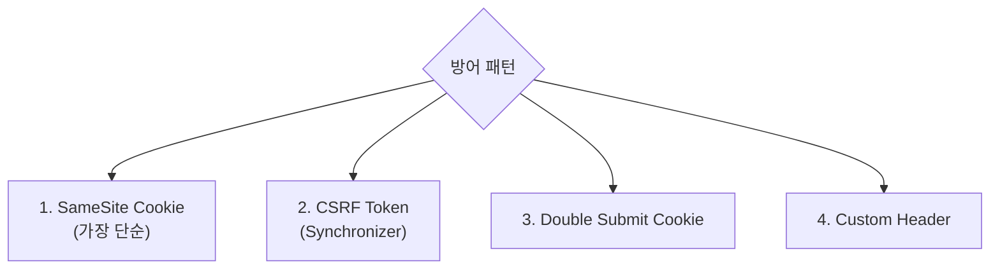
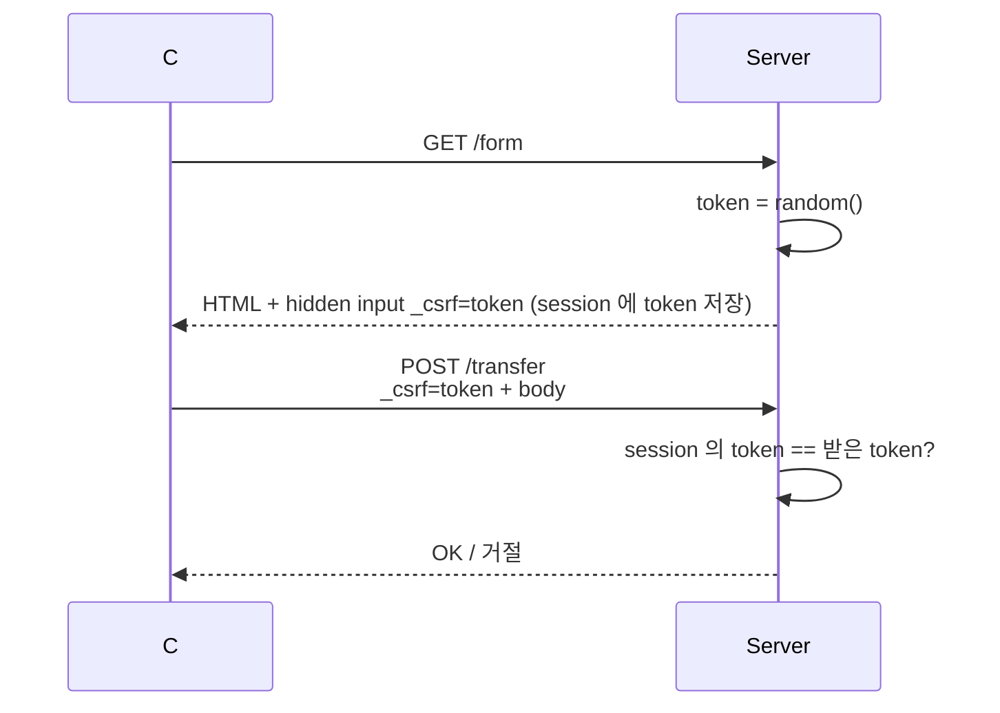
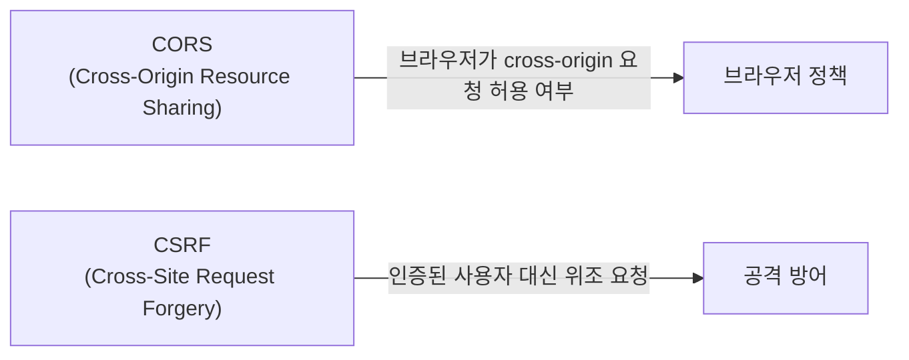
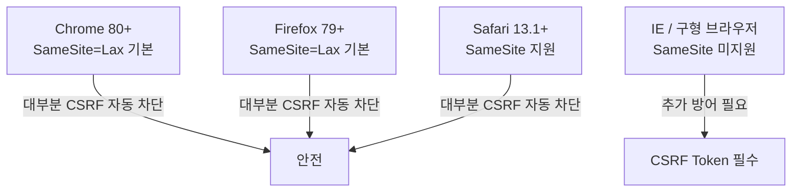

## 정의

**CSRF (Cross-Site Request Forgery)** 는 *사용자가 로그인된 상태* 에서 *공격자가 만든 페이지* 가 *피해자 브라우저로 위조 요청* 을 보내는 공격. 쿠키 기반 인증의 *큰 약점*.

## CSRF vs XSS

| 항목 | CSRF | XSS |
|---|---|---|
| 공격 경로 | 브라우저 자동 쿠키 첨부 악용 | 피해 사이트에 스크립트 주입 |
| 피해 사이트 코드 조작 | 불필요 | 필요 |
| 피해자 의도 | 피해자가 요청을 모름 | 피해자 브라우저에서 코드 실행 |
| 방어 포인트 | 서버: 요청 출처 검증 | 서버: 출력 인코딩 |
| 쿠키 의존 | 쿠키 기반 세션에 한정 | 어떤 인증 방식도 영향 |

## 공격 시나리오

```mermaid
sequenceDiagram
    autonumber
    participant V as Victim
    participant Bank as bank.com
    participant Evil as evil.com

    V->>Bank: 로그인
    Bank-->>V: Set-Cookie: session=ABC
    V->>Evil: 다른 탭에서 evil.com 방문
    Evil-->>V: HTML with <form action="bank.com/transfer">
    Note over V: HTML 안의 form 자동 submit (JS)
    V->>Bank: POST /transfer<br/>(자동 첨부 cookie: session=ABC)<br/>amount=1000&to=attacker
    Bank->>Bank: 인증된 세션 → 정상 처리
    Bank-->>V: 200 OK (이미 이체 됨)
```



핵심: *브라우저가 쿠키를 자동 첨부* 한다는 점을 *악용*. *XSS 와 다름*. CSRF 는 *공격자가 페이지에 코드 주입 못 해도 가능*.

## 4가지 방어 패턴



### 1. SameSite Cookie

```http
Set-Cookie: SID=abc; HttpOnly; Secure; SameSite=Lax
```

`SameSite=Lax` 가 cross-site form POST 차단. *2020 부터 Chrome 의 기본값*.

| SameSite 값 | Cross-site GET | Cross-site POST | 설명 |
|---|---|---|---|
| `Strict` | 차단 | 차단 | 완전 격리, 외부 링크 클릭도 차단 |
| `Lax` | top-level 허용 | 차단 | 기본값, 대부분의 CSRF 차단 |
| `None` | 허용 | 허용 | `Secure` 필수, iframe / 3rd-party 용 |

> [!IMPORTANT]
> **SameSite=Lax 만으로도 대부분의 CSRF 차단**. *옛 브라우저 호환* 이 필요하면 추가 패턴.

### 2. CSRF Token (Synchronizer Token)



- *각 폼/요청마다 고유 token*.
- session 에 *서버 측 저장* + 폼 hidden field.
- *Rails, Django, Spring* 기본 적용.

### 3. Double Submit Cookie

```http
GET /form
→ Set-Cookie: csrf_token=ABC
→ HTML: <input name="_csrf" value="ABC">

POST /transfer
→ Cookie: csrf_token=ABC
→ Body: _csrf=ABC

Server: cookie 의 csrf_token == body 의 _csrf ?
```

- *서버 측 저장 없이* 동작.
- 단점: subdomain 의 *cookie 침해* 시 우회.

### 4. Custom Header (XHR/Fetch 한정)

```js
fetch('/api/transfer', {
  method: 'POST',
  headers: {
    'X-Requested-With': 'XMLHttpRequest',
    'Content-Type': 'application/json',
  },
  body: JSON.stringify({...}),
});
```

- *Simple Request 가 아니므로 CORS preflight 발생*.
- 다른 origin 이면 preflight 거절 → 위조 요청 *애초에 불가*.
- *SPA + API* 의 *깔끔한 패턴*.

## Origin / Referer 헤더 검증

서버에서 요청 출처를 직접 확인하는 보조 방어:

```python
# 서버 측 Origin 검증 예시
def check_origin(request):
    origin = request.headers.get('Origin')
    referer = request.headers.get('Referer')
    allowed = {'https://myapp.com', 'https://www.myapp.com'}
    if origin:
        return origin in allowed
    if referer:
        return any(referer.startswith(o) for o in allowed)
    return False  # 둘 다 없으면 거절
```

> [!WARNING]
> *Referer 는 브라우저 설정 / 프록시로 제거될 수 있음*. Origin + CSRF Token 을 *같이* 사용 권장. Referer 만으로는 불충분.

## 프레임워크 기본 내장

| 프레임워크 | CSRF 방어 |
|---|---|
| Django | `CsrfViewMiddleware` 기본 활성화 (`` 태그) |
| Rails | `protect_from_forgery :exception` 기본 |
| Spring Security | `csrf()` 기본 활성화 (JWT 사용 시 disable) |
| Laravel | `VerifyCsrfToken` 미들웨어 기본 |
| Express | `csrf` 패키지 별도 설치 필요 |

> *서버 렌더링 프레임워크는 기본 내장*. SPA 는 별도 설정 필요.

## CORS 와 CSRF 관계

CORS 와 CSRF 는 *다른 문제*. 혼동 주의.



| 항목 | CORS | CSRF |
|---|---|---|
| 목적 | 다른 origin 의 JS 가 응답 읽기 허용 | 위조 요청 자체를 차단 |
| 방어 대상 | 응답 데이터 노출 | 상태 변경 요청 위조 |
| Simple Request | preflight 없음 → CORS 우회 가능 | CSRF 공격 가능 |
| 관계 | CORS 허용해도 CSRF 방어 별도 필요 | CSRF 방어해도 CORS 설정 별도 필요 |

> [!WARNING]
> *CORS 를 허용했다고 CSRF 가 방어되는 것이 아님*. Simple Request (form POST) 는 preflight 없이 전송되어 CORS 와 무관하게 CSRF 공격 가능.

## 어디에 어떤 방어?

| 환경 | 권장 |
|---|---|
| 클래식 서버 렌더링 (Rails, Django) | **CSRF token + SameSite=Lax** |
| SPA + REST API | **Custom header + SameSite=Strict** |
| API + JWT in `Authorization` 헤더 | *대부분 영향 없음* (cookie 안 씀) |
| 모바일 앱 (자체 HTTP 라이브러리) | *영향 없음* |
| 3rd-party 통합 (iframe) | **SameSite=None + Secure** + token |

## 현대 브라우저 현황 (2024+)



| 브라우저 | SameSite=Lax 기본 | 비고 |
|---|---|---|
| Chrome 80+ | 적용 | 2020년 2월부터 |
| Firefox 79+ | 적용 | 2020년 7월부터 |
| Safari 13.1+ | 적용 | 2020년 3월부터 |
| IE 11 | 미지원 | 레거시 환경은 CSRF Token 필수 |

> *현대 브라우저 환경에서는 SameSite=Lax 기본값으로 대부분 방어*. 레거시 지원 필요 시 CSRF Token 병행.

## GET 의 위험성

```html

```

> [!CAUTION]
> *상태 변경 GET* 은 *CSRF 의 가장 흔한 함정*. *모든 변경 요청은 POST/PUT/DELETE 만*. *GET 은 idempotent + read-only*.

## 토큰 구현 시 주의사항

CSRF Token 을 직접 구현할 때:

```python
import secrets
import hmac
import hashlib

def generate_csrf_token(session_id: str, secret: str) -> str:
    # 세션 ID 와 서버 secret 으로 HMAC 생성
    # 단순 random 보다 세션 바인딩이 더 안전
    random_part = secrets.token_hex(16)
    mac = hmac.new(
        secret.encode(),
        f"{session_id}:{random_part}".encode(),
        hashlib.sha256,
    ).hexdigest()
    return f"{random_part}:{mac}"
```

> *단순 `random()` 토큰* 은 서버 재시작 시 세션과 분리될 수 있음. *HMAC 기반 토큰* 이 더 안전하고 stateless 구현 가능.

## 흔한 함정

> [!WARNING]
> 1. **`SameSite=None` 인데 `Secure` 없음** = 브라우저가 거절. 옛 코드 깨짐.
> 2. **CSRF token 을 *모든 요청에서 동일*** = *하나만 탈취* 되면 모든 요청 위조. *세션 단위 회전*.
> 3. **GET 의 *상태 변경*** = SameSite=Lax 가 top-level GET 허용 → CSRF.
> 4. **Multipart form 의 *Content-Type*** = simple request 라 *preflight 없음*. Custom header 방어가 *부분적*.
> 5. **JWT + cookie 혼합** = Authorization 헤더 JWT 는 안전하지만 *cookie 에 저장된 JWT* 는 CSRF 위험.

## 관련 위키

- [[CORS]]
- [[Session Cookie]]
- [[JWT]]
- [[XSS]] (관련 공격)
