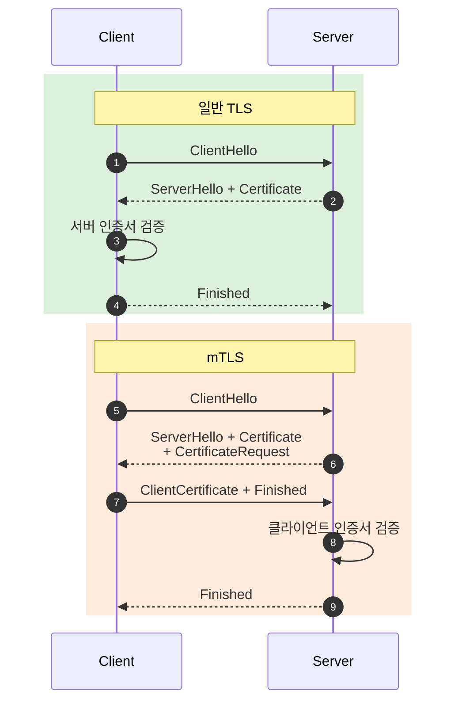
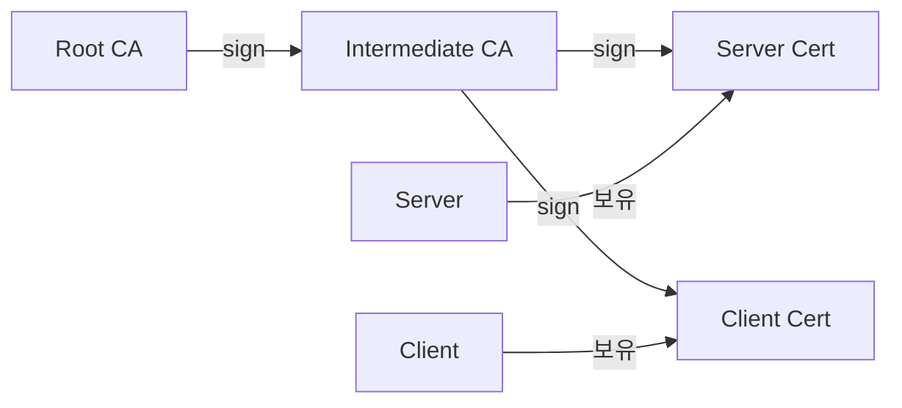
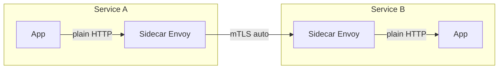
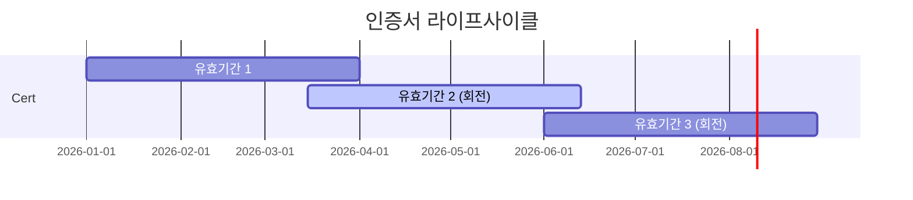
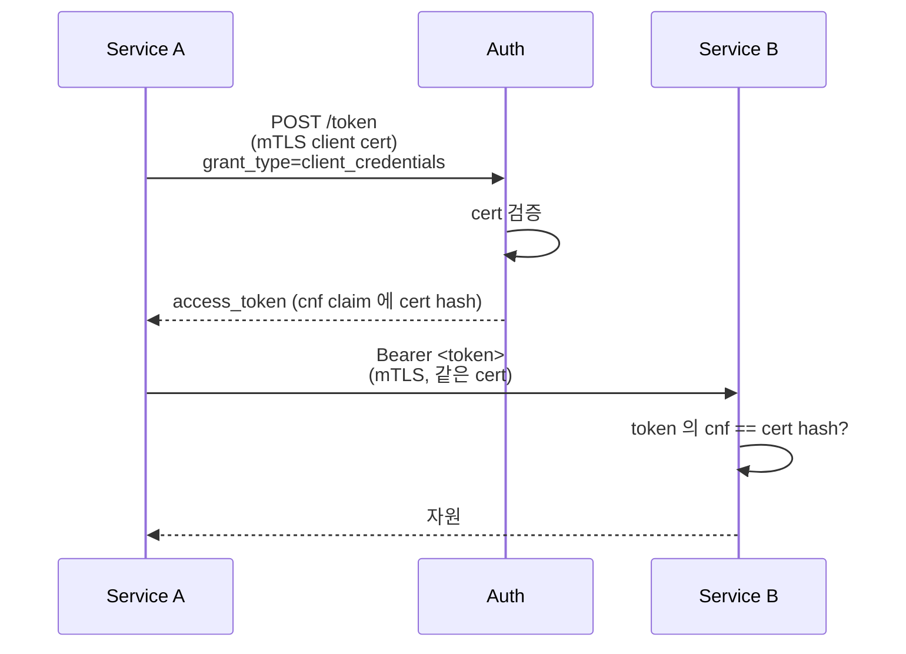

## 정의

**mTLS (Mutual TLS)** 는 *서버뿐 아니라 클라이언트도 TLS 인증서로 자기 신분 증명*. 일반 TLS = *서버 인증만*, mTLS = *양방향*.

활용: *서비스 메시 (Istio, Linkerd)*, *기업 내부 API*, *금융 / B2B 통합*, *IoT 기기*.

## TLS vs mTLS 흐름

```anim:tls-handshake-1-3
{}
```



## 인증서 발급 흐름



자세한 인증서 체인은 [[TLS]] 참고.

## 사용 시나리오

### 1. Service Mesh (Istio, Linkerd, Consul)



- *애플리케이션이 mTLS 를 신경 쓰지 않음*. Sidecar 가 자동.
- *Zero Trust* 네트워크의 토대.

### 2. SPIFFE/SPIRE: 워크로드 신원

```
SPIFFE ID = spiffe://example.com/ns/prod/sa/web
```

쿠버네티스 ServiceAccount → *SVID (SPIFFE Verifiable Identity Document)* → 짧은 mTLS 인증서.

> [!IMPORTANT]
> *수동 인증서 발급/배포 없이* SPIRE 가 *자동 회전*. 회전 주기는 *시간 단위*. 침해 시 영향 최소화.

### 3. 기업 VPN / Zero Trust

- BeyondCorp 류 *디바이스 인증* + 사용자 인증.
- 기기 인증서 + 사용자 OIDC.

### 4. IoT / 디바이스

- *수백만 디바이스* 각자 인증서.
- *제조 시점에 발급* (factory cert).

## 인증서 회전



| 회전 주기 | 적합 |
|---|---|
| 1년 | legacy 시스템 |
| 90일 | Let's Encrypt 표준 |
| 24시간 | 짧은 SVID (SPIFFE) |
| 1시간 | 고보안 환경 |

> 짧을수록 *침해 영향 최소화*. *자동화 없으면 운영 불가*.

## OAuth + mTLS (RFC 8705)

OAuth 의 *client_credentials* 에서 *client_secret 대신 client cert*. *큰 기업 / 금융 API*.



## 흔한 함정

> [!WARNING]
> 1. **인증서 만료 사고** = 자동화 없으면 *언젠가는 만료* → 서비스 다운. *모니터링 + 자동 갱신* 필수.
> 2. **인증서 회전과 사용 *동시*** = 회전 직후 옛 인증서로 검증 실패. *grace period* 필요.
> 3. **CRL (Certificate Revocation List) 의 *체크 누락*** = 침해 인증서가 *수개월 유효*. 짧은 인증서 (SPIFFE) 가 *현실적 답*.
> 4. **mTLS 끝점에 *L7 LB*** = TLS 종료 시점에 *클라이언트 인증서 정보 손실*. `X-Forwarded-Client-Cert` 같은 헤더로 *전달* 또는 *passthrough LB*.

## 인증서 형식

| 형식 | 의미 |
|---|---|
| `.crt` / `.pem` | base64 인코딩 X.509 (텍스트) |
| `.der` | binary DER |
| `.p7b` / `.p7c` | PKCS#7 (체인 포함) |
| `.pfx` / `.p12` | PKCS#12 (인증서 + private key) |
| `.key` | private key 만 |

## 관련 위키

- [[TLS]]
- [[OAuth2]]
- [[Service Mesh]] (Istio, Linkerd)
- [[Kubernetes RBAC]]
