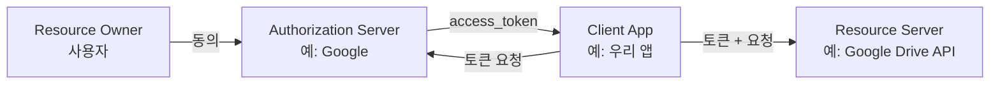
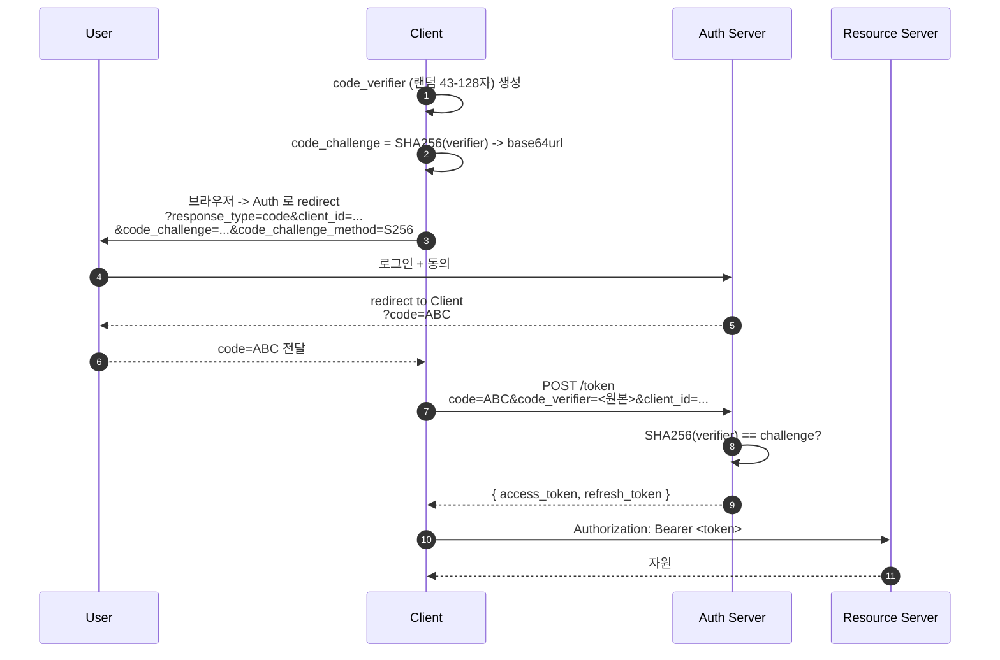
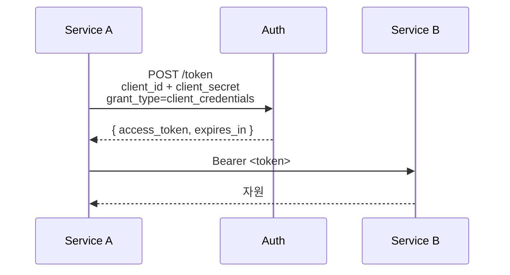
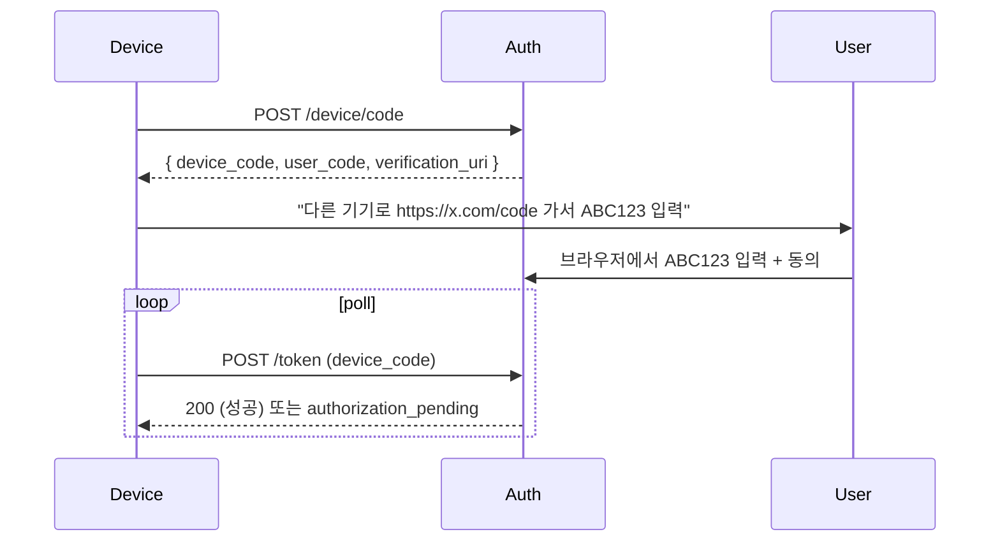

## 정의

**OAuth 2.0** (RFC 6749, 2012) 은 *제3자 앱이 사용자 동의로 자원에 접근* 하게 하는 *권한 위임 프레임워크*. *인증 (authentication)* 이 아니라 *인가 (authorization)*.

**OAuth 2.1** 은 진행 중인 draft. 옛 flow 정리 + PKCE 의무화.

## 핵심 4 역할



## Authorization Code Flow + PKCE (표준)

가장 일반적이고 OAuth 2.1 에서 *유일하게 권장* 되는 사용자 흐름.



### PKCE 가 왜 필수?

OAuth 2.0 의 옛날 *implicit flow* + *public client (모바일 / SPA)* 에서 *intercept 공격*. *code_verifier* 가 *동적 공유 secret* 처럼 작용.

> [!IMPORTANT]
> *모든 OAuth 클라이언트는 PKCE 필수*. 옛 라이브러리도 *반드시 최신 버전*.

## 다른 Flow

| Flow | 사용 | 상태 |
|---|---|---|
| **Authorization Code + PKCE** | 사용자 로그인 (웹/모바일) | *권장* |
| **Client Credentials** | 서버 대 서버 (사용자 없음) | 권장 |
| **Device Authorization** | TV / CLI / 헤드리스 | 권장 |
| **Refresh Token** | access_token 갱신 | 권장 |
| **Implicit** | (옛 SPA) | *폐기 (OAuth 2.1)* |
| **Resource Owner Password** | password 직접 전달 | *폐기 (OAuth 2.1)* |

### Client Credentials (서버끼리)



### Device Flow



*Apple TV, Roku, GitHub CLI (`gh auth login`)* 같은 *키보드 없는 기기*.

## OAuth 2.0 vs OAuth 2.1

| 항목 | 2.0 | 2.1 |
|---|---|---|
| Implicit flow | 허용 | *제거* |
| Resource owner password | 허용 | *제거* |
| PKCE | 권장 | *필수* |
| Bearer token in URL | 허용 (?token=) | *제거* |
| Refresh token rotation | 옵션 | *권장* |
| HTTPS | 권장 | *필수* |

## Scope

`scope=read:files write:profile` 같이 *권한 범위 명시*. Auth Server 가 사용자 동의 화면에 표시.

```
scope=openid profile email     # OpenID Connect
scope=read:items write:orders  # 자원 권한
```

## State Parameter (CSRF 방어)

```
GET /authorize?...&state=<random>
```

Auth 가 *같은 state 를 redirect 에 포함*. 다른 사이트가 *위조한 redirect* 를 클라이언트가 *거절*.

> [!CAUTION]
> *state 검증 누락* = CSRF 공격에 OAuth 흐름 위조 가능. 모든 클라이언트 필수.

## PKCE 구현 예시

```typescript
// TypeScript (browser)
async function generatePKCE() {
  const verifier = crypto.randomUUID().replace(/-/g, '')
    + crypto.randomUUID().replace(/-/g, '');   // 64자

  const encoder = new TextEncoder();
  const data = encoder.encode(verifier);
  const digest = await crypto.subtle.digest('SHA-256', data);

  const challenge = btoa(String.fromCharCode(...new Uint8Array(digest)))
    .replace(/\+/g, '-').replace(/\//g, '_').replace(/=+$/, '');

  return { verifier, challenge };
}

// 사용 예
const { verifier, challenge } = await generatePKCE();
sessionStorage.setItem('pkce_verifier', verifier);

const authUrl = new URL('https://auth.example.com/authorize');
authUrl.searchParams.set('response_type', 'code');
authUrl.searchParams.set('client_id', CLIENT_ID);
authUrl.searchParams.set('redirect_uri', REDIRECT_URI);
authUrl.searchParams.set('code_challenge', challenge);
authUrl.searchParams.set('code_challenge_method', 'S256');
authUrl.searchParams.set('state', crypto.randomUUID());
window.location.href = authUrl.toString();
```

## 토큰 수명과 갱신

| 토큰 | 수명 | 용도 |
|:---|:---|:---|
| `access_token` | 5-60분 (짧을수록 좋음) | 자원 접근에 사용 |
| `refresh_token` | 수일-수개월 | access_token 재발급 |
| `id_token` (OIDC) | 보통 access_token 과 동일 | 사용자 정보 포함 JWT |

**Refresh Token Rotation** (OAuth 2.1 권장):
- refresh_token 을 한 번 사용하면 새 refresh_token 발급, 이전 무효화
- 탈취 탐지: 만료된 refresh_token 재사용 시 경보 + 세션 전체 무효화

```
POST /token
grant_type=refresh_token
refresh_token=<old_token>

-> { access_token: "...", refresh_token: "<new_token>", expires_in: 3600 }
```

## Token Introspection / Revocation

```
# RFC 7662: Token Introspection
POST /introspect
token=<opaque_token>

-> { active: true, sub: "user123", scope: "read", exp: 1234567890 }

# RFC 7009: Token Revocation (로그아웃)
POST /revoke
token=<refresh_token>
token_type_hint=refresh_token
```

opaque token (불투명 토큰) 은 서버 DB 조회 필요. [[jwt|JWT]] 는 서명 검증으로 로컬 검증 가능하지만 revoke 가 어려움.

## JWT vs Opaque Token

| | JWT | Opaque Token |
|:---|:---|:---|
| 검증 | 로컬 (서명 확인) | 서버 introspect 필요 |
| Revocation | 어려움 (TTL 만료 대기) | 즉시 (DB 삭제) |
| 크기 | 큰 편 (클레임 포함) | 짧음 |
| 용도 | API Gateway, stateless | Auth Server 중심 |

## OAuth vs OpenID Connect

| | OAuth 2.0 | OIDC |
|---|---|---|
| 목적 | *권한 위임* (자원 접근) | *인증* (누구인지) |
| 토큰 | access_token | + *id_token* (JWT) |
| User info | 자원 API 로 별도 조회 | id_token 안에 |
| 표준화 | 기본 | OAuth 2.0 위 |

자세한 건 [[openid-connect|OpenID Connect]] 참고.

## 흔한 함정

> [!WARNING]
> 1. **redirect_uri 검증 부재**: open redirect 공격으로 *코드 탈취*.
> 2. **state 미사용**: CSRF.
> 3. **PKCE 없이 public client**: *intercept 공격*.
> 4. **access_token 을 URL 에**: 로그 / referrer 로 노출.
> 5. **refresh_token 영구**: 탈취 시 영구 침해. *rotation* (한 번 쓰면 새 발급 + 옛 무효화).
> 6. **scope 최소화 무시**: 필요한 scope 만 요청 (principle of least privilege).

## 보안 체크리스트

구현 전 점검:

| 항목 | 세부 사항 |
|:---|:---|
| PKCE | 모든 public client (SPA, 모바일) 에 적용 |
| redirect_uri | 정확한 값만 서버에 등록, prefix 매칭 금지 |
| state | 요청마다 새 random 값, callback 에서 검증 |
| access_token 저장 | `localStorage` 보다 메모리 또는 HttpOnly cookie |
| refresh_token 저장 | HttpOnly cookie (XSS 접근 불가) |
| HTTPS | Auth Server 및 Client 모두 필수 |
| scope | 최소 필요 scope 만 요청 |
| token rotation | refresh_token 사용 후 즉시 교체 |

## 실전 라이브러리

| 플랫폼 | 라이브러리 |
|:---|:---|
| SPA (React/Vue) | `@auth0/auth0-react`, `oidc-client-ts` |
| Next.js | `next-auth` (Auth.js v5) |
| Node.js 서버 | `passport-oauth2`, `openid-client` |
| Spring | `spring-security-oauth2-client` |
| Python | `authlib`, `python-social-auth` |
| Mobile (iOS) | `AppAuth-iOS` |
| Mobile (Android) | `AppAuth-Android` |

## 관련 위키

- [[jwt|JWT]]
- [[openid-connect|OpenID Connect]]
- [[saml|SAML]]
- [[mtls|mTLS]]
- [[csrf|CSRF]]
- [[session-cookie|Session Cookie]] - cookie 기반 세션과 토큰 방식 비교
