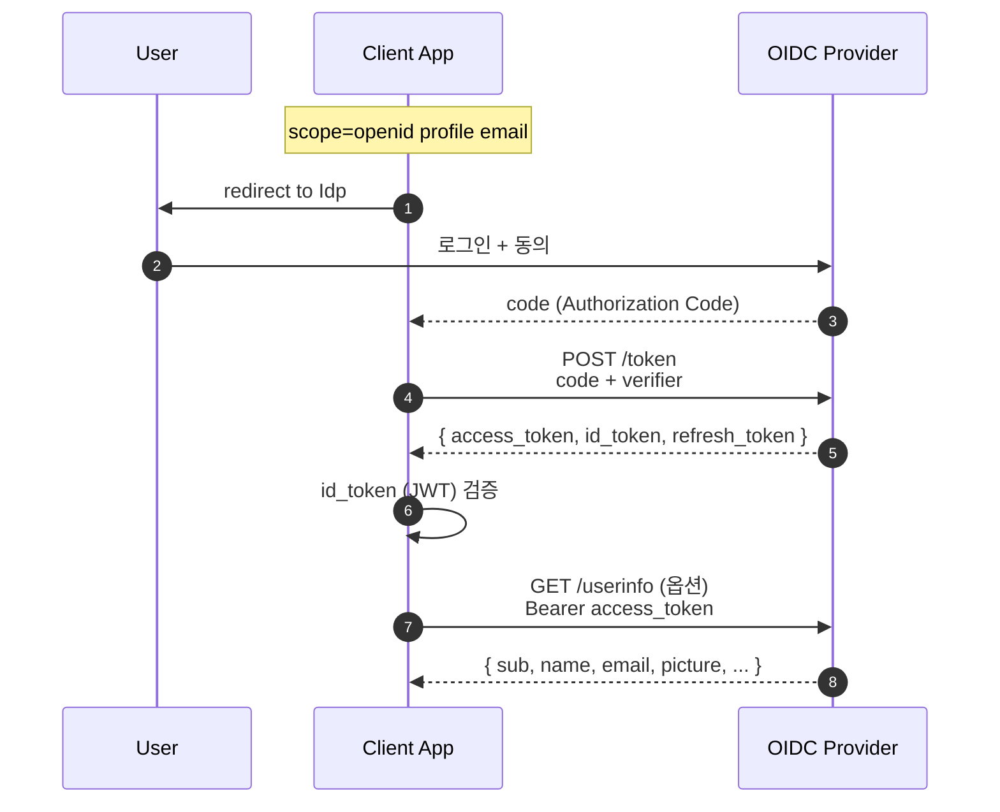
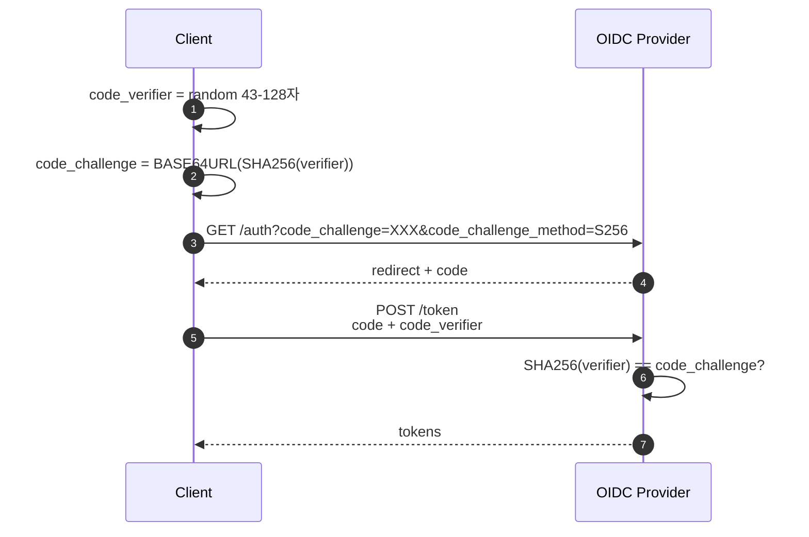
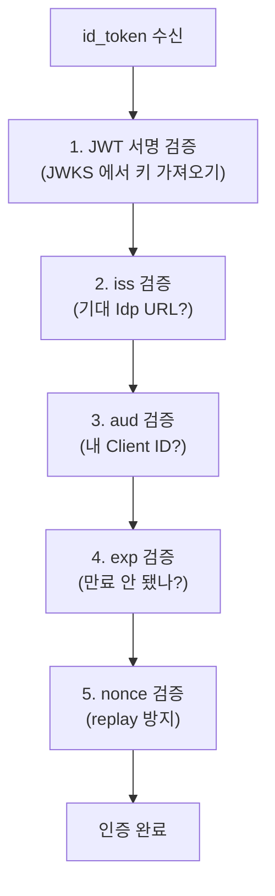
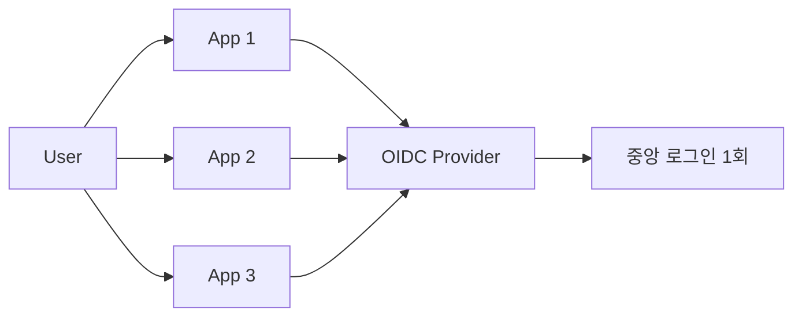

## 정의

**OpenID Connect (OIDC)** 는 *OAuth 2.0 위에 얹은 인증 (authentication) 표준*. OAuth 가 *권한 위임 (authorization)*, OIDC 가 *"누구인지"* 알려준다.

핵심 추가:

1. **`id_token`** (JWT): 사용자 식별 정보
2. **`/userinfo`** endpoint: 추가 프로필 정보
3. **Discovery**: `.well-known/openid-configuration` 으로 자동 설정
4. **Scope `openid`**: OIDC 활성화 신호

## 사용 시나리오

| 상황 | OIDC 역할 |
|---|---|
| SPA / 모바일 앱 로그인 | Authorization Code + PKCE |
| 기업 SSO | Okta / Keycloak → 여러 앱 자동 인증 |
| 소셜 로그인 | Google / Kakao → 내 앱에서 id_token 검증 |
| K8s API 인증 | OIDC Provider 와 kube-apiserver 연동 |

## 흐름



## PKCE 상세 흐름

PKCE (Proof Key for Code Exchange) 는 *Authorization Code 탈취 방지*. *공개 클라이언트* (SPA, 모바일) 필수.



> *code 만 탈취해도 verifier 없이는 token 교환 불가*. SPA 에서 PKCE 없는 Authorization Code Flow 는 *안전하지 않음*.

## id_token 의 표준 클레임

| 클레임 | 의미 |
|---|---|
| `iss` | Issuer (Idp URL) |
| `sub` | Subject (사용자 ID, *영구 식별자*) |
| `aud` | Audience (Client ID) |
| `exp` | 만료 |
| `iat` | 발급 시각 |
| `auth_time` | 사용자가 *마지막으로 인증한* 시각 |
| `nonce` | replay 방지 |
| `acr` | Authentication Context Class Reference |
| `amr` | Authentication Methods (`["pwd", "mfa"]`) |
| `azp` | Authorized Party |
| 프로필 | `name`, `given_name`, `family_name`, `email`, `email_verified`, `picture` |

## id_token 검증 절차

id_token 은 *단순히 받는 것으로 충분하지 않음*. 반드시 서버에서 검증.



```python
# python-jose 예시
from jose import jwt

payload = jwt.decode(
    id_token,
    jwks,           # JWKS 에서 가져온 공개키
    algorithms=["RS256"],
    audience="my-client-id",
    issuer="https://accounts.google.com",
)
# payload["sub"] 가 사용자 영구 ID
```

## Discovery: `.well-known/openid-configuration`

```bash
curl https://accounts.google.com/.well-known/openid-configuration
```

```json
{
  "issuer": "https://accounts.google.com",
  "authorization_endpoint": "https://accounts.google.com/o/oauth2/v2/auth",
  "token_endpoint": "https://oauth2.googleapis.com/token",
  "userinfo_endpoint": "https://openidconnect.googleapis.com/v1/userinfo",
  "jwks_uri": "https://www.googleapis.com/oauth2/v3/certs",
  "scopes_supported": ["openid", "email", "profile"],
  "response_types_supported": ["code", "token", "id_token", ...],
  "id_token_signing_alg_values_supported": ["RS256"],
  ...
}
```

> 클라이언트는 *Idp URL* 하나만 알면 *모든 endpoint 자동 발견*. 신규 OIDC Provider 통합이 *1줄*.

## JWKS (JSON Web Key Set)

```bash
curl https://www.googleapis.com/oauth2/v3/certs
```

```json
{
  "keys": [
    {
      "kty": "RSA",
      "alg": "RS256",
      "use": "sig",
      "kid": "abc123",
      "n": "...",
      "e": "AQAB"
    }
  ]
}
```

- Idp 가 *공개키 공개*.
- 클라이언트가 id_token 의 `kid` 로 *해당 키 찾아 검증*.
- *키 회전* 시 *복수 키 동시 공존*.

## OIDC 흐름 종류

| Flow | 응답 타입 | 사용 |
|---|---|---|
| Authorization Code Flow + PKCE | `response_type=code` | *권장* (모든 클라이언트) |
| Implicit Flow | `response_type=id_token token` | 폐기 |
| Hybrid Flow | `response_type=code id_token` | 일부 경우 |

## SSO (Single Sign-On)



한 번 로그인 → 여러 앱 *자동 인증*. *기업 SSO* (Okta, Auth0, Keycloak) 의 토대.

## 로그아웃 흐름

OIDC 는 *로그아웃* 도 표준화. 세 가지 방식:

| 방식 | 설명 |
|---|---|
| RP-Initiated Logout | 앱이 Idp 에 로그아웃 요청. Idp 세션 종료 |
| Front-Channel Logout | Idp 가 모든 연결 앱에 로그아웃 알림 (iframe) |
| Back-Channel Logout | Idp 가 서버-서버로 로그아웃 알림 (더 안정) |

```bash
# RP-Initiated Logout
GET https://idp.example.com/logout?
  id_token_hint=<id_token>&
  post_logout_redirect_uri=https://myapp.com/
```

> [!WARNING]
> *로컬 세션만 지우는 것* 은 완전한 로그아웃이 아님. *Idp 세션도 종료* 해야 SSO 전체에 영향.

## K8s + OIDC 통합

kube-apiserver 에 OIDC Provider 를 연결해 *kubectl 사용자 인증* 에 활용:

```bash
# kube-apiserver 플래그
--oidc-issuer-url=https://accounts.google.com
--oidc-client-id=my-k8s-client
--oidc-username-claim=email
--oidc-groups-claim=groups
```

```bash
# kubeconfig 에 OIDC 토큰 설정
kubectl config set-credentials alice \
  --auth-provider=oidc \
  --auth-provider-arg=idp-issuer-url=https://accounts.google.com \
  --auth-provider-arg=client-id=my-k8s-client \
  --auth-provider-arg=id-token=<id_token>
```

> OIDC 로 인증된 사용자 email / group 을 *RBAC 의 subject* 로 사용. *중앙 IdP 로 K8s 접근 제어* 통합.

## 사용 라이브러리

| 언어 | 라이브러리 |
|---|---|
| Node | passport-openidconnect, openid-client |
| Python | authlib, python-jose |
| Java | spring-security-oauth2-client, Nimbus JOSE |
| Go | go-oidc, oidc-mw |
| Ruby | omniauth-openid-connect |

## OIDC vs OAuth vs SAML

| | OAuth 2.0 | OIDC | SAML 2.0 |
|---|---|---|---|
| 목적 | 권한 위임 | 인증 | 인증 + 권한 |
| 토큰 | access_token | + id_token (JWT) | SAML Assertion (XML) |
| 페이로드 | bearer | JWT | XML |
| 모바일 친화 | 좋음 | *최고* | 떨어짐 |
| 기업 | 일부 | 모던 표준 | 옛 표준, *여전히 많음* |

## 흔한 함정

> [!WARNING]
> 1. **id_token 만 신뢰** = `aud`, `iss`, `exp`, `nonce` 모두 검증해야 함.
> 2. **JWKS *매 요청* fetch** = 캐싱 필요 (보통 24h). 단 *key rotation* 시 빠르게 갱신.
> 3. **sub 변경** = 같은 Idp 의 같은 사용자는 *`sub` 가 영구 동일*. 다른 Idp 의 같은 이메일은 *다른 sub*.
> 4. **email 만 보고 사용자 식별** = 이메일 변경 가능. *항상 `sub` 로 매핑*.
> 5. **Implicit Flow 아직 사용** = 폐기된 방식. *PKCE 있는 Authorization Code Flow* 로 전환.

## 관련 위키

- [[OAuth2]]
- [[JWT]]
- [[SAML]]
- [[Session Cookie]]
