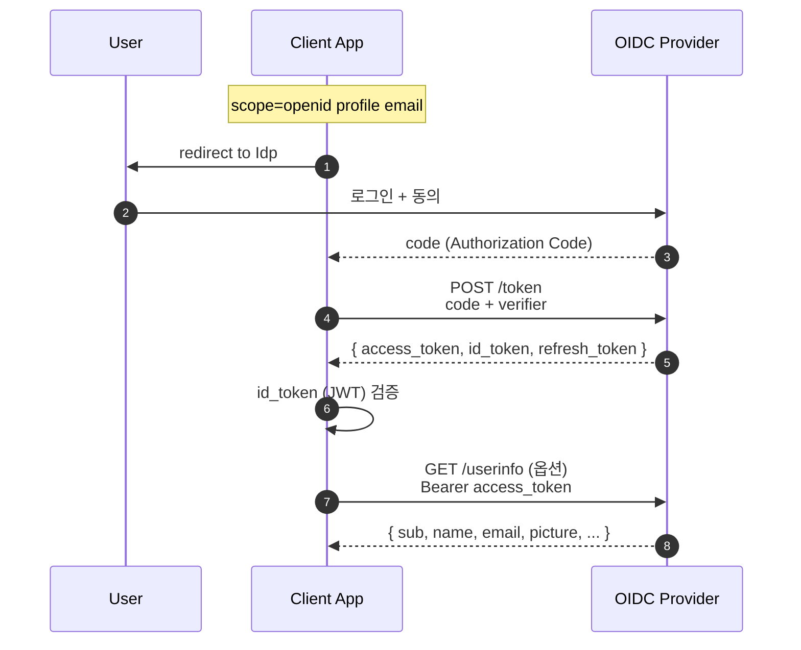
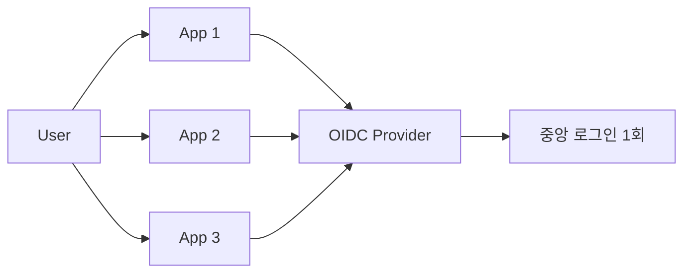

## 정의

**OpenID Connect (OIDC)** 는 *OAuth 2.0 위에 얹은 인증 (authentication) 표준*. OAuth 가 *권한 위임 (authorization)*, OIDC 가 *"누구인지"* 알려준다.

핵심 추가:

1. **`id_token`** (JWT): 사용자 식별 정보
2. **`/userinfo`** endpoint: 추가 프로필 정보
3. **Discovery**: `.well-known/openid-configuration` 으로 자동 설정
4. **Scope `openid`**: OIDC 활성화 신호

## 흐름



## id_token 의 표준 클레임

| 클레임 | 의미 |
|---|---|
| `iss` | Issuer (Idp URL) |
| `sub` | Subject (사용자 ID, *영구 식별자*) |
| `aud` | Audience (Client ID) |
| `exp` | 만료 |
| `iat` | 발급 시각 |
| `auth_time` | 사용자가 *마지막으로 인증한* 시각 |
| `nonce` | replay 방지 |
| `acr` | Authentication Context Class Reference |
| `amr` | Authentication Methods (`["pwd", "mfa"]`) |
| `azp` | Authorized Party |
| 프로필 | `name`, `given_name`, `family_name`, `email`, `email_verified`, `picture` |

## Discovery: `.well-known/openid-configuration`

```bash
curl https://accounts.google.com/.well-known/openid-configuration
```

```json
{
  "issuer": "https://accounts.google.com",
  "authorization_endpoint": "https://accounts.google.com/o/oauth2/v2/auth",
  "token_endpoint": "https://oauth2.googleapis.com/token",
  "userinfo_endpoint": "https://openidconnect.googleapis.com/v1/userinfo",
  "jwks_uri": "https://www.googleapis.com/oauth2/v3/certs",
  "scopes_supported": ["openid", "email", "profile"],
  "response_types_supported": ["code", "token", "id_token", ...],
  "id_token_signing_alg_values_supported": ["RS256"],
  ...
}
```

> 클라이언트는 *Idp URL* 하나만 알면 *모든 endpoint 자동 발견*. 신규 OIDC Provider 통합이 *1줄*.

## JWKS (JSON Web Key Set)

```bash
curl https://www.googleapis.com/oauth2/v3/certs
```

```json
{
  "keys": [
    {
      "kty": "RSA",
      "alg": "RS256",
      "use": "sig",
      "kid": "abc123",
      "n": "...",
      "e": "AQAB"
    }
  ]
}
```

- Idp 가 *공개키 공개*.
- 클라이언트가 id_token 의 `kid` 로 *해당 키 찾아 검증*.
- *키 회전* 시 *복수 키 동시 공존*.

## OIDC 흐름 종류

| Flow | 응답 타입 | 사용 |
|---|---|---|
| Authorization Code Flow + PKCE | `response_type=code` | *권장* (모든 클라이언트) |
| Implicit Flow | `response_type=id_token token` | 폐기 |
| Hybrid Flow | `response_type=code id_token` | 일부 경우 |

## SSO (Single Sign-On)



한 번 로그인 → 여러 앱 *자동 인증*. *기업 SSO* (Okta, Auth0, Keycloak) 의 토대.

## 사용 라이브러리

| 언어 | 라이브러리 |
|---|---|
| Node | passport-openidconnect, openid-client |
| Python | authlib, python-jose |
| Java | spring-security-oauth2-client, Nimbus JOSE |
| Go | go-oidc, oidc-mw |
| Ruby | omniauth-openid-connect |

## OIDC vs OAuth vs SAML

| | OAuth 2.0 | OIDC | SAML 2.0 |
|---|---|---|---|
| 목적 | 권한 위임 | 인증 | 인증 + 권한 |
| 토큰 | access_token | + id_token (JWT) | SAML Assertion (XML) |
| 페이로드 | bearer | JWT | XML |
| 모바일 친화 | 좋음 | *최고* | 떨어짐 |
| 기업 | 일부 | 모던 표준 | 옛 표준, *여전히 많음* |

## 흔한 함정

> [!WARNING]
> 1. **id_token 만 신뢰** = `aud`, `iss`, `exp`, `nonce` 모두 검증해야 함.
> 2. **JWKS *매 요청* fetch** = 캐싱 필요 (보통 24h). 단 *key rotation* 시 빠르게 갱신.
> 3. **sub 변경** = 같은 Idp 의 같은 사용자는 *`sub` 가 영구 동일*. 다른 Idp 의 같은 이메일은 *다른 sub*.
> 4. **email 만 보고 사용자 식별** = 이메일 변경 가능. *항상 `sub` 로 매핑*.

## 관련 위키

- [[OAuth2]]
- [[JWT]]
- [[SAML]]
- [[Session Cookie]]
