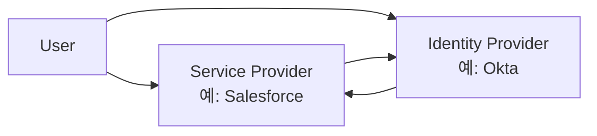
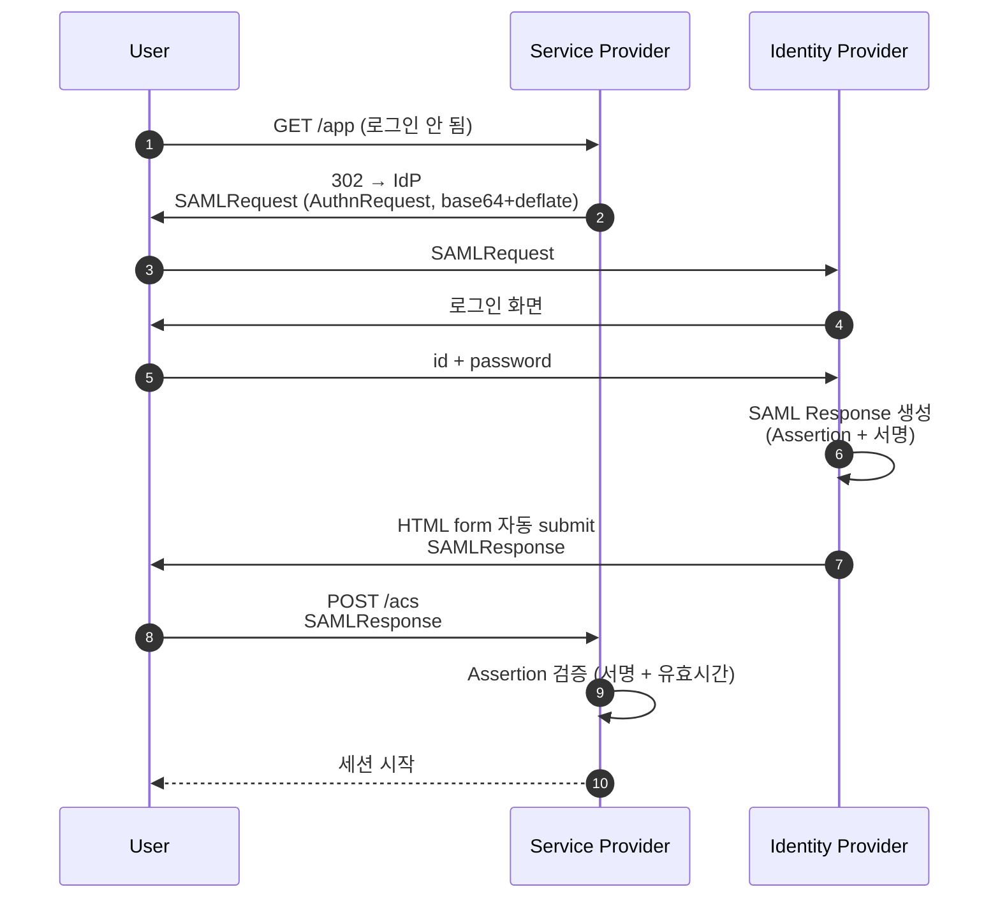

## 정의

**SAML 2.0** (Security Assertion Markup Language) 는 *XML 기반 기업 SSO* 표준. 2005년 OASIS 표준화. 모바일 친화도 / 단순성에서 OIDC 에 밀리지만 *기업 / SaaS 통합의 *옛 표준* 으로 여전히 광범위*.

## 핵심 역할



## SP-initiated SSO 흐름



> SP-initiated = *서비스 (SaaS) 가 먼저 redirect*. IdP-initiated = *IdP 의 사용자 포털에서 클릭*.

## SAML Assertion (XML)

```xml
<saml:Assertion ID="..." IssueInstant="2026-06-25T12:00:00Z">
  <saml:Issuer>https://idp.example.com</saml:Issuer>
  <ds:Signature>...</ds:Signature>
  <saml:Subject>
    <saml:NameID Format="...:emailAddress">koa@example.com</saml:NameID>
    <saml:SubjectConfirmation Method="bearer">
      <saml:SubjectConfirmationData
        Recipient="https://sp.example.com/acs"
        NotOnOrAfter="2026-06-25T12:05:00Z"
        InResponseTo="<원래 AuthnRequest ID>"/>
    </saml:SubjectConfirmation>
  </saml:Subject>
  <saml:Conditions
    NotBefore="2026-06-25T12:00:00Z"
    NotOnOrAfter="2026-06-25T12:05:00Z">
    <saml:AudienceRestriction>
      <saml:Audience>https://sp.example.com</saml:Audience>
    </saml:AudienceRestriction>
  </saml:Conditions>
  <saml:AuthnStatement AuthnInstant="2026-06-25T12:00:00Z">
    <saml:AuthnContext>
      <saml:AuthnContextClassRef>
        urn:oasis:names:tc:SAML:2.0:ac:classes:PasswordProtectedTransport
      </saml:AuthnContextClassRef>
    </saml:AuthnContext>
  </saml:AuthnStatement>
  <saml:AttributeStatement>
    <saml:Attribute Name="email">
      <saml:AttributeValue>koa@example.com</saml:AttributeValue>
    </saml:Attribute>
    <saml:Attribute Name="department">
      <saml:AttributeValue>engineering</saml:AttributeValue>
    </saml:Attribute>
  </saml:AttributeStatement>
</saml:Assertion>
```

## Metadata 교환

SP 와 IdP 가 *XML metadata 파일* 로 사전 합의:

| 항목 | SP metadata | IdP metadata |
|---|---|---|
| Entity ID | `https://sp.example.com` | `https://idp.example.com` |
| ACS URL | `https://sp.example.com/acs` | - |
| SSO URL | - | `https://idp.example.com/sso` |
| SLO URL | logout | logout |
| Certificate | 서명 검증용 공개키 | 동일 |

대부분의 SaaS 는 *URL 한 줄로 metadata 자동 교환*.

## SAML vs OIDC

| 항목 | SAML 2.0 | OIDC |
|---|---|---|
| 출시 | 2005 | 2014 |
| 페이로드 | XML | JSON (JWT) |
| 크기 | 큼 (수 KB) | 작음 |
| 모바일 | 떨어짐 | *우수* |
| 디버깅 | 복잡 (XML 서명) | 단순 |
| 기업 SSO | *전통적* | 부상 중 |
| MFA / step-up | 가능 (acr) | 가능 (acr) |
| 사용자 의도 | 토큰 발급 후 *세션* | 토큰 자체 *반복 사용* |

> [!IMPORTANT]
> *2026 시점*: 모바일 / 소비자 앱 = OIDC. *기업 SaaS 통합* (Workday, Salesforce, ServiceNow, Slack 등) = 여전히 SAML 이 *압도적*.

## 단점 / 함정

> [!WARNING]
> 1. **XML Canonicalization 의 함정** = *공백 처리* 까지 정확해야 서명 검증. 라이브러리 버그 다수 (XSW 공격).
> 2. **시계 어긋남** = NotBefore / NotOnOrAfter 검증에서 *수십 초 clock skew* 가 문제. NTP 필수.
> 3. **메시지 크기** = HTTP-Redirect 으로 보내는 인코딩된 SAMLRequest 가 URL 길이 한계 초과 가능 → HTTP-POST binding 사용.
> 4. **Assertion 의 *audience* 검증 누락** = *다른 SP 의 assertion* 이 재사용 가능.

## 보안: Assertion 검증 체크리스트

| 검증 | 의미 |
|---|---|
| Signature | XML-DSig 로 IdP 공개키 검증 |
| Audience | *내가 그 audience 인지* |
| NotBefore / NotOnOrAfter | 유효 시간 |
| Issuer | 신뢰하는 IdP 인지 |
| InResponseTo | 원래 보낸 AuthnRequest ID 와 일치 |
| Replay | NotOnOrAfter 까지 *받은 ID 중복 거절* |

## 관련 위키

- [[OAuth2]]
- [[OpenID Connect]]
- [[JWT]]
- [[Session Cookie]]
