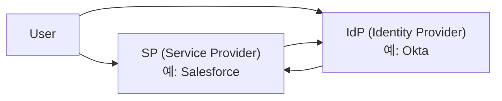
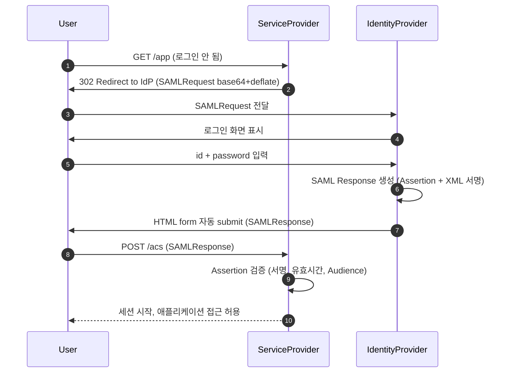
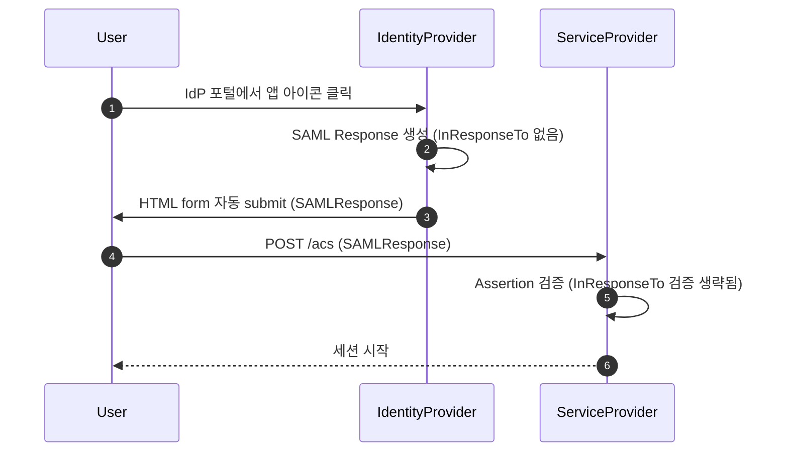
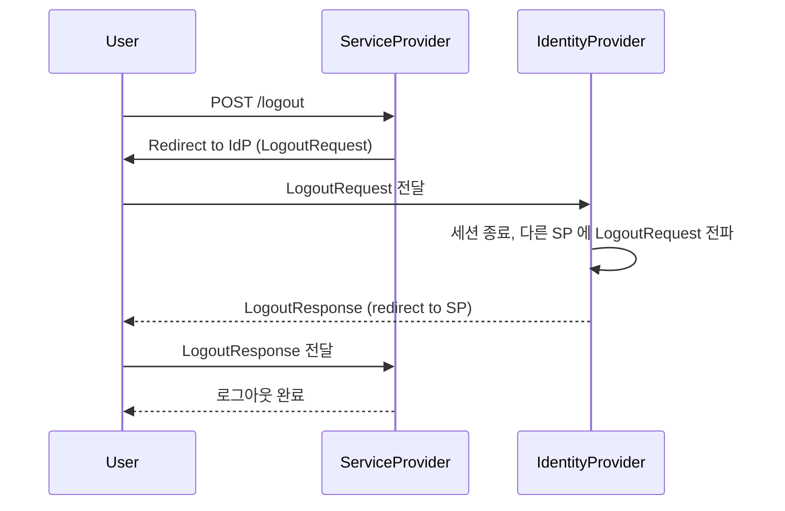
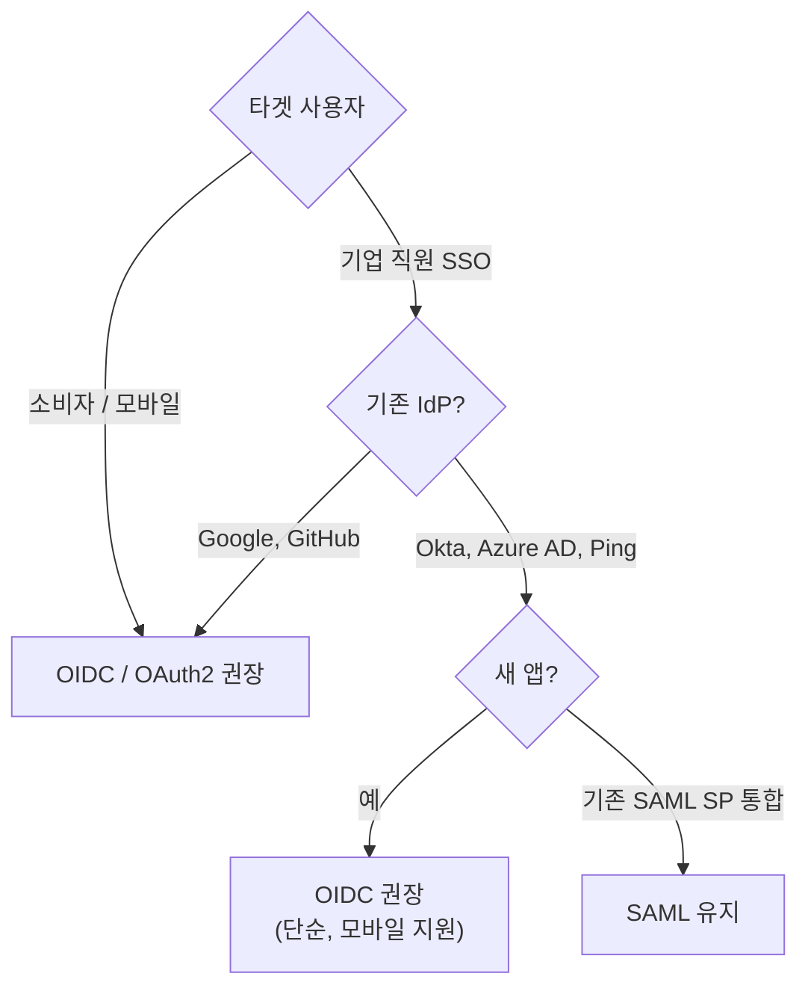

## 정의

**SAML 2.0** (Security Assertion Markup Language) 는 *XML 기반 기업 SSO* 표준. 2005년 OASIS 표준화. 모바일 친화도 / 단순성에서 OIDC 에 밀리지만 *기업 / SaaS 통합의 옛 표준* 으로 여전히 광범위.

## 핵심 역할



| 역할 | 설명 | 예시 |
|---|---|---|
| **SP** (Service Provider) | 서비스를 제공, IdP 에 인증 위임 | Salesforce, Slack, GitHub Enterprise |
| **IdP** (Identity Provider) | 신원 확인 + Assertion 발급 | Okta, Azure AD, Google Workspace |

## SP-initiated SSO 흐름



> SP-initiated = *서비스 (SaaS) 가 먼저 redirect*. 가장 일반적.

## IdP-initiated SSO 흐름



> [!WARNING]
> IdP-initiated 는 `InResponseTo` 가 없어 *CSRF replay 공격에 취약*. SP 가 허용 여부 명시 설정 필요.

## HTTP Binding 비교

| Binding | 전송 방법 | 특징 |
|---|---|---|
| **HTTP-Redirect** | URL query string (deflate + base64) | GET 요청, *URL 길이 한계* (~2KB) |
| **HTTP-POST** | HTML form hidden field (base64) | POST 요청, *크기 제한 없음*, *XML 서명 전송 가능* |

**AuthnRequest** 는 대부분 HTTP-Redirect. **SAMLResponse** 는 반드시 HTTP-POST (서명 포함 크기 때문).

```http
# HTTP-Redirect (AuthnRequest)
GET /sso?SAMLRequest=nJJBj9MwEIXv...&SigAlg=RSA-SHA256&Signature=abc...

# HTTP-POST (SAMLResponse)
POST /acs
Content-Type: application/x-www-form-urlencoded

SAMLResponse=PHNhbWxwO...
```

## SAML Assertion (XML)

```xml
<saml:Assertion ID="..." IssueInstant="2026-06-25T12:00:00Z">
  <saml:Issuer>https://idp.example.com</saml:Issuer>
  <ds:Signature>...</ds:Signature>
  <saml:Subject>
    <saml:NameID Format="...:emailAddress">koa@example.com</saml:NameID>
    <saml:SubjectConfirmation Method="bearer">
      <saml:SubjectConfirmationData
        Recipient="https://sp.example.com/acs"
        NotOnOrAfter="2026-06-25T12:05:00Z"
        InResponseTo="<원래 AuthnRequest ID>"/>
    </saml:SubjectConfirmation>
  </saml:Subject>
  <saml:Conditions
    NotBefore="2026-06-25T12:00:00Z"
    NotOnOrAfter="2026-06-25T12:05:00Z">
    <saml:AudienceRestriction>
      <saml:Audience>https://sp.example.com</saml:Audience>
    </saml:AudienceRestriction>
  </saml:Conditions>
  <saml:AuthnStatement AuthnInstant="2026-06-25T12:00:00Z">
    <saml:AuthnContext>
      <saml:AuthnContextClassRef>
        urn:oasis:names:tc:SAML:2.0:ac:classes:PasswordProtectedTransport
      </saml:AuthnContextClassRef>
    </saml:AuthnContext>
  </saml:AuthnStatement>
  <saml:AttributeStatement>
    <saml:Attribute Name="email">
      <saml:AttributeValue>koa@example.com</saml:AttributeValue>
    </saml:Attribute>
    <saml:Attribute Name="department">
      <saml:AttributeValue>engineering</saml:AttributeValue>
    </saml:Attribute>
  </saml:AttributeStatement>
</saml:Assertion>
```

## Metadata 교환

SP 와 IdP 가 *XML metadata 파일* 로 사전 합의:

| 항목 | SP metadata | IdP metadata |
|---|---|---|
| Entity ID | `https://sp.example.com` | `https://idp.example.com` |
| ACS URL | `https://sp.example.com/acs` | - |
| SSO URL | - | `https://idp.example.com/sso` |
| SLO URL | logout | logout |
| Certificate | 서명 검증용 공개키 | 동일 |

대부분의 SaaS 는 *URL 한 줄로 metadata 자동 교환*.

## SLO (Single Logout)



> SLO 는 *모든 SP 의 세션을 한 번에 종료*. 구현이 복잡해 *미구현 SP 도 많음*.

## SAML vs OIDC 선택



| 항목 | SAML 2.0 | OIDC |
|---|---|---|
| 출시 | 2005 | 2014 |
| 페이로드 | XML | JSON (JWT) |
| 크기 | 큼 (수 KB) | 작음 |
| 모바일 | 떨어짐 | *우수* |
| 디버깅 | 복잡 (XML 서명) | 단순 |
| 기업 SSO | *전통적* | 부상 중 |
| MFA / step-up | 가능 (acr) | 가능 (acr) |
| 사용자 의도 | 토큰 발급 후 *세션* | 토큰 자체 *반복 사용* |

> [!IMPORTANT]
> *2026 시점*: 모바일 / 소비자 앱 = OIDC. *기업 SaaS 통합* (Workday, Salesforce, ServiceNow, Slack 등) = 여전히 SAML 이 *압도적*.

## 보안: Assertion 검증 체크리스트

| 검증 | 의미 |
|---|---|
| Signature | XML-DSig 로 IdP 공개키 검증 |
| Audience | *내가 그 audience 인지* |
| NotBefore / NotOnOrAfter | 유효 시간 |
| Issuer | 신뢰하는 IdP 인지 |
| InResponseTo | 원래 보낸 AuthnRequest ID 와 일치 |
| Replay | NotOnOrAfter 까지 *받은 ID 중복 거절* |

## XSW (XML Signature Wrapping) 공격

*XML 서명 검증 구현 버그*를 이용해 서명된 영역과 실제 처리 영역을 다르게 만드는 공격:

```xml
<!-- 공격자가 조작한 Assertion (개념도) -->
<saml:Assertion ID="evil" ...>
  <!-- 공격자가 원하는 내용 (서명 없음) -->
  <saml:NameID>admin@company.com</saml:NameID>
  <!-- 원본 서명된 Assertion 은 다른 위치에 숨겨짐 -->
</saml:Assertion>
```

**방어**: *검증된 XML 라이브러리* 사용. Assertion ID 의 canonicalization 엄격 검증. *자체 XML 파서 구현 금지*.

## 단점 / 함정

> [!WARNING]
> 1. **XML Canonicalization 의 함정** = *공백 처리* 까지 정확해야 서명 검증. 라이브러리 버그 다수 (XSW 공격).
> 2. **시계 어긋남** = NotBefore / NotOnOrAfter 검증에서 *수십 초 clock skew* 가 문제. NTP 필수.
> 3. **메시지 크기** = HTTP-Redirect 으로 보내는 인코딩된 SAMLRequest 가 URL 길이 한계 초과 가능. HTTP-POST binding 사용.
> 4. **Assertion 의 *audience* 검증 누락** = *다른 SP 의 assertion* 이 재사용 가능.
> 5. **IdP-initiated CSRF** = InResponseTo 없으므로 *replay 가능*. SP 에서 허용 여부 명시.

## Okta 설정 예시

실제 SaaS 통합에서 SP 설정 예시:

```yaml
# Okta 앱 설정 (개념도)
SingleSignOnURL: https://app.example.com/auth/saml/callback  # ACS URL
Audience URI (Entity ID): https://app.example.com
NameID format: EmailAddress
Attribute Statements:
  - email: user.email
  - firstName: user.firstName
  - lastName: user.lastName
  - groups: user.groups
```

```python
# python3-saml 라이브러리로 Assertion 검증
from onelogin.saml2.auth import OneLogin_Saml2_Auth

def prepare_django_request(request):
    return {
        "https": "on" if request.is_secure() else "off",
        "http_host": request.META["HTTP_HOST"],
        "script_name": request.META["PATH_INFO"],
        "post_data": request.POST.dict(),
    }

def acs(request):
    req = prepare_django_request(request)
    auth = OneLogin_Saml2_Auth(req, custom_base_path=settings.SAML_FOLDER)
    auth.process_response()
    errors = auth.get_errors()
    if not errors:
        user_email = auth.get_nameid()
        attributes = auth.get_attributes()
        # 세션 생성 로직
```

## 관련 위키

- [[OAuth2]]
- [[OpenID Connect]]
- [[JWT]]
- [[Session Cookie]]
