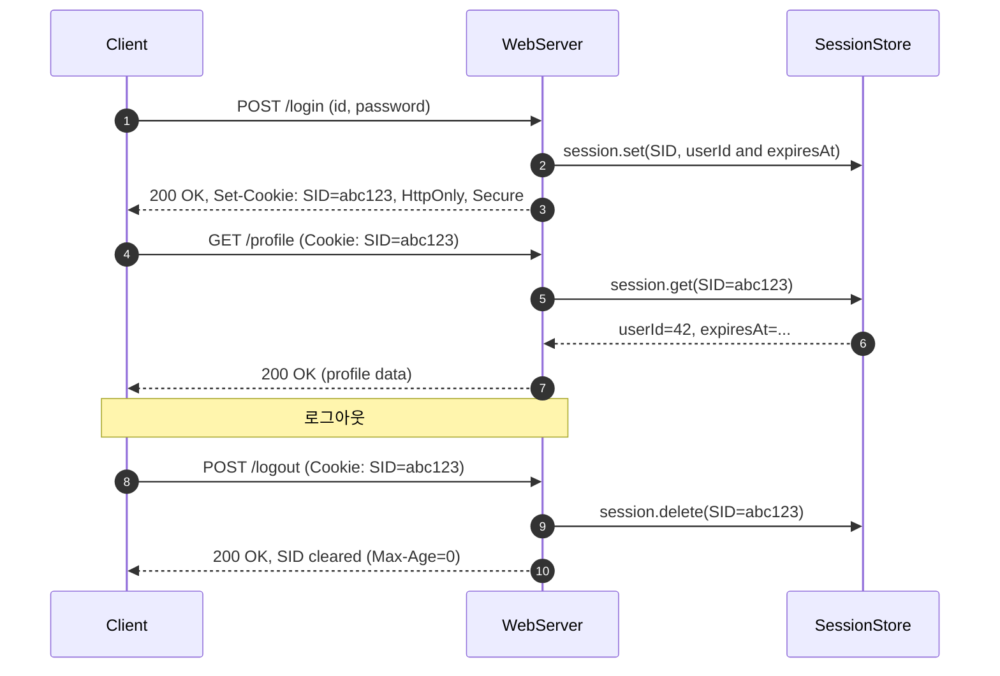
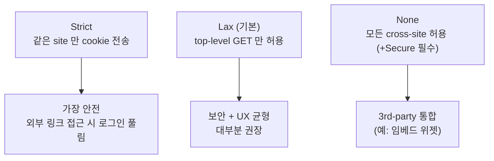
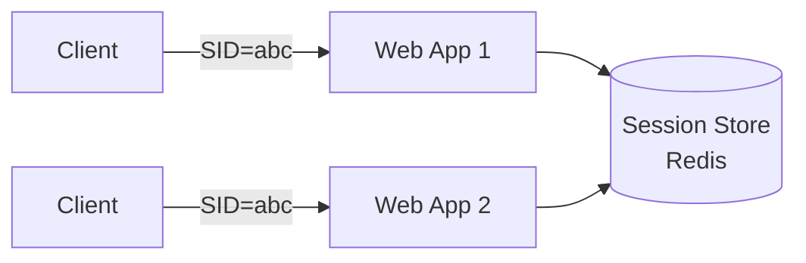
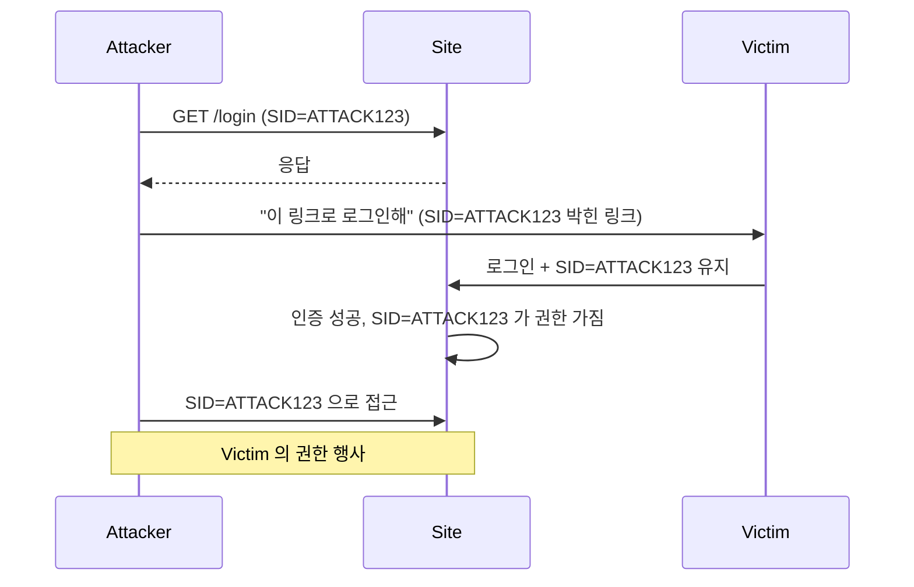

## 정의

**Session Cookie** 는 *서버가 발급한 임의 ID 를 쿠키에 보관*. 매 요청 자동 첨부. *서버 측 세션 store* (Redis, DB) 와 짝.

> [!IMPORTANT]
> *JWT 와의 비교*: session = *stateful*, JWT = *stateless*. 작은-중간 모놀리스에서는 *session 이 더 단순 + 즉시 revoke 가능*. 분산 환경에서는 JWT.

## 쿠키 속성

```http
Set-Cookie: SID=abc123; Path=/; Domain=example.com;
            Secure; HttpOnly; SameSite=Lax;
            Max-Age=3600
```

| 속성 | 의미 |
|---|---|
| `HttpOnly` | JS 에서 접근 불가 (XSS 방어) |
| `Secure` | HTTPS 만 |
| `SameSite=Strict\|Lax\|None` | cross-site 동작 제어 |
| `Path` | URL prefix |
| `Domain` | 도메인 범위 |
| `Max-Age` / `Expires` | 만료 |
| `Partitioned` *(2024+)* | 3rd-party cookie 격리 |
| `__Host-` prefix | Secure + Path=/ + Domain 없음 강제 |

## HTTP 세션 전체 흐름



> 로그아웃은 *반드시 서버 store 도 삭제*. 쿠키만 지우면 *SID 재사용 가능*.

## SameSite 3 모드



| | Strict | Lax | None |
|---|---|---|---|
| 직접 입력 (주소창) | O | O | O |
| 외부 사이트 링크 클릭 | X | O (top-level GET) | O |
| 외부 폼 POST | X | X | O |
| `` | X | X | O |
| iframe POST | X | X | O |

> 2020 부터 *Chrome 의 기본값 = Lax*. 명시하지 않은 옛 쿠키도 *Lax* 적용.

## CSRF 공격과 방어

```mermaid
sequenceDiagram
    autonumber
    participant V as Victim
    participant A as AttackerSite
    participant B as BankSite

    V->>B: 로그인 (SID=abc 쿠키 발급)
    V->>A: 악성 사이트 방문
    A-->>V: "<form action='bank.com/transfer' method='POST'> 자동 submit"
    V->>B: POST /transfer (Cookie: SID=abc 자동 첨부, amount=100000)
    Note over B: CSRF 취약하면 정상 처리됨
```



**방어 전략**:

1. **SameSite=Lax/Strict**: 외부 POST 요청 시 쿠키 전송 차단
2. **CSRF Token**: 서버가 생성한 토큰을 폼에 hidden 필드로 삽입, 요청 시 검증
3. **Double Submit Cookie**: 쿠키와 헤더에 같은 토큰 → origin 확인 효과
4. **Referer / Origin 헤더 검증**: 신뢰할 수 없는 origin 차단

```html
<!-- CSRF token 폼 예시 -->
<form method="POST" action="/transfer">
  <input type="hidden" name="_csrf" value="{{ csrf_token }}">
  <input type="number" name="amount">
  <button type="submit">송금</button>
</form>
```

## Session Store 패턴



세션 store 옵션:

| Store | 특징 |
|---|---|
| 메모리 | 단일 노드, 재시작 시 손실 |
| 파일 | 단일 노드 |
| Redis | *분산 표준* |
| DB (Postgres / MySQL) | 단순 / 큰 부담 |
| 클라이언트 (encrypted cookie) | *stateless 처럼*. Express의 cookie-session, Rails encrypted cookie |

## 구현 예시 (Node.js / Express)

```typescript
import session from "express-session";
import RedisStore from "connect-redis";
import { createClient } from "redis";

const redisClient = createClient({ url: process.env.REDIS_URL });
await redisClient.connect();

app.use(session({
  store: new RedisStore({ client: redisClient }),
  secret: process.env.SESSION_SECRET,  // 32+ bytes random
  resave: false,
  saveUninitialized: false,
  name: "__Host-SID",  // __Host- prefix 강제 보안
  cookie: {
    httpOnly: true,
    secure: true,           // HTTPS only
    sameSite: "lax",        // CSRF 완화
    maxAge: 1000 * 60 * 30, // 30분
  },
}));
```

## Cookie Prefix (`__Host-`, `__Secure-`)

| Prefix | 강제 속성 | 효과 |
|---|---|---|
| `__Host-` | Secure + Path=/ + Domain 없음 | *가장 강력*. 서브도메인 격리 |
| `__Secure-` | Secure 만 | HTTPS 전송 보장 |

```http
Set-Cookie: __Host-SID=abc123; Path=/; Secure; HttpOnly; SameSite=Lax
```

> `__Host-` 사용 시 Domain 속성을 설정하면 *브라우저가 쿠키를 무시*. Path=/ 강제.

## Stateless vs Stateful

| 항목 | Session (cookie) | JWT |
|---|---|---|
| 서버 store | 필수 | 불필요 |
| Revoke | *즉시 (DB 삭제)* | 만료까지 어려움 |
| Cookie 자동 첨부 | *예* | Bearer header 수동 |
| CSRF | *위험* (SameSite 로 완화) | *덜 위험* (헤더면) |
| XSS | *덜 위험* (HttpOnly) | localStorage 면 *위험* |

## Session Fixation



**방어**: *로그인 직후 새 SID 발급*. 옛 SID 무효화.

## 보안 체크리스트

```
✓ HttpOnly                (XSS 방어)
✓ Secure                  (HTTPS 만)
✓ SameSite=Lax 이상       (CSRF 완화)
✓ session 만료 짧게        (15-60분 inactive timeout)
✓ session rotation        (privilege escalation 시 새 SID)
✓ session_id 충분히 랜덤   (128+ bits)
✓ 로그아웃 시 server-side 삭제
✓ __Host- 또는 __Secure- prefix 사용
✓ CSRF token 또는 SameSite=Strict
```

## 흔한 함정

> [!WARNING]
> 1. **`HttpOnly` 없음** = XSS 1줄로 세션 탈취.
> 2. **`Secure` 없음** = HTTP 구간에서 *평문 노출*.
> 3. **`SameSite` 미설정** = 옛 브라우저는 None 처럼 동작 → CSRF.
> 4. **세션 *영구*** = Max-Age 없이 영구 쿠키. 사용자 비활성 후에도 위험.
> 5. **로그아웃이 *cookie 만 삭제*** = server-side store 에 그대로. 토큰이 *재사용 가능*.
> 6. **Session Fixation 미방어** = 로그인 후 SID 교체 안 하면 *공격자가 사전에 SID 심기 가능*.

## Partitioned Cookie (CHIPS, 2024+)

**CHIPS (Cookies Having Independent Partitioned State)**: 3rd-party 쿠키 퇴장 이후 임베드 시나리오를 위한 대안.

```http
Set-Cookie: __Host-widget_session=xyz; Secure; HttpOnly; SameSite=None; Partitioned
```

- 쿠키가 *top-level site 별로 격리*. `a.com` 에서 설정한 `widget.com` 쿠키는 `b.com` 에서 보이지 않음
- *Chrome 118+ 기본 지원*, Firefox 지원 예정
- 기존 `SameSite=None` 임베드 쿠키의 *미래 대안*

## Redis 세션 만료 패턴

```typescript
// 비활성 만료: 활동 시마다 TTL 갱신
async function touchSession(sid: string) {
  const INACTIVE_TIMEOUT = 30 * 60; // 30분
  await redis.expire(`session:${sid}`, INACTIVE_TIMEOUT);
}

// 절대 만료: 최초 설정 후 고정
async function setSession(sid: string, data: object) {
  const ABSOLUTE_TIMEOUT = 8 * 60 * 60; // 8시간
  await redis.setex(`session:${sid}`, ABSOLUTE_TIMEOUT, JSON.stringify(data));
}
```

> *비활성 timeout + 절대 timeout 을 모두 적용*하는 것이 정통. 비활성으로는 짧게 (30분), 절대값으로는 길게 (8시간).

## 관련 위키

- [[JWT]]
- [[CSRF]]
- [[CORS]]
- [[Redis Cache Patterns]]
- [[Sticky Session]]
