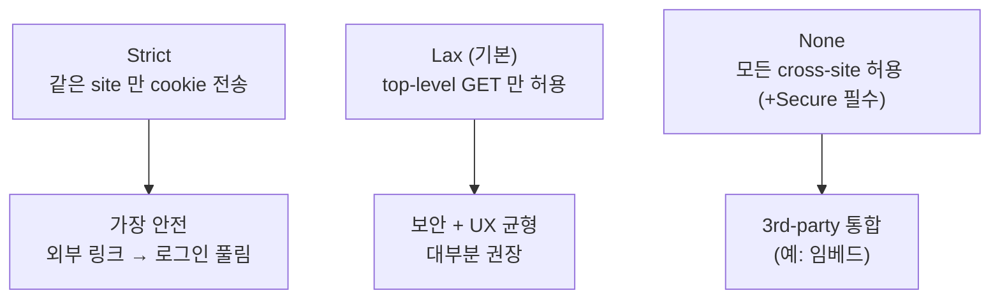
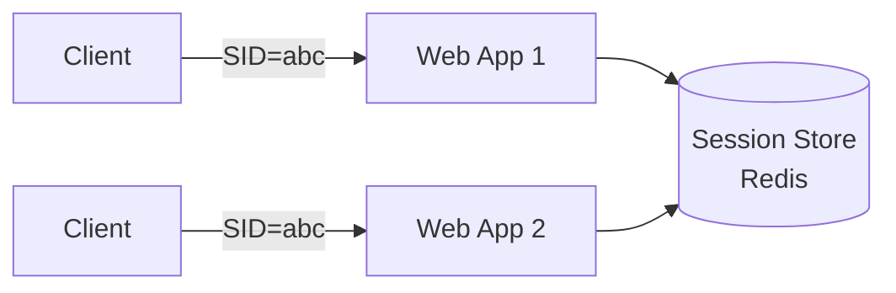
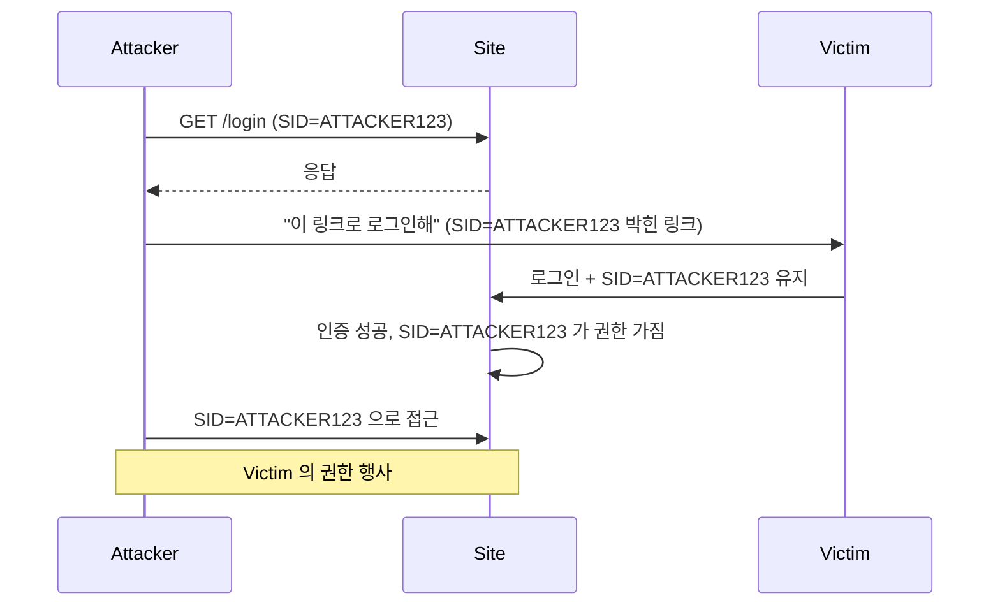

## 정의

**Session Cookie** 는 *서버가 발급한 임의 ID 를 쿠키에 보관*. 매 요청 자동 첨부. *서버 측 세션 store* (Redis, DB) 와 짝.

> [!IMPORTANT]
> *JWT 와의 비교*: session = *stateful*, JWT = *stateless*. 작은-중간 모놀리스에서는 *session 이 더 단순 + 즉시 revoke 가능*. 분산 환경에서는 JWT.

## 쿠키 속성

```http
Set-Cookie: SID=abc123; Path=/; Domain=example.com;
            Secure; HttpOnly; SameSite=Lax;
            Max-Age=3600
```

| 속성 | 의미 |
|---|---|
| `HttpOnly` | JS 에서 접근 불가 (XSS 방어) |
| `Secure` | HTTPS 만 |
| `SameSite=Strict\|Lax\|None` | cross-site 동작 제어 |
| `Path` | URL prefix |
| `Domain` | 도메인 범위 |
| `Max-Age` / `Expires` | 만료 |
| `Partitioned` *(2024+)* | 3rd-party cookie 격리 |
| `__Host-` prefix | Secure + Path=/ + Domain 없음 강제 |

## SameSite 3 모드



| | Strict | Lax | None |
|---|---|---|---|
| 직접 입력 (주소창) | O | O | O |
| 외부 사이트 링크 클릭 | X | O (top-level GET) | O |
| 외부 폼 POST | X | X | O |
| `` | X | X | O |
| iframe POST | X | X | O |

> 2020 부터 *Chrome 의 기본값 = Lax*. 명시하지 않은 옛 쿠키도 *Lax* 적용.

## Session Store 패턴



세션 store 옵션:

| Store | 특징 |
|---|---|
| 메모리 | 단일 노드, 재시작 시 손실 |
| 파일 | 단일 노드 |
| Redis | *분산 표준* |
| DB (Postgres / MySQL) | 단순 / 큰 부담 |
| 클라이언트 (encrypted cookie) | *stateless 처럼*. Express의 cookie-session, Rails encrypted cookie |

## Stateless vs Stateful

```anim:stateless-vs-stateful
{}
```

| 항목 | Session (cookie) | JWT |
|---|---|---|
| 서버 store | 필수 | 불필요 |
| Revoke | *즉시 (DB 삭제)* | 만료까지 어려움 |
| Cookie 자동 첨부 | *예* | Bearer header 수동 |
| CSRF | *위험* (SameSite 로 완화) | *덜 위험* (헤더면) |
| XSS | *덜 위험* (HttpOnly) | localStorage 면 *위험* |

## 보안 체크리스트

```
✓ HttpOnly                (XSS 방어)
✓ Secure                  (HTTPS 만)
✓ SameSite=Lax 이상       (CSRF 완화)
✓ session 만료 짧게        (15-60분 inactive timeout)
✓ session rotation        (privilege escalation 시 새 SID)
✓ session_id 충분히 랜덤   (128+ bits)
✓ 로그아웃 시 server-side 삭제
```

## Session Fixation



**방어**: *로그인 직후 새 SID 발급*. 옛 SID 무효화.

## 흔한 함정

> [!WARNING]
> 1. **`HttpOnly` 없음** = XSS 1줄로 세션 탈취.
> 2. **`Secure` 없음** = HTTP → HTTPS 전환에서 *평문 노출*.
> 3. **`SameSite` 미설정** = 옛 브라우저는 None 처럼 동작 → CSRF.
> 4. **세션 *영구*** = Max-Age 없이 영구 쿠키. 사용자 비활성 후에도 위험.
> 5. **로그아웃이 *cookie 만 삭제*** = server-side store 에 그대로. 토큰이 *재사용 가능*.

## 관련 위키

- [[JWT]]
- [[CSRF]]
- [[CORS]]
- [[Redis Cache Patterns]]
- [[Sticky Session]]
