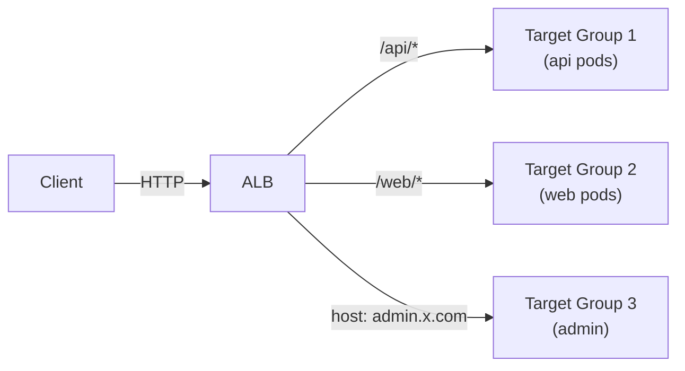
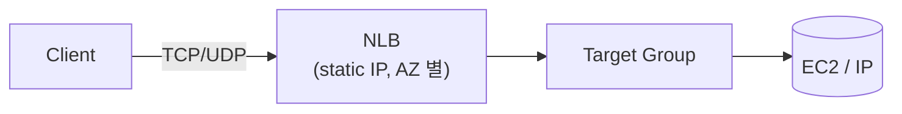
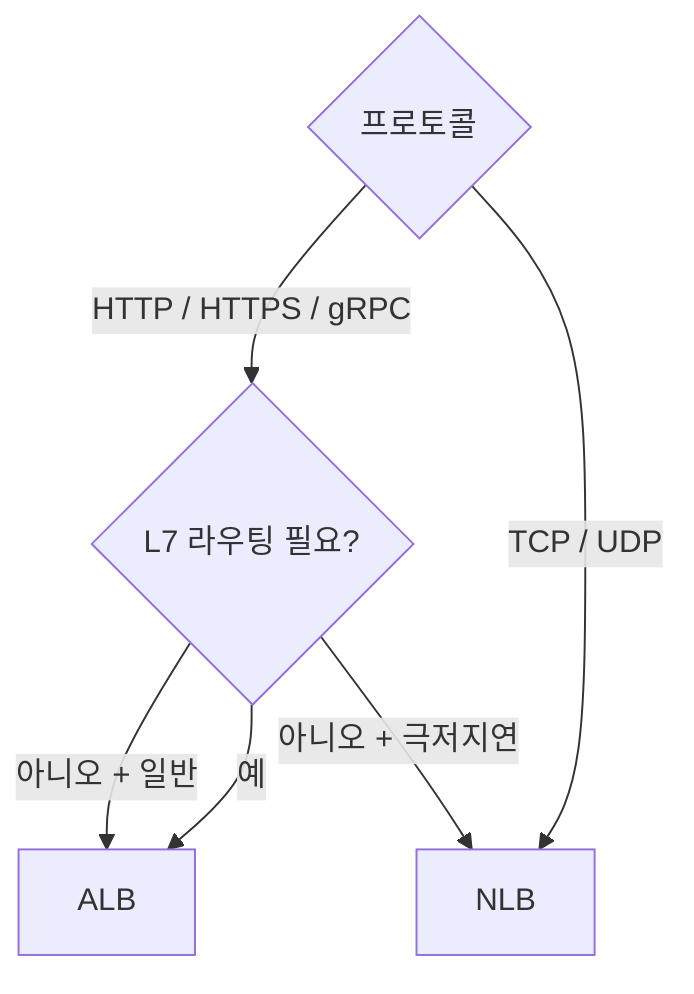
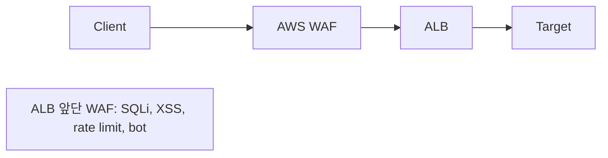

## 정의

| | ALB | NLB | (Classic ELB) |
|---|---|---|---|
| Layer | *L7 (HTTP)* | *L4 (TCP/UDP)* | L4 + L7 (legacy) |
| 라우팅 | path / host / header | port | 단순 |
| TLS termination | O | O (TLS listener) | O |
| WebSocket | O | O | 부분 |
| gRPC | O | O | X |
| 처리량 | 큼 | *매우 큼* | 보통 |
| Static IP | NO | *예 (EIP)* | NO |
| Latency | 중간 (ms) | *극저지연* (µs) | 중간 |
| 가격 | LCU (요청 + 데이터) | LCU | 시간 + GB |

```anim:load-balancer
{}
```

## ALB (Application Load Balancer)



기능:

- Path-based / Host-based / Header / Query routing
- WebSocket / HTTP/2 (gRPC)
- WAF 통합
- Cognito / OIDC 인증 (앞단)
- Lambda 직접 target
- IP 또는 instance target

## NLB (Network Load Balancer)



기능:

- *극저지연*: 마이크로초.
- *static IP*: AZ 별 EIP 고정 (방화벽 허용 친화).
- *millions of conn*.
- TLS termination 옵션.
- TCP / UDP / TLS listener.

> [!IMPORTANT]
> *gRPC, WebSocket idle 대응* 은 *NLB 가 ALB 보다 안정*. 정 idle timeout 길게.

## 선택 트리



## Target Group

```yaml
TargetType: instance | ip | lambda
HealthCheck:
  Protocol: HTTP
  Path: /health
  Interval: 30s
  HealthyThreshold: 2
  UnhealthyThreshold: 3
```

## Sticky Session

```yaml
Stickiness:
  Type: lb_cookie     # ALB 가 쿠키 박음
  Duration: 1d
```

또는 application-controlled (app 이 cookie 박음).

## WAF 통합 (ALB 만)



## ALB → Lambda

```yaml
TargetType: lambda
Targets:
  - { Id: arn:aws:lambda:us-east-1:123:function:myFunc }
```

> *API Gateway 대신 ALB + Lambda* 도 가능. 더 cheap, REST API 만.

## 흔한 함정

> [!WARNING]
> 1. **ALB Idle Timeout 60s** = WebSocket / SSE 가 silent close. ping/pong 또는 timeout 늘림.
> 2. **NLB + auto-scaling** = NLB 의 *target deregistration delay*. 트래픽 차단 후 *수십 초* 까지 일부 요청.
> 3. **HTTP/2 → 백엔드는 HTTP/1.1** = ALB 가 down-grade. gRPC backend 는 *NLB* 또는 HTTP/2 enable.
> 4. **NLB cross-zone disabled** = AZ 간 불균등 분포. enable 권장 (가격 약간 더).

## 관련 위키

- [[Load Balancer]]
- [[aws-vpc]]
- [[aws-route53]]
- [[k8s-ingress]]
