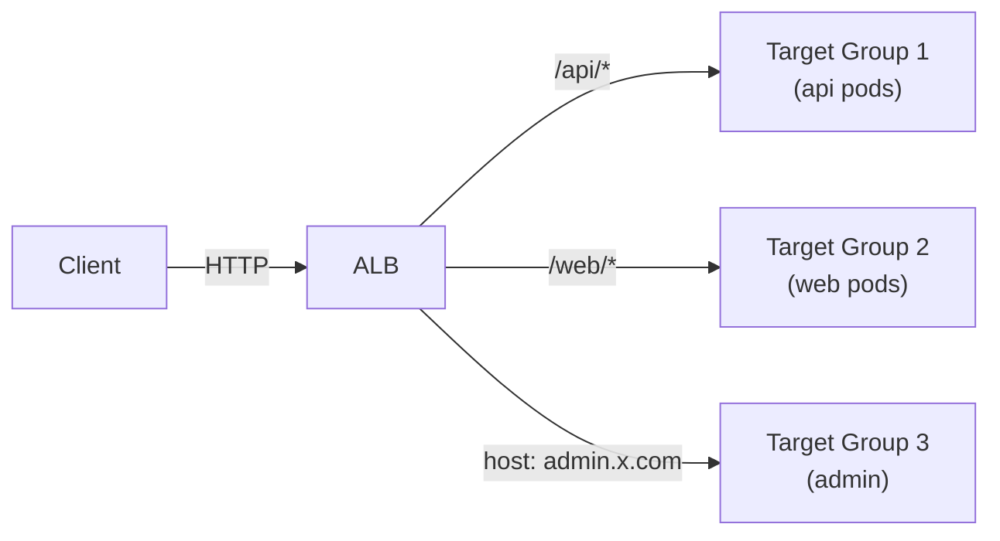
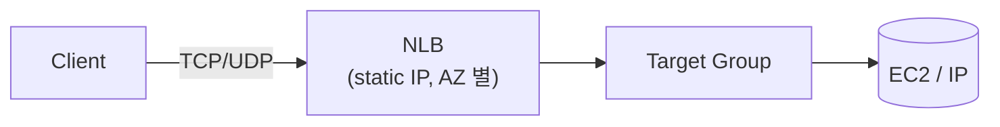
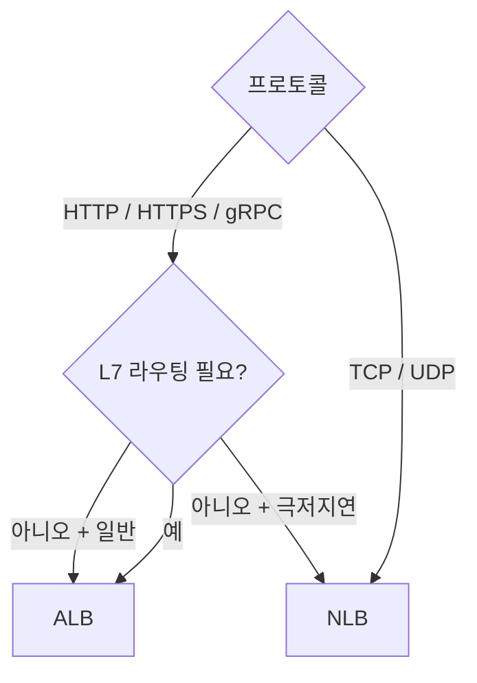
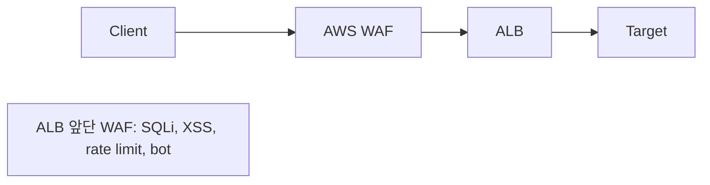
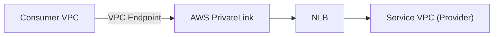

## 정의

| | ALB | NLB | (Classic ELB) |
|---|---|---|---|
| Layer | *L7 (HTTP)* | *L4 (TCP/UDP)* | L4 + L7 (legacy) |
| 라우팅 | path / host / header | port | 단순 |
| TLS termination | O | O (TLS listener) | O |
| WebSocket | O | O | 부분 |
| gRPC | O | O | X |
| 처리량 | 큼 | *매우 큼* | 보통 |
| Static IP | NO | *예 (EIP)* | NO |
| Latency | 중간 (ms) | *극저지연* (us) | 중간 |
| 가격 | LCU (요청 + 데이터) | LCU | 시간 + GB |

```anim:load-balancer
{}
```

## 사용 상황

| 상황 | 선택 |
|---|---|
| HTTP/HTTPS 마이크로서비스 라우팅 | ALB |
| path/host 기반 분기 (microservices) | ALB |
| WAF, Cognito OIDC 인증 앞단 | ALB |
| Lambda 직접 호출 | ALB |
| 극저지연 TCP 트래픽 (게임, 금융) | NLB |
| static IP 필요 (방화벽 화이트리스트) | NLB |
| AWS PrivateLink 엔드포인트 | NLB |
| 수백만 동시 연결 | NLB |

## ALB (Application Load Balancer)



기능:

- Path-based / Host-based / Header / Query routing
- WebSocket / HTTP/2 (gRPC)
- WAF 통합
- Cognito / OIDC 인증 (앞단)
- Lambda 직접 target
- IP 또는 instance target

## NLB (Network Load Balancer)



기능:

- *극저지연*: 마이크로초.
- *static IP*: AZ 별 EIP 고정 (방화벽 허용 친화).
- *millions of conn*.
- TLS termination 옵션.
- TCP / UDP / TLS listener.

> [!IMPORTANT]
> *gRPC, WebSocket idle 대응* 은 *NLB 가 ALB 보다 안정*. 정 idle timeout 길게.

## 선택 트리



## Target Group

```yaml
TargetType: instance | ip | lambda
HealthCheck:
  Protocol: HTTP
  Path: /health
  Interval: 30s
  HealthyThreshold: 2
  UnhealthyThreshold: 3
```

Target group을 서비스별로 분리하면 ALB 하나로 멀티 서비스 라우팅 가능.

## ALB Listener 규칙 우선순위

규칙은 1~50000 우선순위로 평가. 낮을수록 먼저.

```bash
# 규칙 추가 예시
aws elbv2 create-rule \
  --listener-arn arn:aws:elasticloadbalancing:...:listener/... \
  --priority 10 \
  --conditions '[{"Field":"path-pattern","Values":["/api/*"]}]' \
  --actions '[{"Type":"forward","TargetGroupArn":"arn:..."}]'
```

| 조건 (Field) | 예시 |
|---|---|
| `path-pattern` | `/api/*`, `/static/*` |
| `host-header` | `api.example.com` |
| `http-header` | `X-Custom-Header: value` |
| `source-ip` | `10.0.0.0/8` |
| `query-string` | `env=canary` |

## HTTPS / TLS 설정

```bash
# HTTPS Listener 생성
aws elbv2 create-listener \
  --load-balancer-arn arn:... \
  --protocol HTTPS --port 443 \
  --certificates CertificateArn=arn:aws:acm:...:certificate/... \
  --ssl-policy ELBSecurityPolicy-TLS13-1-2-2021-06 \
  --default-actions Type=forward,TargetGroupArn=arn:...

# HTTP → HTTPS redirect
aws elbv2 create-listener \
  --load-balancer-arn arn:... \
  --protocol HTTP --port 80 \
  --default-actions \
    Type=redirect,RedirectConfig='{Protocol=HTTPS,StatusCode=HTTP_301}'
```

> [!TIP]
> SSL Policy 는 최소 `ELBSecurityPolicy-TLS13-1-2-2021-06` 권장. TLS 1.0/1.1 비활성.

## Sticky Session

```yaml
Stickiness:
  Type: lb_cookie     # ALB 가 쿠키 박음
  Duration: 1d
```

또는 application-controlled (app 이 cookie 박음).

> 세션 sticky는 stateful 앱에서만. 가능하면 stateless 설계 권장.

## WAF 통합 (ALB 만)



## ALB → Lambda

```yaml
TargetType: lambda
Targets:
  - { Id: arn:aws:lambda:us-east-1:123:function:myFunc }
```

> *API Gateway 대신 ALB + Lambda* 도 가능. 더 cheap, REST API 만.

## NLB + PrivateLink

NLB를 VPC Endpoint Service 로 노출. 다른 VPC/계정에서 프라이빗 접근.



```bash
# Endpoint Service 생성 (NLB 기반)
aws ec2 create-vpc-endpoint-service-configuration \
  --network-load-balancer-arns arn:aws:elasticloadbalancing:...:loadbalancer/net/...
```

> SaaS 서비스가 고객 VPC에 안전하게 서비스 제공 시 표준 패턴.

## Cross-Zone Load Balancing

기본값:
- ALB: 활성화
- NLB: 비활성화 (AZ 내 균등 분산)

```bash
# NLB cross-zone 활성화
aws elbv2 modify-load-balancer-attributes \
  --load-balancer-arn arn:... \
  --attributes Key=load_balancing.cross_zone.enabled,Value=true
```

> NLB cross-zone 활성화 시 AZ 간 데이터 전송 비용 발생.

## Connection Draining (Deregistration Delay)

Target 제거 전 기존 연결을 안전하게 종료.

```bash
aws elbv2 modify-target-group-attributes \
  --target-group-arn arn:... \
  --attributes Key=deregistration_delay.timeout_seconds,Value=30
```

기본 300초. 빠른 배포 환경에서는 30-60초로 줄이기.

## Access Log

```bash
# Access Log 활성화 (S3)
aws elbv2 modify-load-balancer-attributes \
  --load-balancer-arn arn:... \
  --attributes \
    Key=access_logs.s3.enabled,Value=true \
    Key=access_logs.s3.bucket,Value=my-alb-logs \
    Key=access_logs.s3.prefix,Value=alb
```

로그 필드: `time`, `elb`, `client:port`, `target:port`, `request`, `target_status_code`, `user_agent`.

Athena로 분석:

```sql
SELECT client_ip, request_url, target_status_code, COUNT(*) as cnt
FROM alb_logs
WHERE time > '2026-07-16'
GROUP BY 1, 2, 3
ORDER BY cnt DESC
LIMIT 100;
```

## CloudWatch 핵심 메트릭

| 메트릭 | 의미 |
|---|---|
| `RequestCount` | 총 요청 수 |
| `TargetResponseTime` | 백엔드 응답 시간 |
| `HTTPCode_Target_5XX_Count` | 백엔드 5xx 에러 |
| `HTTPCode_ELB_5XX_Count` | ALB 자체 5xx |
| `HealthyHostCount` | 헬시 타겟 수 |
| `UnHealthyHostCount` | 비헬시 타겟 수 |

> `UnHealthyHostCount > 0` 알림 필수. 배포 중 타겟이 줄어들면 즉각 탐지.

## 흔한 함정

> [!WARNING]
> 1. **ALB Idle Timeout 60s** = WebSocket / SSE 가 silent close. ping/pong 또는 timeout 늘림.
> 2. **NLB + auto-scaling** = NLB 의 *target deregistration delay*. 트래픽 차단 후 *수십 초* 까지 일부 요청.
> 3. **HTTP/2 → 백엔드는 HTTP/1.1** = ALB 가 down-grade. gRPC backend 는 *NLB* 또는 HTTP/2 enable.
> 4. **NLB cross-zone disabled** = AZ 간 불균등 분포. enable 권장 (가격 약간 더).
> 5. **ALB 규칙 한도** = Listener당 규칙 100개 제한. path 패턴 조합 주의.
> 6. **Health Check 경로 인증** = `/health` 에 인증 걸면 ALB가 401 받아 unhealthy 판정. 인증 제외.
> 7. **NLB 의 Source IP 보존** = NLB는 기본적으로 클라이언트 IP 보존. ALB는 X-Forwarded-For 헤더.

## 관련 위키

- [[load-balancer]]
- [[aws-vpc]]
- [[aws-route53]]
- [[k8s-ingress]]
- [[aws-waf]]
- [[aws-cloudfront-cdn]]
- [[k8s-service]]
- [[aws-ecs]]
