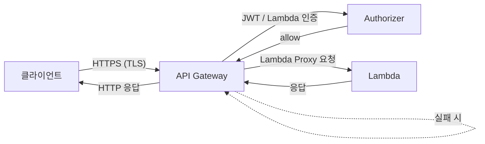
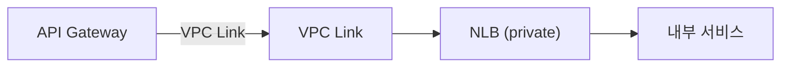
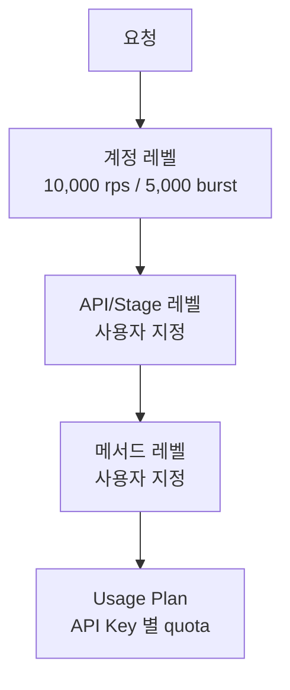
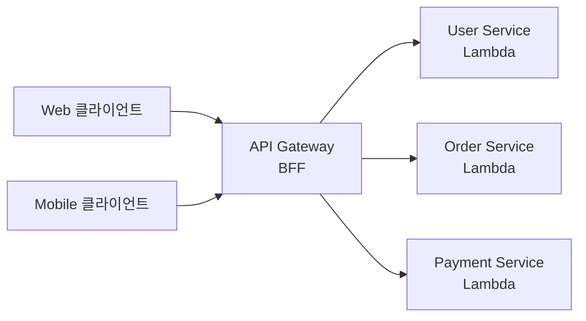

## 정의

**AWS API Gateway** 는 REST / HTTP / WebSocket API 를 관리하는 완전관리형 서비스. 인증, 스로틀링, 캐싱, 요청/응답 변환, 로깅을 단일 서비스로 제공. Lambda 와 결합해 서버리스 백엔드의 진입점이 된다.

## API 타입 비교

| 항목 | REST API | HTTP API | WebSocket API |
|:---|:---|:---|:---|
| 출시 | 2015 | 2019 | 2018 |
| 비용 | $3.50/million | $1.00/million | $1.00/million |
| 지연시간 | 높음 | 낮음 | - |
| JWT authorizer | Lambda만 | *내장* | Lambda만 |
| WAF 통합 | *가능* | 가능 (v2) | 아니오 |
| Request validator | *있음* | 없음 | 없음 |
| Usage Plan/API Key | *있음* | 없음 | 없음 |
| Response 캐싱 | *있음* | 없음 | - |
| 프라이빗 endpoint | 가능 | 가능 | - |

> [!IMPORTANT]
> 신규 프로젝트는 **HTTP API 우선 검토**. 기능 격차를 확인 후 REST API 선택.

## 아키텍처: Lambda 프록시 통합



Lambda proxy 통합: API Gateway 가 원본 요청을 그대로 Lambda 에 전달 (path, headers, body, queryStringParameters 포함). Lambda 는 `statusCode`, `headers`, `body` 를 포함한 JSON 을 반환.

## 통합 타입

### Lambda Proxy

```json
{
  "httpMethod": "POST",
  "path": "/users",
  "headers": { "Authorization": "Bearer ..." },
  "queryStringParameters": { "page": "1" },
  "body": "{\"name\": \"alice\"}"
}
```

Lambda 응답:

```json
{
  "statusCode": 201,
  "headers": { "Content-Type": "application/json" },
  "body": "{\"id\": \"u123\"}"
}
```

### HTTP Proxy

외부 URL 로 요청 그대로 포워딩. 변환 없음.

```yaml
# 통합 설정
integration:
  type: HTTP_PROXY
  uri: "http://internal-alb.example.com/{proxy}"
  httpMethod: ANY
```

### VPC Link

프라이빗 [[aws-vpc|VPC]] 내 [[aws-alb-nlb|ALB/NLB]] 와 연결. 인터넷 노출 없이 내부 서비스 연결.



### AWS 서비스 직접 통합

Lambda 없이 DynamoDB, SQS, S3 등 직접 호출.

```yaml
integration:
  type: AWS
  uri: "arn:aws:apigateway:us-east-1:dynamodb:action/PutItem"
  credentials: "arn:aws:iam::123:role/apigw-dynamo-role"
```

## 인증/인가

### Lambda Authorizer (커스텀)

```python
def handler(event, context):
    token = event['authorizationToken']
    # JWT 검증 또는 DB 조회
    effect = "Allow" if valid(token) else "Deny"
    return {
        "principalId": "user123",
        "policyDocument": {
            "Version": "2012-10-17",
            "Statement": [{
                "Action": "execute-api:Invoke",
                "Effect": effect,
                "Resource": event['methodArn']
            }]
        },
        "context": { "userId": "u123" }   # Lambda 로 전달 가능
    }
```

**캐싱**: Lambda Authorizer 결과를 TTL 동안 캐시. 기본 300초. 비용 절감 + 지연시간 단축.

### JWT Authorizer (HTTP API 전용)

```yaml
authorizer:
  type: JWT
  jwtConfiguration:
    issuer: "https://cognito-idp.us-east-1.amazonaws.com/us-east-1_xxx"
    audience: ["client-id-1"]
  identitySource: "$request.header.Authorization"
```

Cognito, Auth0, Okta 등 OIDC 호환 IdP 와 바로 연동. Lambda 불필요.

### IAM + SigV4

AWS SDK / CLI 로 서명된 요청. 내부 서비스 간 통신에 적합.

## 스로틀링 설정



| 레벨 | 기본값 | 변경 |
|:---|:---|:---|
| 계정 전체 | 10,000 rps / burst 5,000 | Support 티켓으로 증가 |
| Stage/API | 계정 한도 공유 | 콘솔/API 로 설정 |
| 메서드 | Stage 한도 공유 | 각 메서드별 오버라이드 |
| Usage Plan | 일/월 quota, rps | API Key 단위 |

429 Too Many Requests 반환 시 `Retry-After` 헤더 제공.

## 스테이지 관리

```
prod (v1)   →  stage variables: LOG_LEVEL=WARN
staging     →  stage variables: LOG_LEVEL=DEBUG
dev         →  stage variables: LOG_LEVEL=DEBUG
```

- **Stage Variable**: 스테이지별 환경 변수. Lambda alias 로 활용 가능.
- **Canary deployment**: 스테이지에서 일부 트래픽만 새 버전으로.
- **Deployment**: Stage 에 변경사항 반영 (명시적 배포 필요).

## 캐싱 (REST API)

```bash
# 캐시 활성화
aws apigateway update-stage \
  --rest-api-id abc123 \
  --stage-name prod \
  --patch-operations \
    op=replace,path=/cacheClusterEnabled,value=true \
    op=replace,path=/cacheClusterSize,value=0.5
```

| 캐시 크기 | 비용/시간 |
|:---|:---|
| 0.5 GB | $0.020 |
| 1.6 GB | $0.038 |
| 6.1 GB | $0.200 |
| 13.5 GB | $0.250 |

> [!WARNING]
> 캐시는 REST API 전용. HTTP API 에는 없음. 비용이 추가되므로 고트래픽 GET 엔드포인트에만 적용.

## 요청/응답 변환 (REST API)

Velocity Template Language (VTL) 로 매핑:

```
#set($inputRoot = $input.path('$'))
{
  "userId": "$inputRoot.id",
  "email": "$inputRoot.contact.email"
}
```

HTTP API 는 변환 불가 (Lambda 내부에서 처리).

## 사용 패턴

### BFF (Backend for Frontend)



### Microservice Gateway

각 마이크로서비스에 별도 API Gateway 대신 단일 진입점 제공.

### 이벤트 수신 (SNS/SQS 연결)

```
Client → API Gateway → SQS → Lambda consumer
```

비동기 처리 패턴. 즉시 202 Accepted 반환, 실제 처리는 SQS 로.

## 비용 구조

| 항목 | REST API | HTTP API |
|:---|:---|:---|
| 첫 3억 요청/월 | $3.50/million | $1.00/million |
| 3억 초과 | $1.51/million | $0.90/million |
| 캐싱 | 별도 시간당 요금 | 없음 |
| 데이터 전송 | AWS 표준 | AWS 표준 |

**비용 절감 팁**:
- HTTP API 우선 사용 (70% 저렴)
- 캐싱으로 Lambda 호출 감소
- REST API 의 Usage Plan 으로 초과 사용 방지

## 대안 비교

| 옵션 | 특성 | 적합한 경우 |
|:---|:---|:---|
| **API Gateway HTTP** | 낮은 비용, JWT 내장 | 신규 서버리스 API |
| **API Gateway REST** | 풍부한 기능, WAF, 캐싱 | 레거시 마이그레이션, API Key 관리 |
| **[[aws-alb-nlb|ALB]]** | 고성능, 저렴, L7 LB | ECS/EC2 기반, WebSocket |
| **AppSync** | GraphQL 특화, 실시간 | GraphQL API, 모바일 |
| **CloudFront + Functions** | 초저지연 엣지 | 간단 API 변환 |

## 함정

> [!WARNING]
> **Lambda 콜드 스타트**: API Gateway 자체는 콜드 스타트 없음. [[aws-lambda-cold-start|Lambda Cold Start]] 가 응답 지연 원인. Provisioned Concurrency 로 완화.

> [!WARNING]
> **payload 크기 제한**: REST/HTTP API 10 MB, WebSocket 128 KB. 대용량 파일은 S3 Presigned URL 로 직접 업로드.

> [!CAUTION]
> **프라이빗 API 와 VPC Endpoint**: VPC 내부에서만 접근 가능한 API 는 Interface VPC Endpoint 필요. 구성 복잡.

> [!WARNING]
> **REST API 와 HTTP API 기능 격차**: REST API 의 Request Validator, Usage Plan, 캐싱, WAF IP Set 참조 등은 HTTP API 에 없음. 마이그레이션 전 기능 확인 필수.

> [!CAUTION]
> **스테이지 변수와 Lambda alias**: Stage variable 로 Lambda alias 참조 시 Lambda resource policy 에 API Gateway 권한 별도 추가 필요.

> [!WARNING]
> **CORS 설정 누락**: HTTP API 는 CORS 자동 설정 지원. REST API 는 수동 설정 필요 (`OPTIONS` 메서드, `Access-Control-Allow-Origin` 헤더).

## 관련 위키

- [[aws-lambda]] - 주 통합 대상
- [[aws-lambda-cold-start]] - 콜드 스타트 문제
- [[aws-alb-nlb]] - 대안 L7 로드밸런서
- [[aws-vpc]] - 프라이빗 엔드포인트
- [[aws-iam]] - SigV4 인증
- [[aws-waf]] - 요청 필터링
- [[aws-cloudwatch]] - API 모니터링
- [[aws-sqs]] - 비동기 패턴 연결
