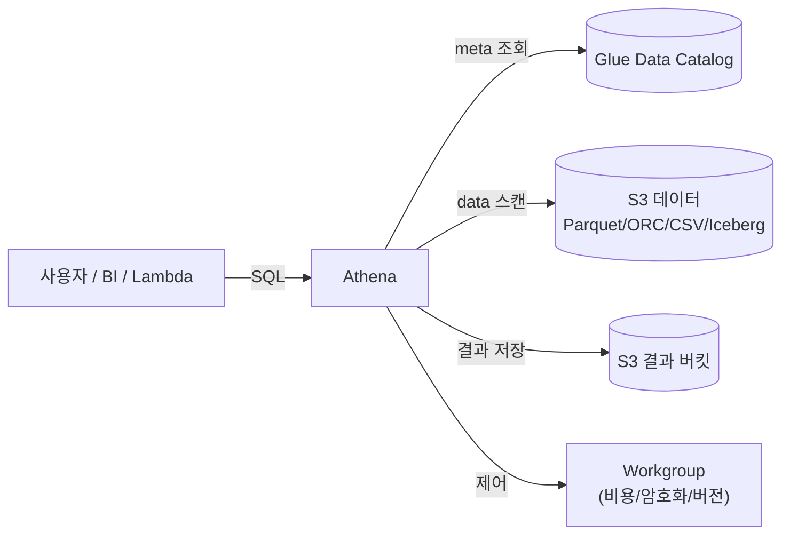

## 정의

**Amazon Athena** 는 *S3 에 있는 데이터를 서버 없이 SQL 로 쿼리* 하는 서비스. 클러스터 프로비저닝, 스키마 로딩, 인덱스 생성 없이 데이터 파일 (Parquet/ORC/CSV/JSON/Iceberg/Hudi/Delta) 을 바로 쿼리.

내부 엔진은 **Trino** 기반 (Engine v3). 이전 v2 는 Presto 기반이었음. [[aws-glue|Glue Data Catalog]] 를 메타 저장소로 씀.

## 사용 상황

| 상황 | 적합성 |
|:---|:---|
| Ad-hoc 로그 분석 | 적합 |
| BI 대시보드 백엔드 (QuickSight 등) | 적합 |
| Data lake 위 SQL | 적합 |
| ETL의 lightweight transform (CTAS) | 적합 |
| Federated query (RDS/DynamoDB 통합 쿼리) | 적합, 소규모만 |
| 초저지연 (< 1초) API 백엔드 | *부적합*, DW 나 캐시 |
| 트랜잭션 처리 | *부적합*, [[postgresql\|Postgres]] |
| 초대용량 반복 배치 | *부적합*, [[aws-redshift\|Redshift]] / EMR |

## 아키텍처



- **엔진**: Trino (Engine v3)
- **메타 저장소**: [[aws-glue|Glue Data Catalog]] (Hive Metastore 호환)
- **데이터**: [[aws-s3|S3]] 그대로 (Athena 는 저장 X)
- **결과**: S3 결과 버킷 (workgroup 별)

## Engine v2 vs v3

| 항목 | v2 (구) | v3 (현재) |
|:---|:---|:---|
| **기반** | Presto | Trino |
| **성능** | 기준 | ~10-15% 개선 |
| **SQL 표준** | Presto 계열 | ANSI SQL 확장 |
| **[[apache-parquet\|Parquet]] v2 encoding** | 부분 | 완전 |
| **Iceberg / Hudi / Delta** | 제한 | 완전 지원 |
| **Query Result Reuse** | X | O (24h) |
| **auto-upgrade** | - | 기본 활성 (workgroup 별) |

**정책**: v3 이 기본. AWS Health Dashboard 로 deprecation 통보. Workgroup pin 도 가능.

## 요금 모델

### 1. On-demand (기본)

- **$5 / TB scanned** (region 별 상이, us-east-1 기준)
- 최소 **10 MB per query** (실제 스캔이 작아도 10 MB 로 청구)
- **성공/실패 쿼리 모두 청구**
- DDL 은 무료

```
Scan 1 TB Parquet =  $5
Scan 4 GB Parquet =  $5 × 4/1024 = $0.02  (10MB 는 넘으니 실 크기)
Scan 5 MB CSV     =  $5 × 10/1024/1024 = $0.00005  (10MB 로 청구)
```

### 2. Capacity Reservation (예약)

- **$0.30 / DPU-hour**
- 예측 가능한 큰 워크로드에 유리 (스캔 요금 아님)
- 사용 안 하는 시간에는 요금 청구 안 됨 (예약 안 하면)
- DPU 을 워크그룹 단위로 예약

**언제 유리**:
- 하루 수 TB 이상 반복 스캔
- 동시 사용자 많음
- 스캔량이 큰 쿼리를 자주

### 3. Athena for Apache Spark

- **$0.35 / DPU-hour**
- Driver 1 DPU + workers (계산 시간만)
- Notebook 세션 (Jupyter 스타일)

**요금 계산 예**:
```
계산 6회, 각 20 DPU 1분, 세션 1시간 (driver 1 DPU):
  worker DPU-hour = 6 × 20 × (1/60) = 2 DPU-hr
  driver DPU-hour = 1 × 1 = 1 DPU-hr
  총 = 3 DPU-hr × $0.35 = $1.05
```

### 4. Federated Query

- 데이터 스캔은 동일 $5/TB
- Lambda 커넥터 호출 = Lambda 요금 별도

## Workgroups

*팀/워크로드 격리 단위*. 각 workgroup 은:

- 결과 저장 위치 (S3)
- 암호화 정책
- 엔진 버전 pin
- 데이터 스캔 한도 (per-query, per-workgroup)
- CloudWatch 지표 발행 여부
- 태그 (비용 배분)

**Cost Control**:

```
per-query limit:  1 GB
  → 쿼리가 1 GB 초과 스캔 시 자동 cancel
per-workgroup limit: 10 GB / 15분
  → SNS 알림 (자동 cancel 아님)
```

가장 흔한 사고 방지: `SELECT *` 인 실수 쿼리로 수 TB 스캔되는 것을 workgroup 한도로 차단.

## 파일 포맷별 비용 영향

| 포맷 | 압축 | 1 TB raw 스캔 시 실 스캔량 | 청구 |
|:---|:---|:---|:---|
| CSV (uncompressed) | 1x | 1 TB | $5 |
| CSV + GZIP | 3-4x | ~300 GB | $1.50 |
| JSON | 1-2x | ~800 GB | $4 |
| [[apache-parquet\|Parquet]] + SNAPPY | 3-4x + column projection | ~10 GB (컬럼 1개) | $0.05 |
| [[apache-parquet\|Parquet]] + ZSTD | 4-6x + column projection | ~7 GB | $0.035 |

> [!IMPORTANT]
> CSV -> Parquet 로 옮기는 것만으로 **10-100배 요금 절감**. Athena 비용 최적화의 첫 단계.

## 파티션 (Partitions)

Hive 스타일 디렉토리 파티션:

```
s3://bucket/events/
├── year=2026/
│   ├── month=07/
│   │   ├── day=15/
│   │   │   └── part-00000.parquet
```

```sql
CREATE EXTERNAL TABLE events (
  user_id BIGINT,
  event_type STRING,
  amount DECIMAL(10,2)
)
PARTITIONED BY (year INT, month INT, day INT)
STORED AS PARQUET
LOCATION 's3://bucket/events/';

-- 파티션 등록 (자동)
MSCK REPAIR TABLE events;

-- 쿼리 (year=2026, month=7 파티션만 스캔)
SELECT COUNT(*) FROM events
WHERE year = 2026 AND month = 7 AND event_type = 'purchase';
```

### Partition Projection

카탈로그 등록 없이 *규칙으로 파티션을 유추*. 파티션이 수백만 개인 대규모 데이터에 유리.

```sql
CREATE EXTERNAL TABLE events (...)
PARTITIONED BY (year INT, month INT, day INT)
STORED AS PARQUET
LOCATION 's3://bucket/events/'
TBLPROPERTIES (
  'projection.enabled' = 'true',
  'projection.year.type' = 'integer',
  'projection.year.range' = '2020,2027',
  'projection.month.type' = 'integer',
  'projection.month.range' = '1,12',
  'projection.day.type' = 'integer',
  'projection.day.range' = '1,31',
  'storage.location.template' = 's3://bucket/events/year=${year}/month=${month}/day=${day}/'
);
```

**장점**:
- Glue Catalog partition API 호출 없음 (요금/지연 감소)
- 새 파티션 자동 인식 (`ALTER TABLE ADD PARTITION` 불필요)
- 대규모 시계열에 최적

## CTAS (CREATE TABLE AS SELECT)

쿼리 결과를 새 테이블로 저장. Parquet + 파티셔닝으로 lightweight ETL.

```sql
CREATE TABLE curated.orders_2026
WITH (
  format = 'PARQUET',
  parquet_compression = 'ZSTD',
  external_location = 's3://curated/orders_2026/',
  partitioned_by = ARRAY['year', 'month']
)
AS
SELECT
  order_id, user_id, amount,
  YEAR(order_date) AS year,
  MONTH(order_date) AS month
FROM raw.orders
WHERE order_date >= DATE '2026-01-01';
```

**INSERT INTO** 도 지원 (append). CTAS + INSERT INTO 는 사실상 Athena 내에서 [[etl|ELT]] 를 가능하게 함.

## Apache Iceberg (Athena 에서)

Iceberg v2 테이블 완전 지원 (2024+).

```sql
CREATE TABLE lakehouse.orders (
  order_id BIGINT,
  user_id BIGINT,
  amount DECIMAL(10,2),
  order_date DATE
)
PARTITIONED BY (order_date)
LOCATION 's3://lakehouse/orders/'
TBLPROPERTIES (
  'table_type' = 'ICEBERG',
  'format' = 'parquet',
  'write_compression' = 'zstd'
);

-- ACID 트랜잭션 (UPDATE / DELETE / MERGE)
UPDATE lakehouse.orders SET amount = amount * 1.1 WHERE order_id = 123;
DELETE FROM lakehouse.orders WHERE user_id = 999;

MERGE INTO lakehouse.orders AS t USING staging AS s
  ON t.order_id = s.order_id
  WHEN MATCHED THEN UPDATE SET amount = s.amount
  WHEN NOT MATCHED THEN INSERT VALUES (s.order_id, s.user_id, s.amount, s.order_date);

-- Time travel
SELECT * FROM lakehouse.orders FOR TIMESTAMP AS OF TIMESTAMP '2026-07-01 00:00:00';
SELECT * FROM lakehouse.orders FOR VERSION AS OF 12345;
```

**제약**:
- Lake Formation 으로 등록된 Iceberg 테이블 DDL 제한
- 중첩 필드 파티셔닝 X
- `ALTER TABLE SET LOCATION` 미지원
- 시간 정밀도 밀리초 (마이크로초 X)

## Federated Query

Lambda 커넥터로 *S3 밖 데이터* 를 SQL 로 조인.

```
지원 커넥터:
- RDS (MySQL, PostgreSQL)
- Redshift
- DynamoDB
- DocumentDB
- Elasticsearch
- CloudWatch Logs / Metrics
- HBase
- Custom (Lambda 로 직접 개발)
```

```sql
-- 사전에 데이터 소스 등록 (커넥터 Lambda + IAM)
SELECT r.customer_name, SUM(a.amount) AS total
FROM rds_mysql.public.customers r
JOIN s3_lake.public.orders a ON r.customer_id = a.customer_id
GROUP BY r.customer_name;
```

**주의**: 대량 데이터를 원격 소스에서 pull 하면 Lambda 요금 + 지연. 소규모 lookup 이나 dimension join 에 적합.

## Query Result Reuse (2023+)

같은 쿼리를 24시간 이내 재실행 시 캐시된 결과 반환. 스캔 요금 없음.

- 정확히 같은 쿼리 텍스트여야 함 (whitespace, comment 제외)
- Workgroup 이 같아야 함
- 24시간 이내 (default, `MaxAgeInMinutes` 설정 가능)

## Prepared Statements & Views

```sql
-- Prepared
PREPARE q1 FROM
  SELECT * FROM orders WHERE user_id = ? AND status = ?;

EXECUTE q1 USING 123, 'paid';

-- View (Athena native)
CREATE OR REPLACE VIEW top_customers AS
SELECT customer_id, SUM(amount) AS total
FROM orders
GROUP BY customer_id
HAVING SUM(amount) > 10000;
```

## Athena for Apache Spark

Spark notebook 을 서버리스로. Trino SQL 로 안 되는 분석/ML feature engineering 에.

- Spark 3.5, Python
- 세션 idle 20분 기본
- Iceberg / Hudi / Delta 지원
- DPU 기반 (`$0.35 / DPU-hour`)

노트북 첫 셀에서 세션 자동 생성. 커스텀 Spark 설정 가능.

## [[aws-athena|Athena]] vs [[aws-redshift-spectrum|Redshift Spectrum]] vs [[aws-redshift|Redshift]]

| 축 | Athena | Redshift Spectrum | Redshift (RA3/Serverless) |
|:---|:---|:---|:---|
| **엔진** | Trino | Redshift 자체 | Redshift 자체 |
| **데이터 위치** | S3 만 | S3 + RMS 조인 | RMS 내부 |
| **사전 클러스터** | 불필요 | 필요 (Redshift 클러스터) | 필요 |
| **요금** | $5/TB 스캔 | $5/TB Spectrum + Redshift 컴퓨트 | Redshift 컴퓨트 |
| **동시 사용자** | 사실상 무제한 | 클러스터 한도 (concurrency scaling) | 클러스터 한도 |
| **JOIN 성능** | 중간 | 우수 (RA3 노드에서) | 최고 |
| **ETL** | CTAS 지원 | 제한 (external table read 위주) | COPY, MERGE 등 |
| **적합** | Ad-hoc, BI, ETL lite | Redshift 를 이미 씀 + S3 조인 | 무거운 배치, warehouse |

## 사용 예제

### 데이터 로딩 없이 로그 분석

```sql
-- ALB 로그 (S3 에 이미 있음)
CREATE EXTERNAL TABLE alb_logs (
  type STRING, time STRING, elb STRING,
  client_ip STRING, target_ip STRING, request_processing_time DOUBLE,
  ...
)
ROW FORMAT SERDE 'org.apache.hadoop.hive.serde2.RegexSerDe'
WITH SERDEPROPERTIES ('serialization.format' = '1', 'input.regex' = '...')
LOCATION 's3://my-alb-logs/AWSLogs/123/elasticloadbalancing/us-east-1/2026/07/';

-- 지난 시간 5xx 오류 top 10 client
SELECT client_ip, COUNT(*) AS n
FROM alb_logs
WHERE elb_status_code LIKE '5%'
  AND time >= '2026-07-30T14:00:00Z'
GROUP BY client_ip
ORDER BY n DESC LIMIT 10;
```

### S3 Access Log 를 QuickSight 대시보드로

```
S3 Access Log → S3 → Glue Crawler → Glue Catalog
                                  ↓
                              Athena Table
                                  ↓
                            QuickSight 대시보드
```

## 함정

> [!WARNING]
> **`SELECT *` on CSV** = 스캔량 폭탄. 컬럼 프로젝션 (필요한 컬럼만) + Parquet 로 변환.

> [!CAUTION]
> **파티션 없는 테이블** = 매 쿼리 전체 데이터 스캔. 데이터 레이크에 처음 붓기 전에 파티션 설계 필수.

> [!WARNING]
> **파티션 프루닝 안 됨** = `WHERE UPPER(year) = '2026'` 같은 함수 적용은 파티션 프루닝 실패. `WHERE year = 2026` 그대로.

> [!IMPORTANT]
> **작은 파일 수천 개** = Athena 성능 붕괴 + 요청 오버헤드. CTAS 로 큰 파일로 합침, Iceberg auto-compact.

> [!CAUTION]
> **Workgroup 한도 미설정** = 실수 `SELECT *` 로 수십 TB 스캔 후 요금 청구. 반드시 per-query / per-workgroup 한도.

> [!WARNING]
> **10 MB 최소 청구** = 매우 작은 쿼리가 많은 워크로드는 오히려 비쌈. Batch aggregation 고려.

> [!IMPORTANT]
> **Federated Query 를 반복 대량 처리에 사용** = Lambda 요금 폭탄 + 지연. Materialize 후 로컬 조인.

> [!CAUTION]
> **Iceberg 를 Lake Formation 으로 등록** = DDL 제한. Athena 에서 UPDATE/DELETE 안 되는 경우 있음. 등록 방식 사전 검토.

> [!WARNING]
> **Query Result Reuse 를 데이터 신선도 필요한 쿼리에** = 최대 24시간 stale. `NoReuse` 설정.

## 관련 위키

- [[aws-glue|AWS Glue]] - 메타 저장소, ETL
- [[aws-redshift|Redshift]] - DW 대안, Spectrum 의 엔진
- [[aws-redshift-spectrum|Redshift Spectrum]] - Redshift 에서 S3 쿼리
- [[aws-s3|AWS S3]] - 데이터 소스
- [[aws-s3-glacier|S3 Glacier]] - Athena 로는 직접 못 씀 (restore 필요)
- [[apache-parquet|Apache Parquet]] - 필수 포맷
- [[data-warehouse|Data Warehouse]] - lakehouse 형태로 대체
- [[etl|ETL / ELT]] - CTAS 로 파이프라인 구현
- [[aws-lambda|Lambda]] - federated 커넥터
- [[aws-iam|IAM]] - 접근 제어
- [[aws-cloudwatch|CloudWatch]] - 쿼리 지표
