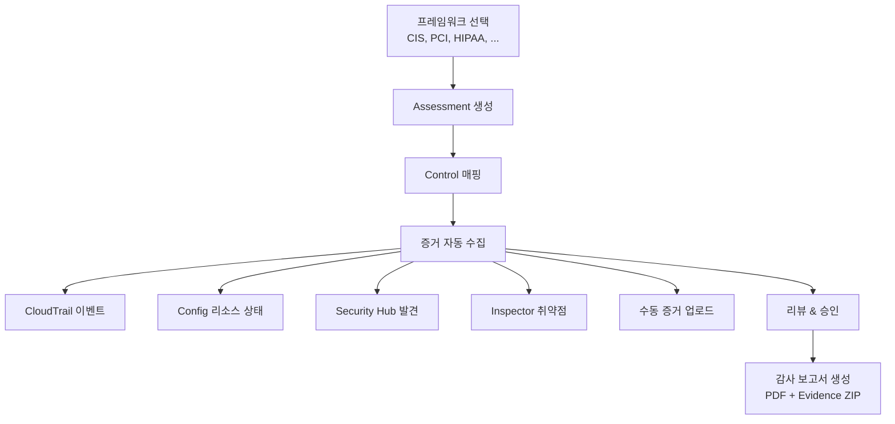
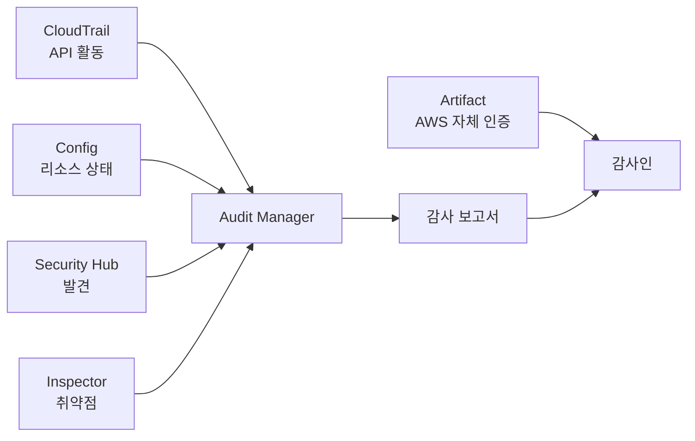

## 정의

**AWS Audit Manager** 는 AWS 사용량에 대한 **감사 (audit) 준비 프로세스를 자동화** 하는 서비스입니다. 규제 프레임워크 (CIS, PCI DSS, HIPAA, GDPR, NIST, SOC 2 등) 를 선택하면, **관련 AWS 리소스의 사용 기록과 구성 데이터를 지속 모니터링하고 감사 증거를 자동 수집** 하여 최종 감사 보고서를 컴파일합니다.

**핵심 목적**: 감사인이 요구하는 **"증거 자료"** 를 수동 수집하지 않고 자동화. 상시 감사 준비 상태 (Audit Readiness) 유지.

## 왜 필요한가

### 전통적 감사의 문제

수동 감사 준비는:
- 감사인 요청 -> 리소스 조회 -> 스크린샷/문서 추출 -> Excel 정리 -> PDF 컴파일
- 수십 시간 소요
- 실수 위험 (누락, 잘못된 리소스)
- 시점 데이터 (특정 시점 스냅샷)

### Audit Manager 자동화

1. **프레임워크 선택** (CIS, PCI, HIPAA, SOC 2, ...)
2. **AWS 리소스 자동 매핑** (프레임워크 컨트롤 -> 리소스)
3. **증거 자동 수집** (지속, 매일)
4. **감사 보고서 자동 생성** (원클릭 PDF)

## 작동 방식



## 4 핵심 개념

### 1. Framework (프레임워크)

**규제 표준/모범 사례 컨테이너**. Controls (통제) 의 집합.

**AWS 제공 pre-built framework** (60+):
- **CIS AWS Foundations Benchmark** v1.2, v1.4, v3.0
- **PCI DSS** v3.2.1, v4.0
- **HIPAA Security Rule**
- **NIST 800-53** rev 5, **NIST 800-171** rev 2
- **GDPR** (일부)
- **SOC 2**
- **ISO/IEC 27001**
- **AWS Well-Architected Security**
- **AWS Foundational Security Best Practices**
- **AWS Config Conformance Pack** 매핑
- **AI Best Practices** (2024+)
- **Generative AI**

**Custom framework**: 사용자 정의 (자체 컨트롤).

### 2. Control (통제)

프레임워크의 개별 요구사항.

**예: CIS 2.1.1** = "S3 버킷 암호화 활성"

각 control 은:
- **설명**: 요구사항 명세
- **테스트 정보**: 어떻게 검증
- **관련 AWS 서비스**: 자동 수집 소스
- **행동 계획**: 위반 시 조치

### 3. Assessment (감사 실행 인스턴스)

Framework 를 특정 계정/리소스에 적용한 **감사 프로젝트**.

```bash
aws auditmanager create-assessment \
  --name "Q3-2026-CIS-Audit" \
  --framework-id abcd1234 \
  --assessment-reports-destination \
    destination=s3://my-audit-reports,destinationType=S3 \
  --scope '{
    "awsAccounts": [{"id": "123456789012"}],
    "awsServices": [{"serviceName": "s3"}, {"serviceName": "iam"}]
  }' \
  --roles '{"roleType": "PROCESS_OWNER", "roleArn": "arn:aws:iam::...:role/AuditManagerRole"}'
```

- **Scope**: 어떤 계정, 어떤 서비스, 어떤 리전
- **Roles**: audit owner, delegate 등 역할

### 4. Evidence (증거)

각 control 에 대한 **자동 수집된 증명 자료**.

**소스**:
- **AWS CloudTrail**: API 이벤트 (누가 언제 무엇을)
- **AWS Config**: 리소스 구성 스냅샷
- **AWS Security Hub**: 보안 발견 사항
- **Amazon Inspector**: 취약점 스캔 결과
- **AWS Systems Manager**: 컴플라이언스 상태
- **License Manager**: 라이선스 컴플라이언스
- **Manual evidence**: 사용자가 수동 업로드 (감사인 인터뷰 노트, 프로세스 문서 등)

**증거 예시**:
- Control: "S3 버킷 암호화" -> Config CI 로 "encryption enabled" 확인 스냅샷
- Control: "MFA 로그인 강제" -> CloudTrail 이벤트 + Config `iam-user-mfa-enabled` rule 상태

## Audit Manager Workflow

### Step 1: Framework 선택

```
콘솔 > Audit Manager > Frameworks
> "AWS Foundational Security Best Practices" 선택
```

### Step 2: Assessment 생성

- Scope: 계정, 리전
- Roles: 담당자
- Evidence 수집 시작

### Step 3: Evidence 지속 수집

**Audit Manager 가 백그라운드에서 자동 수집** (지속). 사용자 액션 불필요.

- 매일 CloudTrail 이벤트 수집
- Config CI 수집
- Security Hub 발견 수집
- 등등

### Step 4: Review & Delegate

- 각 control 별 evidence 검토
- 팀원에게 delegate (예: DBA 에게 DB 관련 control)
- Manual evidence 업로드

### Step 5: 감사 보고서 생성

**Assessment Report 생성** 시:

- 선택한 control 및 evidence 포함
- **PDF 보고서 + ZIP evidence 파일** 생성
- S3 에 자동 저장
- 감사인에게 전달 가능

```bash
aws auditmanager generate-assessment-report \
  --assessment-id abc-123 \
  --name "Q3-2026-CIS-Report" \
  --description "..."
```

## Assessment Report 구조

```
Q3-2026-CIS-Report.pdf
├── 표지 (framework, 기간, 계정, scope)
├── 요약 (통제 수, compliant / non-compliant)
├── Control 1: description, evidence summary, status
│   └── Evidence 1: source, timestamp, data
├── Control 2: ...
└── Appendix

evidence.zip
├── Control 1/
│   ├── evidence_001.json
│   ├── evidence_002.json
│   └── ...
├── Control 2/
└── ...
```

## Delegation

**여러 팀 협업**. 각 팀이 자기 domain 의 control 담당.

- **Audit Owner**: 전체 감사 관리
- **Delegate**: 특정 control 세트 담당 (예: 네트워크 팀, DB 팀)
- **Reviewer**: evidence 리뷰
- **Read-only**: 조회만

## Custom Control

프레임워크에 없는 자체 규칙 정의:

```
Control Name: "Internal Policy: All EC2 tagged with 'owner'"
Description: ...
Test Instructions: ...
Data Source:
  - Config Rule: required-tags (owner)
  - Manual: quarterly team lead confirmation
```

## Custom Framework

Custom control 들을 묶어 조직 특유의 framework 생성.

**예**: "Company Security Baseline"
- CIS controls (일부)
- PCI DSS controls (일부)
- 자체 controls (내부 정책)

한 assessment 로 커버.

## Continuous Auditing

Audit Manager 는 **지속 모니터링**. 감사 시점에만 데이터 수집 아님:

- 매일 evidence 수집
- Control status 지속 업데이트
- 최신 상태를 언제든 확인 가능

**감사 준비 완료 상태 (Audit Readiness)** 를 항상 유지.

## Governance 4 서비스와 관계

**Audit Manager** 는 4개 (CloudTrail, Config, Artifact, Audit Manager) 중 **감사 자동화 최종 단계 (보고서 생성)** 담당.

### 관계도



### 역할 요약

| 서비스 | 역할 |
|:---|:---|
| **CloudTrail** | 활동 이력 (증거 원천) |
| **Config** | 리소스 상태 (증거 원천) |
| **Artifact** | AWS 자체 컴플라이언스 (별도 제출) |
| **Audit Manager** | CloudTrail + Config 를 프레임워크로 컴파일 |

### 감사 인 관점

- Audit Manager 보고서 = 고객이 만든 앱 컴플라이언스 증명
- Artifact 문서 = AWS 인프라 컴플라이언스 증명
- 두 세트를 합쳐 완전한 증명

## 요금

- **Assessment 당 시간 요금**: 활성 assessment 지속 저장
- **Evidence 저장 GB-월**
- **Report generation**: 별도 요금 없음

Free tier: 최초 몇 개월 assessment 하나 무료 (트라이얼).

## 실전 예: 의료 AI 서비스

**시나리오**: HIPAA + SOC 2 이중 준수 필요.

### Setup

1. **Framework 두 개 활성**:
   - "HIPAA Security Rule"
   - "SOC 2 Type II"

2. **각 프레임워크로 Assessment 생성**:
   - Scope: prod 계정 + 데이터 처리 서비스
   - Roles: security team + audit team

3. **Evidence 자동 수집** (수 주간 지속)

### 매일

- Config: S3 encryption, DB encryption 상태 스냅샷
- CloudTrail: PHI 데이터 접근 API 이벤트
- Security Hub: PCI/HIPAA 관련 발견
- Inspector: 컨테이너/EC2 취약점

### 감사 시

- Assessment Report 원클릭 생성
- PDF + evidence ZIP -> 감사인
- Artifact 에서 AWS 인프라 문서 (SOC 2, HIPAA guide) 별도 제출

**소요 시간**: 수 시간 (전통 수 주 vs).

## 함정

> [!WARNING]
> **Framework 는 절대 완성품 아님**. AWS 가 리소스 매핑을 대신 하지만, 각 조직의 정확한 컨트롤 매핑은 사용자 검증 필수.

> [!CAUTION]
> **Evidence 는 시점 데이터 축적**. Assessment 시작 전 데이터 없음. 감사 필요 시점 최소 몇 주 전 시작.

> [!WARNING]
> **자동 수집이 100% 아님**. 일부 control 은 manual evidence 필요 (프로세스 문서, 인터뷰 노트).

> [!IMPORTANT]
> **Custom framework 는 정확한 매핑 필요**. 잘못 매핑하면 실제 위반이 compliant 로 표시.

> [!CAUTION]
> **Evidence 를 감사인이 신뢰할 수 있게** 보전. S3 저장, log file validation, versioning.

> [!WARNING]
> **Audit Manager 는 감사 대체 아님**. 감사 준비 자동화 도구. 실제 감사는 제3자 (감사인) 가 수행.

## Audit Manager 를 안 쓰면?

수동으로 다음을 각각:

- Config Aggregator 로 리소스 상태 export
- CloudTrail 로그 S3 저장 + Athena 쿼리
- Security Hub 발견 리포트
- Excel 로 프레임워크 컨트롤 매핑
- Manual evidence 폴더 관리
- 감사인 요청마다 재조사

Audit Manager 는 이 모든 것을 통합. **감사 반복 조직 (SaaS, 금융, 의료)** 에 특히 가치.

## 관련 위키

- [[aws-cloudtrail|CloudTrail]] - Evidence 원천 (활동)
- [[aws-config|Config]] - Evidence 원천 (상태)
- [[aws-artifact|Artifact]] - AWS 자체 컴플라이언스 (병행 제출)
- [[aws-iam|IAM]] - Audit Manager 접근 제어
- [[aws-s3|S3]] - 보고서/증거 저장
- [[aws-kms|KMS]] - 암호화
- [[aws-cloudwatch|CloudWatch]] - 지속 모니터링
