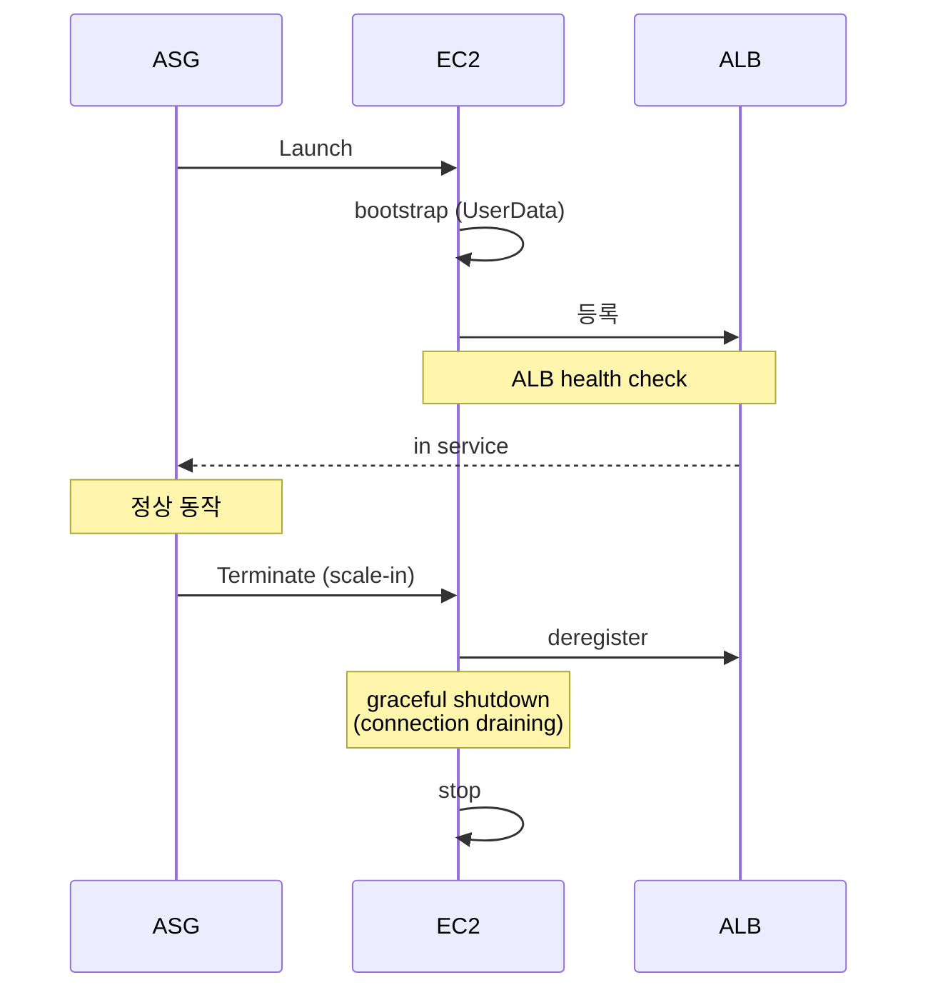

## 정의

**Auto Scaling Group (ASG)** = *EC2 instance 자동 증감*. *desired / min / max* + *scaling policy*.

## 구조

```mermaid
flowchart TB
    ASG[Auto Scaling Group<br/>min=2, max=20, desired=5]
    ASG --> LT[Launch Template<br/>(instance type, AMI, SG, ...)]
    ASG --> Tg[Target Group<br/>(ALB/NLB)]
    ASG --> Az[Multi-AZ<br/>az-a, az-b, az-c]
    ASG --> Policy[Scaling Policy]
    Policy --> TT[Target Tracking]
    Policy --> Step[Step]
    Policy --> Sched[Scheduled]
    Policy --> Pred[Predictive]
```

## Scaling Policy 4종

### 1. Target Tracking (권장)

```yaml
TargetTrackingConfiguration:
  PredefinedMetricSpecification:
    PredefinedMetricType: ASGAverageCPUUtilization
  TargetValue: 50.0
```

> "*CPU 평균 50%* 유지하도록 알아서 증감".

### 2. Step Scaling

```
CPU 70-80% → +1
CPU 80-90% → +2
CPU 90%+   → +5
```

세밀 제어. 복잡.

### 3. Scheduled

```bash
# 매일 오전 9시에 desired=10
aws autoscaling put-scheduled-update-group-action \
  --auto-scaling-group-name web \
  --schedule "cron(0 9 * * ? *)" \
  --desired-capacity 10
```

> 예측 가능한 트래픽 (예: 직장인 사용 패턴, 새벽 light).

### 4. Predictive Scaling

머신러닝으로 *과거 패턴 예측* → *미리 증가*. AWS managed.

## Lifecycle



## Lifecycle Hooks

```yaml
LifecycleHook:
  LifecycleTransition: autoscaling:EC2_INSTANCE_LAUNCHING
  HeartbeatTimeout: 300
  NotificationTargetARN: arn:aws:sns:...
```

- **Launching**: instance 시작 *직후, 트래픽 받기 전*. 데이터 워밍업, init.
- **Terminating**: terminate *직전*. log flush, draining.

## Cooldown vs Warmup

| | Cooldown | Warmup |
|---|---|---|
| 의미 | 다음 scaling 까지 *대기* | instance 가 *준비되기 까지* |
| 기본 | 300s | 0 (Target Tracking 자동) |

## ASG + Spot

```yaml
MixedInstancesPolicy:
  InstancesDistribution:
    OnDemandBaseCapacity: 2          # 최소 on-demand
    OnDemandPercentageAboveBaseCapacity: 25
    SpotAllocationStrategy: capacity-optimized-prioritized
  LaunchTemplate:
    Overrides:
      - InstanceType: m6i.large
      - InstanceType: m6a.large
      - InstanceType: m6g.large
```

> *2 on-demand 보장 + 나머지 70% spot 비용 절감*.

## EC2 Auto Scaling vs Application Auto Scaling

| | EC2 ASG | App Auto Scaling |
|---|---|---|
| 대상 | EC2 | ECS, DynamoDB, Aurora, ... |
| 정책 | 동일 | 동일 |
| 단위 | instance | task / capacity unit |

## 흔한 함정

> [!WARNING]
> 1. **Health check 정의 잘못** = 정상 instance 도 *unhealthy* 판정 → 무한 replace.
> 2. **Cooldown 너무 짧음** = scaling oscillation.
> 3. **Spot 100%** = capacity 부족 시 instance launch 실패. *최소 on-demand* 안전망.
> 4. **ALB connection draining 부재** = scale-in 시 *진행 중 요청 끊김*.

## 관련 위키

- [[aws-ec2]]
- [[aws-alb-nlb]]
- [[k8s-hpa-vpa]] (K8s 버전)
- [[Load Balancer]]
