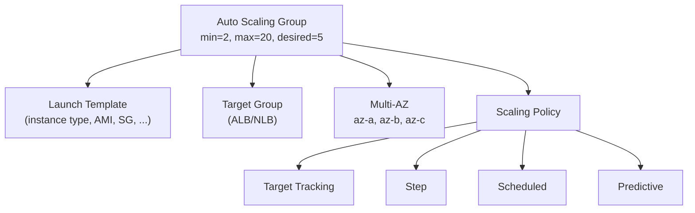
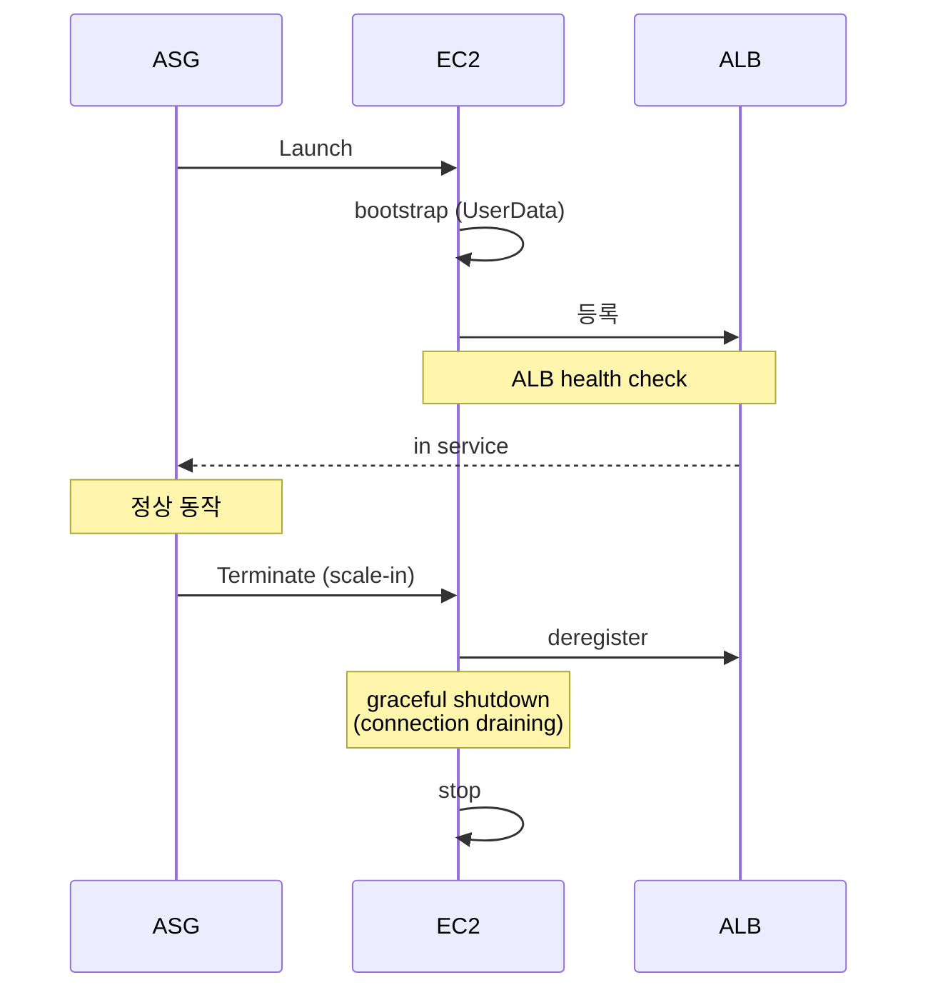
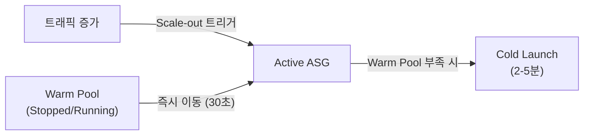
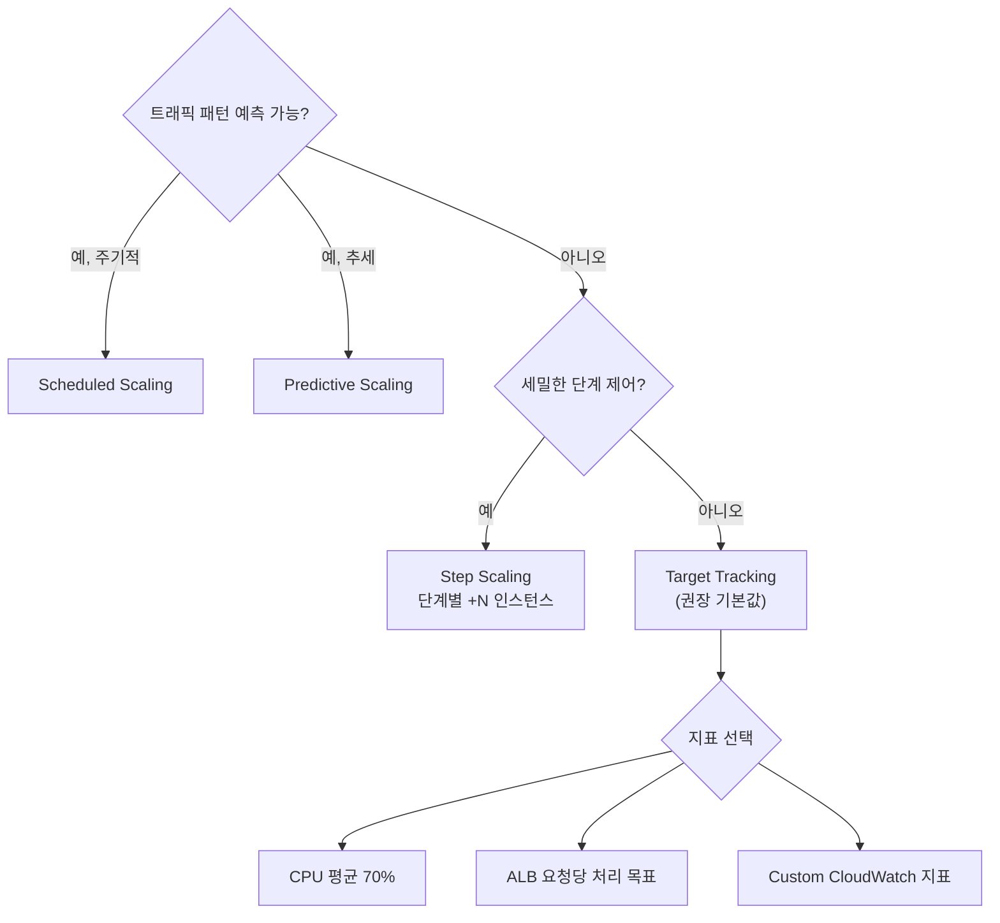

## 정의

**Auto Scaling Group (ASG)** = *EC2 instance 자동 증감*. *desired / min / max* + *scaling policy*.

## 구조



## Scaling Policy 4종

### 1. Target Tracking (권장)

```yaml
TargetTrackingConfiguration:
  PredefinedMetricSpecification:
    PredefinedMetricType: ASGAverageCPUUtilization
  TargetValue: 50.0
```

> "*CPU 평균 50%* 유지하도록 알아서 증감".

### 2. Step Scaling

```
CPU 70-80% → +1
CPU 80-90% → +2
CPU 90%+   → +5
```

세밀 제어. 복잡.

### 3. Scheduled

```bash
# 매일 오전 9시에 desired=10
aws autoscaling put-scheduled-update-group-action \
  --auto-scaling-group-name web \
  --schedule "cron(0 9 * * ? *)" \
  --desired-capacity 10
```

> 예측 가능한 트래픽 (예: 직장인 사용 패턴, 새벽 light).

### 4. Predictive Scaling

머신러닝으로 *과거 패턴 예측* → *미리 증가*. AWS managed.

## Lifecycle



## Lifecycle Hooks

```yaml
LifecycleHook:
  LifecycleTransition: autoscaling:EC2_INSTANCE_LAUNCHING
  HeartbeatTimeout: 300
  NotificationTargetARN: arn:aws:sns:...
```

- **Launching**: instance 시작 *직후, 트래픽 받기 전*. 데이터 워밍업, init.
- **Terminating**: terminate *직전*. log flush, draining.

## Cooldown vs Warmup

| | Cooldown | Warmup |
|---|---|---|
| 의미 | 다음 scaling 까지 *대기* | instance 가 *준비되기 까지* |
| 기본 | 300s | 0 (Target Tracking 자동) |

## ASG + Spot

```yaml
MixedInstancesPolicy:
  InstancesDistribution:
    OnDemandBaseCapacity: 2          # 최소 on-demand
    OnDemandPercentageAboveBaseCapacity: 25
    SpotAllocationStrategy: capacity-optimized-prioritized
  LaunchTemplate:
    Overrides:
      - InstanceType: m6i.large
      - InstanceType: m6a.large
      - InstanceType: m6g.large
```

> *2 on-demand 보장 + 나머지 70% spot 비용 절감*.

## EC2 Auto Scaling vs Application Auto Scaling

| 항목 | EC2 ASG | Application Auto Scaling |
|:---|:---|:---|
| 대상 | EC2 인스턴스 | ECS Task, DynamoDB, Aurora, Lambda, AppStream 등 |
| 정책 유형 | 동일 (Target Tracking, Step, Scheduled, Predictive) | 동일 |
| 스케일 단위 | 인스턴스 수 | Task 수 / 용량 단위 |
| 설정 위치 | EC2 ASG 콘솔/API | Application Auto Scaling API |

### Application Auto Scaling 예시 (ECS)

```bash
# ECS 서비스에 스케일링 대상 등록
aws application-autoscaling register-scalable-target \
  --service-namespace ecs \
  --resource-id service/my-cluster/my-service \
  --scalable-dimension ecs:service:DesiredCount \
  --min-capacity 2 \
  --max-capacity 20

# Target Tracking 정책 (CPU 60% 유지)
aws application-autoscaling put-scaling-policy \
  --service-namespace ecs \
  --resource-id service/my-cluster/my-service \
  --scalable-dimension ecs:service:DesiredCount \
  --policy-name cpu-target-tracking \
  --policy-type TargetTrackingScaling \
  --target-tracking-scaling-policy-configuration '{
    "PredefinedMetricSpecification": {
      "PredefinedMetricType": "ECSServiceAverageCPUUtilization"
    },
    "TargetValue": 60.0,
    "ScaleInCooldown": 300,
    "ScaleOutCooldown": 60
  }'
```

## Warm Pool

**Warm Pool** = 미리 준비된 인스턴스 풀. Scale-out 응답 속도를 대폭 단축.



```yaml
WarmPoolConfiguration:
  MinSize: 2
  MaxGroupPreparedCapacity: 5
  PoolState: Stopped   # Stopped or Running
  InstanceReusePolicy:
    ReuseOnScaleIn: true
```

- **Stopped 상태**: 비용 절감 (스토리지만 과금), 30-60초 내 ready
- **Running 상태**: 즉시 ready (최대 수초), 인스턴스 비용 발생
- `ReuseOnScaleIn: true`: Scale-in 시 인스턴스를 Warm Pool 로 반환 (삭제 아님)

> [!TIP]
> 앱 부팅 시간이 5분 이상이면 Warm Pool 큰 효과. 부팅 시간이 30초 미만이면 단순 ASG 충분.

## Instance Refresh

AMI 업데이트, 시작 템플릿 변경 시 기존 인스턴스를 롤링 방식으로 교체:

```bash
aws autoscaling start-instance-refresh \
  --auto-scaling-group-name web-asg \
  --preferences '{
    "MinHealthyPercentage": 80,
    "InstanceWarmup": 300,
    "CheckpointPercentages": [20, 50, 100],
    "CheckpointDelay": 600
  }'
```

- `MinHealthyPercentage: 80` = 항상 80% 이상 healthy 유지하며 교체
- Checkpoint 로 단계별 진행, 검증 후 다음 단계
- 문제 발생 시 `cancel-instance-refresh` 로 중단

## Health Check 유형

| 유형 | 감지 범위 | 설정 |
|:---|:---|:---|
| **EC2 Health Check** | 인스턴스 상태 (stopped, terminated) | 기본값 |
| **ELB Health Check** | ALB/NLB 가 HTTP 응답 확인 | `HealthCheckType: ELB` |
| **Custom Health Check** | 외부 시스템에서 unhealthy 표시 | `set-instance-health` API |

```bash
# ALB Health Check 활성화
aws autoscaling update-auto-scaling-group \
  --auto-scaling-group-name web-asg \
  --health-check-type ELB \
  --health-check-grace-period 300
```

> [!WARNING]
> Health Check Grace Period (기본 300초) 설정 필수. 앱 시작 전 health check 실패로 무한 재시작 방지.

## 스케일링 정책 선택 가이드



| 정책 | 추천 상황 |
|:---|:---|
| Target Tracking | 대부분의 웹 서버, API 서버 |
| Step Scaling | 갑작스런 트래픽 스파이크, 세밀한 제어 필요 |
| Scheduled | 영업시간 패턴, 배치 작업 전후 |
| Predictive | ML 워크로드, 주기적 대용량 처리 |

## 비용 최적화

### ASG + Spot 혼합 전략

```yaml
MixedInstancesPolicy:
  InstancesDistribution:
    OnDemandBaseCapacity: 2
    OnDemandPercentageAboveBaseCapacity: 20
    SpotAllocationStrategy: capacity-optimized-prioritized
    SpotInstancePools: 3
  LaunchTemplate:
    LaunchTemplateSpecification:
      LaunchTemplateName: web-lt
      Version: "$Latest"
    Overrides:
      - InstanceType: m7i.large
      - InstanceType: m7a.large
      - InstanceType: m7g.large
      - InstanceType: m6i.large
```

**비용 효과**: On-Demand 100% 대비 최대 70% 절감. On-Demand 2개 보장으로 안정성 확보.

### Predictive Scaling 비용 효과

Predictive Scaling 은 피크 **전에** 미리 증가하므로:
- 피크 초반 성능 저하 없음
- Cooldown 지연 없이 최적 용량 유지

## 흔한 함정

> [!WARNING]
> 1. **Health check 정의 잘못** = 정상 instance 도 *unhealthy* 판정 → 무한 replace.
> 2. **Cooldown 너무 짧음** = scaling oscillation.
> 3. **Spot 100%** = capacity 부족 시 instance launch 실패. *최소 on-demand* 안전망.
> 4. **ALB connection draining 부재** = scale-in 시 *진행 중 요청 끊김*.

> [!CAUTION]
> **Launch Template 버전 고정 `$Latest` 위험**: `$Latest` 를 쓰면 새 버전이 자동 적용되어 예상치 못한 인스턴스 변경. 프로덕션은 고정 버전 권장.

> [!IMPORTANT]
> **Lifecycle Hook 활용**: Lambda 나 SNS 와 연동해 초기화 완료 전 트래픽 차단. 앱이 완전히 준비된 후에만 ALB 등록.

## 관련 위키

- [[aws-ec2]]
- [[aws-ec2-instance-types]]
- [[aws-alb-nlb]]
- [[aws-cloudwatch]]
- [[k8s-hpa-vpa]] (K8s 버전)
- [[Load Balancer]]
