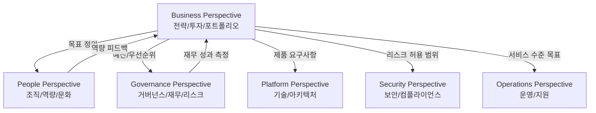
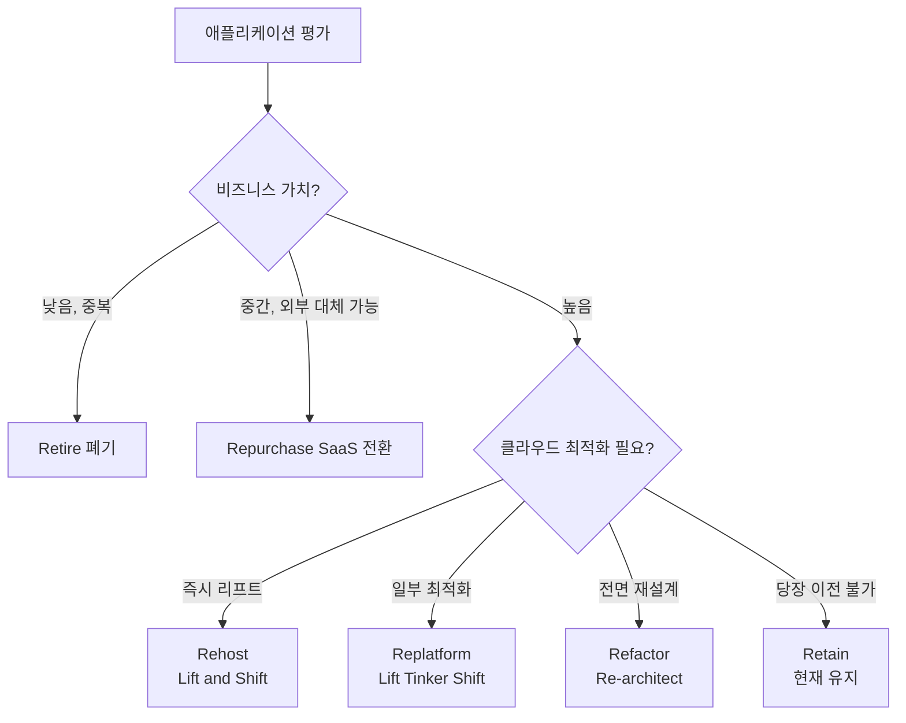

## 정의

**Business Perspective** 는 [[aws-caf|AWS CAF]] 6 관점 중 **비즈니스 성과** 에 초점을 맞춘 관점입니다. 클라우드 투자가 **디지털 전환 목표와 비즈니스 성과 (revenue, cost, agility, innovation)** 를 실제로 견인하도록 보장합니다.

**주요 stakeholder**: CEO, CFO, COO, CIO, CTO.

## 핵심 질문

- 클라우드로 어떤 비즈니스 성과를 달성할 것인가?
- 투자 대비 성과 (ROI) 는?
- 어떤 제품/서비스를 클라우드로 만들 것인가?
- 조직의 데이터/역량을 어떻게 수익화 할 것인가?

## 주요 Capabilities (역량)

Business perspective 는 8-10 개 capability. 대표:

### 1. Strategy Management (전략 관리)

디지털 전환 목표를 회사 전략과 정렬. 클라우드가 **어떤 비즈니스 문제** 를 해결하는가 정의.

**성숙도 지표**:
- Initial: 클라우드 사용은 있지만 전략 없음
- Optimized: 전략 정기 리뷰, KPI 로 측정

### 2. Portfolio Management (포트폴리오 관리)

**어떤 앱/서비스를 클라우드로**, **어떤 순서로**. 우선순위 결정 프레임워크 (6R: Rehost, Replatform, Refactor, Repurchase, Retire, Retain).

### 3. Innovation Management (혁신 관리)

클라우드가 새 비즈니스 모델/서비스를 가능하게 하는지 관리. 실험 (experimentation), MVP, 학습 문화.

### 4. Product Management (제품 관리)

디지털 제품/서비스의 **lifecycle** (착상 -> 개발 -> 배포 -> 은퇴). Product manager 역할 강화.

### 5. Strategic Partnership (전략적 파트너십)

AWS, SI, ISV 파트너와의 관계. Managed service provider (MSP), 컨설팅, 트레이닝 파트너.

### 6. Data Monetization (데이터 수익화)

조직의 데이터를 **비즈니스 가치** 로 전환. 데이터 제품, ML/AI 인사이트, 개인화, 예측.

### 7. Business Insights (비즈니스 인사이트)

BI, 대시보드, 분석. 데이터 기반 의사결정 문화.

### 8. Data Science (데이터 과학)

ML/AI 역량 개발. SageMaker, Bedrock 등 활용.

## Cloud Value Framework (4 pillar)

AWS 가 제시하는 **클라우드 가치의 4 축**:

### 1. Cost Savings (비용 절감)

- **CapEx -> OpEx**: 서버 구입 대신 사용료
- **Reserved / Savings Plans** 로 예측 가능 워크로드 절감
- **Serverless / Spot** 로 유휴 자원 제거
- 데이터센터 운영/부동산 절감

**전형적 30-40% TCO 절감** (마이그레이션 규모에 따라).

### 2. Staff Productivity (스태프 생산성)

- 관리형 서비스 (RDS, Kinesis, Lambda) 로 운영 부담 감소
- IaC + CI/CD 로 배포 시간 단축
- 관측 도구로 문제 진단 가속
- 팀이 저부가가치 운영 대신 앱 개발/비즈니스 집중

### 3. Operational Resilience (운영 회복력)

- Multi-AZ / Multi-region HA
- 자동 백업, DR
- 자동 failover
- 다운타임 비용 절감 (예: 1시간 다운타임 = 수백만 USD 손실)

### 4. Business Agility (비즈니스 민첩성)

- 새 서비스 프로비저닝 몇 분 (기존 몇 주/월)
- 신규 시장/지역 진출 빠름 (multi-region)
- 실험 비용 낮음 (실패 부담 낮음)
- 경쟁 대응 속도

**정성적 가치**이나 흔히 정량화된 revenue 증가로 이어짐.

## KPI 예시

### 비용 관련

- **TCO reduction**: on-prem 대비 3-5년 절감
- **Unit economics**: 사용자당 인프라 비용
- **Cost of goods sold (COGS)** 감소

### Agility 관련

- **Time to market**: 신규 서비스 출시 시간
- **Deployment frequency**: 배포 횟수 (DORA metric)
- **Lead time**: 아이디어 -> 프로덕션

### Innovation 관련

- **Number of experiments**: 분기별 실험 수
- **New products launched**: 신규 제품 수
- **Revenue from new products**: 신규 제품 매출

## 실전 활동

### Envision phase

- 비즈니스 전략 워크숍 (경영진)
- 산업/경쟁사 벤치마킹
- 클라우드 채택 비즈니스 케이스 (business case)
- ROI 시뮬레이션

### Align phase

- Portfolio 우선순위 매트릭스 (impact vs effort)
- Cloud value framework 4 축 갭 분석
- Product roadmap (12-24 개월)

### Launch phase

- 첫 pilot 성과 측정 (KPI baseline vs target)
- 성공 스토리 조직 내 공유
- 팀 인센티브 정렬

### Scale phase

- 지속 성과 대시보드
- 재투자 결정 (성공한 것에 더)
- 신규 비즈니스 기회 발굴

## CAF 6 관점 관계도

Business Perspective 는 다른 5개 관점과 상호 의존합니다.



### 6 관점 한눈에

| 관점 | 초점 | 주요 Stakeholder |
|:---|:---|:---|
| **Business** | 비즈니스 성과, ROI, 전략 | CEO, CFO, COO |
| **People** | 조직 변화, 역량 개발, 문화 | CHRO, CIO |
| **Governance** | 재무 관리, 리스크, 포트폴리오 | CFO, CDO |
| **Platform** | 아키텍처, 기술 플랫폼, 모던화 | CTO, Architect |
| **Security** | 보안, 컴플라이언스, 신뢰 | CISO |
| **Operations** | 운영, 모니터링, 지속 최적화 | VP Ops, IT Ops |

## Business Case 구성

클라우드 전환 전 비즈니스 케이스 작성 프레임워크:

### 1. 현재 상태 분석 (As-Is)

```
온프레미스 비용 항목:
- 하드웨어 (서버, 스토리지, 네트워크): CapEx
- 데이터센터 (공간, 전력, 냉각): OpEx
- 소프트웨어 라이선스: CapEx/OpEx
- 인력 (서버 관리, DB 관리): OpEx
- 유지보수 계약: OpEx
```

### 2. 미래 상태 예측 (To-Be)

```
클라우드 비용 예측:
- 컴퓨팅 (EC2, Reserved/Savings Plans)
- 스토리지 (S3, EBS, RDS)
- 네트워크 (데이터 전송, CDN)
- 관리형 서비스 (RDS, EKS, SageMaker)
- 지원 (AWS Support plan)

마이그레이션 비용:
- 컨설팅/SI 비용
- 내부 인력 시간
- 교육/인증
- 병렬 운영 기간
```

### 3. 비용 절감 계산

| 항목 | 절감 근거 | 일반적 절감률 |
|:---|:---|:---|
| 서버 구매 비용 제거 | 하드웨어 수명 주기 없음 | 30-40% |
| 데이터센터 운영 | 공간/전력/냉각 없음 | 20-30% |
| 인력 최적화 | 관리형 서비스 활용 | 10-20% |
| 유휴 자원 제거 | Auto Scaling, 정확한 사이징 | 15-25% |

## ROI 계산 방법론

### 3년 TCO 비교 모델

```
총 절감 = (현재 3년 비용) - (클라우드 3년 비용 + 마이그레이션 비용)

ROI % = (순 절감액 / 마이그레이션 비용) x 100

손익분기점 = 마이그레이션 비용 / 월간 절감액
```

### Cloud Value Framework 지표 정량화

| 가치 축 | 정량화 방법 | 예시 |
|:---|:---|:---|
| **비용 절감** | TCO 분석, 3-5년 비교 | 연간 $2M 절감 |
| **생산성 향상** | 배포 빈도, 장애 복구 시간 | 배포 10배 증가 |
| **운영 회복력** | 다운타임 비용, SLA 개선 | 연간 다운타임 99시간 → 1시간 |
| **비즈니스 민첩성** | Time-to-market, 실험 수 | 신규 기능 출시 6주 → 1주 |

> [!IMPORTANT]
> AWS 의 [TSO Logic](https://aws.amazon.com/tso-logic/) 또는 AWS Migration Evaluator 로 데이터 기반 TCO 분석 가능.

## 포트폴리오 우선순위 결정 (6R)

마이그레이션 대상 앱의 전략 분류:



| 전략 | 설명 | 마이그레이션 속도 |
|:---|:---|:---|
| **Rehost** | VM을 그대로 클라우드로 (VMware, MGN) | 빠름 |
| **Replatform** | DB를 RDS로, 앱 서버를 컨테이너로 | 중간 |
| **Refactor** | 마이크로서비스, 서버리스로 재설계 | 느림 |
| **Repurchase** | CRM/ERP를 SaaS로 대체 | 빠름 |
| **Retire** | 불필요한 앱 폐기 | 즉시 |
| **Retain** | 현재 환경 유지 (추후 재평가) | 해당 없음 |

## 성숙도 평가 모델

CAF 는 4단계 성숙도를 정의합니다:

| 단계 | 명칭 | 특성 |
|:---|:---|:---|
| **1** | Project | 개별 팀 클라우드 실험 |
| **2** | Foundation | 기반 구축, 공통 플랫폼 |
| **3** | Migration | 조직적 마이그레이션 진행 |
| **4** | Reinvention | 클라우드 네이티브, 지속 혁신 |

Business Perspective 성숙도 지표:

- **Level 1**: 클라우드 사용하지만 비즈니스 목표 연결 없음
- **Level 2**: 클라우드 전환 로드맵 존재, C-level 인식
- **Level 3**: KPI 로 성과 측정, 조직 전반 채택
- **Level 4**: 클라우드 우선 문화, 지속적 혁신 사이클

## 흔한 실패 패턴

> [!WARNING]
> **비즈니스 목표 없이 기술 도입**. "우리도 클라우드 써야지" 만으로는 ROI 안 나옴. 명확한 문제 정의부터.

> [!CAUTION]
> **비용 절감만 목표**. Cost savings 는 4 축 중 하나. Agility / innovation 무시하면 경쟁력 손실.

> [!WARNING]
> **경영진 이탈**. 전환 3 년차에 경영진 관심 감소하며 지원 축소. 지속 참여 필수.

> [!IMPORTANT]
> **정성적 가치도 정량화 시도**. Agility, resilience 를 매출 영향으로 환산.

> [!CAUTION]
> **마이그레이션 비용 과소평가**: 컨설팅, 교육, 병렬 운영 기간, 내부 인력 시간 모두 계산에 포함해야. 첫 1-2년은 비용 증가 후 절감 시작.

## 관련 위키

- [[aws-caf|AWS CAF]] - 상위 개요
- [[aws-caf-people|People Perspective]] - 조직/문화
- [[aws-caf-governance|Governance Perspective]] - 재무/리스크
- [[aws-caf-platform|Platform Perspective]]
- [[aws-caf-security|Security Perspective]]
- [[aws-caf-operations|Operations Perspective]]
- [[well-architected]] - AWS Well-Architected Framework (실행 관점)
