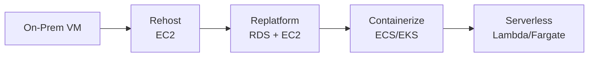

## 정의

**Platform Perspective** 는 [[aws-caf|AWS CAF]] 6 관점 중 **엔터프라이즈급 확장 가능한 하이브리드 클라우드 플랫폼 구축** 을 담당합니다. 기존 워크로드 현대화 + 신규 클라우드 네이티브 솔루션 구현이 목표입니다.

**주요 stakeholder**: CTO, technology leaders, architects, engineers.

## 주요 Capabilities

### 1. Platform Architecture

**엔터프라이즈 클라우드 플랫폼 설계**. 여러 워크로드가 공유하는 표준.

- Multi-account 계층
- Landing Zone (Control Tower)
- 네트워킹 (Transit Gateway, VPC 표준)
- 공통 서비스 (로깅, 관측, secret 관리)
- IAM Identity Center (SSO)

### 2. Data Architecture

데이터 저장/처리 아키텍처:

- **OLTP**: [[aws-rds|RDS]], Aurora, DynamoDB
- **OLAP**: [[aws-redshift|Redshift]], Athena
- **Data Lake**: S3 + Glue + Lake Formation
- **Streaming**: Kinesis, MSK (Kafka)
- **ETL / ELT**: Glue, EMR, Step Functions
- **Vector**: [[aws-s3-vectors|S3 Vectors]], OpenSearch

### 3. Platform Engineering

**Reusable 플랫폼 구성 요소** 개발:
- IaC 모듈 (Terraform, CDK)
- 표준 컨테이너 이미지
- CI/CD 파이프라인 템플릿
- 셀프서비스 포털

### 4. Data Engineering

파이프라인 개발:
- Data ingestion
- Transformation
- Quality checks
- Serving layer

### 5. Provisioning and Orchestration

리소스 자동 프로비저닝:
- IaC ([[aws-cdk|CDK]], [[aws-terraform|Terraform]], CloudFormation)
- Kubernetes (EKS)
- Service Catalog

### 6. Modern Application Development

**Cloud-native 12-factor 앱** 개발:
- Microservices
- Containers (ECS, EKS)
- Serverless (Lambda, Fargate)
- API-first
- Event-driven

### 7. Continuous Integration and Continuous Delivery (CI/CD)

배포 자동화:
- CodePipeline, CodeBuild, CodeDeploy
- 또는 GitHub Actions, GitLab CI, ArgoCD
- Blue/green, canary
- Rollback 자동화

## 6R Migration Strategy

기존 앱을 클라우드로 이관하는 6 가지 방법 ([[aws-caf-governance|Governance perspective]] 에서 결정):

| Strategy | 설명 | 예 |
|:---|:---|:---|
| **Rehost** (Lift-and-shift) | VM 그대로 EC2 로 | 마이그레이션 첫 단계 |
| **Replatform** | 약간 조정 (예: DB 를 RDS 로) | 관리 부담 감소 |
| **Refactor / Re-architect** | 클라우드 네이티브 재설계 | 최대 이익, 최대 비용 |
| **Repurchase** | SaaS 로 대체 | ERP -> Workday |
| **Retire** | 사용 중단 | 안 쓰는 앱 |
| **Retain** | 온프렘 유지 | 규제, 기술 제약 |

**AWS 도구**:
- **Migration Hub**: 이관 프로젝트 추적
- **Application Migration Service (MGN)**: Rehost 자동화
- **Database Migration Service (DMS)**: DB 이관
- **Migration Evaluator**: TCO / 이관 계획
- **Application Discovery Service**: on-prem 발견

## Modernization Path

Rehost -> Replatform -> Refactor 진화:

각 단계 이익 vs 노력 트레이드오프.

## Cloud-Native Patterns

### Microservices

- 도메인 단위 서비스
- 독립 배포
- 폴리글롯 (팀별 언어 선택)
- API 계약 명확

### Containers

- [[oci-image|OCI]] 이미지
- Orchestration: [[kubernetes|K8s]] / [[aws-ecs|ECS]]
- Immutable infrastructure

### Serverless

- Lambda 함수
- Managed service (SNS, SQS, Step Functions)
- No infrastructure management

### Event-Driven

- EventBridge, SNS, SQS, Kafka
- Decoupled services
- Async processing

### API-First

- REST / GraphQL / gRPC
- OpenAPI spec
- API Gateway

## Well-Architected 통합

Platform perspective 는 [[well-architected|Well-Architected Framework]] 6 pillar 와 정렬:

1. **Operational Excellence**
2. **Security**
3. **Reliability**
4. **Performance Efficiency**
5. **Cost Optimization**
6. **Sustainability**

각 워크로드 리뷰 시 6 pillar 검사.

## Infrastructure as Code (IaC)

**모든 인프라를 코드로**:

- **CloudFormation**: AWS native
- **Terraform**: Multi-cloud
- **CDK (Cloud Development Kit)**: TypeScript/Python 등 언어로
- **Pulumi**: 대안

**이익**:
- 재현성 (같은 환경 여러 번 배포)
- 버전 관리 (Git)
- 코드 리뷰
- 자동 배포

## GitOps

Git 을 SSoT (Single Source of Truth) 로:
- Manifests 를 Git 에
- ArgoCD, Flux 가 자동 sync
- 변경 = PR + merge

## Observability Platform

Platform perspective 는 관측 인프라도 담당:
- [[aws-cloudwatch|CloudWatch]] Metrics + Logs
- [[opentelemetry|OpenTelemetry]] traces
- [[prometheus|Prometheus]] + Grafana
- Distributed tracing (X-Ray, Jaeger)

## 실전 활동

### Envision

- 기존 아키텍처 리뷰
- Target 아키텍처 원칙 (principles)
- Reference architecture

### Align

- Landing Zone 설계
- Migration wave planning
- Skill 요구사항 매핑

### Launch

- Landing Zone 배포
- Pilot 워크로드 이관/신규 개발
- IaC 표준 정착

### Scale

- 재사용 가능한 platform capabilities
- Self-service portal
- Multi-region 확장

## 흔한 실패 패턴

> [!WARNING]
> **Lift-and-shift 로 끝**. Rehost 후 클라우드 이익 대부분 안 나옴 (관리 부담 그대로).

> [!CAUTION]
> **각 팀이 독자적 인프라**. Reusable module 없이는 사일로.

> [!WARNING]
> **IaC 없이 콘솔 조작**. 재현성 없음, drift 발생.

> [!IMPORTANT]
> **Modernization 은 반복 여정**. 한 번에 refactor 못 함. 점진.

## 관련 위키

- [[aws-caf|AWS CAF]] - 상위 개요
- [[aws-caf-business|Business Perspective]]
- [[aws-caf-people|People Perspective]]
- [[aws-caf-governance|Governance Perspective]]
- [[aws-caf-security|Security Perspective]]
- [[aws-caf-operations|Operations Perspective]]
- [[aws-ec2|EC2]]
- [[aws-ecs|ECS]]
- [[aws-eks|EKS]]
- [[aws-lambda|Lambda]]
- [[aws-vpc|VPC]]
- [[kubernetes|Kubernetes]]
- [[oci-image|OCI Image]]
