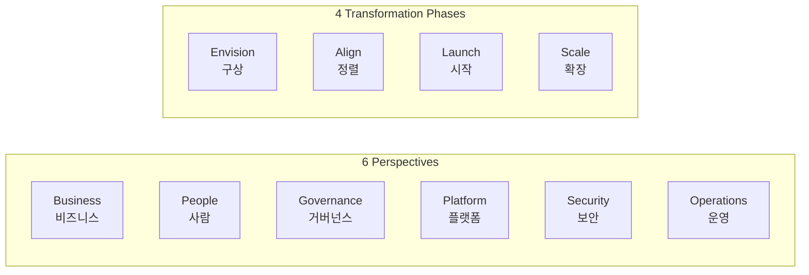

## 정의

**AWS Cloud Adoption Framework (AWS CAF)** 는 AWS 가 수많은 고객의 클라우드 전환 경험을 정리해 만든 **조직 수준의 클라우드 도입 방법론** 입니다. **"어떤 서비스를 어떻게 쓸까"** 를 다루는 [[well-architected|Well-Architected Framework]] 와 달리, CAF 는 **"조직으로서 어떻게 클라우드로 이행할까"** 라는 **전략, 사람, 프로세스, 거버넌스** 를 다룹니다.

**핵심 가치**: 클라우드 도입 시 놓치기 쉬운 조직/문화/거버넌스 관점을 체계화. **디지털 전환 (digital transformation)** 을 성공시키는 조직 역량 (capability) 진단 및 로드맵 제공.

## 왜 CAF 인가

- **기술만으로는 부족**: 조직 문화, 스킬, 프로세스, 거버넌스가 함께 성숙해야 성공
- **공통 언어**: 경영진, 기술팀, 재무팀, 보안팀이 같은 프레임워크로 대화
- **역량 진단**: 우리 조직의 현재 클라우드 준비도 (readiness) 측정
- **로드맵**: 어디서부터 시작하고 무엇을 우선순위화할지
- **리스크 최소화**: 잘 알려진 실패 패턴 회피

## CAF 구성

CAF 는 **6 perspectives × 4 phases** 매트릭스로 구성됩니다.

## 6 Perspectives (6 관점)

각 perspective 는 **관련 stakeholder 그룹이 소유하는 조직 역량 (capability) 집합**.

| Perspective | 초점 | 주요 stakeholder |
|:---|:---|:---|
| **Business** | 비즈니스 성과, ROI, 디지털 전략 | CEO, CFO, COO, CIO, CTO |
| **People** | 문화, 조직, 리더십, 인력 | CIO, COO, CTO, cloud director |
| **Governance** | 관리, 리스크, 재무, 통제 | Transformation officer, CIO, CTO, CFO, CDO, CRO |
| **Platform** | 인프라, 아키텍처, 개발 플랫폼 | CTO, tech leaders, architects, engineers |
| **Security** | CIA (기밀성/무결성/가용성), 컴플라이언스 | CISO, CCO, audit, security architects |
| **Operations** | SLA, 관측, 사고 대응, 자동화 | Infra/ops leaders, SREs, IT service managers |

### 자세히

- [[aws-caf-business|Business Perspective]] - 비즈니스 성과 극대화
- [[aws-caf-people|People Perspective]] - 문화 변화 + 스킬 개발
- [[aws-caf-governance|Governance Perspective]] - 통제 + 재무 + 리스크
- [[aws-caf-platform|Platform Perspective]] - 인프라 + 아키텍처 + 앱 현대화
- [[aws-caf-security|Security Perspective]] - CIA 삼각 + 컴플라이언스
- [[aws-caf-operations|Operations Perspective]] - 서비스 딜리버리 + 자동화

## 4 Transformation Phases

CAF 는 클라우드 전환을 4 단계 iterative 여정으로.

### Phase 1: Envision (구상)

**전략 및 비전 수립**. 조직이 클라우드로 무엇을 이루려는가.

**활동**:
- 비즈니스 목표 정의 (revenue, cost, agility)
- 우선순위 전환 기회 식별
- CAF 6 perspectives 관점에서 현재 상태 진단
- 이해관계자 동의 확보

**산출물**: 비전 문서, 첫 프로젝트 후보 목록.

### Phase 2: Align (정렬)

**계획 및 갭 분석**. 각 perspective 별 갭 식별 + 우선순위.

**활동**:
- 현재 상태 (as-is) vs 목표 상태 (to-be) 매핑
- CAF 역량 (capability) 별 성숙도 측정
- 우선순위 프로젝트 정의
- 팀 조직 설계, RACI 매트릭스

**산출물**: Transformation roadmap, 조직 설계, 예산 계획.

### Phase 3: Launch (시작)

**Pilot 프로젝트 실행 + 학습**. 작은 스케일로 검증.

**활동**:
- Landing Zone 구축 (AWS Control Tower, Organizations)
- 초기 workload 이전 or 신규 개발
- CI/CD 파이프라인
- 팀 스킬 개발 (교육, 자격증)
- 첫 성과 측정

**산출물**: Working pilot, 학습된 인사이트, 조직 신뢰 획득.

### Phase 4: Scale (확장)

**확장 및 지속 진화**. Pilot 성과를 전사로 확장.

**활동**:
- 다중 workload 이관
- 팀 규모 확장
- Center of Excellence (CCoE) 설립
- FinOps 자동화 (비용 관리)
- 지속 개선 (feedback loop)

**산출물**: 전사 확장된 클라우드 채택, 지속 revenue/cost 개선.

**주의**: 단방향 아님. 4 단계는 **반복적, 병행 가능**. 새 프로젝트 계속 Envision 하며 기존 것 Scale.

## Capability (역량)

각 perspective 는 여러 **capability** (조직 역량) 를 포함. 각 capability 는:

- **정의**: 무엇을 하는 역량
- **성숙도 모델**: Initial -> Managed -> Defined -> Optimized
- **평가 질문**: 우리 조직은 어느 수준?
- **모범 사례**: 다음 단계로 가는 방법

**총 CAF capability 수** (6 perspectives 합): 약 40+ 역량.

### 성숙도 척도 예시

**Data Governance capability**:
- **Initial (Level 1)**: Ad-hoc, 문서화 안 됨
- **Managed (Level 2)**: 정책 있지만 일관성 부족
- **Defined (Level 3)**: 표준화된 프로세스
- **Optimized (Level 4)**: 지속 개선, 자동화, 메트릭 기반

각 조직이 self-assessment 후 목표 성숙도로 이동.

## CAF vs Well-Architected Framework

두 프레임워크 자주 혼동됨.

| 축 | CAF | Well-Architected |
|:---|:---|:---|
| **대상** | 조직 (people, process) | 개별 워크로드 (아키텍처) |
| **질문** | 조직으로 어떻게 클라우드 도입 | 이 워크로드 잘 설계됐나 |
| **관점** | Business, People, Governance, Platform, Security, Operations | Operational Excellence, Security, Reliability, Performance, Cost, Sustainability |
| **사용 시** | 전환 초기, 조직 진단 | 워크로드 개발 시, 리뷰 |
| **결과물** | Roadmap, 조직 설계 | Design decision, 개선 액션 |

**흔한 조합**: CAF 로 조직 전략 -> Well-Architected 로 개별 워크로드 검증.

## Cloud Center of Excellence (CCoE)

CAF Scale 단계에서 흔히 등장. **클라우드 관련 표준, 도구, 교육, 지원** 을 담당하는 조직 단위.

**책임**:
- Landing Zone 설계/유지
- 클라우드 표준 (naming, tagging, security)
- Reusable IaC 모듈
- 교육 프로그램
- 팀 지원 (컨설팅)
- FinOps 리더십

## Landing Zone

**Multi-account 기반의 표준화된 AWS 환경** (프로덕션 첫 단계).

- **AWS Control Tower**: 자동화된 Landing Zone
- **AWS Organizations**: 계정 트리 + SCP
- **Log archive account**: CloudTrail, Config 중앙 저장
- **Security account**: Security Hub, GuardDuty 통합
- **Networking account**: Transit Gateway, DX
- **Sandbox / Dev / Stg / Prod account**: 환경별 격리

CAF Platform + Security + Governance perspective 의 실현.

## 실전 적용 순서

### 1. Executive alignment (Business perspective)

- CEO/CFO 와 클라우드 전환 목표 합의
- ROI 시나리오 (cost saving, revenue growth)
- 전환 예산 확보

### 2. Cloud readiness 진단 (전체)

- CAF Self-Assessment Tool (AWS 제공)
- 6 perspectives 별 성숙도 측정
- 갭 우선순위

### 3. Foundation (People + Governance)

- CCoE 발족
- 교육 계획 (AWS Certifications)
- Landing Zone 설계

### 4. First workload (Platform + Security + Operations)

- Pilot workload 선정 (low-risk)
- Migration or greenfield
- CI/CD, IaC, 관측

### 5. Scale (Business)

- 성과 측정 & 공유
- Roadmap 확장
- 지속 개선

## 흔한 실패 패턴

1. **Business perspective 무시**: 기술만 도입, 비즈니스 성과 안 정의 -> ROI 없음
2. **People perspective 소홀**: 조직/문화 변화 없이 기술만 -> 저항, 스킬 갭
3. **Governance 없이 시작**: 계정, 비용, 정책 관리 없이 카오스
4. **Security 후처리**: 나중에 붙이면 재구성 필요
5. **Operations 자동화 부족**: 수동 운영으로 확장 어려움
6. **Platform 표준화 부족**: 각 팀이 독립 설계, 재사용 X

CAF 는 이 6 perspective 를 균형있게 성숙시키라는 지침.

## 관련 도구 & 리소스

- **AWS CAF Self-Assessment Tool**: 6 perspective 별 진단
- **AWS Well-Architected Tool**: 워크로드 리뷰
- **AWS Control Tower**: Landing Zone 자동화
- **AWS Organizations**: Multi-account
- **AWS Migration Hub**: 이관 프로젝트 추적
- **AWS Application Migration Service (MGN)**: lift-and-shift
- **AWS Skill Builder**: 교육 플랫폼
- **AWS Partner Network (APN)**: 전환 파트너

## 함정

> [!WARNING]
> **CAF 는 checkbox 아님**. 각 capability 를 조직 컨텍스트에 맞춰 해석. 무비판적 도입은 오히려 방해.

> [!CAUTION]
> **Scale 없이 Pilot 만**. Pilot 성공 후 확장 안 하면 sunk cost. Scale phase 를 반드시 계획.

> [!WARNING]
> **6 perspective 균형** 안 잡히면 병목 생김. 예: Security 뒤처지면 프로덕션 못 감.

> [!IMPORTANT]
> **CCoE 는 강제 통제 조직 아님**. Enabler 로 자리매김. 팀에 표준+도구 제공, 자율성 존중.

> [!CAUTION]
> **CAF vs 조직 실제 상황 격차**. Startup 은 6 perspective 다 필요 없을 수 있음. 규모에 맞게 조정.

## 관련 위키

- [[aws-caf-business|Business Perspective]]
- [[aws-caf-people|People Perspective]]
- [[aws-caf-governance|Governance Perspective]]
- [[aws-caf-platform|Platform Perspective]]
- [[aws-caf-security|Security Perspective]]
- [[aws-caf-operations|Operations Perspective]]
- [[aws-iam|IAM]] - 계정 통제
- [[aws-cloudtrail|CloudTrail]] - Governance
- [[aws-config|Config]] - Governance
- [[aws-audit-manager|Audit Manager]] - Security
