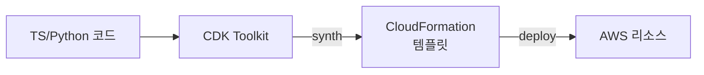

## 정의

**AWS CDK (Cloud Development Kit)** 는 **프로그래밍 언어** (TypeScript, Python, Java, C#, Go) 로 AWS 인프라를 정의하여 **CloudFormation** 템플릿을 생성하는 IaC 프레임워크입니다.

**한 줄 요약**: "YAML 대신 TypeScript 로 인프라 짜기". 타입/추상화/재사용을 얻습니다.

## 왜 CDK 인가

### CloudFormation 순수 사용의 문제

- **YAML/JSON 지옥**: 수천 줄, 문법 오류 감지 어려움
- **재사용 어려움**: 파라미터화 한계, 중첩 스택 복잡
- **타입 없음**: 오타를 배포 시 발견
- **IDE 지원 약함**: 자동완성 제한

### CDK 접근

- **컴파일 시 타입 검사** (TypeScript 등)
- **추상화 계층**: L1 (raw) → L2 (opinionated) → L3 (patterns)
- **IDE 자동완성**
- **테스트 (jest, pytest)**
- **재사용 패키지 (Construct Hub, npm)**

## 아키텍처



**Synth 단계** (`cdk synth`): 코드 → CloudFormation 템플릿.
**Deploy 단계** (`cdk deploy`): 템플릿을 CloudFormation 이 실행.

## Construct 3계층

CDK 의 핵심 추상화.

### L1 (CFN Resources)

CloudFormation 리소스와 1:1 매핑. `Cfn` prefix.

```typescript
new CfnBucket(this, 'MyBucket', {
  bucketName: 'my-app-data',
  versioningConfiguration: { status: 'Enabled' },
});
```

가장 세밀한 제어, 하지만 boilerplate 많음.

### L2 (AWS Constructs)

**Opinionated wrapper**. 일반 관용을 기본값으로.

```typescript
new Bucket(this, 'MyBucket', {
  versioned: true,
  encryption: BucketEncryption.KMS_MANAGED,
  blockPublicAccess: BlockPublicAccess.BLOCK_ALL,
});
```

간결. 안전한 기본값 (public block, encryption).

### L3 (Patterns)

**여러 리소스를 조합** 한 상위 패턴.

```typescript
new ApplicationLoadBalancedFargateService(this, 'Web', {
  taskImageOptions: { image: ContainerImage.fromRegistry('nginx') },
  publicLoadBalancer: true,
});
```

한 줄로 ALB + Fargate service + Target Group + SG + CloudWatch alarm 등 자동 구성.

## App / Stack / Construct 계층

```typescript
const app = new App();

new MyStack(app, 'MyStack-Dev', {
  env: { account: '123', region: 'us-east-1' },
});
new MyStack(app, 'MyStack-Prod', {
  env: { account: '456', region: 'us-west-2' },
});

app.synth();
```

- **App**: 최상위 컨테이너, 여러 stack
- **Stack**: 하나의 CloudFormation stack (배포 단위)
- **Construct**: 리소스 조합 (재사용 단위)

## 실전 예시 (TypeScript)

```typescript
// lib/my-stack.ts
import * as cdk from 'aws-cdk-lib';
import * as s3 from 'aws-cdk-lib/aws-s3';
import * as lambda from 'aws-cdk-lib/aws-lambda';
import { Construct } from 'constructs';

export class MyStack extends cdk.Stack {
  constructor(scope: Construct, id: string, props?: cdk.StackProps) {
    super(scope, id, props);

    const bucket = new s3.Bucket(this, 'DataBucket', {
      versioned: true,
      encryption: s3.BucketEncryption.S3_MANAGED,
      lifecycleRules: [
        { transitions: [{ storageClass: s3.StorageClass.GLACIER, transitionAfter: cdk.Duration.days(90) }] },
      ],
    });

    const fn = new lambda.Function(this, 'Handler', {
      runtime: lambda.Runtime.NODEJS_20_X,
      handler: 'index.handler',
      code: lambda.Code.fromAsset('lambda'),
      environment: {
        BUCKET: bucket.bucketName,
      },
    });

    bucket.grantReadWrite(fn);   // IAM 정책 자동 생성
  }
}
```

`grantReadWrite` 같은 헬퍼가 IAM 정책 자동 생성. 수동으로 policy JSON 안 씀.

## CLI

```bash
npm i -g aws-cdk

cdk init app --language typescript
cdk bootstrap                    # 처음 한 번, 계정+리전당
cdk synth                        # CFN 템플릿 생성 (배포 없이 확인)
cdk diff                         # 이전 배포와 차이
cdk deploy MyStack               # 배포
cdk destroy MyStack              # 삭제
cdk ls                           # stack 목록
```

`cdk bootstrap` 은 CDK 가 asset (Lambda 코드, Docker image) 을 업로드할 S3/ECR 등 사전 리소스 생성.

## 테스트

```typescript
import { Template } from 'aws-cdk-lib/assertions';

test('S3 bucket has versioning', () => {
  const app = new cdk.App();
  const stack = new MyStack(app, 'Test');
  const template = Template.fromStack(stack);

  template.hasResourceProperties('AWS::S3::Bucket', {
    VersioningConfiguration: { Status: 'Enabled' },
  });

  template.resourceCountIs('AWS::Lambda::Function', 1);
});
```

Snapshot testing 도 가능. IaC 를 단위 테스트.

## Aspects (Cross-cutting)

모든 리소스에 정책 강제:

```typescript
class RequireBucketEncryption implements cdk.IAspect {
  visit(node: IConstruct): void {
    if (node instanceof s3.CfnBucket) {
      if (!node.bucketEncryption) {
        cdk.Annotations.of(node).addError('Bucket must have encryption');
      }
    }
  }
}

cdk.Aspects.of(app).add(new RequireBucketEncryption());
```

Governance 정책을 코드로.

## CDK vs Terraform

| 축 | CDK | Terraform |
|:---|:---|:---|
| **언어** | 프로그래밍 언어 | HCL (DSL) |
| **대상** | AWS 위주 (CDK for Terraform 있음) | Multi-cloud |
| **State 관리** | CloudFormation 관리 | 자체 state (S3+DynamoDB) |
| **커뮤니티** | AWS 중심 | 폭넓음 |
| **재사용** | npm/pip 패키지 | Terraform module |
| **테스트** | jest, pytest | terratest, kitchen-terraform |

**결정**:
- AWS-only, 개발자 팀 → **CDK**
- Multi-cloud, 인프라 팀 중심 → **Terraform**
- AWS + Terraform 문화 → **CDK for Terraform (CDKTF)**

## CDK Construct Hub

[constructs.dev](https://constructs.dev/) - 커뮤니티 constructs 저장소:

- `cdk-monitoring-constructs`: 표준 CloudWatch 대시보드
- `cdk-nag`: 보안 규칙 자동 검사
- `cdk-pipelines`: CD 파이프라인
- 수천 개 패키지

## 함정

> [!WARNING]
> **`cdk bootstrap` 안 하면 배포 실패**. 새 계정/리전마다 한 번.

> [!CAUTION]
> **자동 생성 리소스 이름은 변경 시 재생성**. 명시적 이름 부여로 방지.

> [!WARNING]
> **CDK 업그레이드 시 breaking change**. v1 → v2 대이관. Lock file 관리.

> [!IMPORTANT]
> **`cdk diff` 를 CI 에**. 배포 전 변경 미리 검토.

> [!CAUTION]
> **Aspects 는 강력하지만 오버헤드**. 큰 앱에서 synth 느려짐.

## 관련 위키

- [[terraform|Terraform]] - 대안 IaC
- [[cdk|CDK 상세]] (다른 페이지)
- [[aws-cloudformation|CloudFormation]] - 백엔드
- [[aws-iam|IAM]] - grant 헬퍼
- [[aws-s3|S3]]
- [[aws-lambda|Lambda]]
- [[aws-caf|AWS CAF]]
- [[well-architected|Well-Architected]]
