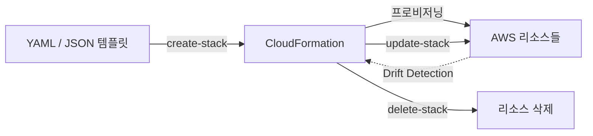
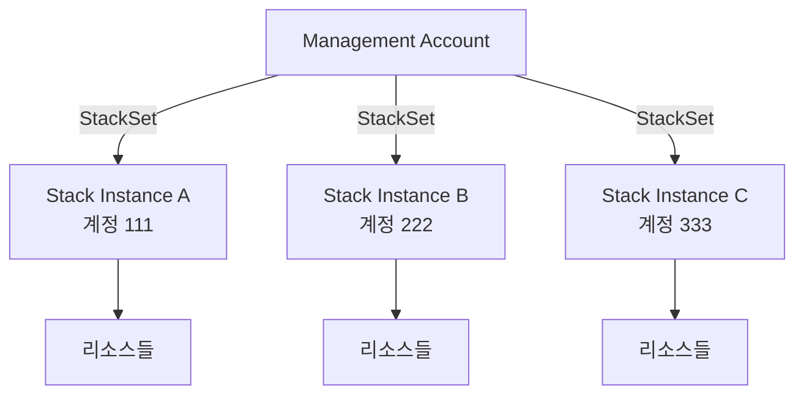

## 정의

**AWS CloudFormation** 은 JSON 또는 YAML 템플릿으로 AWS 인프라를 **선언적으로 프로비저닝**하는 IaC (Infrastructure as Code) 서비스입니다. 원하는 최종 상태를 기술하면 CloudFormation 이 생성/수정/삭제를 순서에 맞게 자동으로 수행합니다.

**한 줄 요약**: "YAML/JSON 로 AWS 리소스를 선언하면, CloudFormation 이 의존성을 분석해 올바른 순서로 만들어준다".

## 왜 CloudFormation 인가

### 수동 콘솔 조작의 문제

- **재현 불가**: 콘솔 클릭 내용은 기억 의존. 새 환경 구성 매번 다르게 됨
- **드리프트**: 누군가 콘솔에서 수정 → 개발/스테이징/프로덕션 환경 간 차이 발생
- **감사 어려움**: 누가 언제 무엇을 바꿨는지 추적 불가
- **삭제 어려움**: 어떤 리소스가 세트인지 몰라 삭제 시 일부 누락

### CloudFormation 접근

- **코드로 상태 관리**: Git 저장소에 템플릿 → 버전 관리 + PR 리뷰
- **반복 가능한 배포**: 같은 템플릿으로 Dev / Staging / Prod 동일하게 구성
- **Drift Detection**: 실제 상태와 템플릿 차이 자동 감지
- **Rollback**: 업데이트 실패 시 이전 상태 자동 복원
- **의존성 자동 처리**: RDS 가 VPC 보다 먼저 생성되지 않도록 자동 순서 결정

## 핵심 개념

### Stack

CloudFormation 의 **배포 + 관리 단위**. 하나의 템플릿이 하나의 Stack 에 대응.

- 리소스들을 하나의 단위로 생성 / 수정 / 삭제
- Stack 삭제 → 포함된 모든 리소스 삭제 (`DeletionPolicy: Retain` 예외)
- Stack 이름은 리전 내 고유

**Stack 상태**:

| 상태 | 의미 |
|:---|:---|
| `CREATE_COMPLETE` | 생성 완료 |
| `UPDATE_IN_PROGRESS` | 업데이트 중 |
| `UPDATE_ROLLBACK_COMPLETE` | 업데이트 실패, 롤백 완료 |
| `DELETE_FAILED` | 삭제 실패 (리소스 의존성 등) |

### StackSet

**여러 AWS 계정 + 여러 리전** 에 동일 스택 배포. 조직 전체 보안 기준선 적용에 활용.

```
Management Account (Admin)
├── StackSet "SecurityBaseline"
│   ├── Account A, us-east-1
│   ├── Account A, ap-northeast-2
│   ├── Account B, us-east-1
│   └── Account B, ap-northeast-2
```

AWS Organizations 통합 시 신규 계정 자동 포함 가능.

### ChangeSet

**배포 전 변경 미리보기**. 실제 적용 전에 "무엇이 어떻게 바뀌는지" 확인.

```bash
# ChangeSet 생성
aws cloudformation create-change-set \
  --stack-name my-stack \
  --template-body file://template.yaml \
  --change-set-name my-changes

# 변경 내용 확인
aws cloudformation describe-change-set --change-set-name my-changes

# 실제 적용
aws cloudformation execute-change-set --change-set-name my-changes
```

CI/CD 파이프라인에서 ChangeSet 생성 → 검토 게이트 → Execute 흐름을 권장합니다.

## 아키텍처 / 라이프사이클



### StackSet 배포 구조



## 템플릿 구조

```yaml
AWSTemplateFormatVersion: '2010-09-09'
Description: '앱 인프라 스택'

# 배포 시 입력 받는 파라미터
Parameters:
  Environment:
    Type: String
    AllowedValues: [dev, staging, prod]
    Default: dev
  InstanceType:
    Type: String
    Default: t3.small

# 조건식 (Intrinsic Function 조합)
Conditions:
  IsProd: !Equals [!Ref Environment, prod]

# 필수 섹션: 실제 리소스 정의
Resources:
  MyBucket:
    Type: AWS::S3::Bucket
    Properties:
      BucketName: !Sub '${AWS::StackName}-data-${AWS::Region}'
      VersioningConfiguration:
        Status: !If [IsProd, Enabled, Suspended]
    DeletionPolicy: Retain   # 스택 삭제 시 버킷 보존

  LambdaRole:
    Type: AWS::IAM::Role
    Properties:
      AssumeRolePolicyDocument:
        Version: '2012-10-17'
        Statement:
          - Effect: Allow
            Principal:
              Service: lambda.amazonaws.com
            Action: 'sts:AssumeRole'
      ManagedPolicyArns:
        - arn:aws:iam::aws:policy/service-role/AWSLambdaBasicExecutionRole

  MyFunction:
    Type: AWS::Lambda::Function
    Properties:
      FunctionName: !Sub '${AWS::StackName}-handler'
      Runtime: nodejs20.x
      Handler: index.handler
      Code:
        S3Bucket: !Ref MyBucket
        S3Key: lambda.zip
      Role: !GetAtt LambdaRole.Arn   # 다른 리소스 속성 참조
    DependsOn: LambdaRole

# 다른 스택에서 참조할 수 있도록 내보내기
Outputs:
  BucketName:
    Value: !Ref MyBucket
    Export:
      Name: !Sub '${AWS::StackName}-BucketName'
  FunctionArn:
    Value: !GetAtt MyFunction.Arn
```

## Intrinsic Functions

| 함수 | 용도 | 예시 |
|:---|:---|:---|
| `!Ref` | 리소스 ID / 파라미터 값 참조 | `!Ref MyBucket` |
| `!GetAtt` | 리소스 속성 참조 | `!GetAtt LambdaRole.Arn` |
| `!Sub` | 문자열 치환 (변수 포함) | `!Sub '${AWS::StackName}-bucket'` |
| `!If` | 조건 분기 | `!If [IsProd, Enabled, Disabled]` |
| `!Join` | 문자열 결합 | `!Join ['-', [a, b, c]]` |
| `!Select` | 목록에서 선택 | `!Select [0, !GetAZs '']` |
| `!ImportValue` | 다른 스택 Output 참조 | `!ImportValue OtherStack-BucketName` |
| `!Split` | 문자열 분리 | `!Split [',', !Ref CsvList]` |
| `!FindInMap` | Mappings 섹션 값 조회 | `!FindInMap [RegionMap, !Ref AWS::Region, AMI]` |

### Pseudo Parameters (자동 제공)

- `${AWS::AccountId}`: 현재 계정 ID
- `${AWS::Region}`: 현재 리전
- `${AWS::StackName}`: 현재 스택 이름
- `${AWS::StackId}`: 스택 ARN
- `${AWS::NoValue}`: 속성 제거 (Condition 과 함께 사용)

## Drift Detection

**Drift**: 템플릿 정의와 실제 리소스 상태의 차이.

```bash
# Drift 감지 시작
aws cloudformation detect-stack-drift --stack-name my-stack

# 감지 상태 확인
aws cloudformation describe-stack-drift-detection-status \
  --stack-drift-detection-id <id>

# 드리프트된 리소스 상세 보기
aws cloudformation describe-stack-resource-drifts --stack-name my-stack
```

**Drift 주요 원인**:
- 누군가 AWS 콘솔에서 수동으로 설정 변경
- 외부 스크립트 / Terraform 등 다른 도구로 리소스 수정
- AWS 서비스 자동 업데이트

> [!IMPORTANT]
> **Drift 감지는 자동 아님**. 수동 실행 또는 Lambda + EventBridge 로 주기적 스캔 설정 필요.

## Rollback

스택 업데이트 중 실패 → **이전 상태 자동 복원** (기본).

**주요 상태 전이**:
- `UPDATE_IN_PROGRESS` → 실패 → `UPDATE_ROLLBACK_IN_PROGRESS` → `UPDATE_ROLLBACK_COMPLETE`
- `UPDATE_ROLLBACK_FAILED`: 롤백 자체도 실패. `continue-update-rollback` 명령 + 수동 복구 필요.

**`DisableRollback`** 옵션으로 실패 시 리소스 보존 가능 (디버그용, 프로덕션 비권장).

## Nested Stacks vs Cross-Stack References

### Nested Stacks

부모 스택이 자식 스택을 리소스로 포함하는 방식:

```yaml
# parent-stack.yaml
Resources:
  NetworkStack:
    Type: AWS::CloudFormation::Stack
    Properties:
      TemplateURL: https://s3.amazonaws.com/my-bucket/network.yaml

  AppStack:
    Type: AWS::CloudFormation::Stack
    Properties:
      TemplateURL: https://s3.amazonaws.com/my-bucket/app.yaml
      Parameters:
        VpcId: !GetAtt NetworkStack.Outputs.VpcId
```

**장점**: 단일 배포 단위, 부모 업데이트로 전체 라이프사이클 관리.
**단점**: 중첩 깊이 제한 (10 수준), 자식 스택도 스택 한도 (2000개/리전) 에 포함.

### Cross-Stack References

별도 스택 간 `Export` / `ImportValue` 로 값 전달:

```yaml
# network-stack.yaml Outputs
Outputs:
  VpcId:
    Value: !Ref MyVPC
    Export:
      Name: !Sub '${AWS::StackName}-VpcId'

# app-stack.yaml
Resources:
  MyInstance:
    Properties:
      VpcId: !ImportValue 'network-stack-VpcId'
```

**장점**: 스택 독립 배포, 팀별 소유권 분리, 변경 충격 격리.
**단점**: 다른 스택이 ImportValue 중인 Export 삭제 불가, 리전 간 교차 참조 불가.

## CDK 와의 관계

[[aws-cdk|AWS CDK]] 는 TypeScript / Python 등 프로그래밍 언어로 인프라를 정의하고, 내부적으로 CloudFormation 템플릿을 생성해 배포합니다.

```
CDK 코드 (TypeScript)
    → cdk synth
    → CloudFormation 템플릿 (YAML)
    → cdk deploy
    → CloudFormation 스택 생성
    → AWS 리소스
```

CDK 는 CloudFormation 의 **프로그래밍 언어 인터페이스**입니다. 실제 프로비저닝 엔진은 CloudFormation 이며, AWS 콘솔의 CloudFormation 스택에서 CDK 배포 결과를 확인할 수 있습니다.

## CloudFormation vs 대안 IaC

| 축 | CloudFormation | [[terraform|Terraform]] | [[aws-cdk|CDK]] | [[pulumi|Pulumi]] |
|:---|:---|:---|:---|:---|
| **제공사** | AWS 관리형 | HashiCorp / OpenTofu | AWS | Pulumi Corp |
| **언어** | YAML / JSON | HCL | TS / Python / Java / Go | TS / Python / Go / C# |
| **대상 클라우드** | AWS 전용 | Multi-cloud | AWS 위주 | Multi-cloud |
| **State 관리** | CFN 서비스 내장 | 자체 tfstate 파일 | CFN 서비스 내장 | Pulumi Cloud |
| **변경 미리보기** | ChangeSet | `terraform plan` | `cdk diff` | `pulumi preview` |
| **새 AWS 서비스** | 즉시 지원 | Provider 업데이트 필요 | 즉시 지원 | Provider 업데이트 필요 |
| **타입 안전성** | 없음 | HCL 제한적 | 완전 (TS) | 완전 |
| **테스트** | 어려움 | terratest | jest / pytest | 언어 내장 |

**판단 기준**:
- AWS-only, AWS 관리 상태 선호, YAML 거부감 없음 → **CloudFormation**
- AWS-only + 개발자 친화성 + 타입 안전성 + 테스트 → **CDK**
- Multi-cloud, 인프라 팀 중심, 넓은 에코시스템 → **Terraform**
- Multi-cloud + 완전한 프로그래밍 언어 → **Pulumi**

## 비용

CloudFormation 자체는 **무료**. 생성되는 AWS 리소스 요금만 부과.

예외:
- **StackSets**: 배포 Operation 당 소량 요금 (서비스 관리형 모드)
- **CloudFormation Guard**: 오픈소스 정책 검사 도구, 실행 비용 없음

## 함정

> [!CAUTION]
> **리소스 Update 가 Replacement 유발**. `UpdateRequiresReplacement` 속성 변경 시 기존 리소스 삭제 후 재생성. 예: RDS 인스턴스 식별자 변경 → DB 데이터 포함 삭제. **ChangeSet 으로 반드시 미리 확인**.

> [!WARNING]
> **IAM Circular Dependency**. Lambda → IAM Role → Lambda 처럼 순환 참조 발생 시 스택 생성 교착 상태. `DependsOn` 명시 또는 별도 스택으로 분리해 해결.

> [!CAUTION]
> **스택당 리소스 500개 한계** (소프트 한도 200개). 대형 인프라는 Nested Stacks 또는 독립 스택 여러 개로 분리.

> [!WARNING]
> **Cross-Stack Export 삭제 불가**. 다른 스택이 `!ImportValue` 로 참조 중인 Export 를 삭제하면 오류. 스택 간 의존성 설계 초기에 명확히 계획.

> [!IMPORTANT]
> **Rollback 실패 시 수동 복구 필요**. `UPDATE_ROLLBACK_FAILED` 상태에서는 `continue-update-rollback` 명령 실행 후 문제 리소스 수동 정리. 해결 못하면 스택이 잠길 수 있음.

> [!WARNING]
> **Stack 삭제 = 리소스 삭제**. 실수로 스택 삭제 시 RDS, S3 등 데이터 포함 삭제. 중요 리소스에 `DeletionPolicy: Retain` 또는 `Snapshot` 설정 필수.

## 관련 위키

- [[aws-cdk|CDK]] - CloudFormation 의 프로그래밍 언어 인터페이스
- [[terraform|Terraform]] - 대안 IaC (Multi-cloud)
- [[pulumi|Pulumi]] - 대안 IaC (프로그래밍 언어, Multi-cloud)
- [[aws-iam|IAM]] - 리소스 권한 및 Role 정의
- [[aws-s3|S3]] - 중첩 스택 템플릿 / asset 저장
- [[aws-cloudwatch|CloudWatch]] - 스택 이벤트 메트릭
- [[aws-cloudtrail|CloudTrail]] - 스택 변경 이력 감사
- [[aws-config|Config]] - 리소스 구성 변경 추적 + 규정 준수
- [[well-architected|Well-Architected]] - IaC 모범 사례
