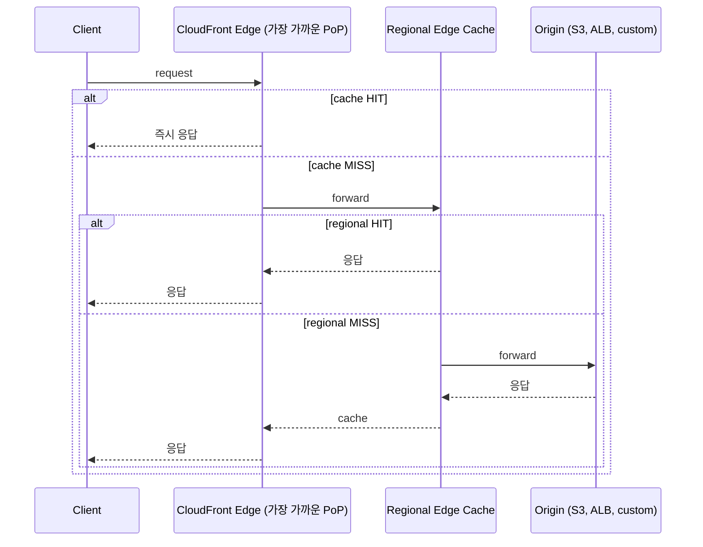
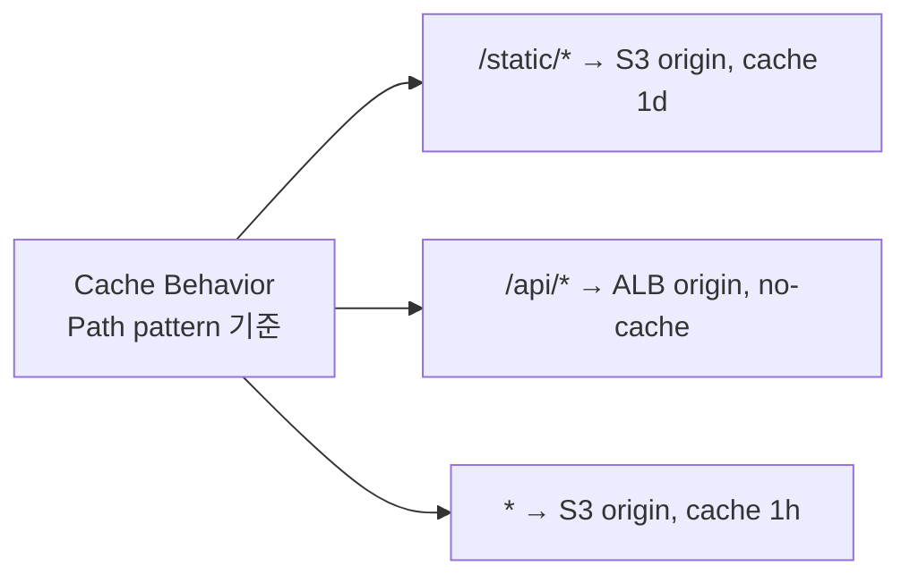

## 정의

**CloudFront** = AWS 의 *글로벌 CDN*. *전세계 엣지 (~600 PoP)* 에서 사용자에게 가까이.

## 동작



## Origin 종류

| Origin | 사용 |
|---|---|
| S3 | 정적 파일 |
| ALB / NLB | 동적 |
| Custom (anywhere) | 외부 (자체 호스팅) |
| Lambda Function URL | 서버리스 |
| MediaPackage | 비디오 |

## Cache Behavior



## Cache Key

```yaml
CachePolicy:
  Headers: [Accept-Language, Authorization]
  Cookies: [session]
  QueryStrings: [version]
```

> *너무 많은 key* = cache hit rate 떨어짐. *최소*.

## Signed URL / Signed Cookie

```bash
aws cloudfront sign --url https://d111.cloudfront.net/private/video.mp4 \
  --key-pair-id K123 \
  --private-key file://private_key.pem \
  --date-less-than 2026-06-26
```

- 사용자별 *임시 URL*.
- 동영상 / 다운로드 / 보호된 콘텐츠.

## OAC (Origin Access Control)

S3 origin 의 *공개 차단 + CloudFront 만 접근*:

```yaml
S3 Bucket policy:
  - Principal: cloudfront.amazonaws.com
    Condition:
      AWS:SourceArn: arn:aws:cloudfront:::distribution/EXX
```

> *옛 OAI (Origin Access Identity)* 의 후계. *S3 의 모든 PUT/GET 권한 분리*.

## Edge Compute

| | CloudFront Functions | Lambda@Edge |
|---|---|---|
| Runtime | JavaScript only | Node, Python |
| 실행 위치 | edge (가장 빠름) | regional edge |
| Cold start | *0* | 가능 |
| 시간 한도 | < 1ms | 5s (viewer) / 30s (origin) |
| 메모리 | 2MB | 128MB-10GB |
| 가격 | 매우 저렴 | Lambda 가격 |
| 사용 | header rewrite, redirect, A/B | 복잡 처리 (auth, transform) |

## TLS / SNI

- *AWS Certificate Manager (ACM)* 무료 인증서.
- *반드시 us-east-1* (Northern Virginia) 에서 발급 (CloudFront 글로벌).
- SNI 기본 활성 (옛 dedicated IP 옵션 비싸다).

## 흔한 함정

> [!WARNING]
> 1. **Origin 의 *cache header 무시*** = CloudFront 가 cache 안 함. `Cache-Control: max-age=...` 명시.
> 2. **S3 origin 공개** = CloudFront 우회 가능. OAC 필수.
> 3. **invalidation 비용** = 1000 path 까지 무료, 이후 $0.005/path. wildcards (`/*`) 가 효율적.
> 4. **TLS cert 가 wrong region** = us-east-1 에서만 발급. 다른 region 의 cert 는 *사용 불가*.

## 관련 위키

- [[aws-s3]]
- [[aws-alb-nlb]]
- [[aws-route53]]
- [[aws-lambda]] (Lambda@Edge)
- [[network-http-caching]]
