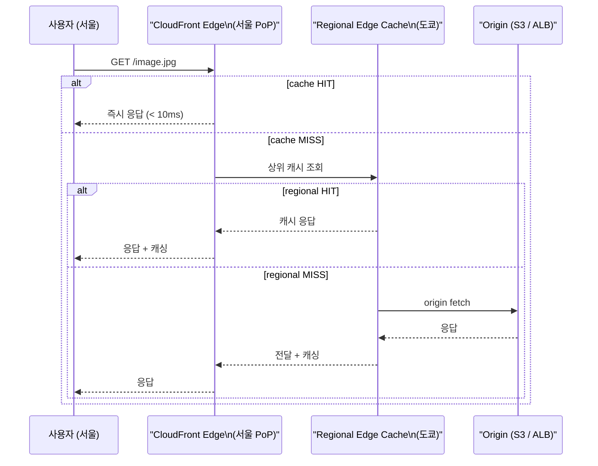
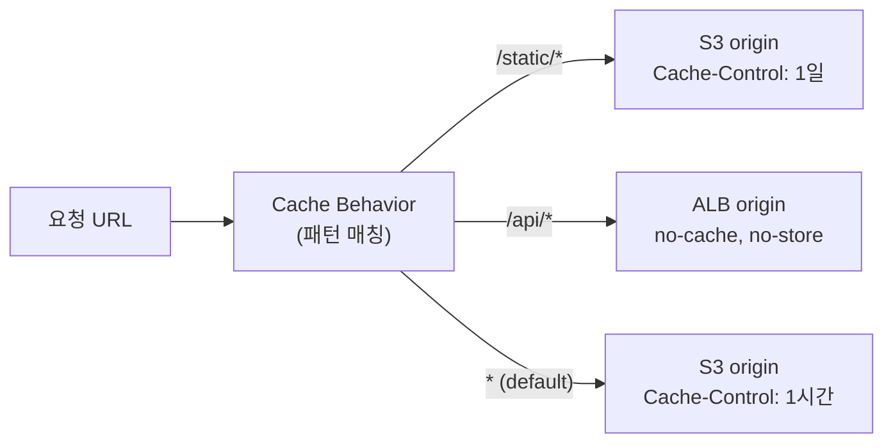
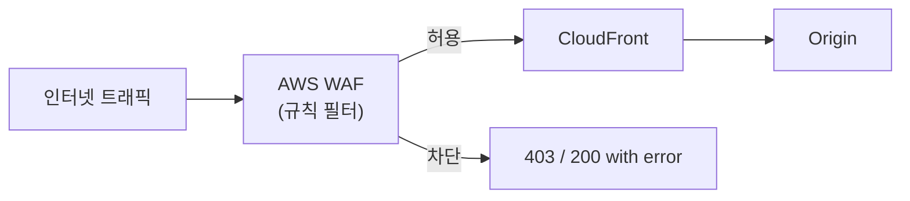

## 정의

**CloudFront** = AWS 의 *글로벌 CDN*. 전세계 ~600 PoP (Points of Presence) 에서 사용자에게 가까운 edge 로 콘텐츠 제공. 지연 감소 + origin 부하 감소.

## 동작 흐름



## Origin 종류

| Origin | 사용 사례 |
|:---|:---|
| S3 | 정적 파일, 이미지, SPA |
| ALB / NLB | 동적 API, 웹 앱 |
| Custom HTTP (any) | 외부 자체 서버 |
| Lambda Function URL | 서버리스 API |
| MediaPackage | 라이브/VOD 스트리밍 |
| API Gateway | REST / WebSocket API |

## Cache Behavior

요청 경로 패턴별로 다른 origin + 캐시 정책 적용.



**매칭 우선순위**: 더 구체적인 패턴이 먼저. `/api/v2/*` 가 `/api/*` 보다 먼저 평가.

## Cache Key 설계

```yaml
CachePolicy:
  HeadersConfig:
    HeaderBehavior: whitelist
    Headers: [Accept-Encoding, Accept-Language]
  CookiesConfig:
    CookieBehavior: whitelist
    Cookies: [session-id]
  QueryStringsConfig:
    QueryStringBehavior: whitelist
    QueryStrings: [version, locale]
```

> cache key 에 포함되는 항목이 많을수록 cache hit rate 떨어짐. *최소한*의 key 로 유지.

**Origin Request Policy** 와 분리: cache key 에는 없지만 origin 에 전달할 header/cookie/query 를 별도 정의 가능.

## OAC (Origin Access Control)

S3 origin 의 직접 접근 차단 + CloudFront 만 허용.

```yaml
# S3 Bucket Policy
Statement:
  - Effect: Allow
    Principal:
      Service: cloudfront.amazonaws.com
    Action: s3:GetObject
    Resource: arn:aws:s3:::my-bucket/*
    Condition:
      StringEquals:
        AWS:SourceArn: arn:aws:cloudfront::123456789:distribution/EXXX
```

- 옛 OAI (Origin Access Identity) 의 후계 (2022+)
- OAC 는 SSE-KMS 암호화 S3 도 지원
- S3 퍼블릭 차단 설정 유지 상태에서 CloudFront 만 접근

## Signed URL / Signed Cookie

보호된 콘텐츠에 임시 접근 URL 생성.

```bash
# CLI 로 signed URL 생성
aws cloudfront sign \
  --url https://d111.cloudfront.net/private/video.mp4 \
  --key-pair-id K1234567890 \
  --private-key file://cloudfront-private-key.pem \
  --date-less-than 2026-12-31T23:59:59Z
```

```python
# Boto3 Python
from botocore.signers import CloudFrontSigner
import rsa

def rsa_signer(message):
    with open('private_key.pem', 'rb') as f:
        private_key = rsa.PrivateKey.load_pkcs1(f.read())
    return rsa.sign(message, private_key, 'SHA-1')

signer = CloudFrontSigner(key_id, rsa_signer)
url = signer.generate_presigned_url(
    'https://d111.cloudfront.net/private/doc.pdf',
    date_less_than=datetime(2026, 12, 31)
)
```

**Signed URL vs Signed Cookie**:
- *Signed URL*: 파일 단건. 다운로드 링크, 동영상 단건
- *Signed Cookie*: 여러 파일. 구독 콘텐츠, 멤버십 전체 섹션

## Edge Compute

CloudFront 에서 코드 실행. 두 가지 옵션.

| 항목 | CloudFront Functions | Lambda@Edge |
|:---|:---|:---|
| Runtime | JS (ES 2019) | Node.js, Python |
| 실행 위치 | edge PoP (가장 빠름) | Regional edge cache |
| Cold start | 없음 | 있음 (드물게) |
| 실행 시간 한도 | 1ms | viewer: 5s / origin: 30s |
| 메모리 | 2MB | 128MB-10GB |
| 가격 | $0.1/100만 | Lambda 가격 |
| 네트워크 접근 | 불가 | 가능 |
| 사용 사례 | header 조작, redirect, A/B | 인증, 이미지 변환, 복잡 로직 |

```javascript
// CloudFront Functions: URL 정규화 예시
async function handler(event) {
    const request = event.request;
    // /blog/post/ -> /blog/post/index.html
    if (request.uri.endsWith('/')) {
        request.uri += 'index.html';
    }
    return request;
}
```

```python
# Lambda@Edge: JWT 인증 (origin request)
import jwt

def handler(event, context):
    request = event['Records'][0]['cf']['request']
    headers = request.get('headers', {})
    auth = headers.get('authorization', [{}])[0].get('value', '')
    try:
        token = auth.replace('Bearer ', '')
        jwt.decode(token, SECRET_KEY, algorithms=['HS256'])
        return request  # 통과
    except Exception:
        return {'status': '401', 'body': 'Unauthorized'}
```

## TLS / 인증서

- *AWS Certificate Manager (ACM)* 무료 인증서 사용
- 반드시 **us-east-1** (N. Virginia) 에서 발급 (CloudFront 가 글로벌 서비스이므로)
- SNI (Server Name Indication) 기본 활성. 전용 IP 옵션 ($600/월) 은 레거시 클라이언트 지원 시만

```bash
# 서울에서 발급한 인증서는 CloudFront 에 사용 불가
# us-east-1 에서 발급 필수
aws acm request-certificate \
  --domain-name example.com \
  --subject-alternative-names *.example.com \
  --validation-method DNS \
  --region us-east-1
```

## 캐시 무효화 (Invalidation)

배포 후 캐시 즉시 갱신.

```bash
# 특정 경로 무효화
aws cloudfront create-invalidation \
  --distribution-id EXXX \
  --paths /index.html /app.js

# 전체 무효화
aws cloudfront create-invalidation \
  --distribution-id EXXX \
  --paths "/*"
```

**비용**: 첫 1000 path/월 무료, 이후 $0.005/path. 와일드카드 `/*` 는 1 path 로 계산.

> CI/CD 배포마다 `/*` 무효화는 비효율적. 파일명에 hash 포함 (`app.abc123.js`) 후 영구 캐시 권장.

## 비용 구조

| 항목 | 요금 (서울 리전) |
|:---|:---|
| 데이터 전송 (아웃바운드) | $0.114/GB (첫 10TB) |
| HTTP 요청 | $0.0075/10만 |
| HTTPS 요청 | $0.01/10만 |
| 무효화 | 1000 path/월 무료 후 $0.005/path |
| Lambda@Edge | Lambda 요금 + 리전 추가 비용 |

**비용 최적화**:
- S3 origin 은 CloudFront 통해 내보낼 때 무료 (S3 → CloudFront 데이터 전송 무료)
- cache hit rate 높이면 origin 트래픽 + 비용 감소
- Price Class 로 서비스 지역 제한 (US/EU 만 = 저렴)

## CloudFront + WAF 조합



WAF 규칙: IP 차단, geo 제한, rate limiting, OWASP 관리형 규칙, bot 탐지.

CloudFront distribution 단위로 WAF WebACL 연결 (us-east-1 에서 생성한 WebACL).

## 흔한 함정

> [!WARNING]
> 1. **Origin 의 Cache-Control 헤더 누락**: CloudFront 가 캐싱 안 함. Origin 에서 `Cache-Control: max-age=...` 명시 필수.
> 2. **S3 origin 퍼블릭 오픈**: CloudFront 우회 가능. OAC 필수, S3 버킷 퍼블릭 차단 유지.
> 3. **TLS cert wrong region**: us-east-1 이 아닌 리전의 ACM cert 는 CloudFront 에서 사용 불가.
> 4. **무효화 남용**: `/*` 매 배포마다 실행 = 비용 + hit rate 0. hash 파일명으로 대체.
> 5. **Lambda@Edge 디버깅 어려움**: 전 세계 리전에서 실행. CloudWatch Logs 가 실행 리전에 분산.

> [!CAUTION]
> Lambda@Edge 는 CDK/CloudFormation 배포 후 edge 전파까지 수 분 소요. 배포 직후 즉시 반영 아님.

> [!IMPORTANT]
> CloudFront distribution 삭제 전 비활성화 필수. 비활성화 후 삭제까지 15분 이상 소요.

## 관련 위키

- [[aws-s3]] - 정적 파일 origin
- [[aws-alb-nlb]] - 동적 origin
- [[aws-route53]] - Custom domain DNS
- [[aws-lambda]] - Lambda@Edge / Function URL origin
- [[aws-waf]] - 트래픽 필터링
- [[aws-shield]] - DDoS 방어
- [[network-http-caching]] - HTTP 캐시 원리
