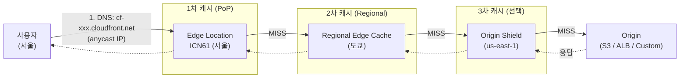
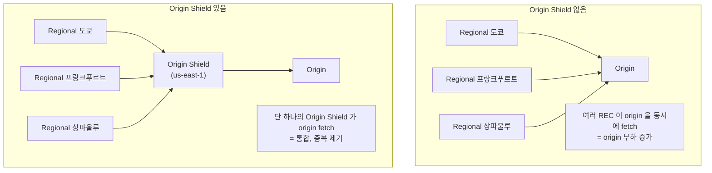
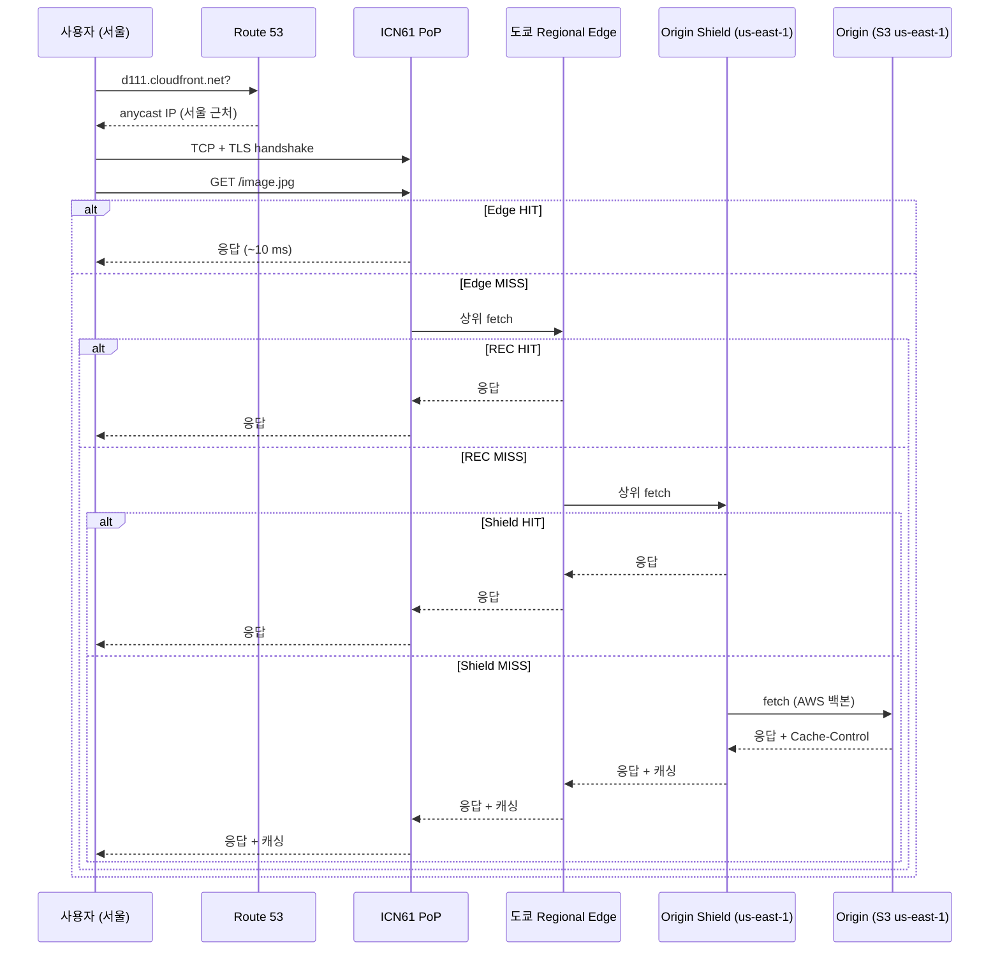
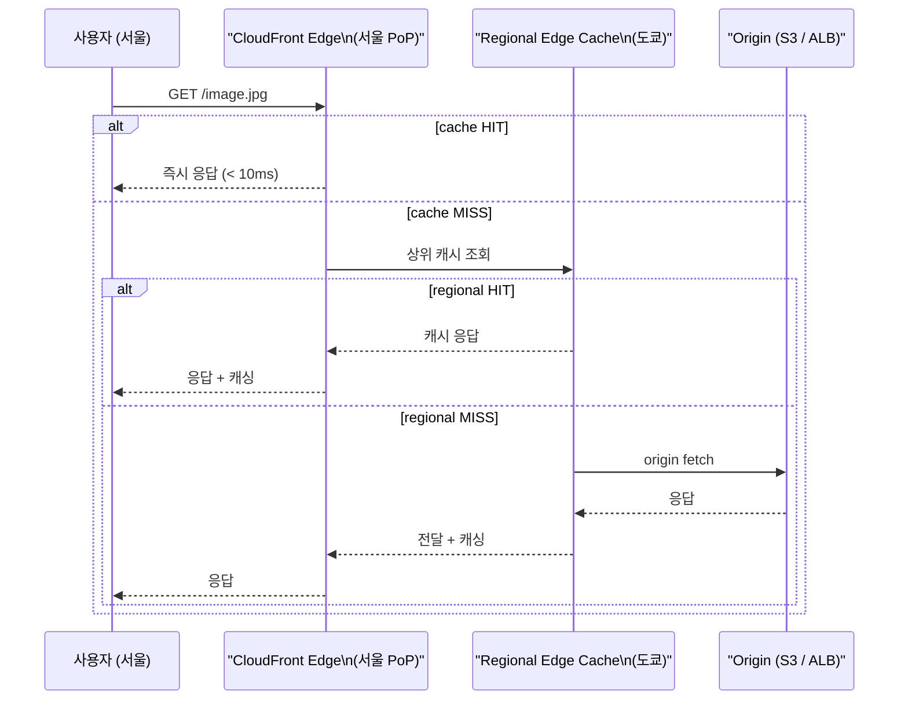
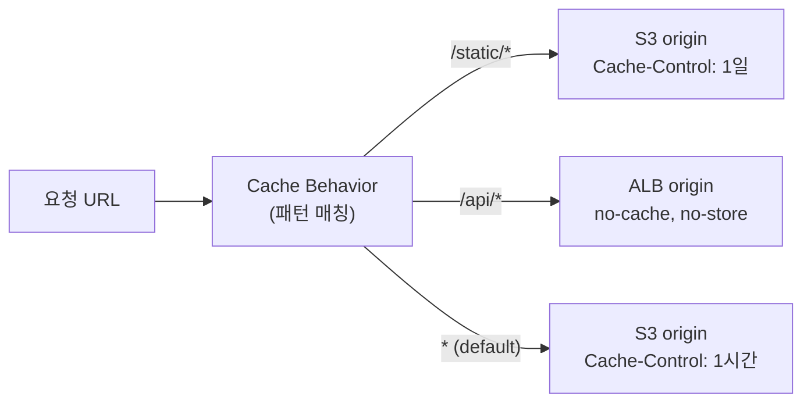
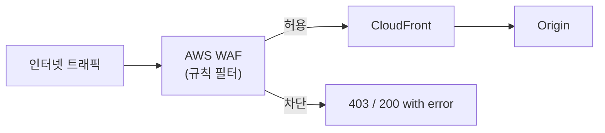

## 정의

**CloudFront** 는 AWS 의 *글로벌 CDN* (Content Delivery Network). 전 세계 **600+ PoP (Points of Presence)** + **13 Regional Edge Cache** 를 통해 사용자에게 가장 가까운 edge 에서 콘텐츠 제공. 지연 감소, origin 부하 감소, DDoS 완화가 목적.

## CloudFront 는 어떻게 동작하는가 (원리)

### 1. 글로벌 네트워크 계층

CloudFront 는 **3계층 캐시 구조** + **AWS 백본 네트워크** 로 동작:


```mermaid
flowchart LR
    Client["사용자<br/>(서울)"]

    subgraph Tier1["1차 캐시 (PoP)"]
        Edge1["Edge Location<br/>ICN61 (서울)"]
    end

    subgraph Tier2["2차 캐시 (Regional)"]
        REC["Regional Edge Cache<br/>(도쿄)"]
    end

    subgraph Tier3["3차 캐시 (선택)"]
        Shield["Origin Shield<br/>(us-east-1)"]
    end

    Origin["Origin<br/>(S3 / ALB / Custom)"]

    Client -->|"1. DNS: cf-xxx.cloudfront.net<br/>(anycast IP)"| Edge1
    Edge1 -->|"MISS"| REC
    REC -->|"MISS"| Shield
    Shield -->|"MISS"| Origin

    Origin -.->|"응답"| Shield
    Shield -.-> REC
    REC -.-> Edge1
    Edge1 -.-> Client
```

| 계층 | 위치 | 역할 | 개수 |
|:---|:---|:---|:---|
| **Edge Location (PoP)** | 600+ 도시 | 사용자와 가장 가까움, 첫 캐시 | 매우 많음 (콘텐츠 소량) |
| **Regional Edge Cache** | 13 리전 | PoP 미스 시 상위 캐시, 콘텐츠 대량 | 큰 캐시 |
| **Origin Shield** | 특정 리전 (선택) | 최상위 통합 캐시, origin 요청 정리 | 사용자 지정 |
| **Origin** | S3/ALB/EC2/Custom | 실제 데이터 | 1개 (또는 origin group) |

### 2. DNS 기반 라우팅 (Anycast)

사용자가 `d111.cloudfront.net` 을 조회하면:

1. **[[aws-route53|Route 53]]** (또는 사용자 DNS) 이 CloudFront 의 anycast IP 반환
2. **BGP anycast**: 같은 IP 를 전 세계 모든 PoP 이 광고 -> ISP 는 가장 가까운 PoP 으로 라우팅
3. **Latency-based / Geo-based** 조합: 정확한 지연 측정 결과와 지리적 위치를 함께 사용

**Global Accelerator 와 차이**: [[aws-global-accelerator|Global Accelerator]] 는 anycast IP 2개를 사용자에게 제공 (정적 IP 필요 시), CloudFront 는 도메인 기반 라우팅 + HTTP/HTTPS 콘텐츠 캐싱에 특화.

### 3. TCP + TLS 종단 (Termination at Edge)

**핵심 성능 이점**: TCP handshake + TLS handshake 가 사용자와 가장 가까운 edge 에서 완료.

```
사용자 (서울) -> ICN61 PoP (서울): TCP + TLS handshake (~5-10 ms RTT)
ICN61 PoP -> Origin (us-east-1): AWS 백본 (지속 연결, keep-alive)
```

- 일반 인터넷 대비 handshake 지연 100 ms+ 절감 가능
- Origin 연결은 **persistent connection** 재사용
- **HTTP/2, HTTP/3 (QUIC)** 지원 -> multiplexing, 0-RTT resumption

### 4. AWS Global Backbone 활용

Edge -> Origin 구간은 **인터넷이 아닌 AWS 사설 백본** 을 타고 감. BGP flap / peering 문제 없음.

- Global backbone: 100+ Tbps 용량
- 여러 대륙 간 전용 광케이블
- 원본이 [[aws-s3|S3]] / ALB 인 경우 데이터 전송 완전 내부 (인터넷 hop 0)

### 5. Cache 계층 (Cache Tier Hierarchy)

**세 레벨 조회 순서** (miss 시 상위로):

```
1) Edge (PoP) 캐시 확인       → HIT: 즉시 응답 (~10 ms)
2) MISS → Regional Edge Cache 조회
3) MISS → Origin Shield 조회 (활성화 시)
4) MISS → Origin fetch → 각 계층에 캐싱
```

**왜 계층 캐시가 유리한가**:
- PoP 이 600+ 개 -> 각 PoP 은 콘텐츠의 일부만 캐시 (용량 제한)
- 인기 콘텐츠는 PoP 에서 처리
- 롱테일 콘텐츠는 Regional Edge Cache 에서 흡수 (Origin 요청 감소)

### 6. Origin Shield (선택 최상위 캐시)

**Origin Shield** 는 사용자가 지정하는 *하나의 리전* 을 최상위 통합 캐시로 사용.


```mermaid
flowchart TB
    subgraph NoShield["Origin Shield 없음"]
        REC1["Regional 도쿄"] --> Origin1["Origin"]
        REC2["Regional 프랑크푸르트"] --> Origin1
        REC3["Regional 상파울루"] --> Origin1
        Note1["여러 REC 이 origin 을 동시에 fetch<br/>= origin 부하 증가"]
    end

    subgraph WithShield["Origin Shield 있음"]
        REC4["Regional 도쿄"] --> Shield["Origin Shield<br/>(us-east-1)"]
        REC5["Regional 프랑크푸르트"] --> Shield
        REC6["Regional 상파울루"] --> Shield
        Shield --> Origin2["Origin"]
        Note2["단 하나의 Origin Shield 가 origin fetch<br/>= 통합, 중복 제거"]
    end
```

**이점**:
- Origin 부하 감소 (같은 콘텐츠를 여러 REC 이 각자 fetch 하는 문제 해결)
- Cache hit rate 상승 (전역 통합)
- Custom origin (온프레미스) 의 대역폭 절감

**과금**: Origin Shield 요청 수 × 요금 (data-out 은 origin 요금과 통합).

**언제 켜나**:
- Origin 이 다중 리전에서 동시에 요청받아 부담될 때
- Origin 이 온프레미스 / 자체 서버
- Cache hit rate 를 최대화 (인기 콘텐츠가 여러 지역에 균등 분포)

### 7. 요청 흐름 (완전판)


```mermaid
sequenceDiagram
    participant U as 사용자 (서울)
    participant DNS as Route 53
    participant Edge as ICN61 PoP
    participant REC as 도쿄 Regional Edge
    participant Shield as Origin Shield (us-east-1)
    participant Origin as Origin (S3 us-east-1)

    U->>DNS: d111.cloudfront.net?
    DNS-->>U: anycast IP (서울 근처)
    U->>Edge: TCP + TLS handshake
    U->>Edge: GET /image.jpg

    alt Edge HIT
        Edge-->>U: 응답 (~10 ms)
    else Edge MISS
        Edge->>REC: 상위 fetch
        alt REC HIT
            REC-->>Edge: 응답
            Edge-->>U: 응답
        else REC MISS
            REC->>Shield: 상위 fetch
            alt Shield HIT
                Shield-->>REC: 응답
                REC-->>Edge: 응답
                Edge-->>U: 응답
            else Shield MISS
                Shield->>Origin: fetch (AWS 백본)
                Origin-->>Shield: 응답 + Cache-Control
                Shield-->>REC: 응답 + 캐싱
                REC-->>Edge: 응답 + 캐싱
                Edge-->>U: 응답 + 캐싱
            end
        end
    end
```

## 왜 이 아키텍처인가 (설계 결정)

1. **PoP 다수 + 각 PoP 소형 캐시** = 사용자 근접 + 낮은 저장 비용
2. **REC 소수 + 큰 캐시** = 롱테일 흡수 + PoP 부하 완화
3. **Origin Shield 선택형** = 필요할 때만 (비용/hit rate 트레이드오프)
4. **AWS 백본 활용** = 인터넷 라우팅 변동성 회피
5. **Anycast IP** = 사용자에게 단일 도메인, 내부적으로 최적 PoP 자동 선택

## 동작 흐름

## 동작 흐름


```mermaid
sequenceDiagram
    participant Client as 사용자 (서울)
    participant Edge as "CloudFront Edge\n(서울 PoP)"
    participant Regional as "Regional Edge Cache\n(도쿄)"
    participant Origin as "Origin (S3 / ALB)"

    Client->>Edge: GET /image.jpg
    alt cache HIT
        Edge-->>Client: 즉시 응답 (< 10ms)
    else cache MISS
        Edge->>Regional: 상위 캐시 조회
        alt regional HIT
            Regional-->>Edge: 캐시 응답
            Edge-->>Client: 응답 + 캐싱
        else regional MISS
            Regional->>Origin: origin fetch
            Origin-->>Regional: 응답
            Regional-->>Edge: 전달 + 캐싱
            Edge-->>Client: 응답
        end
    end
```

## Origin 종류

| Origin | 사용 사례 |
|:---|:---|
| S3 | 정적 파일, 이미지, SPA |
| ALB / NLB | 동적 API, 웹 앱 |
| Custom HTTP (any) | 외부 자체 서버 |
| Lambda Function URL | 서버리스 API |
| MediaPackage | 라이브/VOD 스트리밍 |
| API Gateway | REST / WebSocket API |

## Cache Behavior

요청 경로 패턴별로 다른 origin + 캐시 정책 적용.


```mermaid
flowchart LR
    Req["요청 URL"] --> Behavior["Cache Behavior\n(패턴 매칭)"]
    Behavior -->|"/static/*"| BehA["S3 origin\nCache-Control: 1일"]
    Behavior -->|"/api/*"| BehB["ALB origin\nno-cache, no-store"]
    Behavior -->|"* (default)"| BehC["S3 origin\nCache-Control: 1시간"]
```

**매칭 우선순위**: 더 구체적인 패턴이 먼저. `/api/v2/*` 가 `/api/*` 보다 먼저 평가.

## Cache Key 설계

```yaml
CachePolicy:
  HeadersConfig:
    HeaderBehavior: whitelist
    Headers: [Accept-Encoding, Accept-Language]
  CookiesConfig:
    CookieBehavior: whitelist
    Cookies: [session-id]
  QueryStringsConfig:
    QueryStringBehavior: whitelist
    QueryStrings: [version, locale]
```

> cache key 에 포함되는 항목이 많을수록 cache hit rate 떨어짐. *최소한*의 key 로 유지.

**Origin Request Policy** 와 분리: cache key 에는 없지만 origin 에 전달할 header/cookie/query 를 별도 정의 가능.

## OAC (Origin Access Control)

S3 origin 의 직접 접근 차단 + CloudFront 만 허용.

```yaml
# S3 Bucket Policy
Statement:
  - Effect: Allow
    Principal:
      Service: cloudfront.amazonaws.com
    Action: s3:GetObject
    Resource: arn:aws:s3:::my-bucket/*
    Condition:
      StringEquals:
        AWS:SourceArn: arn:aws:cloudfront::123456789:distribution/EXXX
```

- 옛 OAI (Origin Access Identity) 의 후계 (2022+)
- OAC 는 SSE-KMS 암호화 S3 도 지원
- S3 퍼블릭 차단 설정 유지 상태에서 CloudFront 만 접근

## Signed URL / Signed Cookie

보호된 콘텐츠에 임시 접근 URL 생성.

```bash
# CLI 로 signed URL 생성
aws cloudfront sign \
  --url https://d111.cloudfront.net/private/video.mp4 \
  --key-pair-id K1234567890 \
  --private-key file://cloudfront-private-key.pem \
  --date-less-than 2026-12-31T23:59:59Z
```

```python
# Boto3 Python
from botocore.signers import CloudFrontSigner
import rsa

def rsa_signer(message):
    with open('private_key.pem', 'rb') as f:
        private_key = rsa.PrivateKey.load_pkcs1(f.read())
    return rsa.sign(message, private_key, 'SHA-1')

signer = CloudFrontSigner(key_id, rsa_signer)
url = signer.generate_presigned_url(
    'https://d111.cloudfront.net/private/doc.pdf',
    date_less_than=datetime(2026, 12, 31)
)
```

**Signed URL vs Signed Cookie**:
- *Signed URL*: 파일 단건. 다운로드 링크, 동영상 단건
- *Signed Cookie*: 여러 파일. 구독 콘텐츠, 멤버십 전체 섹션

## Edge Compute

CloudFront 에서 코드 실행. 두 가지 옵션.

| 항목 | CloudFront Functions | Lambda@Edge |
|:---|:---|:---|
| Runtime | JS (ES 2019) | Node.js, Python |
| 실행 위치 | edge PoP (가장 빠름) | Regional edge cache |
| Cold start | 없음 | 있음 (드물게) |
| 실행 시간 한도 | 1ms | viewer: 5s / origin: 30s |
| 메모리 | 2MB | 128MB-10GB |
| 가격 | $0.1/100만 | Lambda 가격 |
| 네트워크 접근 | 불가 | 가능 |
| 사용 사례 | header 조작, redirect, A/B | 인증, 이미지 변환, 복잡 로직 |

```javascript
// CloudFront Functions: URL 정규화 예시
async function handler(event) {
    const request = event.request;
    // /blog/post/ -> /blog/post/index.html
    if (request.uri.endsWith('/')) {
        request.uri += 'index.html';
    }
    return request;
}
```

```python
# Lambda@Edge: JWT 인증 (origin request)
import jwt

def handler(event, context):
    request = event['Records'][0]['cf']['request']
    headers = request.get('headers', {})
    auth = headers.get('authorization', [{}])[0].get('value', '')
    try:
        token = auth.replace('Bearer ', '')
        jwt.decode(token, SECRET_KEY, algorithms=['HS256'])
        return request  # 통과
    except Exception:
        return {'status': '401', 'body': 'Unauthorized'}
```

## TLS / 인증서

- *AWS Certificate Manager (ACM)* 무료 인증서 사용
- 반드시 **us-east-1** (N. Virginia) 에서 발급 (CloudFront 가 글로벌 서비스이므로)
- SNI (Server Name Indication) 기본 활성. 전용 IP 옵션 ($600/월) 은 레거시 클라이언트 지원 시만

```bash
# 서울에서 발급한 인증서는 CloudFront 에 사용 불가
# us-east-1 에서 발급 필수
aws acm request-certificate \
  --domain-name example.com \
  --subject-alternative-names *.example.com \
  --validation-method DNS \
  --region us-east-1
```

## 캐시 무효화 (Invalidation)

배포 후 캐시 즉시 갱신.

```bash
# 특정 경로 무효화
aws cloudfront create-invalidation \
  --distribution-id EXXX \
  --paths /index.html /app.js

# 전체 무효화
aws cloudfront create-invalidation \
  --distribution-id EXXX \
  --paths "/*"
```

**비용**: 첫 1000 path/월 무료, 이후 $0.005/path. 와일드카드 `/*` 는 1 path 로 계산.

> CI/CD 배포마다 `/*` 무효화는 비효율적. 파일명에 hash 포함 (`app.abc123.js`) 후 영구 캐시 권장.

## 비용 구조

| 항목 | 요금 (서울 리전) |
|:---|:---|
| 데이터 전송 (아웃바운드) | $0.114/GB (첫 10TB) |
| HTTP 요청 | $0.0075/10만 |
| HTTPS 요청 | $0.01/10만 |
| 무효화 | 1000 path/월 무료 후 $0.005/path |
| Lambda@Edge | Lambda 요금 + 리전 추가 비용 |

**비용 최적화**:
- S3 origin 은 CloudFront 통해 내보낼 때 무료 (S3 → CloudFront 데이터 전송 무료)
- cache hit rate 높이면 origin 트래픽 + 비용 감소
- Price Class 로 서비스 지역 제한 (US/EU 만 = 저렴)

## CloudFront + WAF 조합


```mermaid
flowchart LR
    Internet["인터넷 트래픽"] --> WAF["AWS WAF\n(규칙 필터)"]
    WAF -->|"허용"| CF["CloudFront"]
    WAF -->|"차단"| Block["403 / 200 with error"]
    CF --> Origin["Origin"]
```

WAF 규칙: IP 차단, geo 제한, rate limiting, OWASP 관리형 규칙, bot 탐지.

CloudFront distribution 단위로 WAF WebACL 연결 (us-east-1 에서 생성한 WebACL).

## 흔한 함정

> [!WARNING]
> 1. **Origin 의 Cache-Control 헤더 누락**: CloudFront 가 캐싱 안 함. Origin 에서 `Cache-Control: max-age=...` 명시 필수.
> 2. **S3 origin 퍼블릭 오픈**: CloudFront 우회 가능. OAC 필수, S3 버킷 퍼블릭 차단 유지.
> 3. **TLS cert wrong region**: us-east-1 이 아닌 리전의 ACM cert 는 CloudFront 에서 사용 불가.
> 4. **무효화 남용**: `/*` 매 배포마다 실행 = 비용 + hit rate 0. hash 파일명으로 대체.
> 5. **Lambda@Edge 디버깅 어려움**: 전 세계 리전에서 실행. CloudWatch Logs 가 실행 리전에 분산.

> [!CAUTION]
> Lambda@Edge 는 CDK/CloudFormation 배포 후 edge 전파까지 수 분 소요. 배포 직후 즉시 반영 아님.

> [!IMPORTANT]
> CloudFront distribution 삭제 전 비활성화 필수. 비활성화 후 삭제까지 15분 이상 소요.

## 관련 위키

- [[aws-s3|S3]] - 정적 파일 origin
- [[aws-alb-nlb|ALB / NLB]] - 동적 origin
- [[aws-route53|Route 53]] - Custom domain DNS
- [[aws-lambda|Lambda]] - Lambda@Edge / Function URL origin
- [[aws-waf|WAF]] - 트래픽 필터링
- [[aws-shield|Shield]] - DDoS 방어
- [[aws-global-accelerator|Global Accelerator]] - 비HTTP 대안
- [[aws-api-gateway|API Gateway]] - Edge-optimized 는 CloudFront 사용
- [[aws-kms|KMS]] - OAC + SSE-KMS 통합
