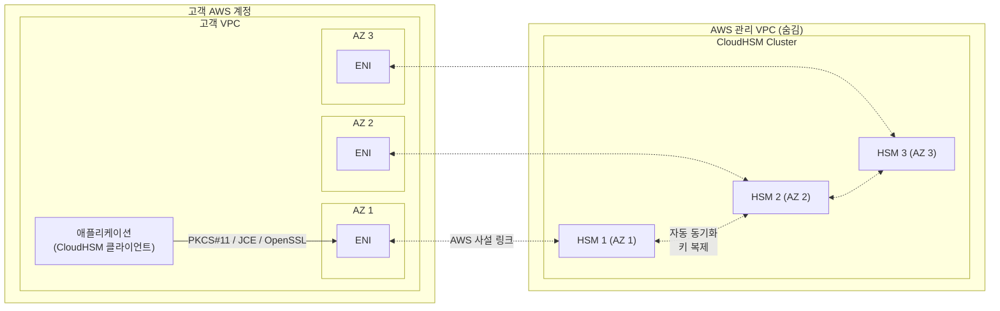
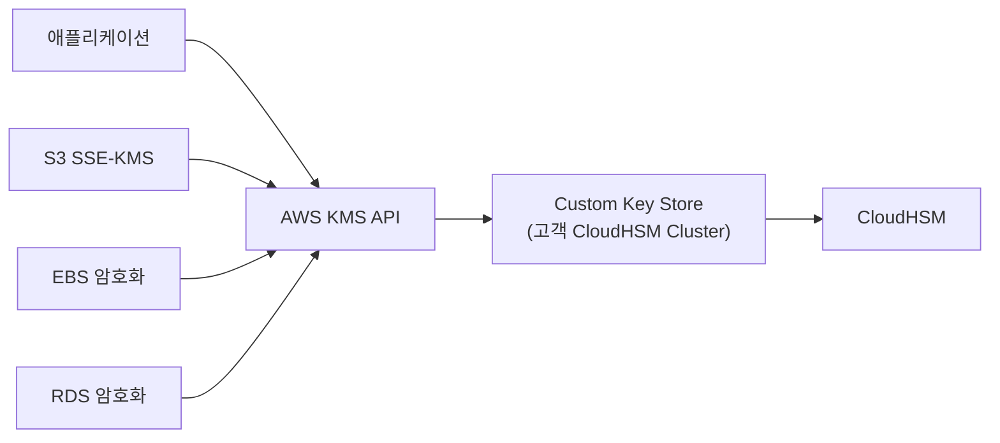

## 정의

**AWS CloudHSM** 은 *AWS VPC 안에서 실행되는 단일 테넌트 (single-tenant) 하드웨어 보안 모듈 (HSM)*. 물리 하드웨어에 격리된 HSM 을 고객 전용으로 프로비저닝하고, 고객이 사용자 / 키 / 백업을 완전히 통제. AWS 는 하드웨어 유지와 네트워크 가용성만 담당하며 **키에는 접근할 수 없다**.

**한 줄 요약**: *AWS 관리 편의 (프로비저닝, HA)* + *"AWS 도 못 보는 키" 를 원하는 규제/보안 요구* 의 결합.

## HSM 이란

**HSM (Hardware Security Module)** = *암호화 키를 안전하게 생성 / 저장 / 사용하기 위한 전용 하드웨어*.

특징:
- **키는 HSM 밖으로 나오지 않음** (사용은 HSM 안에서, 결과만 반환)
- **물리적 tamper 대응**: 봉인 파괴 감지 시 키 자동 삭제
- **표준 인터페이스** (PKCS#11, JCE, CNG/KSP) 로 애플리케이션 통합
- **FIPS / Common Criteria** 등 인증 획득

일반 서버의 소프트웨어 키 저장은 root 나 exploit 으로 유출 가능. HSM 은 물리 격리로 이를 원천 차단.

## 왜 CloudHSM 인가

### KMS 와의 대비

[[aws-kms|AWS KMS]] 도 HSM 백엔드를 쓴다. 그러면 왜 CloudHSM 이 별도 필요한가?

| 축 | [[aws-kms\|KMS]] | CloudHSM |
|:---|:---|:---|
| **테넌시** | Multi-tenant (여러 고객이 같은 HSM 풀) | **Single-tenant** (고객 전용 HSM) |
| **관리 주체** | AWS 가 사실상 전부 | 고객이 사용자 / 키 / 백업 |
| **AWS 접근** | AWS 가 관리 API 갖고 있음 | **AWS 는 접근 불가** |
| **표준 API** | KMS API (AWS 전용) | PKCS#11, JCE, OpenSSL Dynamic Engine, CNG/KSP |
| **알고리즘** | AWS 가 지원하는 것만 | HSM 이 지원하는 것 전부 (커스텀 포함) |
| **FIPS 인증** | FIPS 140-2 Level 2 (HSM 백엔드는 L3) | **FIPS 140-2 Level 3** |
| **비용 모델** | 키당 + 요청당 | HSM 시간당 |
| **AWS 서비스 통합** | 대부분 자동 (S3, EBS, RDS, ...) | 통합 제한 (KMS Custom Key Store 통해 우회) |
| **적합** | 대부분의 앱 암호화 | 규제 / 커스텀 crypto / PKI CA |

**결정 규칙**:
- 대부분: [[aws-kms|KMS]] 로 충분
- **금융 결제 / 정부 기밀 / PKI CA / "AWS 도 못 봐야" 요구**: CloudHSM

### 대표 사용처

1. **금융 서비스**: PIN 처리, EMV 결제, HSM 기반 거래 서명
2. **정부 / 방위**: 분류된 데이터, 규제 준수 (FedRAMP High)
3. **PKI Certificate Authority**: 루트 / 중간 CA 개인 키 보관, 인증서 서명
4. **디지털 서명**: 계약서 서명, 문서 인증
5. **DRM / 저작권**: 콘텐츠 암호화 키
6. **커스텀 암호 알고리즘**: KMS 미지원 알고리즘 (예: 일부 국내 표준)

## 아키텍처



### 구성 요소

- **Cluster**: 여러 HSM 의 논리 그룹. 각 HSM 이 다른 AZ 에 위치 → HA
- **HSM**: 개별 물리 HSM (전용 하드웨어). 요청 부하 분산 대상
- **ENI (Elastic Network Interface)**: 고객 VPC 서브넷에 생성. 클라이언트가 이 ENI 로 HSM 과 통신 (자세히: [[aws-eni|ENI]])
- **클라이언트 SDK**: EC2 나 On-prem 서버에 설치. HSM API 호출 처리

### HA (고가용성)

- Cluster 안 여러 HSM 이 자동으로 키를 동기화
- 클라이언트가 자동 로드 밸런싱
- 한 HSM 이 죽어도 다른 HSM 이 서비스 지속
- 실무 권장: **최소 2 AZ, 2 HSM 이상** (단일 HSM 은 프로덕션 금지)

## 표준 인터페이스

CloudHSM 이 지원하는 crypto API:

| 인터페이스 | 언어/환경 | 대표 사용 |
|:---|:---|:---|
| **PKCS#11** | C / Python / Go / etc | 범용 표준, OpenSSL, PKI 도구 |
| **JCE (Java Cryptography Extension)** | Java | Java 앱, Bouncy Castle |
| **OpenSSL Dynamic Engine** | OpenSSL 기반 어떤 도구든 | Nginx / Apache TLS 종단, PKI |
| **CNG / KSP** | Windows | ADCS, Windows PKI |

**의미**: 애플리케이션은 기존 표준 API 를 그대로 쓰고, 백엔드만 CloudHSM 을 가리키게 설정하면 됨. 코드 재작성 대부분 불필요.

## KMS Custom Key Store 통합

CloudHSM 을 직접 안 쓰고 **KMS 를 통해 CloudHSM 을 백엔드로 사용** 하는 옵션.



**이점**:
- KMS 의 편의성 (S3/EBS/RDS 자동 통합) + CloudHSM 의 통제
- 애플리케이션은 KMS API 로 개발 → 이식성
- KMS 감사 (CloudTrail) 유지

**단점**:
- KMS 요금 + CloudHSM 요금 둘 다
- 지연 (KMS → CloudHSM 왕복)

**언제 유리**: KMS 편의성은 원하되 규제로 인해 키가 고객 통제 하에 있어야 할 때.

## AWS 서비스 통합

CloudHSM 을 직접 지원 (별도 통합) 하는 서비스:

- **[[aws-redshift|Redshift]]**: 클러스터 암호화 키를 CloudHSM 에 저장
- **RDS Oracle TDE**: Transparent Data Encryption
- **ACM Private CA**: PKI 인증서 발급 (루트 CA 키를 CloudHSM 에)
- **NGINX / Apache**: OpenSSL 통해 TLS 개인 키 관리

그 외 대부분은 KMS Custom Key Store 를 경유.

## FIPS 140-2 Level 3

CloudHSM 이 인증 받은 표준. 물리 보안의 국제 표준.

| Level | 특징 |
|:---|:---|
| Level 1 | SW 기반 crypto |
| Level 2 | SW + 물리 tamper 증거 (봉인 seal) |
| **Level 3** | **물리 tamper 대응** (봉인 파괴 시 키 자동 삭제) + role-based auth |
| Level 4 | 최상위 (환경 공격 대응) |

Level 3 는 대부분의 금융 / 정부 규제가 요구하는 수준. CloudHSM 의 이 인증이 KMS 대신 CloudHSM 을 선택하는 주된 이유.

## 사용자 관리

CloudHSM 의 특별한 점: **AWS 계정의 IAM 이 아니라, HSM 자체의 사용자 시스템**.

**HSM 사용자 역할**:
- **Precrypto Officer (PRECO)**: 초기화 시 임시 관리자
- **Crypto Officer (CO)**: 사용자 관리, 클러스터 설정
- **Crypto User (CU)**: 실제 crypto 연산 (key 생성/사용/삭제)
- **Appliance User (AU)**: 관리 목적

CloudHSM 클러스터 활성화 시 CO 를 지정하고, 이후 애플리케이션 별로 CU 를 생성. AWS 는 이 사용자 데이터베이스에 접근 불가.

## 백업

- **자동 백업**: 클러스터 상태 변경 시 (사용자/키 추가 등)
- **암호화된 백업**: AWS 관리 KMS 키로 봉인
- **저장 위치**: 클러스터와 같은 리전 S3 (고객 소유 아님)
- **복원**: 새 클러스터 생성 시 백업에서 복원 가능

**중요**: 백업조차도 AWS 가 열 수 없음. 클러스터의 CO 자격 증명이 없으면 아무도 복원 불가.

## 요금

- **HSM 시간당** (~$1.60 - $2 USD / HSM-hour, 리전별 상이)
- Cluster 는 HSM 개수 x 시간
- 스토리지 / 백업 무료 (기본)
- 데이터 전송 표준

**계산 예시**:
```
HA 최소 (2 HSM × 24 × 30) × $1.60 = ~$2,304 /월

3 HSM (3 AZ HA) × 24 × 30 × $1.60 = ~$3,456 /월
```

KMS 는 키당 $1/월 + 요청당 소액이라 대부분 훨씬 저렴. CloudHSM 은 규제 / 통제가 필수인 워크로드에만.

## 운영 책임

| 항목 | AWS | 고객 |
|:---|:---|:---|
| 하드웨어 유지 | O | X |
| 네트워크 가용성 | O | X |
| Cluster 프로비저닝 | O | X |
| **사용자 관리 (CO / CU)** | X | **O** |
| **키 생성 / 로테이션** | X | **O** |
| **백업 관리** | X | **O** (자동 백업이지만 복원은 고객) |
| **클라이언트 통합** | X | O |
| **모니터링 (실패, 성능)** | 부분 | O |

**핵심**: AWS 가 하드웨어를 대신 운영해주지만, **키와 사용자의 책임은 완전히 고객**. 이걸 KMS 와 혼동하면 안 됨 (KMS 는 대부분 AWS 가 함).

## 관측 & 감사

- **CloudTrail**: CloudHSM API 호출 (클러스터 관리) 기록
- **CloudWatch**: HSM 상태 지표 (healthy 개수, 사용률)
- **HSM 자체 audit log**: crypto 연산 이력 (선택적 syslog 전송)

## 함정

> [!WARNING]
> **단일 HSM = 프로덕션 금지**. HSM 이나 AZ 장애 시 서비스 중단. 최소 2 AZ, 2 HSM.

> [!CAUTION]
> **CO / CU 자격증명 분실** = 클러스터 복구 불가. AWS 도 도와줄 수 없음. 자격증명은 여러 명 / 여러 저장소에 안전 백업 (예: 안전 금고).

> [!WARNING]
> **KMS 대신 CloudHSM 을 대부분 워크로드에** = 요금 폭탄 + 운영 부담. 규제/통제 요구가 없으면 KMS 부터.

> [!IMPORTANT]
> **AWS 는 키에 접근 불가**. 좋은 점이자 나쁜 점. 관리자 실수로 잘못된 키를 지우면 복구 불가. 백업 정책 필수.

> [!CAUTION]
> **AWS 서비스 통합 제한**. S3 SSE-KMS 같은 자동 통합을 원하면 KMS Custom Key Store 로 우회 (양쪽 요금 다 발생).

> [!WARNING]
> **CloudHSM 클라이언트 SDK 관리**. EC2 / On-prem 에 설치되는 클라이언트가 있음. 버전 업그레이드, TLS 갱신 등 관리 필요.

> [!IMPORTANT]
> **hsm1.medium 은 end-of-support 로 마이그레이션 대상**. 신규는 hsm2m.medium (또는 최신).

## 관련 위키

- [[aws-kms|AWS KMS]] - Multi-tenant 대안
- [[aws-iam|IAM]] - AWS 계정 접근 제어 (별개)
- [[aws-vpc|VPC]] - CloudHSM ENI 배치
- [[aws-eni|ENI]] - 클라이언트가 접근하는 인터페이스
- [[aws-redshift|Redshift]] - CloudHSM 통합 서비스
- [[aws-cloudtrail|CloudTrail]] - 관리 API 감사
