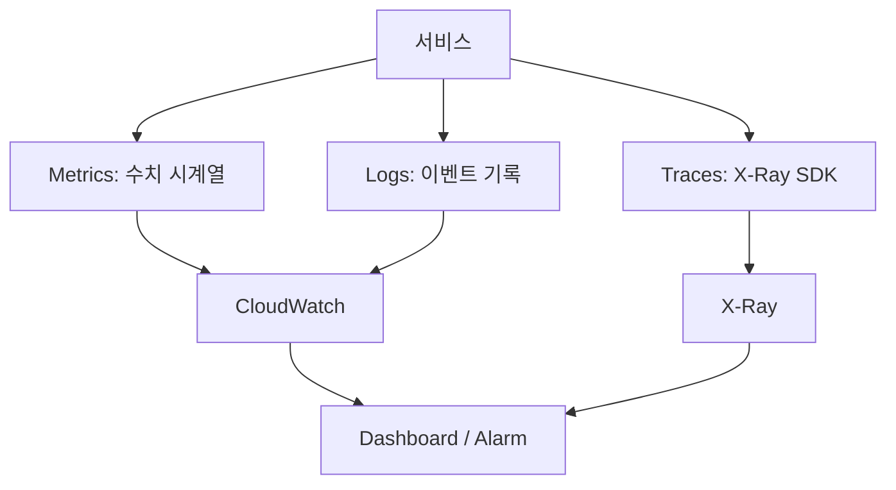
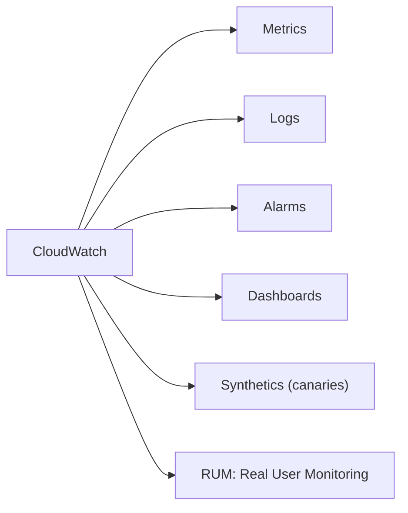
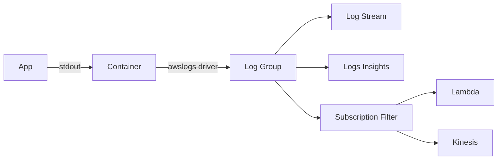

## 정의

**CloudWatch** = AWS 의 *모니터링 + 로그 + 알람* 통합 서비스.  
메트릭 수집, 로그 집계, 대시보드, 알람, 이상 감지를 하나의 서비스에서 제공.

## 사용 상황

| 상황 | 해결책 |
|---|---|
| EC2 / Lambda CPU 급등 감지 | Alarm + SNS 알림 |
| 서비스 응답 P99 추적 | Custom Metric + Dashboard |
| 에러 로그 실시간 분석 | Logs Insights 쿼리 |
| 여러 alarm 동시 발생 노이즈 | Composite Alarm 으로 통합 |
| 이상 패턴 자동 감지 | Anomaly Detection |
| EC2 메모리 / 디스크 수집 | CloudWatch Agent |
| ECS / EKS 컨테이너 모니터링 | Container Insights |
| 여러 메트릭 결합 계산 | Metric Math |

## 관측 가능성 3가지 축



> Metrics + Logs 는 CloudWatch 가 담당, Traces 는 X-Ray (별도 서비스).  
> 세 축이 모두 있어야 진단 가능한 시스템.

## 4가지 구성



## Metrics

| 종류 | 의미 |
|---|---|
| **Standard resolution** | 1분 단위 |
| **High resolution** | 1초 단위 (별도 비용) |
| **Built-in** | AWS service 자동 |
| **Custom** | `PutMetricData` API |

```python
cw.put_metric_data(
    Namespace='MyApp',
    MetricData=[{
        'MetricName': 'OrdersPlaced',
        'Value': 1,
        'Unit': 'Count',
        'Dimensions': [
            { 'Name': 'Region', 'Value': 'us-east-1' },
            { 'Name': 'Service', 'Value': 'order-api' }
        ]
    }]
)
```

## Embedded Metric Format (EMF)

```json
{
  "_aws": {
    "Timestamp": 1719318060000,
    "CloudWatchMetrics": [{
      "Namespace": "MyApp",
      "Dimensions": [["Service"]],
      "Metrics": [
        { "Name": "Latency", "Unit": "Milliseconds" }
      ]
    }]
  },
  "Service": "api",
  "Latency": 125,
  "user_id": "u_42"
}
```

> *로그로 출력하면 CloudWatch 가 자동으로 메트릭 추출*. PutMetricData API 호출 없음. *대량 메트릭의 비용 절감*.

## Metric Math

여러 메트릭을 *수식으로 결합*, 새로운 파생 메트릭 계산.

```yaml
Metrics:
  - Id: errors
    MetricStat:
      Metric: { MetricName: Errors, Namespace: MyApp }
      Stat: Sum
      Period: 60
  - Id: requests
    MetricStat:
      Metric: { MetricName: Requests, Namespace: MyApp }
      Stat: Sum
      Period: 60
  - Id: error_rate
    Expression: "errors / requests * 100"
    Label: "Error Rate"
```

| 수식 예시 | 용도 |
|---|---|
| `errors / requests * 100` | 에러율 계산 |
| `SUM([m1, m2, m3])` | 여러 서비스 합산 |
| `ANOMALY_DETECTION_BAND(m1, 2)` | 이상 감지 밴드 |
| `FILL(m1, 0)` | 누락 데이터 0 채움 |

## CloudWatch Agent

EC2 / 온프레미스에서 *OS 레벨 메트릭* 수집.  
기본 메트릭에 포함되지 않는 *메모리, 디스크 사용률* 을 수집하려면 필수.

```json
{
  "metrics": {
    "namespace": "MyApp/EC2",
    "metrics_collected": {
      "mem": {
        "measurement": ["mem_used_percent"]
      },
      "disk": {
        "measurement": ["disk_used_percent"],
        "resources": ["/", "/data"]
      },
      "cpu": {
        "measurement": ["cpu_usage_idle", "cpu_usage_iowait"],
        "totalcpu": true
      }
    }
  }
}
```

> SSM Parameter Store 에 설정 저장 → 전체 fleet 동기화 가능.

## Container Insights

ECS / EKS 컨테이너 환경의 *CPU, 메모리, 네트워크, Pod 상태* 자동 수집.

| 지원 환경 | 메트릭 예시 |
|---|---|
| ECS | TaskCPUUtilization, ServiceCount |
| EKS | pod_cpu_utilization, node_memory_utilization |

```bash
# EKS 에 Container Insights 활성화
aws eks create-addon \
  --cluster-name my-cluster \
  --addon-name amazon-cloudwatch-observability
```

> 컨테이너 레벨 성능 문제 진단. Auto Scaling 트리거로 활용 가능.

## Logs



### Logs Insights (쿼리)

```sql
fields @timestamp, @message
| filter @message like /ERROR/
| stats count() by bin(5m)
| sort @timestamp desc
| limit 50
```

### Subscription Filter

*로그 → Lambda / Kinesis* 실시간 stream. 외부 시스템 (Datadog, ELK) 으로 export.

## Alarms

```yaml
Alarm:
  MetricName: CPUUtilization
  Namespace: AWS/EC2
  Statistic: Average
  Period: 60
  EvaluationPeriods: 5
  Threshold: 80
  ComparisonOperator: GreaterThanThreshold
  AlarmActions: [arn:aws:sns:...]
```

> 5번 연속 1분 평균 CPU > 80% → SNS 알림.

## Composite Alarm

```yaml
AlarmRule: |
  ALARM("HighCPU") AND
  ALARM("HighLatency") AND
  NOT ALARM("Maintenance")
```

> *복수 alarm 결합*. *유의미한 사고* 만 알림 (false positive 감소).

## Anomaly Detection

```yaml
Metrics:
  - Id: m1
    MetricStat: { ... }
  - Id: ad1
    Expression: ANOMALY_DETECTION_BAND(m1, 2)
```

> 머신러닝으로 *정상 범위 학습 + 이상치 감지*.

## CloudWatch vs 3rd-party

| | CloudWatch | Datadog / NewRelic |
|---|---|---|
| AWS 통합 | *최고* | 통합 plugin |
| UI | 기본 | *우수* |
| 가격 | metric 수에 비례 | 호스트 기반 |
| Distributed tracing | X-Ray 별도 | *통합* |
| APM | 제한 | *완전* |

> *대부분의 큰 회사* = CloudWatch 기본 + Datadog 등 으로 *세분*.

## 비용 최적화

| 전략 | 효과 |
|---|---|
| PutMetricData 대신 EMF | API 호출 비용 절감 |
| Dimension cardinality 제한 | 메트릭 수 통제 |
| Log retention 정책 설정 | S3 export 후 삭제 |
| High resolution 필요한 것만 선택 | 1초 해상도 비용 절감 |
| Metric Math 활용 | 파생 메트릭 별도 저장 불필요 |

## 흔한 함정

> [!WARNING]
> 1. **메트릭 비용 폭증** = 각 dimension 조합 = 별도 metric. *cardinality* 관리.
> 2. **Log retention 기본 *영원*** = 무한 비용. *retention 정책* 필수.
> 3. **PutMetricData *API call 비용*** = EMF 로 *log 로 메트릭*.
> 4. **Alarm 의 *INSUFFICIENT_DATA*** = 데이터 부족으로 alarm 못 보내. `TreatMissingData` 명시.
> 5. **EC2 메모리/디스크 미수집** = 기본 메트릭에 없음. CloudWatch Agent 필수.
> 6. **Log Group 별도 retention** = Log Group 마다 개별 설정해야 함. 전체 계정 기본값 없음.

## 관련 위키

- [[prometheus]]
- [[opentelemetry]]
- [[slo-sli-error-budget]]
- [[aws-eventbridge]]
- [[aws-cloudtrail]]
- [[aws-lambda]]
