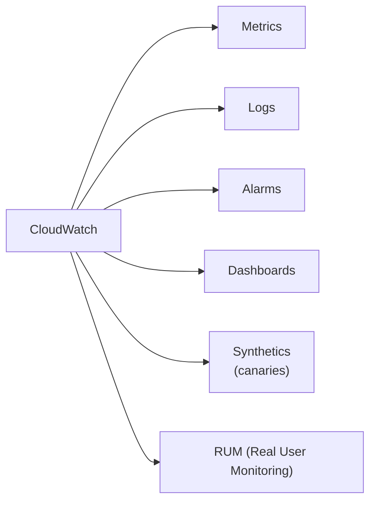
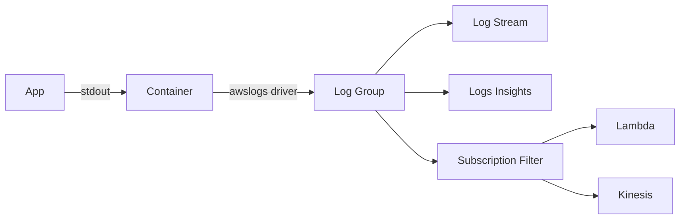

## 정의

**CloudWatch** = AWS 의 *모니터링 + 로그 + 알람* 통합 서비스.

## 4가지 구성



## Metrics

| 종류 | 의미 |
|---|---|
| **Standard resolution** | 1분 단위 |
| **High resolution** | 1초 단위 (별도 비용) |
| **Built-in** | AWS service 자동 |
| **Custom** | `PutMetricData` API |

```python
cw.put_metric_data(
    Namespace='MyApp',
    MetricData=[{
        'MetricName': 'OrdersPlaced',
        'Value': 1,
        'Unit': 'Count',
        'Dimensions': [
            { 'Name': 'Region', 'Value': 'us-east-1' },
            { 'Name': 'Service', 'Value': 'order-api' }
        ]
    }]
)
```

## Embedded Metric Format (EMF)

```json
{
  "_aws": {
    "Timestamp": 1719318060000,
    "CloudWatchMetrics": [{
      "Namespace": "MyApp",
      "Dimensions": [["Service"]],
      "Metrics": [
        { "Name": "Latency", "Unit": "Milliseconds" }
      ]
    }]
  },
  "Service": "api",
  "Latency": 125,
  "user_id": "u_42"
}
```

> *로그로 출력하면 CloudWatch 가 자동으로 메트릭 추출*. PutMetricData API 호출 없음. *대량 메트릭의 비용 절감*.

## Logs



### Logs Insights (쿼리)

```sql
fields @timestamp, @message
| filter @message like /ERROR/
| stats count() by bin(5m)
| sort @timestamp desc
| limit 50
```

### Subscription Filter

*로그 → Lambda / Kinesis* 실시간 stream. 외부 시스템 (Datadog, ELK) 으로 export.

## Alarms

```yaml
Alarm:
  MetricName: CPUUtilization
  Namespace: AWS/EC2
  Statistic: Average
  Period: 60
  EvaluationPeriods: 5
  Threshold: 80
  ComparisonOperator: GreaterThanThreshold
  AlarmActions: [arn:aws:sns:...]
```

> 5번 연속 1분 평균 CPU > 80% → SNS 알림.

## Composite Alarm

```yaml
AlarmRule: |
  ALARM("HighCPU") AND
  ALARM("HighLatency") AND
  NOT ALARM("Maintenance")
```

> *복수 alarm 결합*. *유의미한 사고* 만 알림 (false positive 감소).

## Anomaly Detection

```yaml
Metrics:
  - Id: m1
    MetricStat: { ... }
  - Id: ad1
    Expression: ANOMALY_DETECTION_BAND(m1, 2)
```

> 머신러닝으로 *정상 범위 학습 + 이상치 감지*.

## CloudWatch vs 3rd-party

| | CloudWatch | Datadog / NewRelic |
|---|---|---|
| AWS 통합 | *최고* | 통합 plugin |
| UI | 기본 | *우수* |
| 가격 | metric 수에 비례 (큼) | 호스트 기반 (큼) |
| Distributed tracing | X-Ray 별도 | *통합* |
| APM | 제한 | *완전* |

> *대부분의 큰 회사* = CloudWatch 기본 + Datadog 등 *비싼 도구* 으로 *세분*.

## 흔한 함정

> [!WARNING]
> 1. **메트릭 비용 폭증** = 각 dimension 조합 = 별도 metric. *cardinality* 관리.
> 2. **Log retention 기본 *영원*** = 무한 비용. *retention 정책* 필수.
> 3. **PutMetricData *API call 비용*** = EMF 로 *log 로 메트릭*.
> 4. **Alarm 의 *INSUFFICIENT_DATA*** = 데이터 부족으로 alarm 못 보내. `TreatMissingData` 명시.

## 관련 위키

- [[prometheus]]
- [[opentelemetry]]
- [[slo-sli-error-budget]]
- [[aws-eventbridge]] (CW Events → EB)
