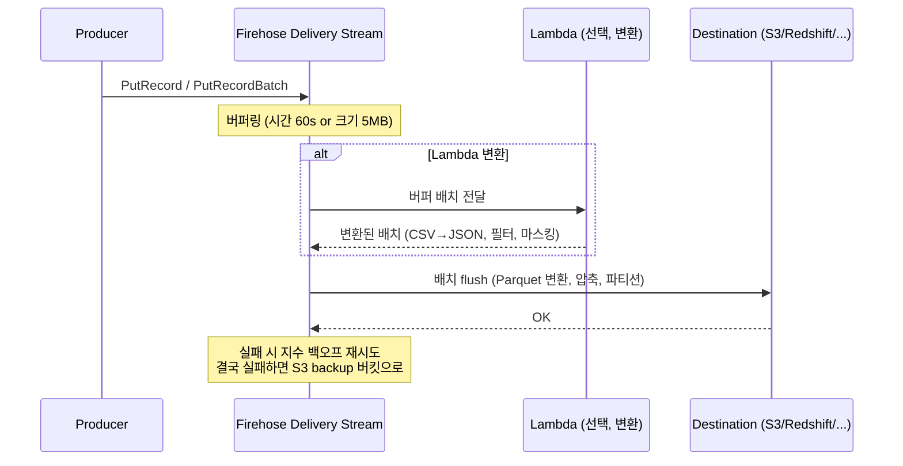

## 정의

**Amazon Data Firehose** (구 Kinesis Data Firehose, 2024-02 이름 변경) 는 *스트리밍 데이터를 받아 S3/Redshift/OpenSearch/Splunk 등으로 자동 적재* 하는 완전 서버리스 서비스. 저장하지 않고 **전달 (delivery)** 만.

**한 줄 감각**: 스트림을 목적지까지 배달하는 트럭. 코드 작성 없이 인프라 관리 없이 적재.

## 왜 Firehose 인가

로그를 [[aws-s3|S3]] 에 넣는 흔한 요구를 예로 들면:

**Firehose 없이**:
- Kinesis / Kafka 컨슈머 코드 작성
- 버퍼링, 배치, 재시도, 오류 처리 직접 구현
- 인스턴스/컨테이너 운영
- 파티션 폴더 구조 관리

**Firehose 로**:
- 콘솔에서 delivery stream 생성 (5분)
- 목적지: S3 버킷 지정
- 그 뒤로 유지 관리 0

## KDS vs Firehose

| 축 | [[aws-kinesis-data-streams\|Kinesis Data Streams]] | Amazon Data Firehose |
|:---|:---|:---|
| **역할** | 수집/저장 스트림 | 전달 (적재) 서비스 |
| **관리** | 샤드 (Provisioned) or On-demand | 완전 서버리스 |
| **지연** | 실시간 (~200 ms, EFO ~70 ms) | 준실시간 (버퍼 최소 60초, Zero Buffering ~5초) |
| **저장 / 보존** | O (24h ~ 365일) | X (저장 X) |
| **재처리 (Replay)** | 가능 | 불가 |
| **다중 소비자** | 여러 독립 소비자 | 목적지로만 전달 |
| **소비자 구현** | 직접 코딩 | 코딩 불필요 |
| **순서 보장** | 샤드 내 O | 보장 X |
| **데이터 변환** | 직접 구현 | Lambda 인라인 내장 |
| **목적지** | 사용자 정의 | 정해진 세트 |
| **레코드 크기** | 최대 1 MiB | 최대 1 MiB |
| **과금** | 샤드 시간 + 데이터량 | 수집/전달 데이터량 |

## 데이터 흐름



## 목적지 (Destinations)

| 목적지 | 특징 |
|:---|:---|
| **[[aws-s3\|Amazon S3]]** | 가장 흔함. Parquet/ORC 변환 + 파티션 자동 |
| **[[aws-redshift\|Amazon Redshift]]** | S3 경유 후 COPY 자동 |
| **Amazon OpenSearch Service** | 로그 분석 인덱스 |
| **Splunk** | 엔터프라이즈 로그 |
| **Apache Iceberg on S3** (2024+) | Lakehouse 직접 적재 |
| **HTTP 엔드포인트** | Datadog, New Relic, MongoDB Atlas 등 파트너 |
| **Snowflake** | 직접 통합 (2024+) |

## 소스 (Sources)

| 소스 | 특징 |
|:---|:---|
| **Direct PUT** | 애플리케이션이 SDK 로 직접 |
| **[[aws-kinesis-data-streams\|Kinesis Data Streams]]** | KDS 를 소스로 (구독) |
| **Amazon MSK** | Kafka 를 소스로 (2023+) |
| **CloudWatch Logs subscription filter** | 로그 -> Firehose |
| **IoT Rules** | IoT 데이터 |

## 버퍼링 (Buffering)

Firehose 는 배치로 flush -> 준실시간.

**두 조건 중 먼저 도달**:
- **시간**: 60초 ~ 900초 (기본 300)
- **크기**: 1 MB ~ 128 MB (기본 5)

**Zero Buffering** (2023+):
- 시간 0초 설정 시 사실상 실시간 (~5초)
- OpenSearch/Splunk 목적지에서 유용

## 데이터 변환 (Transformation)

### Lambda 인라인 변환

```python
def lambda_handler(event, context):
    output = []
    for record in event['records']:
        raw = base64.b64decode(record['data']).decode('utf-8')
        # CSV -> JSON, 필드 추가, PII 마스킹 등
        transformed = transform(raw)
        output.append({
            'recordId': record['recordId'],
            'result': 'Ok',
            'data': base64.b64encode(transformed.encode()).decode()
        })
    return {'records': output}
```

**결과 상태**:
- `Ok` - 변환 성공, 목적지로
- `Dropped` - 필터링됨 (조용히 버림)
- `ProcessingFailed` - 오류, S3 backup 으로

### 포맷 변환 (Format Conversion)

S3 목적지 한정. JSON -> [[apache-parquet|Parquet]] 또는 ORC 자동 변환.

```
입력: {"user_id": 1, "event": "click", "ts": "2026-07-30"}
      ↓ Parquet 변환 + SNAPPY 압축
S3: my-lake/events/year=2026/month=07/day=30/hour=15/xxx.parquet
```

**필수 조건**:
- [[aws-glue|Glue Catalog]] 에 스키마 등록
- 소스 데이터가 JSON

**압축**: GZIP / SNAPPY / ZSTD 등.

## Iceberg 목적지 (2024+)

Apache Iceberg 테이블에 직접 적재 (INSERT / UPDATE / DELETE 지원).

```yaml
DestinationConfiguration:
  IcebergDestinationConfiguration:
    CatalogConfiguration:
      CatalogARN: arn:aws:glue:...:catalog
    S3Configuration:
      RoleARN: ...
      BucketARN: arn:aws:s3:::my-lake
    UniqueKeys: [order_id]      # Upsert 키
    OperationTypes: [INSERT, UPDATE, DELETE]
```

CDC 스트림을 Iceberg 로 그대로 반영. [[aws-athena|Athena]] / [[aws-emr|EMR]] 에서 즉시 쿼리.

## 파티션 (Dynamic Partitioning)

레코드 내용 기반으로 S3 파티션 자동 생성.

```
입력 record: {"customer_id": 42, "event_ts": "2026-07-30T15:00:00Z"}
파티션 표현식: !{partitionKeyFromQuery:customer_id}/!{partitionKeyFromLambda:date}
S3 결과: my-lake/customer_id=42/date=2026-07-30/xxx.parquet
```

- `partitionKeyFromQuery`: JQ 로 필드 추출
- `partitionKeyFromLambda`: Lambda 반환값
- **주의**: 파티션 수 폭증 = small files

## 오류 처리 (Backup)

- 변환/전달 실패 -> S3 backup 버킷 (구성 필수)
- 소스 데이터도 백업 가능 (`FailedDataOnly` 또는 `AllData`)
- 재처리 시 backup 을 원본 소스처럼 사용

## 요금

- **수집 데이터**: $0.029 / GB (초기), 이후 볼륨 할인
- **변환 (Format Conversion)**: 추가 $0.018 / GB
- **Lambda 변환**: Lambda 요금 별도
- **Dynamic Partitioning**: 추가 요금
- **VPC Delivery**: 시간 + GB 추가

과금 단위: **5 KB 단위 반올림** (5 KB 미만 레코드도 5 KB 로 청구).

## 실전 예제

### CloudWatch Logs -> S3 로그 레이크

```
[모든 Lambda 로그] -> CloudWatch Logs
   ↓ subscription filter
Firehose (delivery stream)
   ↓ Lambda 변환 (JSON 정제)
   ↓ Parquet 변환 + SNAPPY
S3 (year=/month=/day= 파티션)
   ↓
Athena SQL 로 분석
```

### KDS + Firehose 결합

```
[생산자] -> Kinesis Data Streams -> ┬-> Lambda (실시간 alert)
                                    └-> Data Firehose -> S3 (자동 적재)
```

**핵심**: KDS 가 고속 수집 + 다중 소비자 + 재처리를 담당, Firehose 가 그 중 하나의 소비자로서 적재.

## 함정

> [!WARNING]
> **Firehose 는 저장하지 않는다**. 재처리/다중 소비자 필요하면 [[aws-kinesis-data-streams|KDS]] 를 앞단에.

> [!CAUTION]
> **밀리초 실시간 필요** = Firehose 부적합 (버퍼 지연). [[aws-kinesis-data-streams|KDS]] 소비자 직접 구현.

> [!WARNING]
> **버퍼 크기 5 MB 유지** = S3 파일 수백만 개 (small files). 파일 크기 128 MB 근처로 조정, 또는 Athena CTAS / Iceberg auto-compact.

> [!IMPORTANT]
> **5 KB 최소 청구** = 매우 작은 레코드 많으면 오히려 비쌈. 프로듀서에서 배치.

> [!CAUTION]
> **Dynamic Partitioning 남용** = 파티션 폭증 + 스몰 파일. 카디널리티 검증 필수.

> [!WARNING]
> **Lambda 변환 응답 시간 5분 초과** = 실패. 무거운 변환은 별도 파이프라인.

> [!IMPORTANT]
> **이름 변경 (Kinesis Data Firehose → Amazon Data Firehose, 2024-02)**. API/SDK 는 하위 호환. 문서/블로그는 옛 이름 혼재.

## 관련 위키

- [[aws-kinesis-data-streams|Kinesis Data Streams]] - 스트림 소스
- [[aws-kinesis-data-analytics|Managed Service for Apache Flink]] - 실시간 처리
- [[aws-s3|S3]] - 대표 목적지
- [[aws-redshift|Redshift]] - 목적지
- [[apache-parquet|Apache Parquet]] - 포맷 변환 결과
- [[aws-glue|Glue]] - Catalog 스키마
- [[aws-lambda|Lambda]] - 인라인 변환
- [[aws-athena|Athena]] - 적재 후 쿼리
- [[etl|ETL]] - 파이프라인 개념
