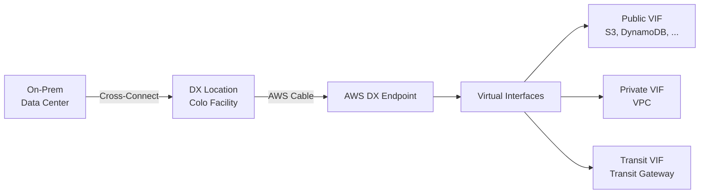
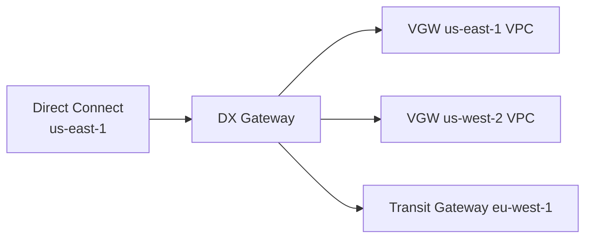

## 정의

**AWS Direct Connect (DX)** 는 온프레미스 데이터센터 (또는 사무실) 를 AWS 리전에 **전용선** 으로 직접 연결하는 서비스입니다. 인터넷을 거치지 않아 **낮은 지연, 예측 가능한 대역폭, 낮은 데이터 전송 비용, 강한 보안 (MACsec 옵션)** 을 제공합니다.

## 왜 Direct Connect 인가

VPN 대비 강점:

- **낮은 지연**: 인터넷 라우팅 hops 없음
- **일정한 대역폭**: 1/10/40/100/400 Gbps 옵션 (혼잡 없음)
- **낮은 데이터 전송 요금**: Egress ~2-3배 저렴 (인터넷 대비)
- **예측 가능한 성능**: BGP peering, 인터넷 routing 변동 없음
- **MACsec**: L2 encryption (신규 옵션)
- **컴플라이언스**: 데이터가 인터넷을 통과하지 않음

**단점**:
- 초기 프로비저닝 몇 주 (회선 신청, 설치)
- 비쌈 (Port + 데이터)
- 리던던시 위해 이중화 권장 (비용 2배)

## 대안 비교

| 방식 | 대역폭 | 지연 | 비용 | 프로비저닝 |
|:---|:---|:---|:---|:---|
| **Direct Connect** | 1G-400G | 낮음 (수 ms) | 비쌈 | 몇 주 |
| **Site-to-Site VPN** | 최대 1.25 Gbps | 인터넷 지연 | 저렴 | 즉시 |
| **VPN over DX** | DX 대역폭 | 낮음 | DX+ | DX 준비 후 |
| **Transit Gateway + VPN** | 여러 VPN 통합 | 인터넷 | 중간 | 즉시 |
| **PrivateLink** | 앱 단위 | 낮음 | 사용량 | 즉시 |

**결정**: 대량 데이터 (< 몇 TB/일), 실시간 (< 5ms), 컴플라이언스 -> DX. 소량, 유연성 -> VPN.

## 아키텍처



## 물리 계층

### DX Location

- **AWS 가 지정한 colocation 시설** (Equinix, Digital Realty 등, 100+ 위치 세계)
- 고객 회선 사업자 (통신사) 가 이 시설에 물리 회선 배치
- Cross-connect (물리 케이블) 로 AWS DX router 에 연결

### Connection 유형

- **Dedicated Connection**: 1G / 10G / 100G / 400G. 고객 전용 물리 포트.
- **Hosted Connection**: AWS Direct Connect Partner 가 제공. 50 Mbps ~ 10 Gbps. 파트너의 dedicated 회선을 나눔 (VLAN 분할).

**Hosted 가 대부분 실무 선택**. Dedicated 는 대기업 규모.

## Virtual Interface (VIF)

한 물리 connection 위에 여러 논리 VIF (VLAN tag 로 분리).

### 3 유형

**1. Private VIF**: VPC 접근

```
On-prem 10.0.0.0/8  ← Private VIF →  VPC (VGW 또는 DX Gateway)
```

- Virtual Private Gateway (VGW) 또는 Direct Connect Gateway 를 target
- VPC 안 프라이빗 IP 로 접근 (RDS, EC2 등)

**2. Public VIF**: AWS 공용 서비스

```
On-prem 10.0.0.0/8  ← Public VIF →  Public AWS (S3, DynamoDB, EC2 public IP, ...)
```

- BGP 로 AWS 의 public prefix 광고 받음
- 인터넷 우회하지만 destination 은 public endpoint
- S3, DynamoDB, KMS 등 인터넷 접근 가능한 서비스

**3. Transit VIF**: Transit Gateway 접근

```
On-prem  ← Transit VIF →  Direct Connect Gateway →  Transit Gateway →  여러 VPC
```

- 여러 VPC / 리전을 하나의 VIF 로 통합 관리
- Direct Connect Gateway 필수

## Direct Connect Gateway

**여러 리전 / 여러 VPC 를 하나의 DX 연결에서 접근**.



- 하나의 DX 물리 연결로 **글로벌 리전 커버**
- **10 VGW + 6 Transit Gateway attachment** 상한 (기본)
- VPC 간 통신은 DX Gateway 통과 안 함 (별도 VPC peering / TGW 필요)

## Routing (BGP)

Direct Connect 는 **BGP (Border Gateway Protocol) peering** 으로 라우팅 정보 교환.

```
On-prem router (BGP AS 65000)
   ↓ BGP peering
AWS DX router (BGP AS 7224)
```

### AS Number

- **On-prem**: 사용자 AS (일반 private ASN 64512-65534, 또는 public ASN)
- **AWS**: 기본 64512-64513, 사용자 지정 가능

### 광고 (Advertisement)

**On-prem 이 광고**: 자기 subnet (10.0.0.0/16)
**AWS 가 광고**: VPC CIDR (10.100.0.0/16)

BGP timer, MED, AS_PATH 등으로 경로 우선순위 조정.

### 이중화 (Redundancy)

Single DX 는 단일 실패 지점. AWS 권장:

1. **Multiple DX connections** in different DX locations
2. **DX + Site-to-Site VPN** (fallback)
3. **BGP 로 자동 failover**

Well-Architected 는 최소 2 DX + 다른 location.

## MACsec (L2 encryption)

**IEEE 802.1AE** 표준. Direct Connect 물리 링크에 L2 암호화 (AES-256-GCM).

- **10G, 100G Dedicated Connection** 만 지원
- 사용자가 CAK/CKN 관리 (KMS 저장 가능)
- On-prem router 도 MACsec 지원 필요
- 컴플라이언스 (금융, 정부) 요구 시

TLS (앱 레벨) 와 별개 계층. 두 계층 모두 활성 가능.

## SiteLink (2021+)

**DX Location 간 직접 통신**. AWS 리전 우회.

```
Site A (Tokyo colo) → DX Location Tokyo → SiteLink →
                       DX Location Frankfurt → Site B (Frankfurt colo)
```

- 사용자의 여러 지사를 AWS 네트워크로 저지연 연결
- MPLS / WAN 대체
- AWS 백본 = 초고성능

## 가격

### Port hour

Dedicated:
- 1G: 0.30 USD/hour
- 10G: 2.25 USD/hour
- 100G: 22.50 USD/hour (근사)

Hosted:
- 50M-10G: 파트너 협의 (통신사 요금)

### Data transfer

- **Out (AWS -> on-prem)**: GB 당 (인터넷 대비 저렴, region 별 다름)
- **In (on-prem -> AWS)**: 무료

### 예산 예시

```
10G Dedicated (US) + 1 TB/day egress
= 2.25 * 24 * 30 (port) + 30 TB * 0.02 (data)
= ~1620 + 600
= ~2220 USD/월
```

+ 회선 사업자 (통신사) 요금 별도 (수백 ~ 수천 USD/월).

## Setup 단계

1. **DX Location 선택** (AWS 콘솔에서)
2. **Connection 요청** (Dedicated) 또는 Partner (Hosted)
3. **LOA-CFA** 발급 (Letter of Authorization - Connection Facility Assignment)
4. 통신사에 LOA 전달 -> **cross-connect 배치**
5. **BGP peering 설정** (AWS 와 on-prem router)
6. **VIF 생성** (Private/Public/Transit)
7. **Route 광고 검증**
8. **트래픽 시험**

Dedicated 는 몇 주, Hosted 는 며칠.

## Testing (Test AWS Direct Connect Failover Testing)

**BGP 세션 강제 종료** 테스트로 failover 검증.

```bash
aws directconnect start-bgp-failover-test \
  --virtual-interface-id dxvif-xxx \
  --test-duration-in-minutes 30
```

지정 시간 동안 BGP down -> failover VIF 로 라우팅되는지 확인.

## Observability

**CloudWatch metrics**:
- `ConnectionState`: 연결 상태 (up/down)
- `ConnectionBpsIngress/Egress`
- `ConnectionPpsIngress/Egress`
- `ConnectionLightLevelTx/Rx`: 광 신호 강도
- `ConnectionErrorCount`
- `VirtualInterfaceBpsIngress/Egress`
- `VirtualInterfacePpsIngress/Egress`

**Alert 관용**:
- `ConnectionState == 0` (down): 즉시 알림
- BGP session 상태 (별도 monitoring)
- Light level: 광 회선 열화 감지

## 함정

> [!WARNING]
> **Single DX = SPOF**. 프로덕션은 반드시 이중화 (2 DX + 2 다른 location, 또는 DX + VPN).

> [!CAUTION]
> **BGP 광고 잘못하면 routing loop**. AWS 광고 재광고 금지 (RIB filter).

> [!WARNING]
> **DX Gateway 는 VPC 간 통신 X**. VPC-to-VPC 는 별도 (Peering, TGW).

> [!IMPORTANT]
> **Public VIF 는 인터넷 우회 but 목적지는 public IP**. Private VIF 처럼 프라이빗 IP 아님.

> [!CAUTION]
> **MACsec 은 dedicated 만**. Hosted 는 지원 X.

> [!WARNING]
> **BGP MD5 password 관리**. AWS 콘솔에서 확인 안 되면 재발급. 온프렘 config 와 동기화.

> [!IMPORTANT]
> **회선사업자 요금 별도**. AWS DX 요금 외에 통신사 회선 요금 (수백 USD~).

## Direct Connect vs VPN vs PrivateLink

| 축 | Direct Connect | VPN | PrivateLink |
|:---|:---|:---|:---|
| **네트워크** | 전용선 | 인터넷 | AWS 백본 |
| **대역폭** | 1G-400G | 최대 1.25G | 서비스 별 |
| **지연** | 낮음, 안정 | 인터넷 변동 | 낮음 |
| **초기 설정** | 몇 주 | 즉시 | 즉시 |
| **비용** | 높음 | 낮음 | 사용량 |
| **사용 시** | 대량 / 실시간 | 소량 / 일반 | 특정 서비스만 |

**흔한 조합**: DX + VPN backup. DX 정상: DX. DX down: VPN 자동 전환 (BGP).

## 관련 위키

- [[aws-vpc|VPC]] - VGW 대상
- [[aws-privatelink|PrivateLink]] - 대안 (서비스 단위)
- [[aws-route53|Route 53]] - Resolver 하이브리드
- [[aws-s3|S3]] - Public VIF 대상
- [[aws-iam|IAM]] - DX 관리 권한
- [[aws-cloudwatch|CloudWatch]] - 모니터링
- [[aws-kms|KMS]] - MACsec CAK 보관
