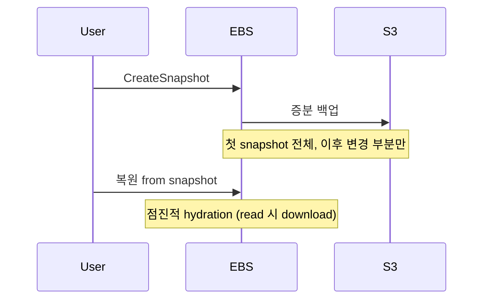

## 정의

| | EBS | Instance Store |
|---|---|---|
| 영속성 | *영속* | *임시* (instance 종료 시 손실) |
| 위치 | 네트워크 attached | 노드 직결 NVMe |
| 분리 | 다른 instance 에 attach 가능 | *불가* |
| Snapshot | *가능* | 불가 |
| 가격 | 매월 | EC2 가격에 포함 |
| Latency | 네트워크 hop | *매우 낮음* |
| 처리량 | 옵션 | 매우 높음 |

## EBS Volume 종류

| 종류 | 용도 | IOPS 한도 | 처리량 |
|---|---|---|---|
| **gp3** (기본) | 일반 | 16,000 (별도 구매로 80k) | 1,000 MB/s |
| **gp2** | 옛 일반 (gp3 권장) | 16,000 | 250 MB/s |
| **io2** | 고성능 | 256,000 | 4,000 MB/s |
| **io2 Block Express** | 극고성능 | 256k+ | 4 GB/s |
| **st1** | throughput HDD (DW) | low | 500 MB/s |
| **sc1** | cold HDD | low | 250 MB/s |

> [!TIP]
> *2026 시점 gp3 가 기본*. gp2 보다 *저렴 + 더 유연*. 새 volume 은 gp3 로.

## gp3 의 *분리 가격*

```
기본: 3,000 IOPS + 125 MB/s 무료
추가: IOPS $0.005/PIOPS-월, 처리량 $0.04/MBps-월
```

> *gp2 는 size 비례 IOPS*. *gp3 는 size 와 IOPS 분리* → 작은 volume + 큰 IOPS 가능.

## Snapshot



- *S3 저장* (지역 안에 복제).
- 증분: 같은 volume 의 *변경 block 만*.
- *Fast Snapshot Restore (FSR)* 옵션: 즉시 full performance.

## Instance Store

```
m6id.large    ← 'd' 가 NVMe 포함
i4i.large     ← 'i' family 가 storage 특화
```

- *intanc instance type 별 고정*.
- *수십 GB ~ 수십 TB NVMe*.
- *극저지연 + 극고처리량*.

### 적합

| 용도 | 이유 |
|---|---|
| Shuffle 데이터 (Spark) | 잠시면 됨 |
| 캐시 (Redis L1) | 다시 채울 수 있음 |
| 임시 build / compile | 빠름 |
| 데이터베이스의 *replica* | 다시 sync 가능 |

### 부적합

| 용도 | 이유 |
|---|---|
| Primary DB 데이터 | instance 종료 시 손실 |
| 사용자 업로드 | 영속 필요 |

## 비교 직관

<ChartJs
  client:visible
  type="bar"
  title="Storage 별 latency vs throughput (직관)"
  caption="Instance Store NVMe 가 압도. EBS gp3 는 균형. S3 는 큰 throughput 가능하지만 latency 큼."
  height="240px"
  data={{
    labels: ['Instance Store NVMe', 'EBS io2', 'EBS gp3', 'EBS st1', 'S3'],
    datasets: [
      {
        label: 'p99 read latency (ms)',
        data: [0.05, 0.4, 1.0, 5, 30],
        backgroundColor: ['#22c55e', '#3b82f6', '#a78bfa', '#f59e0b', '#ef4444'],
      },
    ],
  }}
  options={{
    scales: { y: { type: 'logarithmic', title: { display: true, text: 'ms (log)' } } },
    plugins: { legend: { display: false } },
  }}
/>

## Multi-Attach (io2 만)

```bash
aws ec2 modify-volume --volume-id vol-xxx --multi-attach-enabled
```

- 같은 EBS volume → *여러 EC2 동시 attach* (최대 16개)
- *분산 파일시스템 (GFS2, OCFS2) 필요*. 단순 ext4 가 동시 mount 면 *손상*.

## 흔한 함정

> [!WARNING]
> 1. **gp2 사용 (옛)** = gp3 가 저렴. 마이그레이션 (downtime 없음).
> 2. **Snapshot *지역 간 복제 안 함*** = region 장애 시 손실.
> 3. **Instance Store 를 영속처럼** = stop/start = 데이터 손실 (reboot 은 OK).
> 4. **IOPS *너무 작음*** = 워크로드 IOPS 측정 후 결정.

## 관련 위키

- [[aws-ec2]]
- [[aws-s3]]
- [[wal-write-ahead-log]] (DB fsync 와 EBS)
