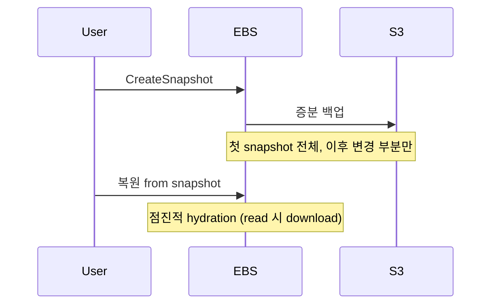
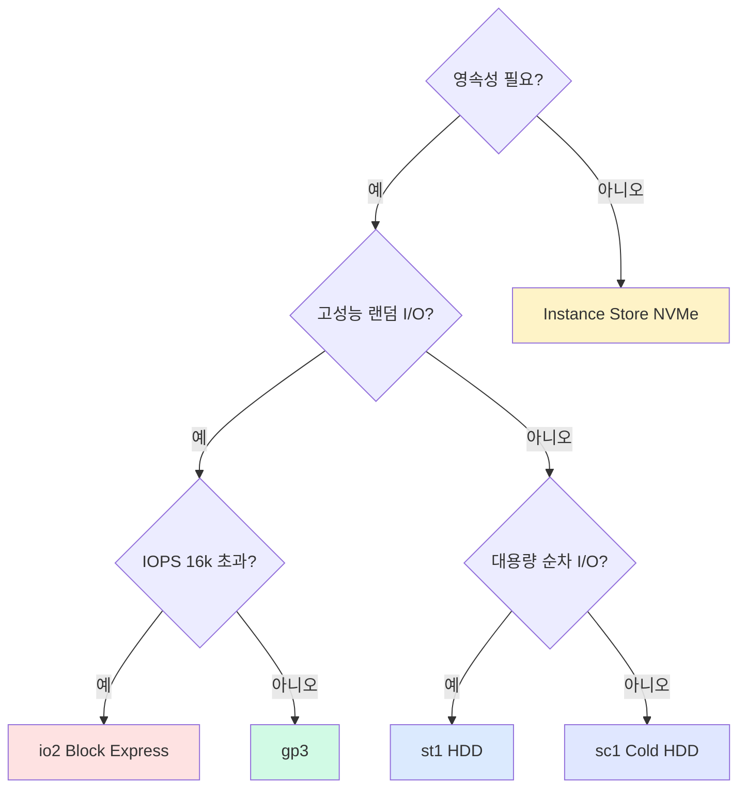
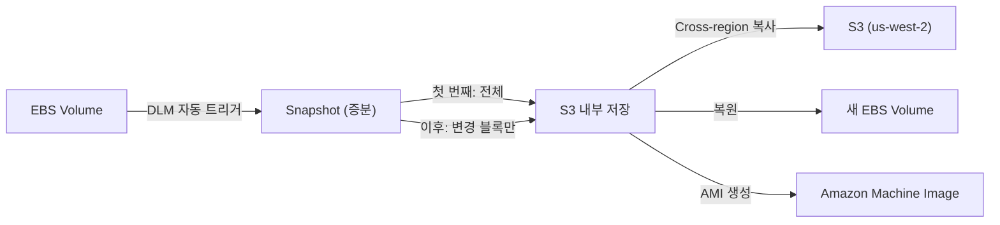

## 정의

| | EBS | Instance Store |
|---|---|---|
| 영속성 | *영속* | *임시* (instance 종료 시 손실) |
| 위치 | 네트워크 attached | 노드 직결 NVMe |
| 분리 | 다른 instance 에 attach 가능 | *불가* |
| Snapshot | *가능* | 불가 |
| 가격 | 매월 | EC2 가격에 포함 |
| Latency | 네트워크 hop | *매우 낮음* |
| 처리량 | 옵션 | 매우 높음 |

## EBS Volume 종류

| 종류 | 용도 | IOPS 한도 | 처리량 |
|---|---|---|---|
| **gp3** (기본) | 일반 | 16,000 (별도 구매로 80k) | 1,000 MB/s |
| **gp2** | 옛 일반 (gp3 권장) | 16,000 | 250 MB/s |
| **io2** | 고성능 | 256,000 | 4,000 MB/s |
| **io2 Block Express** | 극고성능 | 256k+ | 4 GB/s |
| **st1** | throughput HDD (DW) | low | 500 MB/s |
| **sc1** | cold HDD | low | 250 MB/s |

> [!TIP]
> *2026 시점 gp3 가 기본*. gp2 보다 *저렴 + 더 유연*. 새 volume 은 gp3 로.

## gp3 의 *분리 가격*

```
기본: 3,000 IOPS + 125 MB/s 무료
추가: IOPS $0.005/PIOPS-월, 처리량 $0.04/MBps-월
```

> *gp2 는 size 비례 IOPS*. *gp3 는 size 와 IOPS 분리* → 작은 volume + 큰 IOPS 가능.

## Snapshot



- *S3 저장* (지역 안에 복제).
- 증분: 같은 volume 의 *변경 block 만*.
- *Fast Snapshot Restore (FSR)* 옵션: 즉시 full performance.

## Instance Store

```
m6id.large    ← 'd' 가 NVMe 포함
i4i.large     ← 'i' family 가 storage 특화
```

- *intanc instance type 별 고정*.
- *수십 GB ~ 수십 TB NVMe*.
- *극저지연 + 극고처리량*.

### 적합

| 용도 | 이유 |
|---|---|
| Shuffle 데이터 (Spark) | 잠시면 됨 |
| 캐시 (Redis L1) | 다시 채울 수 있음 |
| 임시 build / compile | 빠름 |
| 데이터베이스의 *replica* | 다시 sync 가능 |

### 부적합

| 용도 | 이유 |
|---|---|
| Primary DB 데이터 | instance 종료 시 손실 |
| 사용자 업로드 | 영속 필요 |

## 비교 직관

<ChartJs
  client:visible
  type="bar"
  title="Storage 별 latency vs throughput (직관)"
  caption="Instance Store NVMe 가 압도. EBS gp3 는 균형. S3 는 큰 throughput 가능하지만 latency 큼."
  height="240px"
  data={{
    labels: ['Instance Store NVMe', 'EBS io2', 'EBS gp3', 'EBS st1', 'S3'],
    datasets: [
      {
        label: 'p99 read latency (ms)',
        data: [0.05, 0.4, 1.0, 5, 30],
        backgroundColor: ['#22c55e', '#3b82f6', '#a78bfa', '#f59e0b', '#ef4444'],
      },
    ],
  }}
  options={{
    scales: { y: { type: 'logarithmic', title: { display: true, text: 'ms (log)' } } },
    plugins: { legend: { display: false } },
  }}
/>

## Multi-Attach (io2 만)

```bash
aws ec2 modify-volume --volume-id vol-xxx --multi-attach-enabled
```

- 같은 EBS volume → *여러 EC2 동시 attach* (최대 16개)
- *분산 파일시스템 (GFS2, OCFS2) 필요*. 단순 ext4 가 동시 mount 면 *손상*.

## 스토리지 선택 결정 트리



| 결과 | 주요 용도 |
|:---|:---|
| Instance Store NVMe | Spark shuffle, 캐시, 임시 빌드 |
| io2 Block Express | Oracle RAC, 고성능 OLTP, SAP HANA |
| gp3 | 일반 앱 서버, MySQL/PostgreSQL, OS 디스크 |
| st1 HDD | DW, Kafka, Hadoop, 대용량 스트리밍 |
| sc1 Cold HDD | 아카이브, 콜드 로그, 비용 최소화 |

## EBS 심화: gp3 성능 최적화

gp3 는 크기(GB)와 성능(IOPS/처리량)이 독립적으로 구매됩니다.

```bash
# gp3 볼륨 생성 (IOPS 6,000 + 처리량 500 MB/s 지정)
aws ec2 create-volume \
  --volume-type gp3 \
  --size 500 \
  --iops 6000 \
  --throughput 500 \
  --availability-zone us-east-1a

# 기존 gp2 를 gp3 로 변환 (무중단)
aws ec2 modify-volume \
  --volume-id vol-12345678 \
  --volume-type gp3 \
  --iops 3000 \
  --throughput 125
```

### gp3 vs gp2 비교

| 항목 | gp2 | gp3 |
|:---|:---|:---|
| 기본 IOPS | 볼륨 크기 x 3 (최대 16,000) | 고정 3,000 |
| 추가 IOPS | 불가 (크기만 늘려야 함) | 독립 구매 가능 (최대 16,000) |
| 기본 처리량 | 250 MB/s | 125 MB/s |
| 추가 처리량 | 불가 | 독립 구매 가능 (최대 1,000 MB/s) |
| 요금 | $0.10/GB-월 | $0.08/GB-월 |

> [!TIP]
> gp2 에서 gp3 로 마이그레이션하면 동일 크기 기준 **약 20% 비용 절감**. EC2 재시작 불필요, `ModifyVolume` 호출 즉시 변환 시작.

### io2 선택 기준

```
IOPS 16,000 초과 필요? → io2
Multi-Attach 필요 (복수 EC2)?  → io2
내구성 99.999% 필요 (금융, 의료)? → io2
```

## Snapshot 자동화 (DLM)

**Data Lifecycle Manager (DLM)** 로 스냅샷 일정 자동화:

```json
{
  "ExecutionRoleArn": "arn:aws:iam::123456789012:role/dlm-role",
  "Description": "Daily EBS snapshots - 7day retention",
  "State": "ENABLED",
  "PolicyDetails": {
    "PolicyType": "EBS_SNAPSHOT_MANAGEMENT",
    "ResourceTypes": ["VOLUME"],
    "TargetTags": [{"Key": "Backup", "Value": "true"}],
    "Schedules": [{
      "Name": "Daily",
      "CreateRule": {
        "Interval": 24,
        "IntervalUnit": "HOURS",
        "Times": ["03:00"]
      },
      "RetainRule": {"Count": 7},
      "CopyTags": true,
      "CrossRegionCopyRules": [{
        "TargetRegion": "us-west-2",
        "Encrypted": true,
        "CopyTags": true,
        "RetainRule": {"Count": 3}
      }]
    }]
  }
}
```

- `Backup: true` 태그 달린 볼륨 자동 대상
- 7일 보관 후 자동 삭제
- Cross-region 복사로 DR 확보 (3일 보관)

스냅샷 아키텍처:



> [!WARNING]
> 스냅샷은 S3에 저장되지만 일반 S3 버킷에서는 보이지 않습니다. EC2 콘솔/API 로만 접근 가능.

### Fast Snapshot Restore (FSR)

스냅샷에서 볼륨 복원 시 기본적으로 블록을 lazily 로드합니다 (read 시 S3에서 가져옴). FSR 활성화 시 즉시 full performance.

```bash
aws ec2 enable-fast-snapshot-restores \
  --source-snapshot-ids snap-12345678 \
  --availability-zones us-east-1a us-east-1b
```

FSR 은 AZ 당 요금 발생 ($0.75/snapshot-hour 수준).

## EFS vs S3 대비

| 항목 | EBS | EFS | S3 |
|:---|:---|:---|:---|
| **유형** | 블록 스토리지 | 네트워크 파일시스템 | 객체 스토리지 |
| **동시 접근** | 단일 EC2 | 여러 EC2/Lambda 동시 | 무제한 클라이언트 |
| **OS 마운트** | Linux/Windows | Linux (NFSv4) | SDK/API |
| **Latency** | 1ms 미만 | 수 ms | 수십 ms |
| **최대 크기** | 64 TB/볼륨 | 페타바이트 (자동 확장) | 무제한 |
| **요금 기준** | GB 단위 고정 | GB 사용량 | GB 저장량 + 요청 |
| **주요 용도** | OS, DB, 앱 데이터 | 공유 파일, CMS, 컨테이너 | 정적 자산, 백업, 빅데이터 |

### 선택 가이드

- **단일 EC2의 OS 디스크/DB 데이터**: EBS
- **여러 EC2/컨테이너가 같은 파일 공유**: EFS
- **정적 웹 파일, 로그 아카이브, 데이터 레이크**: S3

## 비용 최적화 패턴

### 1. gp2 볼륨 일괄 gp3 마이그레이션

```bash
# 모든 gp2 볼륨 조회
aws ec2 describe-volumes \
  --filters Name=volume-type,Values=gp2 \
  --query 'Volumes[*].[VolumeId,Size,Iops,AvailabilityZone]' \
  --output table

# 개별 변환
aws ec2 modify-volume \
  --volume-id vol-xxxxxxxx \
  --volume-type gp3
```

### 2. 미사용 볼륨 정리

```bash
# EC2 미연결 볼륨 (available 상태) 조회
aws ec2 describe-volumes \
  --filters Name=status,Values=available \
  --query 'Volumes[*].[VolumeId,Size,CreateTime,AvailabilityZone]' \
  --output table
```

EC2 terminate 후 루트 볼륨은 `DeleteOnTermination=true` (기본값) 이면 자동 삭제. 추가로 attach 한 볼륨은 수동 삭제 필요.

### 3. 스냅샷 비용 관리

- DLM 으로 오래된 스냅샷 자동 삭제
- S3 Intelligent-Tiering 급 아카이브 스냅샷: `aws ec2 modify-snapshot-tier` 로 Archived 상태로 전환 (70% 비용 절감, 복원 24-72시간)

## 흔한 함정

> [!WARNING]
> 1. **gp2 사용 (옛)** = gp3 가 저렴. 마이그레이션 (downtime 없음).
> 2. **Snapshot *지역 간 복제 안 함*** = region 장애 시 손실.
> 3. **Instance Store 를 영속처럼** = stop/start = 데이터 손실 (reboot 은 OK).
> 4. **IOPS *너무 작음*** = 워크로드 IOPS 측정 후 결정.

> [!CAUTION]
> **Multi-Attach io2 + 일반 파일시스템** = 데이터 손상. 반드시 GFS2, OCFS2 같은 cluster-aware 파일시스템 사용.

> [!IMPORTANT]
> **EC2 stop vs reboot**: stop 시 Instance Store 데이터 소멸. reboot 은 보존. 스케줄 유지보수 시 주의.

## 관련 위키

- [[aws-ec2]]
- [[aws-s3]]
- [[aws-rds]]
- [[aws-ec2-instance-types]]
- [[wal-write-ahead-log]] (DB fsync 와 EBS)
