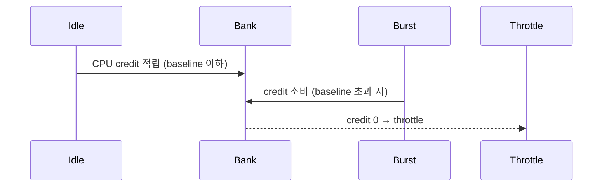
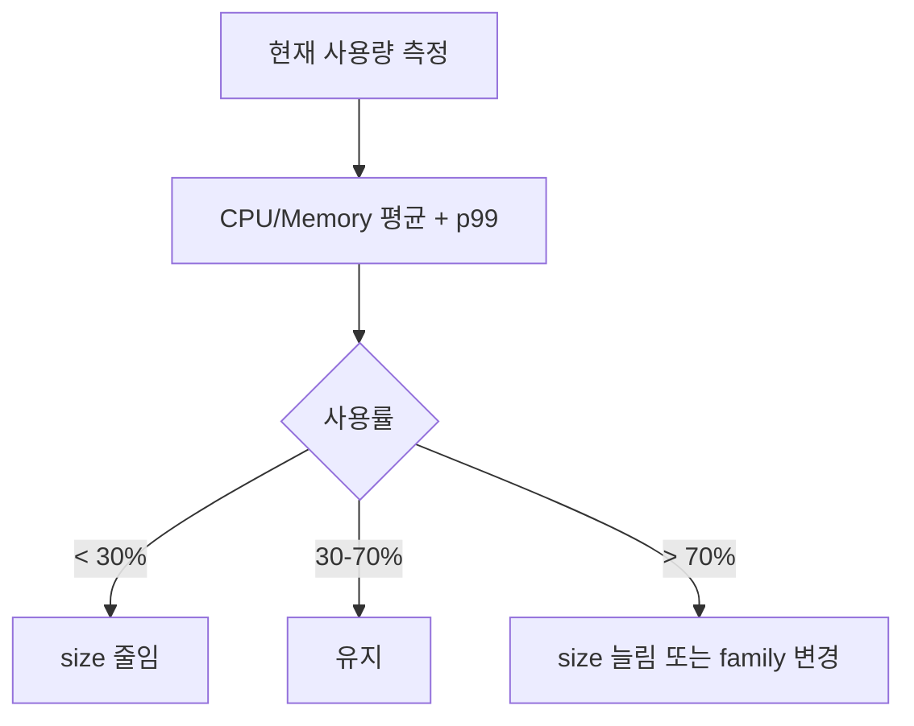
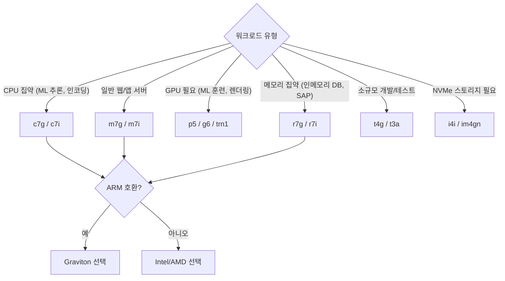

## 정의

EC2 인스턴스 *수백 종*. *family + generation + modifier + size*. 워크로드에 맞춰 *right-sizing*.

## Family

| Family | 용도 | 예 |
|---|---|---|
| **t** | burstable | t4g.micro |
| **m** | general | m7i, m7a, m7g |
| **c** | compute | c7i (CPU 강) |
| **r** | memory | r7i (RAM 강) |
| **x, u** | extreme memory | x2gd (1.5TB+) |
| **i** | storage (NVMe) | i4i |
| **d** | dense HDD | d3 |
| **p, g, inf, trn** | GPU/AI | p5 (H100), trn1 (training) |
| **hpc** | HPC | hpc7g |
| **mac** | macOS | mac2 (Apple Silicon) |

## 세대 + Modifier

```
m7g.large
│ │ │
│ │ └── size
│ └──── generation 7
└────── family + modifier
        m = general
        i = Intel
        a = AMD
        g = Graviton (ARM)
        n = enhanced network
        d = local NVMe
```

| Modifier | 의미 |
|---|---|
| `i` | Intel Xeon |
| `a` | AMD EPYC |
| `g` | AWS Graviton (ARM) |
| `n` | enhanced network |
| `d` | local NVMe SSD |
| `z` | high frequency |
| `e` | extended memory |

## Size

| Size | vCPU (m7i) | RAM |
|---|---|---|
| nano | 2 | 0.5GB |
| micro | 2 | 1GB |
| small | 2 | 2GB |
| medium | 2 | 4GB |
| large | 2 | 8GB |
| xlarge | 4 | 16GB |
| 2xlarge | 8 | 32GB |
| 4xlarge | 16 | 64GB |
| 8xlarge | 32 | 128GB |
| ... | ... | ... |
| 48xlarge | 192 | 768GB |

## Graviton vs Intel vs AMD (비용 비교)

<ChartJs
  client:visible
  type="bar"
  title="m7 family, 같은 size 의 시간당 비용 (직관)"
  caption="Graviton 이 가장 저렴 + 비슷한 성능. 새 워크로드는 Graviton 우선."
  height="240px"
  data={{
    labels: ['m7i (Intel)', 'm7a (AMD)', 'm7g (Graviton ARM)'],
    datasets: [
      {
        label: '시간당 비용 (USD)',
        data: [0.1008, 0.0921, 0.0816],
        backgroundColor: ['#3b82f6', '#a78bfa', '#22c55e'],
      },
    ],
  }}
  options={{
    scales: { y: { title: { display: true, text: 'USD/h' }, beginAtZero: true } },
    plugins: { legend: { display: false } },
  }}
/>

## Burstable (t family) 의 CPU Credit



| 타입 | Baseline CPU |
|---|---|
| t4g.nano | 5% |
| t4g.micro | 10% |
| t4g.small | 20% |
| t4g.medium | 20% (2 vCPU) |

> [!CAUTION]
> *지속적 부하* 에 burstable 사용 = credit 소진 → baseline 으로 throttle. *unlimited 모드* 또는 *m family*.

## Right-sizing



도구:

- AWS Compute Optimizer (자동 권장)
- CloudWatch metric
- 3rd-party (CloudHealth, Spot.io)

## Nitro

AWS 의 *경량 하이퍼바이저*. *모든 새 generation* (>= 2018) 이 Nitro. 거의 *bare-metal 성능*.

특징:

- 빠른 시작
- *Nitro Enclaves* (격리 컴퓨팅, 민감 데이터 처리)
- *Nitro SSD* (NVMe)
- 네트워크 / 스토리지 *전용 카드*

## Spot 인스턴스 심화

Spot 은 미사용 EC2 용량을 최대 90% 할인에 제공. 단, AWS 가 언제든 회수 가능 (2분 경고).


### Spot 적합/부적합 워크로드

| 적합 | 부적합 |
|:---|:---|
| 배치 처리, 렌더링 | 프로덕션 웹 서버 단독 |
| 빅데이터 처리 (Spark, EMR) | 실시간 DB Primary |
| CI/CD 빌드 | 상태 유지 워크로드 |
| ML 훈련 (체크포인트 지원 시) | 종료 허용 안 되는 작업 |

### Spot 중단 처리

```python
import requests
import time

def check_spot_interruption():
    """EC2 instance metadata 로 종료 2분 전 알림 확인"""
    try:
        r = requests.get(
            "http://169.254.169.254/latest/meta-data/spot/termination-time",
            timeout=1
        )
        if r.status_code == 200:
            print(f"Spot termination at: {r.text}")
            # 체크포인트 저장, graceful shutdown 처리
            return True
    except Exception:
        pass
    return False

while True:
    if check_spot_interruption():
        # 상태 저장, 작업 큐에 반환 등
        break
    time.sleep(5)
```

### Spot Fleet / EC2 Fleet

```yaml
SpotFleet:
  SpotFleetRequestConfig:
    AllocationStrategy: diversified
    TargetCapacity: 10
    LaunchSpecifications:
      - InstanceType: m7i.large
        SubnetId: subnet-a
      - InstanceType: m7a.large
        SubnetId: subnet-b
      - InstanceType: m6i.large
        SubnetId: subnet-c
```

`diversified` 전략: 여러 인스턴스 타입과 AZ 에 분산 → 대규모 중단 위험 감소.

## Placement Groups

인스턴스 배치를 제어해 성능 또는 가용성 최적화.

| 유형 | 목적 | 특성 |
|:---|:---|:---|
| **Cluster** | 최저 레이턴시, 최고 처리량 | 같은 AZ, 같은 랙. HPC/ML 훈련 |
| **Spread** | 최고 가용성 | AZ 별 다른 랙. 중요 인스턴스 격리 |
| **Partition** | 대규모 분산 | AZ 내 파티션 격리. Kafka, Cassandra, HDFS |

```bash
# Cluster Placement Group 생성 (HPC)
aws ec2 create-placement-group \
  --group-name hpc-cluster \
  --strategy cluster

# 인스턴스를 그룹에 배치
aws ec2 run-instances \
  --placement GroupName=hpc-cluster \
  ...
```

> [!CAUTION]
> Cluster Placement Group 은 단일 AZ 내 단일 랙. 랙 장애 시 전체 그룹 영향. 중요 프로덕션 워크로드에는 Spread 사용.

## 워크로드별 인스턴스 선택 가이드



## 요금 모델 비교

| 모델 | 할인율 | 유연성 | 적합 |
|:---|:---|:---|:---|
| **On-Demand** | 기준 | 최고 (즉시 시작/종료) | 단기, 예측 불가 |
| **Reserved (1년)** | 약 30-40% | 낮음 (1년 약정) | 안정적 베이스라인 |
| **Reserved (3년)** | 약 60-70% | 매우 낮음 | 장기 고정 워크로드 |
| **Savings Plans** | Reserved 유사 | 중간 (패밀리/리전 유연) | 다양한 인스턴스 타입 |
| **Spot** | 최대 90% | 중간 (회수 가능) | 내결함성 배치 |
| **Dedicated Host** | 없음 | 낮음 | 라이센스, 규정 준수 |

### Savings Plans vs Reserved Instances

| 항목 | Reserved Instances | Compute Savings Plans |
|:---|:---|:---|
| 약정 단위 | 특정 인스턴스 타입/리전 | 특정 금액 (시간당) |
| 인스턴스 변경 | 불가 (Convertible RI 제외) | 가능 (패밀리, OS, 리전) |
| 관리 복잡성 | 높음 | 낮음 |
| 권장 | 패밀리 고정 대용량 | 유연한 현대적 아키텍처 |

## Graviton 마이그레이션 체크리스트

```bash
# 1. 아키텍처 호환성 확인 (컨테이너)
docker inspect --format='{{.Architecture}}' my-image
# 결과: amd64 (x86) → 마이그레이션 필요, arm64 → 즉시 사용 가능

# 2. 멀티 아키텍처 이미지 빌드 (Docker Buildx)
docker buildx build \
  --platform linux/amd64,linux/arm64 \
  -t myrepo/myapp:latest \
  --push .

# 3. Graviton 인스턴스 테스트 배포
aws ec2 run-instances \
  --instance-type m7g.large \
  --image-id ami-xxxx-arm64 \
  ...
```

**주의 사항**:
- 컴파일 언어 (Go, Java, Python): 대부분 arm64 바이너리 자동 생성 또는 패키지 제공
- 인라인 어셈블리 코드: x86 전용이면 이식 필요
- 서드파티 라이브러리: arm64 지원 여부 확인

## 흔한 함정

> [!WARNING]
> 1. **새 워크로드를 *Intel 만*** = Graviton 비용 절감 기회 놓침.
> 2. **t family 의 *지속 부하*** = credit 소진 + throttle.
> 3. **너무 큰 size** = 비용 폭증. *right-sizing 정기*.
> 4. **잘못된 family** = 메모리 워크로드에 c family → swap 폭증.

> [!CAUTION]
> **Spot 단독 프로덕션**: 중단 시 서비스 다운. ASG 에서 On-Demand 최소값 설정 필수.

> [!IMPORTANT]
> **Compute Optimizer 활용**: AWS 가 CloudWatch 지표 기반으로 right-sizing 자동 권장. 매달 리포트 확인으로 비용 최적화 지속.

## 관련 위키

- [[aws-ec2]]
- [[aws-ebs-vs-instance-store]]
- [[aws-auto-scaling]]
- [[aws-ecs-fargate]]
- [[aws-eks]]
