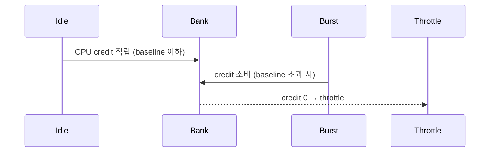
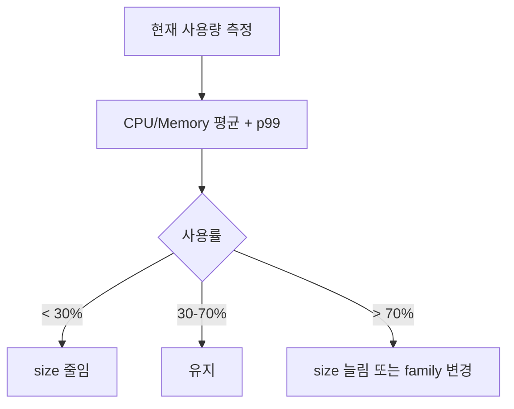

## 정의

EC2 인스턴스 *수백 종*. *family + generation + modifier + size*. 워크로드에 맞춰 *right-sizing*.

## Family

| Family | 용도 | 예 |
|---|---|---|
| **t** | burstable | t4g.micro |
| **m** | general | m7i, m7a, m7g |
| **c** | compute | c7i (CPU 강) |
| **r** | memory | r7i (RAM 강) |
| **x, u** | extreme memory | x2gd (1.5TB+) |
| **i** | storage (NVMe) | i4i |
| **d** | dense HDD | d3 |
| **p, g, inf, trn** | GPU/AI | p5 (H100), trn1 (training) |
| **hpc** | HPC | hpc7g |
| **mac** | macOS | mac2 (Apple Silicon) |

## 세대 + Modifier

```
m7g.large
│ │ │
│ │ └── size
│ └──── generation 7
└────── family + modifier
        m = general
        i = Intel
        a = AMD
        g = Graviton (ARM)
        n = enhanced network
        d = local NVMe
```

| Modifier | 의미 |
|---|---|
| `i` | Intel Xeon |
| `a` | AMD EPYC |
| `g` | AWS Graviton (ARM) |
| `n` | enhanced network |
| `d` | local NVMe SSD |
| `z` | high frequency |
| `e` | extended memory |

## Size

| Size | vCPU (m7i) | RAM |
|---|---|---|
| nano | 2 | 0.5GB |
| micro | 2 | 1GB |
| small | 2 | 2GB |
| medium | 2 | 4GB |
| large | 2 | 8GB |
| xlarge | 4 | 16GB |
| 2xlarge | 8 | 32GB |
| 4xlarge | 16 | 64GB |
| 8xlarge | 32 | 128GB |
| ... | ... | ... |
| 48xlarge | 192 | 768GB |

## Graviton vs Intel vs AMD (비용 비교)

<ChartJs
  client:visible
  type="bar"
  title="m7 family, 같은 size 의 시간당 비용 (직관)"
  caption="Graviton 이 가장 저렴 + 비슷한 성능. 새 워크로드는 Graviton 우선."
  height="240px"
  data={{
    labels: ['m7i (Intel)', 'm7a (AMD)', 'm7g (Graviton ARM)'],
    datasets: [
      {
        label: '시간당 비용 (USD)',
        data: [0.1008, 0.0921, 0.0816],
        backgroundColor: ['#3b82f6', '#a78bfa', '#22c55e'],
      },
    ],
  }}
  options={{
    scales: { y: { title: { display: true, text: 'USD/h' }, beginAtZero: true } },
    plugins: { legend: { display: false } },
  }}
/>

## Burstable (t family) 의 CPU Credit



| 타입 | Baseline CPU |
|---|---|
| t4g.nano | 5% |
| t4g.micro | 10% |
| t4g.small | 20% |
| t4g.medium | 20% (2 vCPU) |

> [!CAUTION]
> *지속적 부하* 에 burstable 사용 = credit 소진 → baseline 으로 throttle. *unlimited 모드* 또는 *m family*.

## Right-sizing



도구:

- AWS Compute Optimizer (자동 권장)
- CloudWatch metric
- 3rd-party (CloudHealth, Spot.io)

## Nitro

AWS 의 *경량 하이퍼바이저*. *모든 새 generation* (>= 2018) 이 Nitro. 거의 *bare-metal 성능*.

특징:

- 빠른 시작
- *Nitro Enclaves* (격리 컴퓨팅)
- *Nitro SSD* (NVMe)
- 네트워크 / 스토리지 *전용 카드*

## 흔한 함정

> [!WARNING]
> 1. **새 워크로드를 *Intel 만*** = Graviton 비용 절감 기회 놓침.
> 2. **t family 의 *지속 부하*** = credit 소진 + throttle.
> 3. **너무 큰 size** = 비용 폭증. *right-sizing 정기*.
> 4. **잘못된 family** = 메모리 워크로드에 c family → swap 폭증.

## 관련 위키

- [[aws-ec2]]
- [[aws-ebs-vs-instance-store]]
- [[aws-auto-scaling]]
