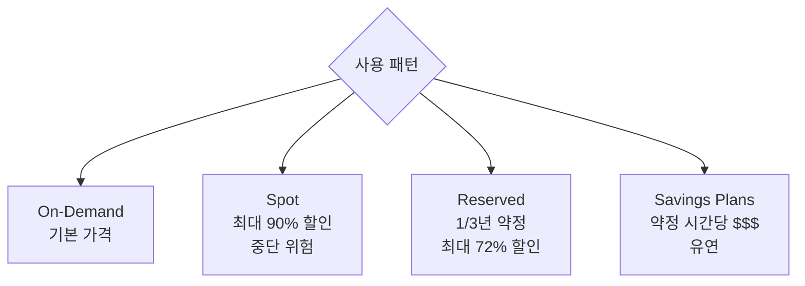
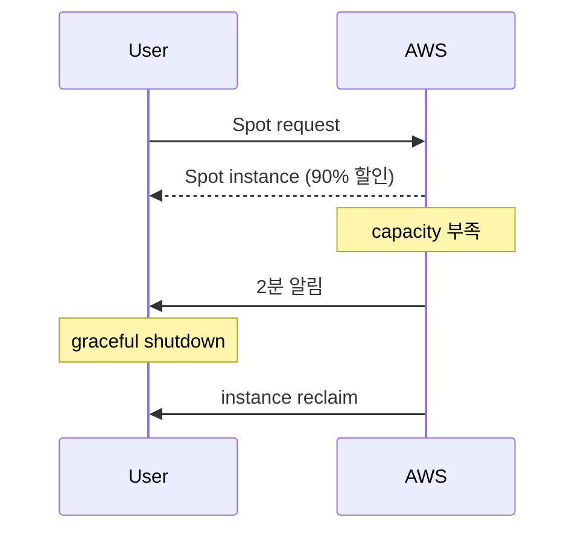

## 정의

**EC2 (Elastic Compute Cloud)** = AWS 의 *VM 서비스*. *instance type* (CPU / RAM / NW) 결정 + *AMI* (OS 이미지) + *EBS* (스토리지).

## 인스턴스 타입 명명

```
m6i.large
│ │ │
│ │ └── size (nano, micro, small, medium, large, xlarge, 2xlarge, ...)
│ └──── generation modifier (i=Intel, a=AMD, g=Graviton ARM, n=network, ...)
└────── family (m=general, c=compute, r=memory, x=extreme memory, p=GPU, ...)
        세대 (6 = 6세대)
```

| Family | 용도 |
|---|---|
| `t` | burstable (가벼운 워크로드) |
| `m` | general purpose |
| `c` | compute optimized |
| `r` | memory optimized |
| `x`/`u` | high memory |
| `i` | storage optimized (NVMe) |
| `d` | dense HDD |
| `p`/`g`/`inf`/`trn` | GPU / AI accelerator |

## Graviton (ARM) vs Intel/AMD

| | Intel (`m7i`) | AMD (`m7a`) | Graviton (`m7g`) |
|---|---|---|---|
| 아키텍처 | x86-64 | x86-64 | ARM64 |
| 가격 (vs Intel) | 1.0× | ~0.9× | *~0.8×* |
| 성능 (workload) | 기준 | 비슷 | *비슷 또는 우수* |
| 호환성 | 모든 OS | 모든 OS | ARM 빌드 필요 |

> [!IMPORTANT]
> *2026 시점 Graviton (ARM) 이 비용 효율 최강*. 모든 새 워크로드는 *ARM 호환 빌드부터*.

## Purchase Options



| 옵션 | 할인 | 적합 |
|---|---|---|
| On-Demand | 0% | 임시 / 테스트 |
| Spot | 60-90% | *batch, stateless, K8s worker* |
| Reserved Instances | 40-72% | 안정 워크로드 |
| Savings Plans | 25-72% | 가장 유연 |
| Dedicated Host | 비쌈 | 컴플라이언스 |

## Spot Instance



> [!TIP]
> Karpenter / EKS managed node group 의 *spot* + *on-demand* 혼합이 *2026 표준*. 비용 60%+ 절감.

## AMI (Amazon Machine Image)

```bash
aws ec2 describe-images --owners amazon --filters \
  "Name=name,Values=al2023-ami-*-x86_64" \
  "Name=state,Values=available"
```

| 옵션 | 의미 |
|---|---|
| Amazon Linux 2023 | AWS 최신 |
| Ubuntu LTS | 가장 흔함 |
| Bottlerocket | container 전용 (EKS) |
| Custom AMI | Packer 로 빌드 |
| Marketplace | RHEL, Windows, 3rd-party |

## User Data (부팅 스크립트)

```bash
#!/bin/bash
yum update -y
yum install -y nginx
systemctl enable --now nginx
```

EC2 부팅 시 *1회 실행*. *cloud-init* 기반.

## Instance Metadata Service (IMDS)

```bash
TOKEN=$(curl -X PUT "http://169.254.169.254/latest/api/token" \
  -H "X-aws-ec2-metadata-token-ttl-seconds: 21600")
curl -H "X-aws-ec2-metadata-token: $TOKEN" \
  http://169.254.169.254/latest/meta-data/instance-id
```

> [!CAUTION]
> *IMDSv2 (token 필수)* 가 SSRF 공격 방어. *IMDSv1 비활성* 강력 권장.

## 흔한 함정

> [!WARNING]
> 1. **`t` family 의 CPU credit** = burst 후 *credit 소진* 시 *baseline* 으로 떨어짐 → 느려짐. unlimited 모드 또는 다른 family.
> 2. **Spot 의 갑작스런 중단** = stateful 워크로드 금지. checkpoint + retry.
> 3. **AMI 가 오래됨** = 보안 패치 없음. 정기 *AMI rebake* + AMI ID 자동화.
> 4. **EBS 만 보고 *instance store* 무시** = NVMe 의 *극도로 빠른 임시 스토리지*. 캐시 / shuffle 용.

## 관련 위키

- [[aws-vpc]]
- [[aws-ebs-vs-instance-store]]
- [[aws-iam]]
- [[aws-auto-scaling]]
