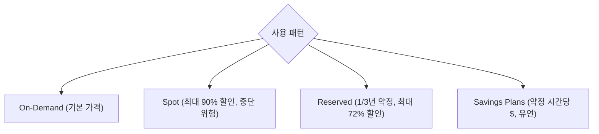
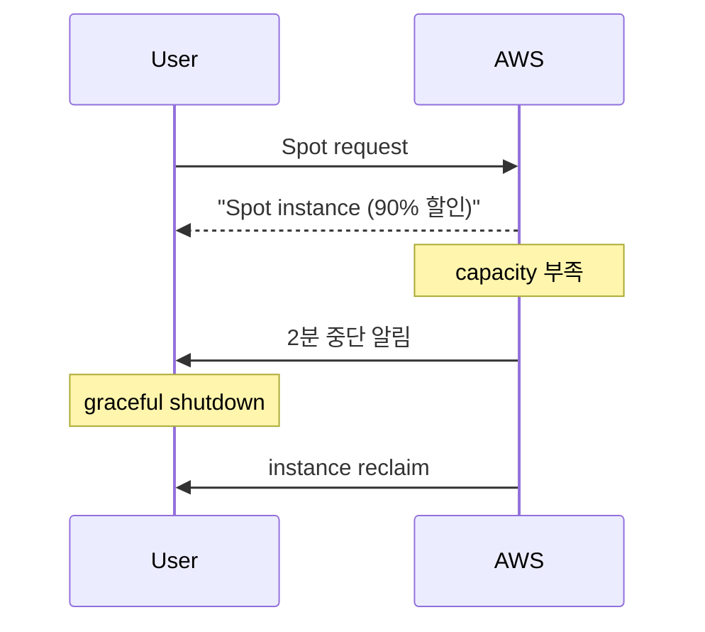

## 정의

**EC2 (Elastic Compute Cloud)** = AWS 의 *VM 서비스*. *instance type* (CPU / RAM / NW) 결정 + *AMI* (OS 이미지) + *EBS* (스토리지).

## 사용 상황

| 상황 | 선택 |
|---|---|
| 웹 서버, 앱 서버 | m/c family On-Demand |
| 비용 절감 (예측 가능 트래픽) | Reserved / Savings Plans |
| 배치, 비동기 처리, CI | Spot Instance |
| GPU 딥러닝 학습 | p/g family |
| 고메모리 DB 인스턴스 | r/x family |
| 로컬 NVMe 캐시 필요 | i family |
| 컨테이너 worker node | m/c Graviton + Spot |

## 인스턴스 타입 명명

```
m6i.large
│ │ │
│ │ └── size (nano, micro, small, medium, large, xlarge, 2xlarge, ...)
│ └──── generation modifier (i=Intel, a=AMD, g=Graviton ARM, n=network, ...)
└────── family (m=general, c=compute, r=memory, x=extreme memory, p=GPU, ...)
        세대 (6 = 6세대)
```

| Family | 용도 |
|---|---|
| `t` | burstable (가벼운 워크로드) |
| `m` | general purpose |
| `c` | compute optimized |
| `r` | memory optimized |
| `x`/`u` | high memory |
| `i` | storage optimized (NVMe) |
| `d` | dense HDD |
| `p`/`g`/`inf`/`trn` | GPU / AI accelerator |

## Graviton (ARM) vs Intel/AMD

| | Intel (`m7i`) | AMD (`m7a`) | Graviton (`m7g`) |
|---|---|---|---|
| 아키텍처 | x86-64 | x86-64 | ARM64 |
| 가격 (vs Intel) | 1.0x | ~0.9x | *~0.8x* |
| 성능 (workload) | 기준 | 비슷 | *비슷 또는 우수* |
| 호환성 | 모든 OS | 모든 OS | ARM 빌드 필요 |

> [!IMPORTANT]
> *2026 시점 Graviton (ARM) 이 비용 효율 최강*. 모든 새 워크로드는 *ARM 호환 빌드부터*.

## Purchase Options



| 옵션 | 할인 | 적합 |
|---|---|---|
| On-Demand | 0% | 임시 / 테스트 |
| Spot | 60-90% | *batch, stateless, K8s worker* |
| Reserved Instances | 40-72% | 안정 워크로드 |
| Savings Plans | 25-72% | 가장 유연 |
| Dedicated Host | 비쌈 | 컴플라이언스 |

## Spot Instance



> [!TIP]
> Karpenter / EKS managed node group 의 *spot* + *on-demand* 혼합이 *2026 표준*. 비용 60%+ 절감.

## AMI (Amazon Machine Image)

```bash
aws ec2 describe-images --owners amazon --filters \
  "Name=name,Values=al2023-ami-*-x86_64" \
  "Name=state,Values=available"
```

| 옵션 | 의미 |
|---|---|
| Amazon Linux 2023 | AWS 최신 |
| Ubuntu LTS | 가장 흔함 |
| Bottlerocket | container 전용 (EKS) |
| Custom AMI | Packer 로 빌드 |
| Marketplace | RHEL, Windows, 3rd-party |

## User Data (부팅 스크립트)

```bash
#!/bin/bash
yum update -y
yum install -y nginx
systemctl enable --now nginx
```

EC2 부팅 시 *1회 실행*. *cloud-init* 기반.

## Instance Metadata Service (IMDS)

```bash
TOKEN=$(curl -X PUT "http://169.254.169.254/latest/api/token" \
  -H "X-aws-ec2-metadata-token-ttl-seconds: 21600")
curl -H "X-aws-ec2-metadata-token: $TOKEN" \
  http://169.254.169.254/latest/meta-data/instance-id
```

> [!CAUTION]
> *IMDSv2 (token 필수)* 가 SSRF 공격 방어. *IMDSv1 비활성* 강력 권장.

## EBS Volume 타입

| 타입 | 용도 | 최대 IOPS | 최대 처리량 |
|---|---|---|---|
| `gp3` | 범용 SSD (기본 권장) | 16,000 | 1,000 MB/s |
| `gp2` | 범용 SSD (구형) | 16,000 | 250 MB/s |
| `io2 Block Express` | 고성능 DB | 256,000 | 4,000 MB/s |
| `io1` | 고성능 (구형) | 64,000 | 1,000 MB/s |
| `st1` | 순차 처리량 HDD | 500 | 500 MB/s |
| `sc1` | 저비용 콜드 HDD | 250 | 250 MB/s |

```bash
# gp2 -> gp3 마이그레이션 (비용 20% 절감)
aws ec2 modify-volume \
  --volume-id vol-xxxx \
  --volume-type gp3 \
  --iops 3000 \
  --throughput 125
```

> `gp3` 는 IOPS/처리량을 독립적으로 설정. gp2 의 IOPS 연동 방식보다 유연하고 저렴.

## Security Group

EC2 인바운드/아웃바운드 트래픽 제어. Stateful (응답 자동 허용).

```bash
# Security Group 생성
aws ec2 create-security-group \
  --group-name web-sg \
  --description "Web Server SG" \
  --vpc-id vpc-xxxx

# 규칙 추가
aws ec2 authorize-security-group-ingress \
  --group-id sg-xxxx \
  --protocol tcp --port 443 --cidr 0.0.0.0/0

# SG 간 참조 (내부 통신)
aws ec2 authorize-security-group-ingress \
  --group-id sg-db \
  --protocol tcp --port 5432 \
  --source-group sg-app   # IP 아닌 SG 참조
```

> SG 간 참조는 IP 변경에 강건. 앱 SG → DB SG 패턴 필수.

## Systems Manager Session Manager

SSH 포트 없이 인스턴스 접속. IAM 기반 접근 제어.

```bash
# SSM으로 접속 (22 포트 불필요)
aws ssm start-session --target i-xxxx

# 포트 포워딩 (로컬 DB 접근)
aws ssm start-session \
  --target i-xxxx \
  --document-name AWS-StartPortForwardingSession \
  --parameters '{"portNumber":["5432"],"localPortNumber":["15432"]}'
```

필요 IAM 권한:

```json
{
  "Action": [
    "ssm:StartSession",
    "ssm:TerminateSession",
    "ec2:DescribeInstances"
  ],
  "Resource": "arn:aws:ec2:*:*:instance/*"
}
```

> [!TIP]
> 배스천 호스트 제거 가능. CloudTrail + Session Manager 로그로 모든 접속 감사.

## Placement Groups

| 타입 | 특성 | 사용 |
|---|---|---|
| Cluster | 같은 AZ, 낮은 latency | HPC, 분산 캐시 |
| Spread | 다른 하드웨어, HA | 소수의 중요 인스턴스 |
| Partition | 파티션별 격리 | Hadoop, Kafka, Cassandra |

```bash
aws ec2 create-placement-group \
  --group-name hpc-cluster \
  --strategy cluster

aws ec2 run-instances \
  --placement '{"GroupName":"hpc-cluster"}' \
  ...
```

## CloudWatch 모니터링

기본 메트릭 (5분 간격, 무료):

| 메트릭 | 의미 |
|---|---|
| `CPUUtilization` | CPU 사용률 |
| `NetworkIn`/`Out` | 네트워크 트래픽 |
| `DiskReadOps`/`WriteOps` | 디스크 I/O |
| `StatusCheckFailed` | 인스턴스/시스템 장애 |

상세 메트릭 (1분 간격, 유료):

```bash
aws ec2 monitor-instances --instance-ids i-xxxx
```

메모리/디스크 사용률은 CloudWatch Agent 설치 필요:

```bash
# Agent 설치 (Amazon Linux)
sudo yum install -y amazon-cloudwatch-agent
sudo /opt/aws/amazon-cloudwatch-agent/bin/amazon-cloudwatch-agent-config-wizard
```

## Auto Recovery

하드웨어 장애 시 자동 재시작 (같은 EIP, 동일 인스턴스 ID).

```bash
aws cloudwatch put-metric-alarm \
  --alarm-name ec2-auto-recover \
  --namespace AWS/EC2 \
  --metric-name StatusCheckFailed_System \
  --statistic Maximum --period 60 --evaluation-periods 2 \
  --comparison-operator GreaterThanOrEqualToThreshold \
  --threshold 1 \
  --alarm-actions arn:aws:automate:us-east-1:ec2:recover
```

## 흔한 함정

> [!WARNING]
> 1. **`t` family 의 CPU credit** = burst 후 *credit 소진* 시 *baseline* 으로 떨어짐 → 느려짐. unlimited 모드 또는 다른 family.
> 2. **Spot 의 갑작스런 중단** = stateful 워크로드 금지. checkpoint + retry.
> 3. **AMI 가 오래됨** = 보안 패치 없음. 정기 *AMI rebake* + AMI ID 자동화.
> 4. **EBS 만 보고 *instance store* 무시** = NVMe 의 *극도로 빠른 임시 스토리지*. 캐시 / shuffle 용.
> 5. **gp2 를 아직 사용** = gp3 가 20% 저렴하고 더 유연. 모든 gp2 를 gp3 로 마이그레이션 권장.
> 6. **SSH 22 포트 열어둠** = SSM Session Manager 로 대체. SG 에서 22 포트 닫기.
> 7. **IMDSv1 비활성 안 함** = SSRF 취약점 시 IAM credentials 탈취. 모든 인스턴스 IMDSv2 강제.
> 8. **Spot 인스턴스 2분 알림 미처리** = IMDS에서 중단 알림 폴링하거나 EventBridge로 graceful shutdown 구현.

## 관련 위키

- [[aws-vpc]]
- [[aws-ebs-vs-instance-store]]
- [[aws-iam]]
- [[aws-auto-scaling]]
- [[aws-cloudwatch]]
- [[aws-eks]]
- [[aws-sg-vs-nacl]]
