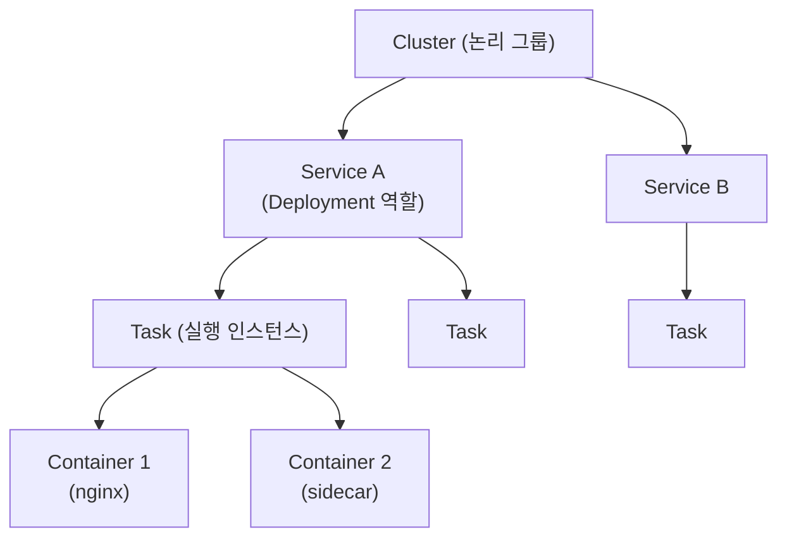
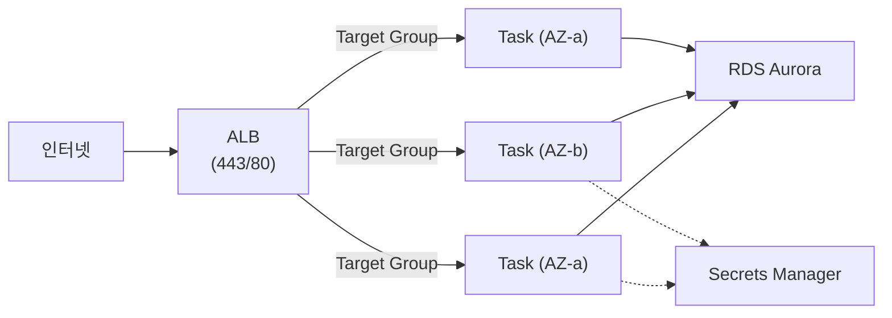
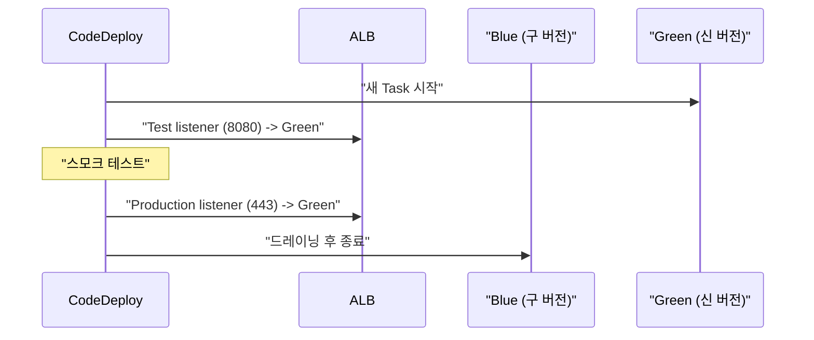

## 정의

**ECS (Elastic Container Service)** = AWS 의 *컨테이너 오케스트레이션*. K8s 보다 단순하고 AWS 네이티브.

**Fargate** = ECS (또는 EKS) 의 *서버리스 실행 환경*. EC2 인스턴스 관리 없이 Task 단위 vCPU/Memory 예약 + 과금.

## ECS 계층 구조



| 객체 | 역할 | K8s 비교 |
|:---|:---|:---|
| **Cluster** | 논리 그룹 (EC2 / Fargate 혼합 가능) | Cluster |
| **Task Definition** | 컨테이너 스펙 (버전 관리됨) | Pod spec (manifiest) |
| **Task** | 실행 중인 Task Definition 인스턴스 | Pod |
| **Service** | desired count 유지, LB 통합, 롤링 배포 | Deployment |

## Task Definition 상세

```json
{
  "family": "web",
  "networkMode": "awsvpc",
  "requiresCompatibilities": ["FARGATE"],
  "cpu": "512",
  "memory": "1024",
  "executionRoleArn": "arn:aws:iam::123:role/ecsTaskExecutionRole",
  "taskRoleArn": "arn:aws:iam::123:role/ecsTaskRole",
  "containerDefinitions": [
    {
      "name": "web",
      "image": "123.dkr.ecr.us-east-1.amazonaws.com/web:latest",
      "portMappings": [{ "containerPort": 8080, "protocol": "tcp" }],
      "environment": [
        { "name": "APP_ENV", "value": "production" }
      ],
      "secrets": [
        { "name": "DB_PASSWORD", "valueFrom": "arn:aws:secretsmanager:us-east-1:123:secret:prod/db" }
      ],
      "logConfiguration": {
        "logDriver": "awslogs",
        "options": {
          "awslogs-group": "/ecs/web",
          "awslogs-region": "us-east-1",
          "awslogs-stream-prefix": "ecs"
        }
      },
      "healthCheck": {
        "command": ["CMD-SHELL", "curl -f http://localhost:8080/health || exit 1"],
        "interval": 30,
        "timeout": 5,
        "retries": 3
      }
    }
  ]
}
```

**IAM Role 두 가지 구분**:
- `executionRoleArn`: ECS agent 가 ECR 이미지 pull, CloudWatch 로그 쓰기에 사용
- `taskRoleArn`: 컨테이너 내 앱이 AWS 서비스 (DynamoDB, S3 등) 접근에 사용

## Fargate vs EC2 Launch Type

| 항목 | EC2 Launch Type | Fargate |
|:---|:---|:---|
| 노드 관리 | *사용자 직접 관리* | *AWS 관리* |
| 운영 부담 | 패치, 스케일링, AMI | *없음* |
| 가격 모델 | EC2 인스턴스 시간 | Task vCPU + Memory 시간 |
| 비용 (대규모) | *저렴 (밀도 최적화)* | 일반적으로 비쌈 |
| GPU 지원 | *가능* | 일부만 |
| 호스트 접근 | SSH 가능 | *불가* |
| 시작 속도 | 빠름 (사전 프로비전) | 약간 느림 (콜드 스타트) |
| Spot 사용 | *가능* | Fargate Spot |
| 적합 | 비용 최적화, GPU, 밀도 | 운영 단순화, 변동 워크로드 |

> [!TIP]
> 소규모 팀 / 운영 부담 최소화 = **Fargate**. 대규모 / 비용 최적화 = **EC2 Launch Type** (Bin packing).

## Fargate 가격 구조

```
vCPU 시간: $0.04048/vCPU/시간
Memory:    $0.004445/GB/시간

예: 0.5 vCPU + 1 GB Memory, 720시간/월
  = (0.5 * $0.04048 * 720) + (1 * $0.004445 * 720)
  = $14.57 + $3.20 = ~$17.77/월
```

**Fargate Spot**: 70% 할인. 2분 사전 통지 후 중단 가능. Stateless/Batch 에 적합.

## Service 설정 (Deployment)

```yaml
service:
  cluster: prod
  taskDefinition: "web:42"
  desiredCount: 3
  launchType: FARGATE
  networkConfiguration:
    awsvpcConfiguration:
      subnets: [subnet-private-a, subnet-private-b]
      securityGroups: [sg-app]
      assignPublicIp: DISABLED
  loadBalancers:
    - targetGroupArn: "arn:aws:elasticloadbalancing:..."
      containerName: web
      containerPort: 8080
  deploymentConfiguration:
    minimumHealthyPercent: 100    # 롤링 중 최소 가용 비율
    maximumPercent: 200           # 롤링 중 최대 Task 수
  deploymentController:
    type: ECS                     # 기본 (CODE_DEPLOY 로 Blue/Green 가능)
```

## ALB 통합 아키텍처



- ALB 가 Task IP 를 직접 Target 으로 등록 (`awsvpc` network mode)
- Service 가 새 Task 등록 / 구 Task 드레이닝 자동 처리
- Draining 기간: 기본 300초 (graceful shutdown)

## Service Auto Scaling

```bash
# Target Tracking (권장)
aws application-autoscaling register-scalable-target \
  --service-namespace ecs \
  --resource-id "service/prod/web" \
  --scalable-dimension ecs:service:DesiredCount \
  --min-capacity 2 \
  --max-capacity 20

aws application-autoscaling put-scaling-policy \
  --policy-name "cpu-tracking" \
  --service-namespace ecs \
  --resource-id "service/prod/web" \
  --scalable-dimension ecs:service:DesiredCount \
  --policy-type TargetTrackingScaling \
  --target-tracking-scaling-policy-configuration '{
    "TargetValue": 70.0,
    "PredefinedMetricSpecification": {
      "PredefinedMetricType": "ECSServiceAverageCPUUtilization"
    },
    "ScaleInCooldown": 300,
    "ScaleOutCooldown": 30
  }'
```

| 스케일링 타입 | 특성 | 사용 케이스 |
|:---|:---|:---|
| Target Tracking | 목표값 유지 자동 | *기본 선택* (CPU 70% 유지) |
| Step Scaling | 지표 임계값별 단계 | 정밀 제어 필요 시 |
| Scheduled | 시간표 기반 | 예측 가능한 트래픽 패턴 |

## ECR 연동

```bash
# ECR 로그인
aws ecr get-login-password --region us-east-1 | \
  docker login --username AWS --password-stdin 123.dkr.ecr.us-east-1.amazonaws.com

# 이미지 빌드 + 푸시
docker build -t web:latest .
docker tag web:latest 123.dkr.ecr.us-east-1.amazonaws.com/web:latest
docker push 123.dkr.ecr.us-east-1.amazonaws.com/web:latest

# 새 Task Definition revision 으로 서비스 업데이트
aws ecs update-service \
  --cluster prod \
  --service web \
  --task-definition web:43 \
  --force-new-deployment
```

## Blue/Green 배포 (CodeDeploy)



`deploymentController: type: CODE_DEPLOY` 로 ALB 두 Target Group 사용. 롤백 1초.

## ECS Anywhere

온프레미스 서버나 Edge 머신을 ECS 클러스터에 등록해 관리.

```bash
# ECS Anywhere 에이전트 설치 스크립트 생성
aws ecs create-cluster --cluster-name hybrid-cluster
aws ssm create-activation \
  --default-instance-name "on-prem-node" \
  --iam-role ECSAnywhereInstanceRole \
  --registration-limit 5
```

## ECS vs EKS 선택 기준

| 항목 | ECS | EKS |
|:---|:---|:---|
| 학습 곡선 | *낮음* | 높음 |
| AWS 종속성 | 높음 | 낮음 |
| K8s 이식성 | 없음 | *높음* |
| 운영 복잡도 | *낮음* | 높음 (Control plane 관리) |
| Cluster 비용 | *무료* | $0.10/시간 |
| Ecosystem | 제한적 | *방대 (Helm, Operator 등)* |
| 적합 | AWS 네이티브, 빠른 시작 | 멀티 클라우드, 표준화, 큰 규모 |

## 함정

> [!WARNING]
> **Fargate Spot 중단 대응 미흡**: 2분 전 SIGTERM 보내고 중단. 컨테이너가 SIGTERM 처리 안 하면 데이터 손실. Graceful shutdown 구현 필수.

> [!CAUTION]
> **awsvpc 네트워크 모드 ENI 한도**: EC2 launch type 시 인스턴스 타입별 ENI 수 제한. `c5.large` 는 ENI 3개 = Task 3개 상한. 인스턴스 타입 선택 시 ENI 한도 확인.

> [!WARNING]
> **CloudWatch Logs 비용**: 모든 컨테이너 로그가 CloudWatch Logs 로. 고트래픽 서비스에서 로그 비용이 컴퓨팅 비용 초과 가능. `fluent-bit` sidecar + S3/OpenSearch 로 라우팅 권장.

> [!CAUTION]
> **Task Definition secrets 키 오타**: `secrets` 필드에 Secrets Manager ARN 오타 시 Task 시작 실패 (ECS_EXEC 로 디버깅). `executionRole` 에 `secretsmanager:GetSecretValue` 권한 필요.

> [!WARNING]
> **Service 업데이트 후 롤링 지연**: `minimumHealthyPercent=100` + `maximumPercent=200` 시 기존 Task 유지 + 새 Task 추가 후 헬스체크 통과하면 구 Task 종료. 헬스체크가 길면 배포 느림.

> [!IMPORTANT]
> **Fargate Task 시작 지연**: 첫 Task 시작에 10-30초 소요 (이미지 풀 포함). [[aws-auto-scaling|Auto Scaling]] 반응 시간 고려, 사전에 여유 Task 유지.

## 관련 위키

- [[aws-ecr]] - 컨테이너 이미지 레지스트리
- [[aws-alb-nlb]] - 로드밸런서 통합
- [[aws-auto-scaling]] - Service Auto Scaling
- [[aws-cloudwatch]] - 로그 + 메트릭
- [[aws-secrets-manager]] - 컨테이너 비밀 관리
- [[aws-iam]] - Task Role, Execution Role
- [[aws-eks]] - K8s 기반 대안
- [[k8s-deployment]] - K8s Deployment 비교
