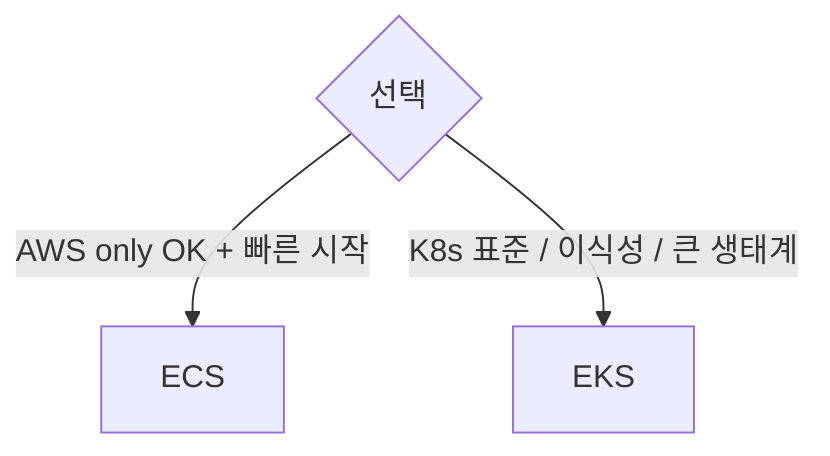

## 정의

**EKS (Elastic Kubernetes Service)** = AWS 의 *managed K8s control plane*. *worker node 는 사용자 (또는 Fargate)*. AWS IAM / VPC / ALB 등 *AWS 통합*.

## 아키텍처

```mermaid
flowchart TB
    User[kubectl] --> CP[EKS Control Plane<br/>(AWS managed)]
    CP --> NG[Managed Node Group<br/>(EC2)]
    CP --> SN[Self-managed Nodes]
    CP --> FG[Fargate Profile<br/>(serverless)]
    NG --> Pods1[Pods]
    SN --> Pods2[Pods]
    FG --> Pods3[Pods]
```

## Worker 3가지

| 종류 | 의미 |
|---|---|
| **Managed Node Group** | EC2, AWS 가 자동 관리 + Auto Scaling |
| **Self-managed Nodes** | EC2, 사용자 직접 |
| **Fargate** | 노드 없음, 서버리스 |

> *Karpenter* 가 *managed node group 의 진화*. 더 빠른 scaling + spot 자동 활용.

## EKS 비용

- **Control Plane**: $0.10/시간 = ~$73/월 (cluster 당)
- **Worker**: EC2 또는 Fargate 비용 별도

## VPC CNI

EKS 의 기본 CNI = *AWS VPC CNI*. Pod 가 *VPC IP 직접* (NAT 없음).

장점:
- *VPC 내 native*: SG / NetworkPolicy / VPC flow logs 그대로
- AWS Load Balancer 통합

단점:
- *IP 고갈* (Pod 수 × instance 수)
- EC2 instance type 별 *ENI / IP 한도*

대안: *Cilium* (eBPF), *Calico*.

## IAM Roles for Service Accounts (IRSA)

```yaml
apiVersion: v1
kind: ServiceAccount
metadata:
  name: s3-uploader
  annotations:
    eks.amazonaws.com/role-arn: arn:aws:iam::123:role/s3-uploader
```

→ pod 가 *IAM role assume* → *AWS API 호출 권한 자동*.

> [!IMPORTANT]
> *IRSA 가 2026 표준*. 옛 *node IAM role 공유* 보다 *세분화 + 보안*.

## EKS Pod Identity (2023+)

IRSA 의 *간소화* 버전. *OIDC provider* 없이도 동작:

```bash
aws eks create-pod-identity-association \
  --cluster-name prod \
  --namespace default \
  --service-account s3-uploader \
  --role-arn arn:aws:iam::123:role/s3-uploader
```

## EKS Add-ons

AWS 가 관리하는 *권장 add-on*:

- VPC CNI
- CoreDNS
- kube-proxy
- EBS CSI driver
- AWS Load Balancer Controller
- ADOT (AWS OpenTelemetry)
- GuardDuty Agent

## EKS vs ECS

자세한 건 [[aws-ecs-fargate]]. 요약:



## 흔한 함정

> [!WARNING]
> 1. **VPC IP 고갈** = pod 수 × ENI 한도. *secondary CIDR* 추가 또는 prefix delegation 활성.
> 2. **EKS 버전 업그레이드** = control plane → node → add-on 순서. *minor 한 번* (n+1 만).
> 3. **kubeconfig 의 *AWS auth*** = `aws eks update-kubeconfig`. IAM 변경 시 인증 깨짐.
> 4. **Fargate + DaemonSet** = *Fargate 가 DaemonSet 미지원*. log/metric sidecar 가 *각 Fargate task 안*.

## 관련 위키

- [[k8s-pod]], [[k8s-deployment]]
- [[aws-ecs-fargate]]
- [[aws-iam]]
- [[aws-vpc]]
