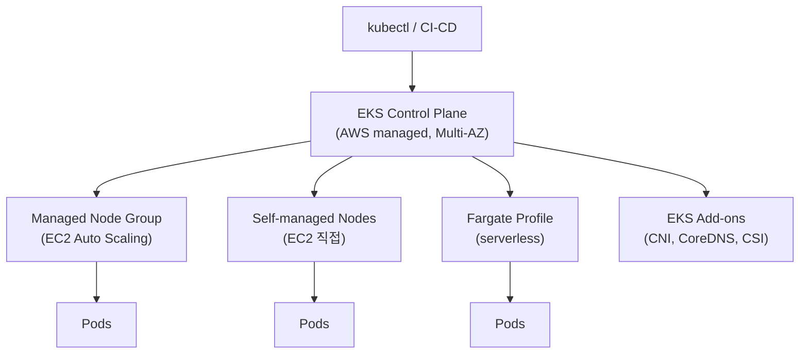
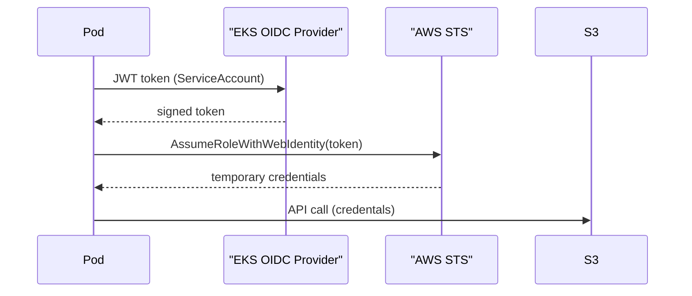
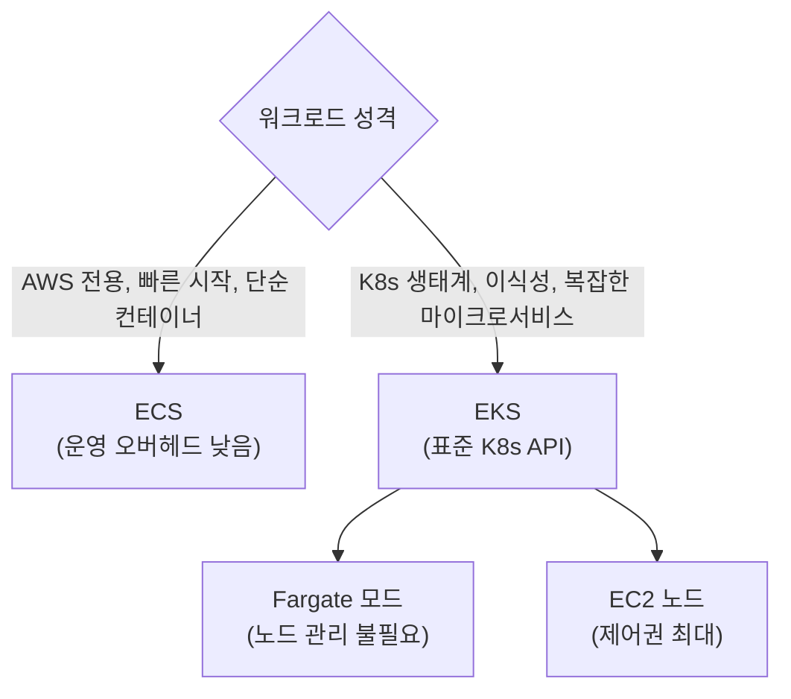
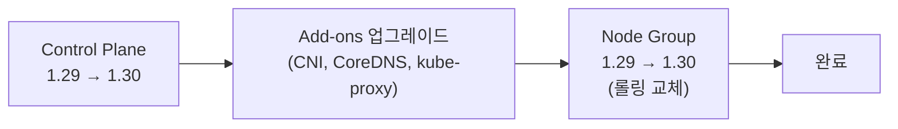

## 정의

**EKS (Elastic Kubernetes Service)** = AWS 의 *managed K8s control plane*. *worker node 는 사용자 (또는 Fargate)*. AWS IAM / VPC / ALB 등 *AWS 통합*.

control plane (etcd, API server, scheduler, controller manager) 을 AWS 가 완전 관리. 업그레이드, HA, 패치 포함. 사용자는 worker node 와 workload 만 책임.

## 아키텍처



## Worker 3가지

| 종류 | 의미 | 관리 주체 |
|:---|:---|:---|
| **Managed Node Group** | EC2, AWS 가 자동 관리 + Auto Scaling | AWS |
| **Self-managed Nodes** | EC2, 사용자 직접 ami/lifecycle 관리 | 사용자 |
| **Fargate** | 노드 없음, 서버리스, pod 단위 과금 | AWS |

> *Karpenter* = managed node group 의 진화. 더 빠른 scaling (초 단위) + spot 자동 활용 + 노드 통합(consolidation).

## IAM Roles for Service Accounts (IRSA)

Pod 별 IAM 권한 부여의 표준. node IAM role 을 공유하지 않고 SA 단위로 분리.

```yaml
apiVersion: v1
kind: ServiceAccount
metadata:
  name: s3-uploader
  annotations:
    eks.amazonaws.com/role-arn: arn:aws:iam::123456789:role/s3-uploader
```



- OIDC provider 를 EKS cluster 에 연결 (cluster 당 1회)
- SA 에 annotate 된 role 을 STS 로 assume
- pod 내 SDK 가 자동으로 credentials 갱신

> [!IMPORTANT]
> IRSA 가 2026 현재 표준. 옛 *node IAM role 공유* 방식은 node 위 모든 pod 가 동일 권한 = 최소 권한 원칙 위반.

## EKS Pod Identity (2023+)

IRSA 의 *간소화* 버전. OIDC provider 설정 없이도 동작. EKS Pod Identity Agent add-on 필요.

```bash
aws eks create-pod-identity-association \
  --cluster-name prod \
  --namespace default \
  --service-account s3-uploader \
  --role-arn arn:aws:iam::123456789:role/s3-uploader
```

| 항목 | IRSA | Pod Identity |
|:---|:---|:---|
| OIDC provider 필요 | 예 | 아니오 |
| 설정 복잡도 | 중간 | 낮음 |
| 교차 계정 | 가능 | 가능 |
| add-on 필요 | 아니오 | 예 (agent) |

## EKS Add-ons

AWS 가 관리하는 *권장 add-on*. EKS 콘솔 / API 로 버전 관리.

| Add-on | 역할 |
|:---|:---|
| VPC CNI | Pod IP 할당 (AWS VPC native) |
| CoreDNS | 클러스터 내부 DNS |
| kube-proxy | 서비스 네트워크 규칙 |
| EBS CSI driver | Persistent Volume (EBS) |
| EFS CSI driver | 공유 스토리지 (EFS) |
| AWS Load Balancer Controller | ALB/NLB 자동 프로비저닝 |
| ADOT | OpenTelemetry 수집 |
| GuardDuty Agent | 컨테이너 위협 탐지 |
| Karpenter | 노드 자동 프로비저닝 |

## VPC CNI 와 IP 관리

EKS 기본 CNI = *AWS VPC CNI*. Pod 가 VPC IP 를 직접 할당.

**장점**: VPC 내 native. SG, NetworkPolicy, VPC flow logs 그대로 적용. AWS LB 통합 자연스러움.

**단점**: IP 소모가 큼. EC2 instance type 별 ENI / IP 한도 존재.

```
c5.large = 최대 3 ENI × 10 IP = 30 Pod 한도
m5.4xlarge = 8 ENI × 30 IP = 240 Pod 한도
```

해결책:
- *secondary CIDR* 추가 (`100.64.0.0/16` 등)
- *prefix delegation* 활성 (ENI 당 /28 블록 할당, Pod 한도 대폭 확대)
- 대안 CNI: *Cilium* (eBPF, overlay), *Calico*

## 비용

| 항목 | 요금 |
|:---|:---|
| Control Plane | $0.10/시간/cluster (~$73/월) |
| Managed Node Group | EC2 온디맨드 / 스팟 가격 |
| Fargate | vCPU $0.04048/시간 + 메모리 $0.004445/GB/시간 |
| EKS Anywhere | 별도 라이선스 |

**비용 최적화**:
- Karpenter + Spot instance 조합으로 node 비용 60-80% 절감 가능
- Fargate 는 소규모 intermittent workload 에 적합, 상시 고밀도 워크로드는 EC2 가 저렴
- 미사용 cluster 는 node group 을 0으로 (control plane 비용은 유지)

## EKS Anywhere

온프레미스에서 동일 EKS API 로 K8s 운영. AWS Outposts 와는 별개.

- VMware vSphere, bare metal, Nutanix 등 지원
- EKS Anywhere 라이선스 + 지원 비용
- GitOps 기반 클러스터 관리 (Flux)

## EKS vs ECS 선택

자세한 내용은 [[aws-ecs-fargate]] 참조.



## 업그레이드 전략

EKS 버전은 3개 마이너 버전 지원. 평균 4개월마다 신버전 출시.

1. Control plane 먼저 업그레이드 (마이너 버전 1씩, n+1 만 허용)
2. Add-on 업그레이드 (버전 호환성 확인)
3. Node group 순차 업그레이드 (롤링)



> [!WARNING]
> control plane 과 node 버전 차이 최대 2 minor. node 가 너무 뒤처지면 업그레이드 불가.

## 모니터링 / 관찰성

```
CloudWatch Container Insights = EKS 메트릭 + 로그 통합
  - pod CPU/메모리 사용률
  - node 수준 지표
  - 네임스페이스 집계

Prometheus + Grafana = 커스텀 메트릭
  - kube-state-metrics (deployment replicas, pod phase)
  - node-exporter (node 시스템 지표)

AWS Distro for OpenTelemetry (ADOT)
  - traces → X-Ray / Jaeger
  - metrics → CloudWatch / Prometheus
```

**로그 수집 전략**:
- Fargate: AWS for FluentBit 사이드카 자동 (CloudWatch Logs)
- EC2 node: DaemonSet (FluentBit, Fluentd) 또는 ADOT

## Karpenter 핵심 개념

Karpenter = node 자동 프로비저닝. managed node group 보다 훨씬 빠른 스케일링.

```yaml
# NodePool 예시
apiVersion: karpenter.sh/v1
kind: NodePool
metadata:
  name: default
spec:
  template:
    spec:
      requirements:
        - key: karpenter.sh/capacity-type
          operator: In
          values: ["spot", "on-demand"]
        - key: kubernetes.io/arch
          operator: In
          values: ["amd64"]
      nodeClassRef:
        name: default
  disruption:
    consolidationPolicy: WhenEmptyOrUnderutilized
    consolidateAfter: 1m
```

**장점**:
- 수초 내 노드 프로비저닝 (managed group 의 3-5분 대비)
- spot 자동 활용 + on-demand fallback
- 미사용 노드 자동 통합 (consolidation) 으로 비용 절감

## 흔한 함정

> [!WARNING]
> 1. **VPC IP 고갈**: pod 수 × ENI 한도. secondary CIDR 또는 prefix delegation 사전 적용.
> 2. **EKS 버전 업그레이드 순서**: control plane → add-on → node 순. minor 한 번씩만.
> 3. **kubeconfig 의 AWS auth**: `aws eks update-kubeconfig`. IAM 변경 시 인증 깨짐 주의.
> 4. **Fargate + DaemonSet 미지원**: log/metric 수집을 sidecar 컨테이너로 각 pod 에 붙여야 함.
> 5. **IRSA OIDC provider**: cluster 당 1회 생성. 누락 시 AssumeRoleWithWebIdentity 실패.

> [!CAUTION]
> `aws-auth` ConfigMap 잘못 수정 시 cluster 접근 완전 차단. IAM Identity Center 또는 EKS access entries 로 대체 권장.

## 관련 위키

- [[kubernetes]] - K8s 기초 개념
- [[k8s-pod]], [[k8s-deployment]]
- [[k8s-rbac]] - 클러스터 내 권한
- [[aws-ecs-fargate]] - 대안 컨테이너 서비스
- [[aws-iam]] - IRSA 권한 모델
- [[aws-vpc]] - VPC CNI, 네트워크 설계
- [[aws-ecr]] - 컨테이너 이미지 저장소
- [[helm]] - K8s 패키지 매니저
