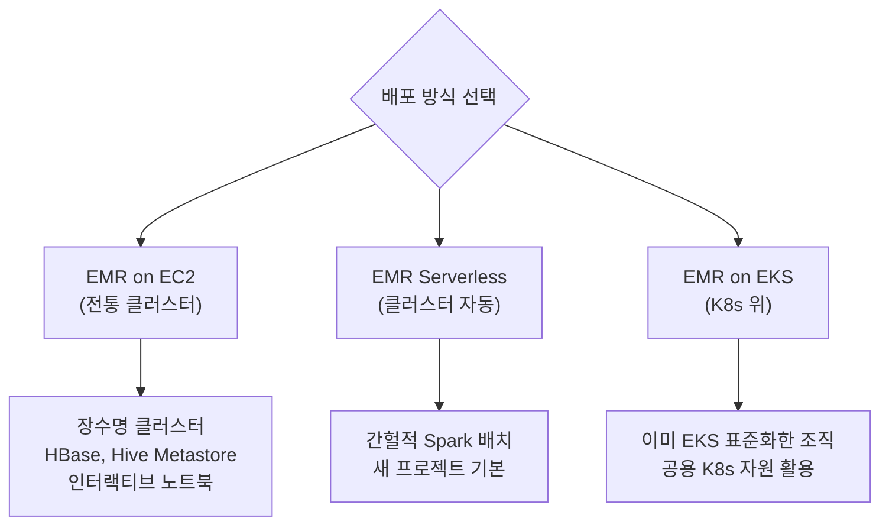
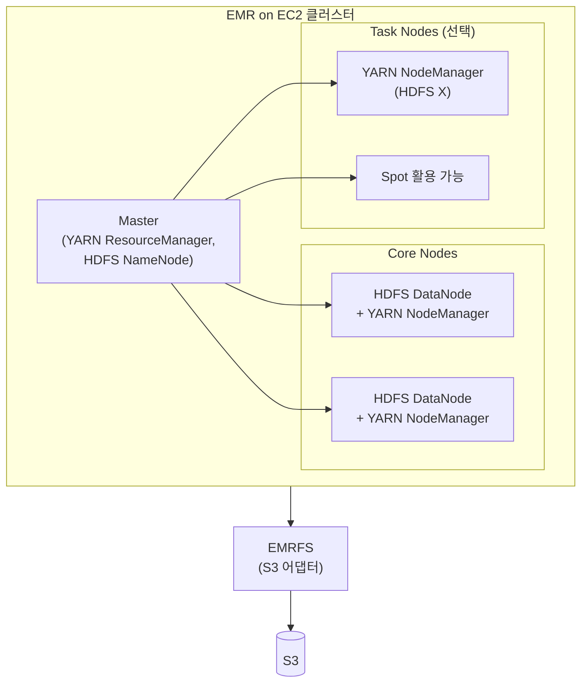
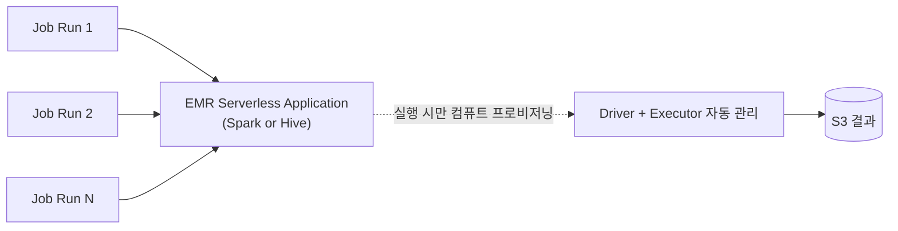
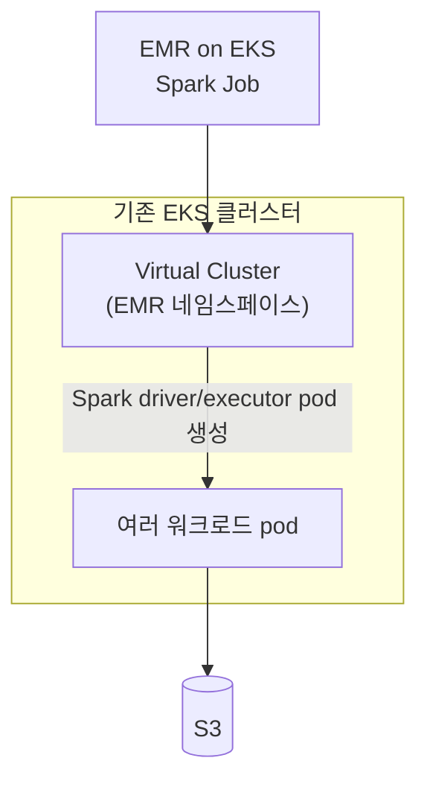
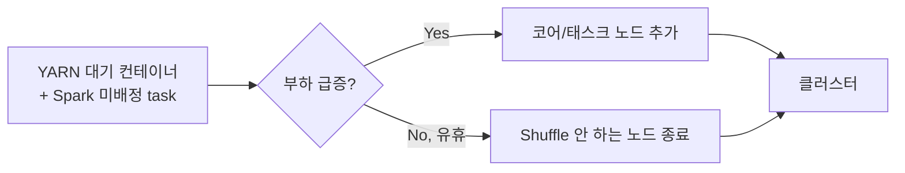

## 정의

**Amazon EMR** (Elastic MapReduce) 은 *[[hadoop-spark|Hadoop / Spark]] 등 오픈소스 빅데이터 프레임워크를 관리형 클러스터로 제공* 하는 AWS 서비스. AWS 가 프로비저닝, 설치, 설정, 튜닝, 모니터링을 담당하고, 사용자는 잡 (job) 제출과 클러스터 크기 결정에만 집중한다.

핵심 정체성은 *AWS 가 관리하는 대규모 분산 컴퓨트 플랫폼* 이며, "어떤 프레임워크를 얹느냐" 는 선택. 대표적으로 **Spark, Hive, Trino, HBase, Flink, Hudi/Iceberg/Delta** 를 그대로 사용 가능.

## 왜 EMR 이 필요한가

빅데이터 프레임워크를 직접 운영하는 것의 어려움:

- **분산 시스템 튜닝**: HDFS 복제, YARN 스케줄링, Spark memory 설정 등 수십 개 파라미터
- **버전 호환성**: Hadoop 3.x + Spark 3.5 + Hive 3.1 + Trino 등의 조합 검증
- **확장성**: 워크로드에 맞춰 노드 늘리기/줄이기 (수동은 지연 큼)
- **장애 복구**: 노드 죽으면 리밸런싱, HDFS 재복제
- **패치**: OS + JVM + 각 프레임워크의 CVE 대응
- **모니터링**: 클러스터 상태, YARN queue, Spark UI, driver log

EMR 의 답:
- 검증된 조합의 프레임워크를 **패키지로 제공** (release label 로 버전 고정)
- **자동 프로비저닝 + 부트스트랩**
- **Managed Scaling** 으로 워크로드에 맞춰 자동 확장/축소
- **Spot 통합** + 실패한 노드 자동 교체
- **EMRFS** 로 [[aws-s3|S3]] 를 HDFS 처럼 접근 (영구 저장)
- **[[aws-iam|IAM]] / [[aws-vpc|VPC]] / [[aws-cloudwatch|CloudWatch]]** 네이티브 통합

## 언제 EMR 을 쓰나

| 상황 | EMR 적합성 |
|:---|:---|
| 수 GB - PB 규모 배치 처리 | 적합 |
| Spark ETL / ML 학습 | 적합 |
| 인터랙티브 Presto/Trino SQL | 적합 (EMR on EC2) |
| HBase (long-lived NoSQL) | 적합 (EMR on EC2) |
| Flink 스트리밍 | 적합 |
| Hudi / Iceberg / Delta 트랜잭션 lakehouse | 적합 |
| 단순 ETL + Glue Catalog 활용 | *부적합* → [[aws-glue\|Glue]] 가 저렴 |
| 서버리스 SQL 애드혹 | *부적합* → [[aws-athena\|Athena]] |
| 트랜잭션 처리 | *부적합* → [[postgresql\|Postgres]] / [[aws-redshift\|Redshift]] |

## 세 가지 배포 방식

EMR 은 *"클러스터를 어떻게 실행하느냐"* 에 따라 세 모델을 제공. 관리 부담과 유연성의 트레이드오프.

### 1. EMR on EC2 (전통)

*직접 관리하는 클러스터*. Master + Core + Task 3 종의 노드로 구성.

**노드 역할**:
- **Master**: 클러스터 조정. 죽으면 클러스터 전체 실패 (HA 옵션 있음)
- **Core**: HDFS + 컴퓨트. 데이터를 저장하므로 spot 부적합
- **Task**: 컴퓨트만 (HDFS X). **Spot 인스턴스로 70% 비용 절감**

**적합**:
- HBase 같은 stateful 서비스
- Hive Metastore 를 클러스터 안에서 유지
- 인터랙티브 사용 (Zeppelin, Jupyter, Trino)
- 여러 프레임워크 동시 실행

**비적합**:
- 짧은 단일 배치 (프로비저닝 5-10 분이 아까움)
- 사용 안 하는 시간에도 인스턴스 요금

### 2. EMR Serverless

*Application 을 만들고, Job Run 을 제출* 하는 모델. 클러스터 개념 없음.

- **Application 유형**: Spark / Hive 중 하나 (동시 지원 X)
- **컴퓨트 관리 없음**: 필요할 때 자동 프로비저닝, 유휴 시 자동 해제
- **과금**: 실제 사용한 vCPU-hour + memory-hour + 임시 storage-hour
- **Cold start**: < 1 분
- **최대 용량 상한**: application 설정으로

**적합**:
- 간헐적 배치 (하루 몇 번)
- 예측 불가한 워크로드
- 클러스터 관리 부담 없음이 우선
- 새 프로젝트 사실상 기본 선택

**비적합**:
- HBase / HDFS 요구 (지원 X)
- 다양한 프레임워크 동시 사용

### 3. EMR on EKS

*Kubernetes 위에서 Spark job 실행*. EKS 클러스터가 이미 있는 조직에.

- **Virtual Cluster**: EKS 네임스페이스에 대응하는 EMR 논리 클러스터
- **Spark pod**: driver / executor 가 K8s pod 로 실행
- **자원 공유**: K8s 표준 스케줄링으로 다른 워크로드와 자원 공유

**적합**:
- 이미 EKS 로 표준화한 조직
- Spark 와 다른 K8s 워크로드 자원 공유
- K8s 관측 도구 (Prometheus, Grafana) 활용

**비적합**:
- EKS 관리 부담이 별개
- Spark 만 지원 (Hive, HBase, Trino 등 X)

### 세 방식 비교

| 축 | EMR on EC2 | EMR Serverless | EMR on EKS |
|:---|:---|:---|:---|
| **관리 대상** | 클러스터 (Master/Core/Task) | 없음 (Job 제출만) | EKS 별도 |
| **컴퓨트 프로비저닝** | 5-10 분 (수동) | < 1 분 (자동) | 즉시 (K8s) |
| **애플리케이션 종류** | 20+ (Spark, Hive, HBase, Trino, Flink, ...) | Spark, Hive | Spark 만 |
| **HDFS / HBase** | O | X | X |
| **유휴 비용** | 인스턴스 요금 지속 | 0 | 0 (EMR 관점) |
| **Spot 통합** | Task fleet 로 | 자동 | K8s spot |
| **적합** | 지속 클러스터, 다중 앱 | 간헐 배치 (기본 선택) | K8s 표준 조직 |

## 저장 계층: EMRFS 와 S3

EMR 의 데이터 저장은 두 축.

### HDFS

- Core 노드의 로컬 디스크에 저장 + 복제
- **클러스터 종료 시 데이터 손실** (일시적 저장만)
- Shuffle intermediate, cache 용도

### EMRFS ([[aws-s3|S3]] as HDFS)

- [[aws-s3|S3]] 를 HDFS 처럼 사용하는 어댑터
- **영구 저장** (클러스터와 독립)
- 여러 클러스터가 같은 데이터 공유
- 사실상 EMR 의 표준 저장

**패턴**: raw / staged / curated 데이터는 [[aws-s3|S3]] 에 [[apache-parquet|Parquet]] 로. HDFS 는 오직 job 실행 중 shuffle / cache.

## 자동 확장: Managed Scaling

EMR on EC2 의 핵심 편의 기능. 워크로드에 따라 코어/태스크 노드 자동 증감.

**핵심 특성**:
- **Shuffle data-aware**: Spark shuffle 이 진행 중인 executor 는 종료하지 않음 (데이터 손실 방지)
- **On-demand vs Spot 분리 관리**: 각각 min/max 지정 가능
- **최소 - 최대** 노드 수 지정, 초 단위 조정

Serverless / EKS 는 자동 스케일링이 기본 내장.

## 대표 프레임워크

EMR release 하나에 검증된 조합으로 여러 프레임워크가 함께 포함.

| 프레임워크 | 용도 |
|:---|:---|
| **[[hadoop-spark\|Apache Spark]]** | 배치 + 스트리밍 + ML. 사실상 EMR 의 킬러 앱 |
| **Apache Hive** | Hadoop SQL. Metastore 로 다른 엔진과 공유 |
| **Apache Flink** | 저지연 스트리밍 처리 |
| **Trino** (구 Presto) | 인터랙티브 SQL (여러 데이터 소스 페더레이션) |
| **Apache HBase** | Wide-column NoSQL (long-lived 클러스터에서) |
| **Apache Hudi / Iceberg / Delta Lake** | Lakehouse table format |
| **Apache Zeppelin / JupyterHub** | 노트북 인터페이스 |
| **Apache Hadoop (HDFS + YARN)** | 저장 + 자원 관리 기반 |

**구성**: EMR release label (예: `emr-7.x.y`) 로 세트를 고정 지정. AWS 가 조합을 검증.

## EMR Studio

*웹 IDE + Jupyter 노트북 + Git 통합 + Cluster/Application 관리 UI*.

- IAM Identity Center 로 SSO
- 노트북 하나에서 EMR on EC2 / Serverless / EKS 모두 실행
- 팀 협업, 코드 재사용

## EMR vs Glue vs Athena

세 서비스가 Spark / SQL 을 서비스로 제공한다는 점에서 겹침. 결정 축.

| 축 | [[aws-glue\|AWS Glue]] | Amazon EMR | [[aws-athena\|Amazon Athena]] |
|:---|:---|:---|:---|
| **주 인터페이스** | Spark ETL 코드 | Spark / Hive / Trino 등 | SQL only |
| **관리 오버헤드** | 최저 (완전 서버리스) | EC2: 중 / Serverless: 낮음 | 최저 |
| **커스터마이징** | 제한적 (Glue 릴리스) | 자유 (버전, 라이브러리, 설정) | 없음 |
| **다양한 앱** | Spark ETL + Python Shell 만 | Spark + Hive + HBase + Trino + Flink | SQL (Trino) |
| **Job 시작** | 1-2 분 | Serverless < 1 분 / EC2 5-10 분 | 즉시 |
| **적합** | 단순 ETL, Catalog 통합 강함 | 대규모, 복잡, 커스텀, 다양한 앱 | 애드혹 SQL, 서버리스 |

**대략 결정**:
- **단순 Spark ETL + Glue Catalog** → [[aws-glue|Glue]]
- **복잡한 Spark / 커스텀 설정 / Iceberg 트랜잭션** → **EMR (Serverless)**
- **HBase, Trino 인터랙티브** → **EMR on EC2**
- **애드혹 SQL** → [[aws-athena|Athena]]

## 성능 튜닝의 핵심 축

프레임워크 (Spark 등) 자체의 튜닝은 [[hadoop-spark|Hadoop / Spark]] 참조. EMR 특유의 축:

1. **파일 포맷**: [[apache-parquet|Parquet]] + ZSTD (CSV/JSON 대비 10-100 배)
2. **파티셔닝**: [[aws-s3|S3]] prefix 로 파티션 프루닝
3. **AQE**: Spark Adaptive Query Execution 활성화 (최신 Spark 는 기본 on)
4. **Spot Task Fleet**: 70% 비용 절감, Core 는 On-Demand
5. **Managed Scaling**: 워크로드에 맞춰 자동
6. **S3 Committer**: 대용량 write 시 partitioned/directory committer 로 rename 최소화
7. **Instance Fleets**: 여러 타입 혼합 → 가용성 + 비용 최적

## 함정

> [!WARNING]
> **HDFS 를 영구 저장으로 오해**. 클러스터 종료 시 데이터 손실. 결과와 원본은 반드시 [[aws-s3|S3]] 에.

> [!CAUTION]
> **EMR on EC2 를 계속 켜둠** = 유휴 시에도 인스턴스 요금. 배치는 Serverless / EC2 는 auto-terminate 정책 (`--auto-terminate`).

> [!WARNING]
> **Core 노드를 Spot 으로**. HDFS DataNode 이므로 spot interruption 시 블록 손실 가능. Spot 은 Task 만.

> [!IMPORTANT]
> **Managed Scaling 은 Shuffle-aware**. 하지만 큰 job 시작 전 미리 스케일 아웃 트리거 필요할 수 있음.

> [!CAUTION]
> **EMR Serverless 는 HBase / HDFS X**. Stateful 서비스는 EMR on EC2.

> [!WARNING]
> **[[aws-lake-formation|Lake Formation]] 세밀 권한 사용 시 EMR 버전 요건**. 최소 EMR 6.7+ 로 사용 전 확인.

> [!IMPORTANT]
> **Trino 와 PrestoDB 는 다른 프로젝트**. EMR 은 둘 다 지원하지만 신규는 Trino 권장 (활발한 개발).

## 관련 위키

- [[hadoop-spark|Hadoop / Spark]] - EMR 이 얹는 프레임워크
- [[aws-glue|AWS Glue]] - 관리형 ETL 대안
- [[aws-athena|Amazon Athena]] - 서버리스 SQL 대안
- [[aws-s3|AWS S3]] - 저장 백엔드 (EMRFS)
- [[aws-lake-formation|Lake Formation]] - 세밀 접근 제어
- [[apache-parquet|Apache Parquet]] - 권장 포맷
- [[data-lake|Data Lake]] - EMR 의 대표 소비 대상
- [[mpp|MPP]] - 다른 계보의 분산 처리
- [[aws-kinesis-data-analytics|Managed Flink]] - Flink 서버리스 대안
- [[aws-ec2|AWS EC2]] - EMR on EC2 컴퓨트
- [[aws-eks|AWS EKS]] - EMR on EKS 기반
- [[aws-iam|IAM]] - EMR 역할 (Service, Instance, Job Execution)
