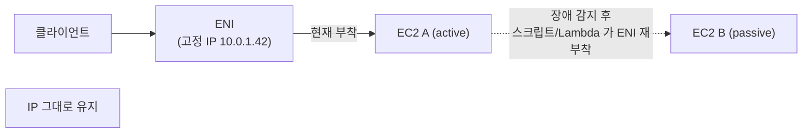
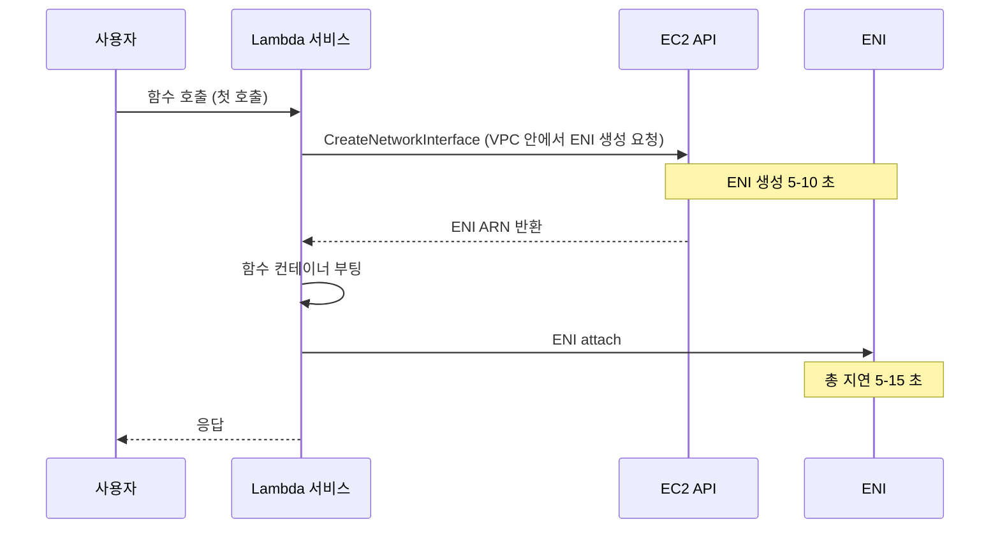
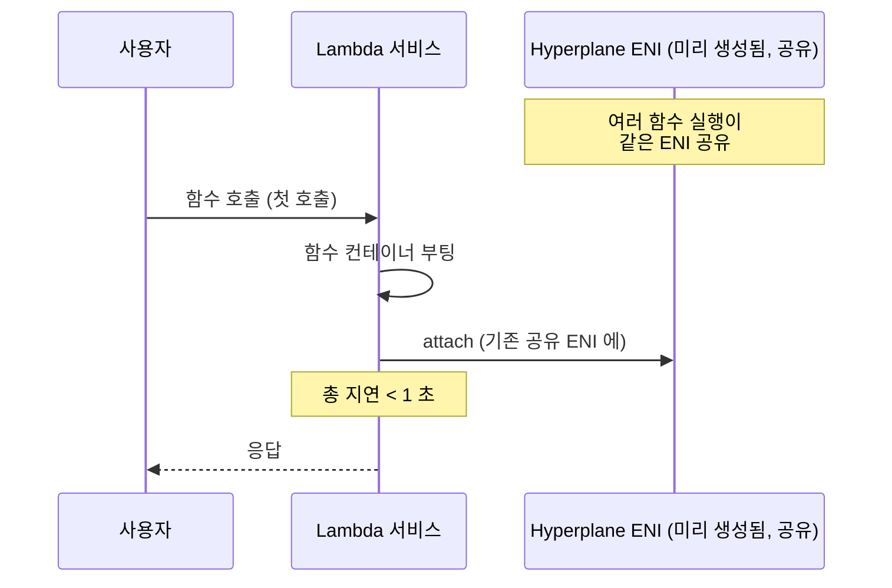

## 정의

**ENI** (Elastic Network Interface, 탄력적 네트워크 인터페이스) 는 *AWS [[aws-vpc|VPC]] 안의 가상 네트워크 카드*. 물리 서버의 NIC (Network Interface Card) 를 소프트웨어로 구현한 것으로, [[aws-ec2|EC2]] / [[aws-lambda|Lambda]] / [[aws-rds|RDS]] / ECS 등이 VPC 에 붙기 위해 사용한다.

**핵심 개념**: *컴퓨트 리소스 (인스턴스, 함수) 는 하나 이상의 ENI 를 통해서만 VPC 네트워크에 접근* 한다. ENI 없이는 IP 주소도, 보안 그룹도 없다.

## ENI 가 가지는 속성

| 속성 | 의미 |
|:---|:---|
| **Primary Private IP** | VPC 서브넷의 사설 IP (필수) |
| **Secondary Private IP** | 추가 사설 IP (여러 개) |
| **Public IP / EIP** | 인터넷 접근용 (선택) |
| **MAC Address** | ENI 고정 (인스턴스 재부팅해도 유지) |
| **Security Group** | ENI 별로 부착 (여러 개 가능) |
| **Source/Dest Check** | NAT 인스턴스는 disable |
| **Subnet** | 소속 서브넷 (AZ 결정) |
| **Description** | 사용자 지정 |

**중요**:
- ENI 는 **AZ 종속** (서브넷이 AZ 단위). 다른 AZ 로 이동 불가
- ENI 는 인스턴스와 **독립 수명**. 인스턴스 종료 후 재부착 가능 (network migration)
- MAC 주소가 고정이라 **라이선스 바인딩** 용도로 활용

## ENI 유형

### 1. Primary ENI (`eth0`)

- 인스턴스 시작 시 자동 생성
- 인스턴스와 **수명 동일** (인스턴스 종료 시 삭제)
- 분리 불가

### 2. Secondary ENI

- 추가로 부착 (인스턴스 실행 중에도 hot-plug)
- 다른 인스턴스로 이동 가능 (**failover 용도**)
- 인스턴스 종료해도 유지

### 3. Requester-managed ENI

*AWS 서비스* 가 자기 대신 생성한 ENI. 사용자가 직접 삭제 불가 (서비스가 관리).

**예**:
- Lambda VPC 함수의 ENI
- RDS 인스턴스의 ENI
- ECS Fargate task 의 ENI
- VPC Endpoint 의 ENI
- ELB 노드의 ENI

## 왜 ENI 라는 개념이 필요한가

물리 세계에서는 서버 = NIC. AWS 는 가상화 환경이라 *컴퓨트와 네트워크를 분리* 해야 유연.

**분리의 이점**:
1. **Failover**: EC2 A 가 죽으면 ENI 를 EC2 B 로 이동 -> IP + MAC + SG 그대로 유지 -> 클라이언트는 몰라도 됨
2. **Multi-homing**: 하나의 인스턴스가 여러 서브넷 (다중 네트워크) 에 참여
3. **관리 분리**: 관리 트래픽용 ENI 와 데이터 트래픽용 ENI 분리
4. **라이선스 고정**: MAC 기반 라이선스 (Windows Server 등) 를 인스턴스와 무관하게 유지

## 인스턴스별 ENI 한도

인스턴스 타입에 따라 부착 가능한 ENI 수 + ENI 당 IP 수가 다름.

| 인스턴스 크기 | 대략 ENI 수 | ENI 당 IP 수 |
|:---|:---|:---|
| t3.micro | 2 | 2 |
| t3.medium | 3 | 6 |
| m5.large | 3 | 10 |
| m5.4xlarge | 8 | 30 |
| m5.24xlarge | 15 | 50 |

정확한 값은 [Nitro 인스턴스 ENI 한도 문서](https://docs.aws.amazon.com/AWSEC2/latest/UserGuide/using-eni.html#AvailableIpPerENI) 참조.

**의미**: EKS Pod (VPC CNI 기본), Fargate task 등이 노드당 사용 가능한 IP 수를 결정.

## 실전 사용 예

### 1. EC2 Failover (Active-Passive)



DNS TTL 대기 없이 초 단위 페일오버 가능.

### 2. Multi-homed 서버

```
EC2 (Firewall/NAT)
├─ ENI eth0: public subnet (인터넷)
└─ ENI eth1: private subnet (내부)
```

한 인스턴스가 두 네트워크를 걸침 (레거시 NAT 인스턴스 패턴).

### 3. 관리/데이터 분리

```
EC2 (DB 서버)
├─ ENI eth0: management subnet (SSH, 모니터링)
└─ ENI eth1: data subnet (앱 트래픽)
```

Security group 이 ENI 별로 다르므로 관리 트래픽만 SSH 허용.

## Lambda ENI 의 역사 (Cold Start 개선)

*Lambda 는 VPC 안에서 실행 시 ENI 가 필요*. 이 부분이 오랜 시간 Lambda [[aws-lambda-cold-start|cold start]] 의 주범이었다.

### 옛날 모델 (~2019, 각 함수마다 ENI)



**문제**:
- 각 함수 실행마다 ENI 생성 -> **5-15 초 cold start**
- 함수 실행 종료 시 ENI 회수 -> 서브넷 IP 낭비
- 동시 실행이 많으면 서브넷 IP 고갈 -> ENI 생성 실패
- 개발자가 함수 코드를 얼마나 최적화해도 이 부분은 못 개선

이 때문에 *"Lambda 는 VPC 안에 넣지 마라"* 는 조언이 있었다.

### 새로운 모델 (2019-, Hyperplane ENI)

AWS 는 2019 년 **Hyperplane** 이라는 내부 인프라를 활용해 ENI 모델을 재설계.



**Hyperplane ENI 의 핵심**:
- **함수/버전/서브넷/보안 그룹 조합당 하나** 의 ENI (기존: 함수 실행마다 하나)
- **여러 실행이 같은 ENI 공유** (network multiplexing)
- **ENI 를 사전 생성** 후 재사용
- **ENI 생성 시간이 cold start 에서 사라짐**

**결과**:
- VPC Lambda cold start: **5-15 초 -> < 1 초**
- IP 소비 대폭 감소
- 서브넷 크기 걱정 완화 (전에는 `/24` 이상 강력 권장, 이제는 여유 있음)

### 2024+ 추가 개선

- **Warm ENI pool**: ENI 가 항상 warm 상태
- 일반 (non-VPC) 함수와 cold start 차이 거의 없음
- Provisioned Concurrency 와 조합 시 사실상 0

## VPC Endpoint 도 ENI

**Interface Endpoint** ([[aws-privatelink|PrivateLink]] 기반) 은 VPC 서브넷에 **ENI 를 생성**해서 서비스 제공.

```
[VPC] -> ENI (Interface Endpoint) -> AWS 서비스 (S3, DynamoDB, KMS 등)
```

이 ENI 의 IP 로 서비스 호출 -> 인터넷/NAT 우회.

**Gateway Endpoint** (S3, DynamoDB 만) 는 다른 메커니즘 (라우트 테이블) 이라 ENI 없음.

## 성능 & 대역폭

ENI 자체는 대역폭 상한이 없지만, *인스턴스 타입의 네트워크 성능* 에 종속.

- Nitro 인스턴스 (m5, m6, c5, c6 등): ENA (Elastic Network Adapter) 지원 -> 최대 100 Gbps
- 이전 세대 (m4 등): 낮은 상한
- **EFA** (Elastic Fabric Adapter): HPC / ML 학습용 초저지연 인터페이스. RDMA 스타일. ENI 의 특수 형태.

## Multi-Attach vs Multi-ENI

혼동 주의:

- **Multi-Attach EBS**: 하나의 EBS 볼륨을 여러 EC2 에 부착 (io1/io2 only)
- **Multi-ENI**: 하나의 EC2 에 여러 ENI 부착

전혀 다른 개념.

## 비용

- ENI 자체 요금 **없음**
- IP 자체 요금 **없음** (2024-02 이후 IPv4 public IP 는 시간당 과금)
- 인스턴스 대역폭 / EIP 미사용 시 요금 등이 관련

## 함정

> [!WARNING]
> **ENI 는 AZ 종속**. 서브넷 = AZ. 다른 AZ 로 이동 불가. Multi-AZ HA 는 다른 ENI 로.

> [!CAUTION]
> **Requester-managed ENI** (Lambda, RDS, VPC Endpoint 가 만든 것) 는 사용자가 직접 삭제 X. 서비스 리소스를 먼저 삭제해야 함. VPC 삭제 실패의 흔한 원인.

> [!WARNING]
> **서브넷 IP 고갈**. Lambda / EKS Pod 등이 서브넷의 IP 를 소비. `/24` (~250개) 는 소규모, 대규모는 `/22` (~1000) 이상 권장.

> [!IMPORTANT]
> **Lambda cold start 옛 기억**. "VPC Lambda 는 느리다" 는 2019 이전 이야기. 지금은 Hyperplane 으로 큰 문제 없음. 아직 이 이유로 Lambda 를 VPC 밖에 두는 관행이 있음.

> [!CAUTION]
> **Security Group 이 ENI 별**. 한 EC2 에 여러 ENI 붙이면 각자 다른 SG. 트래픽이 어느 ENI 로 오는지 파악 필요.

> [!WARNING]
> **Public IP 자동 할당** 은 서브넷 설정. Private subnet 에 만든 ENI 는 EIP 별도 부여해야 인터넷 접근.

> [!IMPORTANT]
> **인스턴스별 ENI 한도** 를 넘으면 attach 실패. EKS 노드 크기 결정 시 반드시 확인 (Pod 수 = ENI 수 × IP-per-ENI).

## 관련 위키

- [[aws-vpc|AWS VPC]] - ENI 의 실행 환경
- [[aws-lambda|AWS Lambda]] - VPC Lambda + Hyperplane
- [[aws-lambda-cold-start|Lambda Cold Start]] - ENI 개선으로 완화된 문제
- [[aws-ec2|AWS EC2]] - 주 사용처
- [[aws-privatelink|PrivateLink]] - Interface Endpoint 로 ENI 활용
- [[aws-sg-vs-nacl|SG vs NACL]] - ENI 에 부착하는 방화벽
