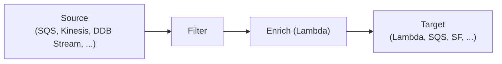

## 정의

**EventBridge** = AWS 의 *통합 event bus*. 옛 CloudWatch Events 의 후계. *AWS service 이벤트 + custom 이벤트 + SaaS 이벤트* 를 한 곳에서.

## Event Bus 종류

| 종류 | 의미 |
|---|---|
| **Default** | AWS service 이벤트 (EC2, S3, CodePipeline 등) |
| **Custom** | 자체 이벤트 |
| **Partner** | SaaS (Datadog, MongoDB, Auth0, ...) |

## Event 형식

```json
{
  "version": "0",
  "id": "...",
  "detail-type": "Order Created",
  "source": "myapp.orders",
  "account": "123",
  "time": "2026-06-25T12:00:00Z",
  "region": "us-east-1",
  "resources": [],
  "detail": {
    "order_id": "o_42",
    "user_id": "u_99",
    "total": 5000
  }
}
```

## Rule + Target

```mermaid
flowchart LR
    Event[Event] --> Bus[Event Bus]
    Bus --> Rule1[Rule 1<br/>(pattern)]
    Rule1 --> Target1[Lambda]
    Rule1 --> Target2[SQS]
    Bus --> Rule2[Rule 2<br/>(다른 pattern)]
    Rule2 --> Target3[Step Functions]
```

```json
{
  "source": ["myapp.orders"],
  "detail-type": ["Order Created"],
  "detail": {
    "total": [{ "numeric": [">=", 10000] }]
  }
}
```

> *Content-based filtering*. *복잡한 매칭* 가능 (prefix, suffix, anything-but, numeric, exists, ...).

## Target 종류

- Lambda
- SQS / SNS
- Step Functions
- ECS Task / EKS / Batch
- Kinesis / Firehose
- API Destination (외부 HTTP)
- 다른 EventBridge bus / Event Bus in 다른 account

## EventBridge Scheduler (2022+)

```bash
aws scheduler create-schedule \
  --name daily-report \
  --schedule-expression "cron(0 9 * * ? *)" \
  --schedule-expression-timezone "Asia/Seoul" \
  --target '{
    "Arn": "arn:lambda:...",
    "RoleArn": "arn:role:..."
  }' \
  --flexible-time-window '{ "Mode": "OFF" }'
```

> CloudWatch Events Schedule 의 *후계 + 더 정교*. *수백만 schedule*, *cron / rate / one-time*.

## Schema Registry

```yaml
Schemas:
  - myapp.orders.OrderCreated@v2
    - 필드: order_id (string), total (number), ...
```

- 이벤트 schema *중앙 보관*.
- 다국어 *코드 생성* (Java, Python, TS).
- *contract 변경 추적*.

## Pipes (2022+)



> *Pipe* = source → filter → enrich → target 의 *one-stop ETL*.

## EventBridge vs SNS

자세한 건 [[aws-sns]].

요약:
- SNS = *대량 fan-out* (12.5M subscriber)
- EventBridge = *복잡 라우팅 + filtering + SaaS 통합*

## 흔한 함정

> [!WARNING]
> 1. **Rule pattern 의 잘못된 JSON** = silently no match. CloudWatch 로 *DeliveryFailure* 모니터링.
> 2. **Cross-account 이벤트** = source bus 의 *permission policy* 와 target bus 의 *PutEvents* 권한.
> 3. **Schema 변경** = *registry 의 versioning* 활용. consumer 영향 평가.
> 4. **Target 의 *retry 한도*** = 24시간 retry. DLQ 필수.

## 관련 위키

- [[aws-sns]], [[aws-sqs]]
- [[aws-step-functions]]
- [[aws-lambda]]
- [[outbox-pattern]] (event 발행)
