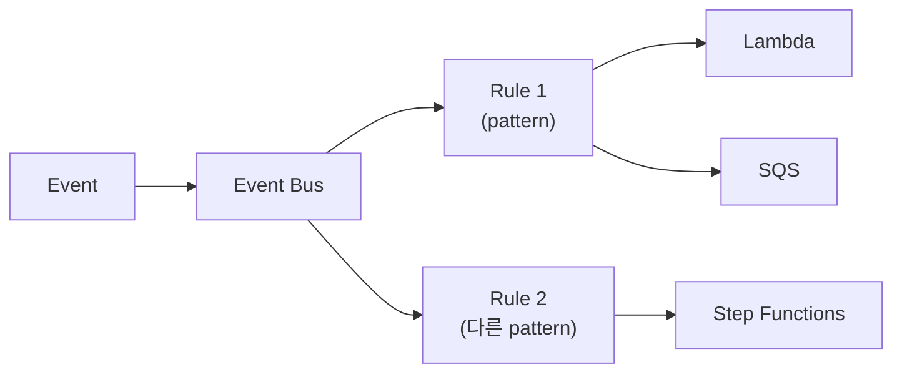
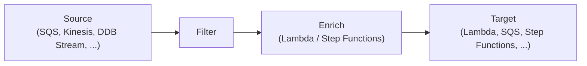
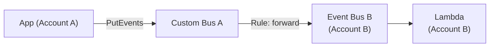

## 정의

**EventBridge** = AWS 의 *통합 event bus*. 옛 CloudWatch Events 의 후계. *AWS service 이벤트 + custom 이벤트 + SaaS 이벤트* 를 한 곳에서 라우팅하는 서버리스 이벤트 플랫폼.

## 사용 상황

| 상황 | EventBridge 선택 이유 |
|---|---|
| 마이크로서비스 간 느슨한 결합 | source 가 target 을 몰라도 됨, 독립 배포 |
| SaaS 이벤트 수신 | Partner Sources (Datadog, MongoDB, Auth0, ...) |
| 배치 스케줄링 | Scheduler 로 cron / rate / one-time |
| Cross-account 이벤트 전파 | 조직 전체 bus 설정 가능 |
| AWS 서비스 이벤트 반응 | EC2 상태 변경, S3 업로드, CodePipeline 알림 |
| ETL 파이프라인 | Pipes 로 source → filter → enrich → target |

*SNS + SQS 가 메시지 큐 / fan-out 에 특화* 라면, EventBridge 는 *이벤트 라우팅 플랫폼*. 복잡한 content-based filtering 과 SaaS 통합이 강점.

## Event Bus 종류

| 종류 | 의미 |
|---|---|
| **Default** | AWS service 이벤트 (EC2, S3, CodePipeline 등) |
| **Custom** | 자체 이벤트 (`PutEvents` API 로 전송) |
| **Partner** | SaaS (Datadog, MongoDB, Auth0, Zendesk, ...) |

Custom bus 는 계정당 100개 생성 가능. 이름, region, account 로 식별.

## Event 형식

```json
{
  "version": "0",
  "id": "...",
  "detail-type": "Order Created",
  "source": "myapp.orders",
  "account": "123456789",
  "time": "2026-06-25T12:00:00Z",
  "region": "us-east-1",
  "resources": [],
  "detail": {
    "order_id": "o_42",
    "user_id": "u_99",
    "total": 5000
  }
}
```

- `source`: 이벤트 출처 (역 DNS 권장, `myapp.orders`).
- `detail-type`: 이벤트 종류. `detail`: 자유 형식 payload.
- 최대 *256KB*. 초과 시 S3 에 payload 를 올리고 URL 만 이벤트에.

## Event Pattern 심화

Rule 이 어떤 이벤트를 처리할지 결정하는 *JSON 필터*. Pattern 이 이벤트의 *상위 집합* 이면 매칭.

```json
{
  "source": ["myapp.orders"],
  "detail-type": ["Order Created"],
  "detail": {
    "total": [{ "numeric": [">=", 10000] }],
    "status": [{ "anything-but": ["CANCELLED", "REFUNDED"] }],
    "region": [{ "prefix": "us-" }],
    "tag": [{ "exists": false }]
  }
}
```

| Operator | 의미 |
|---|---|
| `prefix` | 특정 문자열로 시작 |
| `suffix` | 특정 문자열로 끝 |
| `anything-but` | 제외 목록 |
| `numeric` | 숫자 비교 (`>`, `>=`, `<`, `<=`, `=`) |
| `exists` | 필드 존재 여부 (true / false) |
| `equals-ignore-case` | 대소문자 무시 |
| `cidr` | IP 대역 매칭 |
| `or` | 여러 조건 중 하나 |

## Rule + Target



- 하나의 Bus 에 여러 Rule.
- 하나의 Rule 에 최대 *5개* Target.
- Target 마다 *Input Transformer* 로 payload 변환 가능.

### Input Transformer

Rule 의 Target 으로 보내기 전에 이벤트 payload 를 변환.

```json
{
  "InputPathsMap": {
    "order": "$.detail.order_id",
    "total": "$.detail.total"
  },
  "InputTemplate": "\"Order <order> 금액 <total>원 생성됨\""
}
```

JMESPath 로 필드 추출 후 template 에 삽입. Lambda 호출 없이 payload 를 단순화.

## Target 종류

- Lambda (동기 / 비동기 선택 가능)
- SQS / SNS
- Step Functions
- ECS Task / EKS / Batch
- Kinesis Data Streams / Firehose
- API Destination (외부 HTTP 엔드포인트)
- 다른 EventBridge Bus / 다른 계정의 Bus
- CodePipeline, CodeBuild, SSM Run Command

## Retry + Dead Letter Queue

Target 호출 실패 시 EventBridge 가 자동 재시도.

| 항목 | 기본값 |
|---|---|
| 최대 재시도 기간 | 24시간 |
| 최대 재시도 횟수 | 185회 |
| 재시도 알고리즘 | exponential back-off |
| DLQ 지원 | SQS Dead Letter Queue |

```yaml
Target:
  Arn: arn:aws:lambda:us-east-1:123:function:my-func
  DeadLetterConfig:
    Arn: arn:aws:sqs:us-east-1:123:my-dlq
  RetryPolicy:
    MaximumRetryAttempts: 3
    MaximumEventAgeInSeconds: 3600
```

> [!IMPORTANT]
> *DLQ 는 운영 필수*. 실패 이벤트를 DLQ 로 보내고 [[aws-cloudwatch]] Alarm 연동. `FailedInvocations` 지표를 모니터링.

## EventBridge Scheduler (2022+)

CloudWatch Events Schedule 의 후계. 훨씬 정교하고 *수백만 스케줄* 지원.

```bash
aws scheduler create-schedule \
  --name daily-report \
  --schedule-expression "cron(0 9 * * ? *)" \
  --schedule-expression-timezone "Asia/Seoul" \
  --target '{
    "Arn": "arn:aws:lambda:ap-northeast-2:123:function:reporter",
    "RoleArn": "arn:aws:iam::123:role/scheduler-role"
  }' \
  --flexible-time-window '{ "Mode": "OFF" }'
```

| 방식 | 예시 |
|---|---|
| cron | `cron(0 9 * * ? *)` |
| rate | `rate(5 minutes)` |
| one-time | `at(2026-12-25T00:00:00)` |

*Flexible Time Window*: `FLEXIBLE` 로 지정된 분 범위 안에서 실행 분산 (부하 burst 방지). EventBridge Rule 의 Schedule 과 달리 *UTC 외 timezone 지원*, *하나의 Target 에 직접 IAM Role 부여* 가 가능.

## Schema Registry

이벤트 계약을 중앙에서 관리.

- 이벤트 schema *중앙 보관*.
- 다국어 *코드 생성* (Java, Python, TypeScript).
- *contract 변경 추적* (자동 versioning).
- AWS service 이벤트 schema 는 *자동 등록* (Schema Discovery 활성화 시).

```yaml
Schemas:
  - Name: myapp.orders@OrderCreated
    Version: 2
    Content: |
      {
        "$schema": "...",
        "properties": {
          "detail": {
            "properties": {
              "order_id": { "type": "string" },
              "total": { "type": "number" }
            }
          }
        }
      }
```

## Pipes (2022+)



*Pipe* = source → filter → enrich → target 의 *one-stop ETL* 파이프라인. Rule 방식 대비:
- Rule: bus → N targets 의 fan-out.
- Pipe: 1:1 스트리밍 처리, polling source 에서 직접 읽기 (SQS, Kinesis, DDB Stream).

Enrichment 에서 Lambda 를 껴서 payload 변환 + 외부 조회.

## Cross-account 이벤트 라우팅



1. **소스 계정 Bus**: resource-based policy 에서 Account B 에게 `events:PutEvents` 허용.
2. **Rule 설정**: 소스 Bus 에 "대상 Bus 로 forward" Rule 추가.
3. **대상 계정 Bus**: 수신 후 자체 Rule 로 Lambda / SQS 등 트리거.
4. **조직 전체**: Default Bus 의 *Organization policy* 로 전체 계정 수신 허용.

## 이벤트 Archive + Replay

```yaml
Archive:
  Name: order-events-archive
  EventSourceArn: arn:aws:events:...:event-bus/my-bus
  EventPattern: |
    { "source": ["myapp.orders"] }
  RetentionDays: 90
```

- 이벤트를 Archive 에 저장 후 *재생 (Replay)* 가능.
- 새 Rule 추가 후 과거 이벤트를 replay → consumer 검증.
- 장애 복구: 실패 시간대 이벤트만 선택 replay.

## 모니터링

| 지표 (namespace: AWS/Events) | 의미 |
|---|---|
| `FailedInvocations` | Target 호출 최종 실패 수 |
| `DeadLetterInvocations` | DLQ 로 전송된 이벤트 수 |
| `ThrottledRules` | Rule 평가 제한 횟수 |
| `MatchedEvents` | Rule 에 매칭된 이벤트 수 |
| `TriggeredRules` | Rule 트리거 횟수 |
| `InvocationAttempts` | Target 호출 시도 총 수 |

```bash
aws cloudwatch get-metric-statistics \
  --namespace AWS/Events \
  --metric-name FailedInvocations \
  --dimensions Name=EventBusName,Value=my-bus \
  --start-time 2026-07-01T00:00:00Z \
  --end-time 2026-07-02T00:00:00Z \
  --period 3600 \
  --statistics Sum
```

## EventBridge vs SNS vs SQS

자세한 건 [[aws-sns]], [[aws-sqs]].

| 항목 | EventBridge | SNS | SQS |
|---|---|---|---|
| Filtering | content-based (복잡) | attribute-based (단순) | 없음 |
| Fan-out | Rule 당 5 Target | 12.5M subscriber | 1:1 |
| SaaS 통합 | ✓ Partner Sources | ✗ | ✗ |
| Scheduler | ✓ | ✗ | ✗ |
| Event Replay | ✓ Archive 설정 시 | ✗ | ✗ |
| Schema Registry | ✓ | ✗ | ✗ |
| 비용 기준 | 이벤트 수 | 이벤트 수 | 메시지 수 |
| 주요 용도 | 이벤트 라우팅 | fan-out / pub-sub | 작업 큐 / 버퍼링 |

## 흔한 함정

> [!WARNING]
> 1. **Rule pattern 의 잘못된 JSON** = silently no match. `MatchedEvents` 0 이면 pattern 검토.
> 2. **Cross-account 이벤트** = source bus 의 *resource policy* 와 target bus 의 *PutEvents 권한* 둘 다 필요.
> 3. **Schema 변경** = *registry 의 versioning* 활용. consumer 영향 평가 후 배포.
> 4. **Target retry 한도** = 24시간 재시도 후 드롭. DLQ 미설정 시 이벤트 유실.
> 5. **Pipes Enrichment 오류** = 이벤트 드롭. Enrichment Lambda 는 idempotent 보장.
> 6. **Scheduler timezone** = 기본 UTC. `schedule-expression-timezone` 명시 필수.
> 7. **Input Transformer template 오류** = 이벤트 전달 실패. 미리 콘솔에서 테스트.
> 8. **256KB 초과 payload** = 전송 실패. 대용량은 S3 URL + pointer 패턴.

## 관련 위키

- [[aws-sns]], [[aws-sqs]]
- [[aws-step-functions]]
- [[aws-lambda]]
- [[aws-cloudwatch]]
- [[outbox-pattern]] (이벤트 발행 패턴)
