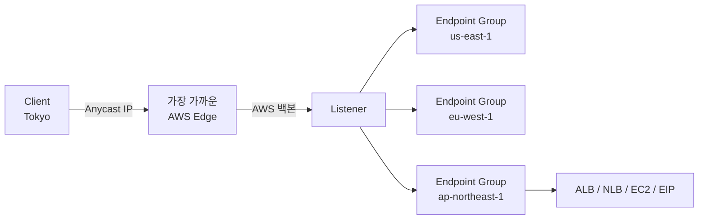

## 정의

**AWS Global Accelerator (GA)** 는 **AWS 글로벌 백본 네트워크** 위에서 사용자를 가장 가까운 healthy AWS endpoint 로 라우팅해 성능을 향상시키는 서비스입니다. **2개의 정적 anycast IP** 를 제공해 여러 리전의 리소스를 단일 endpoint 로 노출합니다.

**한 줄 요약**: 여러 리전 워크로드 앞에 **하나의 글로벌 진입점** 을 두어 사용자를 자동으로 최적 리전으로 라우팅.

## 왜 Global Accelerator 인가

### 인터넷 라우팅의 문제

일반 인터넷:
- 사용자 -> 여러 ISP hop 통과
- BGP 변동으로 경로가 최적이 아닐 수 있음
- 지연 (latency) 예측 불가
- 리전 장애 시 DNS TTL 대기

### GA 의 해결

- **AWS 백본** 으로 최단 경로 (사용자 근처 edge -> AWS backbone -> destination)
- **Anycast IP**: 세계 어디서든 같은 IP, BGP 로 최근접 AWS edge 로
- **Health check**: 자동으로 unhealthy endpoint 우회
- **즉시 페일오버**: DNS 캐시 무관 (IP 는 그대로, endpoint 만 바뀜)
- **정적 IP**: 화이트리스트, DNS 변경 없이 endpoint 변경

## 아키텍처



## 구성 요소

### 1. Accelerator

Top-level 리소스. 2개의 정적 anycast IP 부여.

```bash
aws globalaccelerator create-accelerator \
  --name my-app \
  --enabled \
  --ip-address-type IPV4
```

- **Standard Accelerator**: 성능 최적
- **Custom Routing Accelerator**: 특정 EC2 인스턴스 직접 매핑 (게임 서버 등)

### 2. Listener

특정 프로토콜 + 포트 조합. Anycast IP 의 어떤 포트가 어디로 라우팅될지.

```bash
aws globalaccelerator create-listener \
  --accelerator-arn arn:aws:globalaccelerator::...:accelerator/abc \
  --port-ranges FromPort=443,ToPort=443 \
  --protocol TCP \
  --client-affinity SOURCE_IP
```

**Client Affinity**:
- **NONE** (기본): 각 요청 독립 라우팅
- **SOURCE_IP**: 같은 IP 는 같은 endpoint (세션 유지)

### 3. Endpoint Group

리전 단위. 여러 endpoint 를 포함.

```bash
aws globalaccelerator create-endpoint-group \
  --listener-arn ... \
  --endpoint-group-region us-east-1 \
  --endpoint-configurations \
    EndpointId=arn:aws:elasticloadbalancing:us-east-1:...:loadbalancer/app/prod/abc,Weight=100 \
  --traffic-dial-percentage 100 \
  --health-check-port 443 \
  --health-check-protocol HTTPS \
  --health-check-path /health \
  --health-check-interval-seconds 30 \
  --threshold-count 3
```

- **Traffic Dial**: 이 endpoint group 이 받을 트래픽 비율 (0-100%). 점진 롤아웃 / DR 격리에 활용
- **Health check**: 자동 페일오버 근거

### 4. Endpoint

실제 백엔드. 지원 유형:

- **Application Load Balancer (ALB)**
- **Network Load Balancer (NLB)**
- **EC2 인스턴스** (public IP)
- **Elastic IP**

각 endpoint 는 **weight (0-255)** 로 라우팅 비율 조정.

## 라우팅 로직

1. **Client 요청** -> Anycast IP 로
2. **AWS Edge** (가장 가까운) 가 수신 (BGP 로 결정)
3. **Global Accelerator** 가 최적 endpoint group 선택 (지연 기준, healthy)
4. **Endpoint** (ALB/NLB/EC2) 로 프록시
5. **응답** 동일 경로 역방향

## Global Accelerator vs CloudFront

두 서비스 자주 혼동. 목적이 다름.

| 축 | Global Accelerator | CloudFront |
|:---|:---|:---|
| **주 목적** | 동적 콘텐츠 저지연 라우팅 | 정적 콘텐츠 캐싱 (CDN) |
| **프로토콜** | TCP/UDP (임의) | HTTP/HTTPS |
| **캐싱** | 없음 (프록시만) | 있음 (edge cache) |
| **IP** | 2 정적 anycast | 다수 edge IP |
| **적합** | 게임, 실시간, API | 웹, 이미지, 비디오 |
| **원본** | EC2/ELB/EIP | S3/ELB/EC2/커스텀 |
| **글로벌** | O | O |

**결정**:
- **정적 콘텐츠 캐싱** -> CloudFront
- **동적 (API, 게임, RTC) + 여러 리전 라우팅** -> GA
- **둘 다** 가능 (같은 앱의 정적 vs 동적)

## Global Accelerator vs Route 53 Latency Routing

**Route 53 latency-based**: DNS 기반. 사용자 -> DNS 서버 -> 지연 낮은 리전 IP.

**Global Accelerator**: Anycast IP + 백본 라우팅.

| 축 | Route 53 Latency | GA |
|:---|:---|:---|
| **메커니즘** | DNS | Anycast IP |
| **페일오버 속도** | TTL 대기 (60s+) | 즉시 (IP 그대로) |
| **정적 IP** | X (DNS name) | O (2 IP) |
| **IP 화이트리스트** | 어려움 | 쉬움 |
| **백본 사용** | X | O |
| **요금** | DNS 쿼리 | 시간당 + 데이터 |

**GA 가 나은 경우**:
- 정적 IP 필수 (파트너 화이트리스트)
- 즉시 페일오버 (다운타임 최소화)
- TCP/UDP (DNS 무관)

**Route 53 가 나은 경우**:
- HTTP 트래픽만
- 요금 최소화
- 이미 Route 53 인프라

## 사용 사례

### 1. Multi-region Active-Active API

여러 리전에 백엔드 배포:

- Anycast IP 1개
- 사용자별 가장 가까운 리전 자동 선택
- 리전 장애 시 즉시 다른 리전

### 2. Gaming (실시간 UDP)

- Custom Routing 으로 특정 게임 세션 = 특정 EC2 매핑
- 저지연 필수, UDP 지원
- 리전 간 매치메이킹

### 3. IoT / VoIP

TCP/UDP 저지연 + 정적 IP (디바이스 firmware 에 고정).

### 4. 파트너 API 통합

파트너가 IP 화이트리스트 요구. DNS name 못 씀.

### 5. Blue/Green Multi-region

- Blue 리전 traffic dial 100 -> Green 리전 활성
- Traffic dial 을 점진 이동 (100→50→0)
- 문제 발견 시 즉시 롤백

### 6. On-prem Migration

- 정적 IP 로 DNS 변경 없이 origin 이관
- GA anycast IP -> 처음엔 on-prem -> 점진 AWS 리전으로

## Client IP 보존

기본적으로 Global Accelerator 는 client IP 를 backend 에 전달 (X-Forwarded-For 아님, **실제 IP**).

- ALB: SG 에서 client IP 확인 가능
- NLB: Preserve client IP 옵션
- EC2: 앱이 실제 client IP 로 인식

## Health Check

- **HTTP/HTTPS/TCP** 3 프로토콜
- **간격**: 10 또는 30초
- **임계값**: N번 실패 시 unhealthy
- Endpoint 단위 자동 페일오버
- Endpoint group 전체 unhealthy 시 다음 group

## 요금

- **Fixed Fee**: Accelerator 시간당 (예: $0.025/hour)
- **Data Transfer Premium (DT-Premium)**: 백본 사용 요금
  - AWS 안 이동 데이터: 소량
  - 인터넷 out: 리전별 요금 (일반보다 약간 높음)

**주의**: 유휴 상태에도 fixed fee. 개발 계정에 켜두면 요금.

## Custom Routing Accelerator

일반 GA 와 별개 (VIP-to-VIP 매핑 아님):

- **Deterministic mapping**: 특정 destination port -> 특정 EC2 인스턴스
- **게임 서버** 특화: 매치메이커가 "user X -> instance Y" 결정 후 GA 에 매핑
- Endpoint 는 EC2 (VPC 안 private IP)

일반 GA 는 "healthy endpoint 중 하나", Custom Routing 은 "이 특정 endpoint".

## 관측

- **CloudWatch metrics**: `NewFlowCount`, `ProcessedBytesIn/Out`, `HealthyEndpointCount`
- **Flow Logs**: VPC Flow Logs 로 백엔드 트래픽 (Global Accelerator 자체 flow log 는 별개)
- **AWS X-Ray**: End-to-end 트레이싱 (일부 통합)

## 함정

> [!WARNING]
> **Idle 도 요금**. 사용 안 하는 accelerator 는 삭제.

> [!CAUTION]
> **Anycast IP 는 리전 이동 X**. Accelerator 생성 시 부여, 재생성 시 새 IP. 파트너 화이트리스트라면 신중히.

> [!WARNING]
> **UDP 도 supported**. NLB 로 UDP forward 가능. Game/VoIP 워크로드.

> [!IMPORTANT]
> **Traffic Dial 은 gradual rollout 도구**. 100 → 50 로 낮추면 절반만 그 리전으로. 점진 이관에 활용.

> [!CAUTION]
> **Client IP 보존은 endpoint 별**. ALB/NLB 설정과 조합. NLB 는 preserve client IP 옵션 별도.

> [!WARNING]
> **CloudFront 대체 아님**. 정적 콘텐츠는 CloudFront 가 훨씬 저렴/빠름. GA 는 동적/저지연.

## 관련 위키

- [[aws-cloudfront-cdn|CloudFront]] - 정적 콘텐츠 CDN (대비)
- [[aws-route53|Route 53]] - Latency routing (대안)
- [[aws-alb-nlb|ALB/NLB]] - 백엔드 endpoint
- [[aws-ec2|EC2]] - 백엔드 endpoint
- [[aws-vpc|VPC]]
- [[aws-shield|Shield]] - Anycast IP 자동 보호
- [[aws-direct-connect|Direct Connect]] - Hybrid 통합
- [[aws-privatelink|PrivateLink]] - 대체 접근
- [[stateful-vs-stateless-firewall|Stateful vs Stateless Firewall]] - 방화벽 배경
