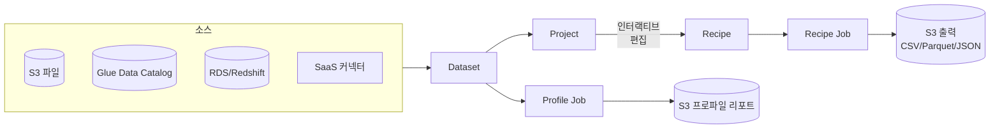

## 정의

**AWS Glue DataBrew** 는 *데이터 분석가와 데이터 사이언티스트를 위한 시각적 (no-code) 데이터 준비 도구*. [[aws-glue|AWS Glue]] 제품군의 일부지만 별도 UI 를 갖고 SQL/Spark 코드 없이 250+ 개 사전 정의 변환으로 데이터를 클리닝, 정규화, 변환.

**대상 사용자**: 데이터 사이언티스트, 애널리스트, 비즈니스 사용자 (엔지니어 아님).

## Glue Studio vs Glue DataBrew

같은 Glue 제품군이지만 목적이 다름.

| 축 | [[aws-glue\|Glue Studio]] | Glue DataBrew |
|:---|:---|:---|
| **대상 사용자** | 데이터 엔지니어 | 데이터 분석가, 사이언티스트 |
| **UI 방식** | 노드 그래프 (source → transform → sink) | 스프레드시트 (컬럼별 조작) |
| **변환 표현** | Spark 코드 생성 (Python/Scala) | Recipe (선언형 스텝) |
| **탐색성** | 낮음 (파이프라인 실행 후 확인) | 높음 (실시간 프리뷰) |
| **변환 수** | 임의 (Spark) | 250+ 사전 정의 |
| **머신러닝** | 별도 | 이상값/PII 자동 감지, 통계 프로파일 |
| **적합** | 대규모 배치 ETL | 데이터 탐색 + 소규모 정제 |

## 핵심 개념

### Dataset

DataBrew 가 참조하는 데이터 소스.

- **파일**: [[aws-s3|S3]] (CSV, JSON, [[apache-parquet|Parquet]], ORC, Avro, XLSX)
- **테이블**: [[aws-glue|Glue Data Catalog]] 등록 테이블
- **DB**: [[aws-rds|RDS]], [[aws-redshift|Redshift]], [[dynamodb|DynamoDB]] (커넥션)
- **SaaS**: Salesforce, Marketo, ServiceNow (일부)

### Project

**Dataset + Recipe** 조합의 작업 공간. 인터랙티브 편집.

### Recipe

*순서대로 실행되는 변환 스텝의 집합*. JSON 으로 저장, 버전 관리, 재사용 가능.

```json
[
  {
    "Action": {
      "Operation": "REMOVE_MISSING",
      "Parameters": {"sourceColumn": "email"}
    }
  },
  {
    "Action": {
      "Operation": "CHANGE_DATA_TYPE",
      "Parameters": {"sourceColumn": "amount", "targetDataType": "double"}
    }
  },
  {
    "Action": {
      "Operation": "STANDARDIZE_TEXT",
      "Parameters": {"sourceColumn": "country", "standardizeMode": "UPPERCASE"}
    }
  }
]
```

### Job

Recipe 를 dataset 에 적용해 실제 결과를 저장.

**Job 유형**:
- **Recipe Job**: Recipe 를 데이터에 적용, 결과를 S3 등에 저장
- **Profile Job**: 데이터 통계 (min, max, null, distinct, 히스토그램, 이상값) 생성

## 변환 종류 (250+ 개)

| 카테고리 | 예시 |
|:---|:---|
| **Cleaning** | 공백 제거, null 처리, 중복 제거, 특수문자 제거 |
| **Format** | 대소문자 변환, 날짜 포맷, 통화, 전화번호 |
| **Structural** | 컬럼 분할/합치기, pivot/unpivot, transpose |
| **Combine** | Join, Union |
| **Statistical** | Standardize, normalize (z-score, min-max), outliers |
| **Text** | 정규식 추출, translate, tokenize |
| **Date/Time** | Parse, format, extract components, timezone |
| **Math** | 사칙연산, 통계 함수, 조건부 |
| **PII** | 자동 감지, mask, hash, delete |
| **NLP** | 감정 분석 (일부), 언어 감지 |

## 데이터 프로파일링

Profile Job 을 실행하면 데이터 품질 리포트 자동 생성.

**포함**:
- 컬럼별 통계 (min, max, mean, median, stddev)
- Null / distinct / duplicate 카운트
- 값 분포 히스토그램
- 상관관계 (correlation matrix)
- 이상치 (outlier) 감지
- **PII 감지** (이름, 이메일, 주소, 신용카드 등)
- 데이터 품질 규칙 (Data Quality Rules) 결과

## 아키텍처



## 요금

- **Interactive Session**: `$1.00 / 30분 세션` (Project 편집)
- **Recipe Job**: `$0.48 / node-hour`
- **Profile Job**: `$0.48 / node-hour`

**계산 예**:
```
매일 recipe job 10분 실행 (2 nodes):
  2 × (10/60) × $0.48 = $0.16 /일
  = ~$5 /월
```

Glue Spark ETL 대비 저렴 (단순 정제 용도).

## 실전 예제

### 1. CSV 를 정제해 Parquet 로

```
Dataset: s3://raw/customer.csv (100 GB)
Recipe:
  1. REMOVE_DUPLICATES on customer_id
  2. STANDARDIZE_TEXT on country (UPPERCASE)
  3. CHANGE_DATA_TYPE on signup_date (STRING -> DATE)
  4. REPLACE_MISSING on email with 'unknown@domain'
  5. DELETE_COLUMN ssn                      // PII 제거
  6. HASH_STRING on phone_number             // PII masking
Job:
  Output: s3://curated/customer/ (Parquet, SNAPPY)
```

### 2. 데이터 품질 리포트 (Profile Job)

```
Dataset: s3://raw/orders.parquet
Profile Job:
  Output: s3://profiles/orders/report.json
  Includes:
    - order_amount: min=0, max=1M, mean=50, stddev=100
    - Outliers: 12 rows (amount > $10K)
    - customer_email: PII detected
    - country: 32 distinct values
```

### 3. 여러 소스 조인

```
Dataset A: s3://sales/orders.csv
Dataset B: Glue Catalog 의 customers 테이블
Recipe:
  1. JOIN on customer_id
  2. AGGREGATE by country: SUM(amount)
  3. TOP_N n=10 by revenue
Job: Redshift 로 적재
```

## Glue DataBrew 언제 쓰나

**적합**:
- 데이터 사이언티스트가 Jupyter 로 데이터 탐색 (대안: pandas)
- 애널리스트가 원본 CSV 를 BI 용으로 정제
- 데이터 품질 감사 (Profile Job)
- PII 감지 자동화 (한 번)
- 프로토타이핑, 파일럿

**부적합**:
- 대규모 배치 ETL (수 TB / 시간) - [[aws-glue|Glue Spark]] 나 [[aws-emr|EMR]]
- 실시간 스트리밍 - [[aws-kinesis-data-analytics|Managed Flink]] / [[aws-data-firehose|Firehose]]
- 복잡한 커스텀 로직 - Glue Spark
- 프로덕션 grade CI/CD - 코드 기반 (dbt / Glue)

## 다른 도구 비교

| 도구 | 사용자 | 강점 | 약점 |
|:---|:---|:---|:---|
| **DataBrew** | 애널리스트 | No-code, 시각적, PII 감지 | 규모/커스터마이징 제한 |
| **[[aws-glue\|Glue Studio]]** | 데이터 엔지니어 | Spark 파워 | 학습 곡선 |
| **dbt** | 애널리틱스 엔지니어 | SQL + 테스트 + lineage | ELT 만 |
| **Trifacta** | 애널리스트 | DataBrew 원류, 성숙 | 유료 |
| **pandas / polars** | 개발자 | 유연, 코드 | 규모 |

## 함정

> [!WARNING]
> **DataBrew 는 대규모 ETL 아님**. 100 GB 이상 반복 정제는 [[aws-glue|Glue Spark]] 나 [[aws-emr|EMR]] 이 저렴/빠름.

> [!CAUTION]
> **Interactive Session 을 켜두고 idle** = 세션당 $1/30분 계속 청구. 사용 후 반드시 종료.

> [!WARNING]
> **Recipe 는 순서 의존**. 스텝 순서 바꾸면 결과 달라짐. Version 관리 필수.

> [!IMPORTANT]
> **Recipe 는 Spark 로 변환 실행**. 매우 큰 데이터에는 partition/parallel 튜닝 불가.

> [!CAUTION]
> **Profile Job 도 유료 (node-hour)**. 매일 실행하면 비용 누적. 필요할 때만.

> [!WARNING]
> **CI/CD 자동화 어려움**. Recipe JSON 을 Git 관리 하되, 배포는 AWS SDK 로 직접 스크립팅 필요.

## 관련 위키

- [[aws-glue|AWS Glue]] - 상위 제품군
- [[aws-athena|Athena]] - SQL 대안
- [[aws-s3|S3]] - 소스/목적지
- [[apache-parquet|Apache Parquet]] - 권장 출력 포맷
- [[etl|ETL / ELT]] - 파이프라인 개념
- [[data-warehouse|Data Warehouse]] - 정제 후 저장
- [[data-lake|Data Lake]] - 원본 소스
