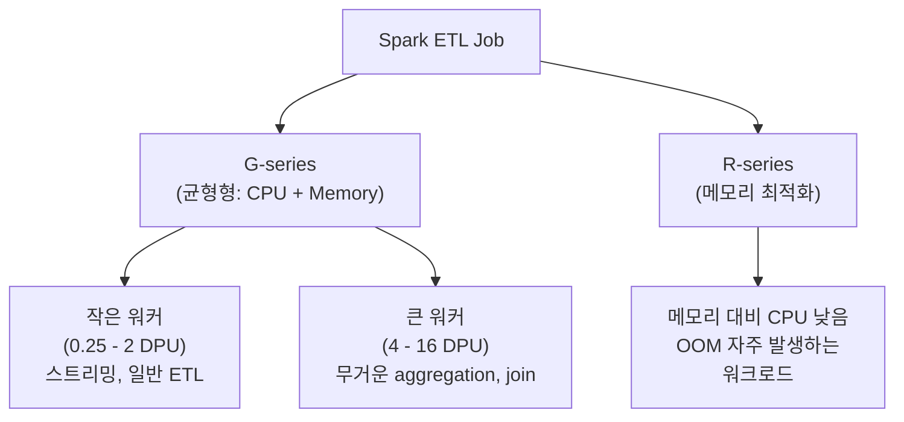
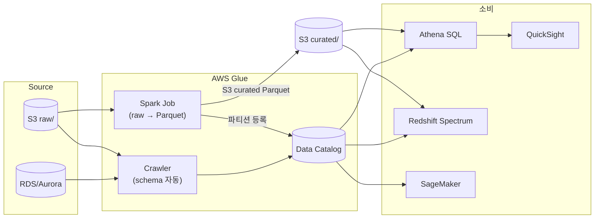

## 정의

**AWS Glue** 는 *서버리스 [[etl|ETL]] + 통합 메타데이터 카탈로그* 플랫폼. Apache Spark 로 데이터 변환을 실행하고, Hive 호환 Data Catalog 로 스키마를 관리. [[aws-athena|Athena]], [[aws-redshift-spectrum|Redshift Spectrum]], EMR 이 모두 같은 카탈로그를 공유.

세 가지 축:
1. **Data Catalog** - Hive 호환 메타 저장소 (databases, tables, partitions)
2. **Crawlers** - 데이터 스캔 -> 스키마 자동 등록
3. **Jobs** - Spark / Python Shell 기반 변환 실행

## Glue Version 이라는 개념

Glue Job 을 만들 때 **Glue version** (릴리스 라벨) 을 선택한다. Glue version 은 그 안에서 사용할 **Spark, Python, Java, 오픈 테이블 포맷 (Iceberg / Hudi / Delta)** 조합을 고정한다. AWS 가 조합을 사전 검증해 제공하므로 사용자는 개별 버전 호환성을 신경 쓸 필요 없다.

**의미**:
- Job 스크립트는 특정 Glue version 위에서 실행됨
- 상위 version 은 최신 Spark / Python / 최적화 포함
- 하위 version 은 레거시 코드 호환

**선택 기준**:
- **신규 프로젝트** -> **최신 안정 version** (Iceberg 완전 지원 등 최신 features)
- **기존 프로덕션** -> 검증된 version 유지 (마이그레이션 계획 후 상승)
- **매우 오래된 version (2.x 이하)** -> EOL 대비 마이그레이션

각 version 의 정확한 Spark/Python/Java 조합은 [AWS Glue Release Notes](https://docs.aws.amazon.com/glue/latest/dg/release-notes.html) 참조.

## Data Catalog

Hive Metastore 호환의 서버리스 메타 저장소. Region 스코프.

```
Catalog (Region)
├── Database "sales_db"
│   ├── Table "orders"          → S3 위치, 스키마, 파티션, SerDe
│   │   ├── Partition (year=2026, month=07)
│   │   ├── Partition (year=2026, month=08)
│   ├── Table "customers"
├── Database "logs_db"
│   └── Table "access_logs"
```

- **소비자**: [[aws-athena|Athena]], [[aws-redshift-spectrum|Spectrum]], EMR, Lake Formation, SageMaker
- **저장 요금**: 첫 100만 오브젝트 무료, 초과 시 100k 당 $1
- **요청 요금**: 첫 100만 requests/월 무료, 초과 시 100만 당 $1

**Partition 관리 전략**:
- **Crawler 등록**: 배치로 파티션 발견 및 등록
- **Athena `MSCK REPAIR TABLE`**: Hive 스타일 파티션 자동 발견
- **`ALTER TABLE ADD PARTITION`**: 파이프라인이 직접 등록 (권장)
- **Partition Projection** ([[aws-athena|Athena]] 전용): 카탈로그 등록 없이 규칙으로 유추

## Crawlers

S3 / JDBC / [[dynamodb|DynamoDB]] / MongoDB 를 스캔해서 스키마와 파티션을 자동 발견.

```
Crawler 대상:
- S3 (Parquet, ORC, JSON, CSV, Avro, XML, Delta, Iceberg, Hudi)
- JDBC (RDS, Aurora, Redshift, on-prem)
- DynamoDB
- MongoDB / DocumentDB
- Glue Catalog (cross-region 카탈로그 복제)
```

**모드**:
- **`CRAWL_EVERYTHING`** - 매번 전체
- **`CRAWL_NEW_FOLDERS_ONLY`** - 새 파티션만
- **`CRAWL_EVENT_MODE`** - S3 event 기반 증분

**Schema Change Policy**:
- Update: `LOG` / `UPDATE_IN_DATABASE`
- Delete: `LOG` / `DELETE_FROM_DATABASE` / `DEPRECATE_IN_DATABASE`

**과금**: `$0.44 / DPU-hour` (ETL job 과 동일). 2 DPU 반시간 = $0.44.

> [!WARNING]
> **Crawler 를 스케줄로 매시간 돌리는 관행** 은 비용 유출. 새 파티션만 필요하면 `CRAWL_NEW_FOLDERS_ONLY` 또는 파이프라인이 파티션을 직접 등록.

## Job 유형

| 유형 | 엔진 | 용도 |
|:---|:---|:---|
| **Spark ETL** | Apache Spark | 대규모 변환, join, aggregate |
| **Spark Streaming** | Spark Structured Streaming | Kinesis/Kafka 실시간 인제스션 |
| **Python Shell** | Python (Spark 없음) | 경량 스크립트, API 호출 |
| **Ray** | Ray.io | 분산 Python (**2026-04-30 신규 고객 접수 중단**) |

## Worker Types & DPU

**DPU** (Data Processing Unit) = *Glue 컴퓨트의 표준 단위*. 대략 4 vCPU + 16 GB 메모리 조합에 해당하며, Glue 요금은 사실상 "DPU × 실행 시간" 으로 결정된다.

### Worker 계열 두 축

Glue 는 워커 타입을 두 축으로 제공한다.



### G-series: 대부분의 워크로드

*CPU 와 메모리가 균형 잡힌* 표준 워커. 대부분 여기.

- **작은 워커 (< 1 DPU)** = 스트리밍이나 소규모 ETL. cost-efficient.
- **표준 워커 (1-2 DPU)** = 일반 ETL / join / 집계 대부분
- **큰 워커 (4-16 DPU)** = 매우 무거운 aggregation, GC 오버헤드 우려 있는 워크로드
- **한 워커의 DPU 가 커질수록** disk (임시 shuffle 저장) 도 함께 커짐

### R-series: OOM 방지용

*같은 DPU 대비 메모리 비중이 큰* 워커. Spark job 이 자주 OutOfMemory 로 실패하거나, 매우 큰 shuffle / broadcast join / cache 를 다룰 때.

**선택 기준**: 로그에 `java.lang.OutOfMemoryError` / `spark.executor.memoryOverhead` 관련 실패가 반복 -> R-series 검토.

### Worker 선택의 원칙

1. **처음엔 G.1X 로 시작** - 대부분 워크로드 커버
2. **profile 후 조정** - Spark UI 로 GC / shuffle spill 관찰
3. **큰 워커 소수 vs 작은 워커 다수** - 각각 트레이드오프. 큰 워커 = shuffle 오버헤드 감소, 작은 워커 = 병렬성 향상
4. **OOM 잦음 -> R-series 또는 워커 크기 증가**
5. **큰 워커 타입은 일부 리전 제약** 있음 (신규 계열은 특정 리전만)

정확한 DPU × vCPU × 메모리 × 디스크 값은 [AWS Glue 워커 문서](https://docs.aws.amazon.com/glue/latest/dg/add-job.html) 참조.

## 가격

**Standard**: `$0.44 / DPU-hour`, 초 단위 과금, 최소 1초 (Glue 3.0+) / 1분 (Glue 0.9/1.0).

**Flex** (비시간-민감 워크로드): `$0.29 / DPU-hour` (약 34% 절감).
- Glue 3.0+ 만
- G.1X / G.2X 만 (G.4X 이상 미지원)
- 예: 야간 배치, 재처리, 실험

**Data Catalog**:
- 스토리지: 첫 100만 오브젝트 무료, 초과 100k 당 $1/월
- 요청: 첫 100만 requests/월 무료, 초과 100만 당 $1

**Interactive Sessions** (Jupyter): `$0.44 / DPU-hour`, idle 자동 종료.

**Data Quality**: `$0.44 / DPU-hour`, 최소 2 DPU × 1분.

**계산 예시**:
```
Spark ETL job:
  G.2X × 10 workers = 20 DPU
  30분 실행
  = 20 × 0.5 × $0.44 = $4.40

Flex 로 실행 시:
  = 20 × 0.5 × $0.29 = $2.90
```

## Job 스크립트 예제

### PySpark (Glue 5.x)

```python
import sys
from awsglue.transforms import *
from awsglue.utils import getResolvedOptions
from pyspark.context import SparkContext
from awsglue.context import GlueContext
from awsglue.job import Job

args = getResolvedOptions(sys.argv, ['JOB_NAME'])
sc = SparkContext()
glueContext = GlueContext(sc)
spark = glueContext.spark_session
job = Job(glueContext)
job.init(args['JOB_NAME'], args)

# Catalog 에서 읽기 (테이블 = 카탈로그 등록되어 있어야 함)
orders = glueContext.create_dynamic_frame.from_catalog(
    database="sales_db",
    table_name="orders_raw",
    push_down_predicate="year='2026' AND month='07'",  # 파티션 프루닝
)

# 변환
transformed = orders.apply_mapping([
    ("order_id", "long", "order_id", "long"),
    ("customer_id", "long", "customer_id", "long"),
    ("amount", "string", "amount", "decimal(10,2)"),  # 타입 캐스팅
    ("created_at", "string", "created_at", "timestamp"),
])

# Parquet + ZSTD 로 S3 에 저장, 카탈로그도 갱신
glueContext.write_dynamic_frame.from_options(
    frame=transformed,
    connection_type="s3",
    connection_options={
        "path": "s3://my-lake/orders_curated/",
        "partitionKeys": ["year", "month"],
    },
    format="parquet",
    format_options={"compression": "zstd"},
)

job.commit()
```

### Job Bookmarks (증분 처리)

```python
# 활성화 시 이미 처리한 파일/파티션은 건너뜀
orders = glueContext.create_dynamic_frame.from_catalog(
    database="sales_db",
    table_name="orders_raw",
    transformation_ctx="orders_source",  # bookmark key
)
```

Job 설정에서 Bookmark: `Enable` -> 재실행 시 새 데이터만.

## Triggers & Workflows

| 개념 | 역할 |
|:---|:---|
| **Trigger** | 수동 / 스케줄 (cron) / 이벤트 기반 실행 |
| **Workflow** | 여러 job/crawler 의존성 그래프 |
| **Blueprint** | 재사용 가능한 workflow 템플릿 |

```
Workflow 예:
  Trigger (schedule daily 02:00)
    ↓
  Crawler (S3 raw)
    ↓
  Job (raw → staged Parquet)
    ↓
  Job (staged → curated with joins)
    ↓
  Crawler (curated 카탈로그 갱신)
```

큰 오케스트레이션은 [[aws-step-functions|Step Functions]] 또는 MWAA (Managed Airflow) 로.

## Glue Studio

Visual drag-and-drop ETL 편집기. Source -> Transform -> Target 노드를 잇고 Scala/Python 코드가 자동 생성.

- Notebook 지원 (Jupyter)
- Git 통합 (GitHub, CodeCommit)
- 시각 lineage
- 초보자용 + PoC

**한계**: 실전 프로덕션은 결국 코드로 관리. Studio 는 프로토타입 → 코드 export 흐름.

## Glue DataBrew

*코드 없는* 데이터 준비 UI. 250+ 사전 정의 변환 (정규화, cleansing, ML feature engineering).

- Interactive: $1.00 / 30분 세션
- Job: $0.48 / node-hour

## Glue Data Quality

DQDL (Data Quality Definition Language) 로 규칙 정의. 자동 anomaly detection 도 지원 (Glue 3.0+).

```
Rules = [
  ColumnCount = 10,
  RowCount between 1000 and 10000000,
  IsComplete "user_id",
  Uniqueness "order_id" > 0.99,
  ColumnValues "status" in ["pending", "paid", "shipped"],
  ColumnValues "amount" >= 0
]
```

**과금**: `$0.44 / DPU-hour`, 최소 2 DPU × 1분.

## Zero-ETL Integrations

관리형 CDC 로 [[aws-rds|RDS]]/Aurora/[[dynamodb|DynamoDB]] -> [[aws-redshift|Redshift]] / SageMaker Lakehouse.

- 설정 자체는 무과금
- 인제스션: 데이터 볼륨 (1 MB 최소 per request)
- Target 컴퓨트: 별도 청구

자세히: [[aws-redshift#zero-etl-integrations|Redshift Zero-ETL]].

## Glue Elastic Views (deprecated)

*사실상 폐지*. Iceberg materialized view (Glue Catalog) 또는 Lake Formation view / [[aws-athena|Athena]] view 로 대체.

## Ray 지원 종료 (2026-04-30)

Glue for Ray 는 신규 고객 접수 중단. 기존 고객은 계속 사용 가능. 대체:
- 표준 Spark job
- EMR Serverless
- Databricks

## 성능 & 비용 최적화

1. **Flex execution**: 야간/재처리 배치는 Flex 로 34% 절감
2. **Auto Scaling**: 워크로드에 따라 워커 자동 조정 (Glue 3.0+)
3. **Job Bookmark**: 증분 처리로 재스캔 방지
4. **파티션 프루닝**: `push_down_predicate` 로 필요한 파티션만 read
5. **파일 포맷**: [[apache-parquet|Parquet]] / ORC + ZSTD (CSV 대비 10배 이상 절감)
6. **Small files compaction**: [[aws-athena|Athena]] CTAS / Iceberg auto-compact
7. **적절한 worker type**: 대부분 G.1X/G.2X 로 충분. G.8X+ 는 실제 profile 후
8. **Temp directory 정리**: S3 lifecycle 로 자동 삭제

## Glue 관용 워크플로우



## 함정

> [!WARNING]
> **DPU 과잉 프로비저닝**. 큰 워커 (G.8X+) 를 기본으로 잡으면 비용 급증. Auto Scaling 또는 profile 후 조정.

> [!CAUTION]
> **Crawler 를 매시간 전체 스캔** = 파티션이 수천/수만 개인 데이터 레이크에서 요금 폭탄. `CRAWL_NEW_FOLDERS_ONLY` 또는 파이프라인이 파티션 직접 등록.

> [!WARNING]
> **CSV/JSON 을 Parquet 으로 변환 안 함** = 다운스트림 ([[aws-athena|Athena]], [[aws-redshift-spectrum|Spectrum]]) 이 매 쿼리마다 10-100배 스캔량. Bronze → Silver → Gold 계층에서 Parquet 로 변환은 사실상 필수.

> [!IMPORTANT]
> **Job Bookmark 잊음** = 매 실행마다 전체 데이터 재처리. 증분 처리는 명시적으로 활성화.

> [!CAUTION]
> **Small Files** 를 그대로 카탈로그에 등록 = [[aws-athena|Athena]]/[[aws-redshift-spectrum|Spectrum]] 성능 붕괴. Job 마지막 단계에서 `coalesce()` 또는 Iceberg auto-compact.

> [!WARNING]
> **Ray job 신규 개발** = 2026-04-30 이후 접수 안 됨. 신규는 표준 Spark ETL 로.

> [!IMPORTANT]
> **Glue 2.0 이하 사용** = 2026-04-01 EOL. Glue 4.0/5.x 로 마이그레이션 (Python 버전, Spark 버전 호환성 사전 검증).

> [!CAUTION]
> **Interactive Session idle** = DPU 계속 청구. 자동 타임아웃 짧게 (기본 30분 -> 필요 시 조정).

> [!WARNING]
> **Data Catalog 파티션 수백만 개** = 요청 요금 + 쿼리 planning 지연. [[aws-athena|Athena]] Partition Projection 로 대체 가능한 경우 고려.

## 관련 위키

- [[aws-athena|Athena]] - Glue Catalog 의 최대 소비자
- [[aws-redshift|Redshift]] - Zero-ETL, COPY 소스
- [[aws-redshift-spectrum|Redshift Spectrum]] - Glue Catalog external schema
- [[aws-s3|S3]] - 원본/타깃 데이터 저장
- [[aws-s3-glacier|S3 Glacier]] - Glue 처리 후 원본 아카이빙
- [[apache-parquet|Apache Parquet]] - Glue 의 표준 출력 포맷
- [[etl|ETL / ELT]] - Glue 가 담당하는 파이프라인 개념
- [[data-warehouse|Data Warehouse]] - Glue 의 타깃
- [[aws-lambda|Lambda]] - 소규모/이벤트 변환 (Glue 대안)
- [[aws-step-functions|Step Functions]] - Glue 오케스트레이션
- [[aws-iam|IAM]] - Glue 실행 role
