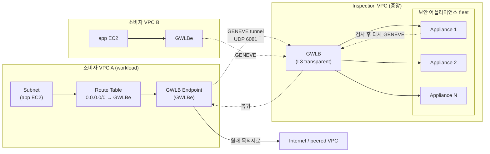

## 정의

**AWS Gateway Load Balancer** (GWLB) 는 *네트워크 계층 (L3) 에서 동작하는 투명 (transparent) 로드 밸런서*. 방화벽 / IPS / IDS / DPI 같은 **네트워크 보안 어플라이언스 (network security appliance) 를 배치, 확장, 관리**하는 것이 유일한 목적이다. 데이터는 GWLB 를 통과하면서 어플라이언스로 우회 (inline inspection) 되고, 응답 후 원래 목적지로 이어진다.

트래픽 캡슐화에는 **GENEVE** (Generic Network Virtualization Encapsulation, [RFC 8926](https://www.rfc-editor.org/rfc/rfc8926)) 프로토콜을 사용한다. UDP 포트 **6081**.

**한 줄 요약**: *"모든 VPC 트래픽을 서드파티 방화벽 어플라이언스에 통과시켜라"* 를 관리형으로 구현한 서비스.

## 왜 ALB / NLB 로는 부족한가

세 종류 로드 밸런서의 근본 차이.

| 로드 밸런서 | 계층 | 목적 |
|:---|:---|:---|
| **[[aws-alb-nlb\|ALB]]** | L7 (HTTP) | HTTP path / host 라우팅, TLS 종단 |
| **[[aws-alb-nlb\|NLB]]** | L4 (TCP/UDP) | 초저지연 TCP/UDP 부하 분산 |
| **GWLB** | **L3 (IP)** | *모든 IP 패킷을 어플라이언스로 우회* |

ALB / NLB 는 *애플리케이션 트래픽을 여러 서버로 분산* 이 목적. GWLB 는 *트래픽을 서버로 보내기 전 반드시 검사/변형하는 미들박스로 보내기* 위한 것.

**대표 시나리오**:
- 조직 정책: 모든 VPC 트래픽을 서드파티 방화벽 (Palo Alto, Fortinet, Check Point 등) 이 검사해야 함
- IDS/IPS: 침입 감지/방지 어플라이언스 클러스터 배치
- DLP: 데이터 유출 방지 스캐너
- 커스텀 패킷 검사 (SSL decrypt, protocol validation)

## 아키텍처

전형적 "centralized inspection VPC" 패턴.



### 구성 요소

- **GWLB**: 어플라이언스 fleet 앞단의 L3 로드 밸런서. 반드시 inspection VPC 에.
- **GWLBe (GWLB Endpoint)**: 소비자 VPC 안에 배포하는 [[aws-privatelink|PrivateLink]] 스타일 endpoint. 라우트 테이블이 이 endpoint 를 목적지로 지정.
- **Appliance fleet**: EC2 인스턴스에 서드파티 SW 설치. GENEVE 지원 필수.
- **Route Table**: 소비자 VPC 의 서브넷 라우트가 트래픽을 GWLBe 로 우회.

### 트래픽 흐름 (Ingress 예)

```
1. Internet → IGW → 소비자 VPC 서브넷 라우트
2. 라우트가 "→ GWLBe" 지시
3. GWLBe 가 트래픽을 GENEVE 로 캡슐화 → GWLB 로 (사설 링크)
4. GWLB 가 flow hash 로 특정 appliance 선택 → GENEVE 로 전달
5. Appliance 가 GENEVE decapsulate → 원본 패킷 검사
6. 통과 결정 시 → GENEVE 로 재캡슐화 → GWLB
7. GWLB → GWLBe → 원래 목적지 (app EC2)
```

**핵심**: appliance 는 원본 패킷의 **모든 헤더와 페이로드를 그대로 봄** (GENEVE 는 캡슐화만 함, 원본 훼손 X). 그래서 IPS / IDS 등이 "실제" 트래픽으로 판단 가능.

## GENEVE 프로토콜

**Generic Network Virtualization Encapsulation** ([RFC 8926](https://www.rfc-editor.org/rfc/rfc8926), 2020 표준화). 네트워크 가상화용 범용 캡슐화.

### 왜 GENEVE 인가

기존 캡슐화 프로토콜들의 한계:

| 프로토콜 | 특징 | 한계 |
|:---|:---|:---|
| **VXLAN** ([RFC 7348](https://www.rfc-editor.org/rfc/rfc7348)) | UDP 캡슐화, L2 over L3 | 헤더 고정, 확장 어려움 |
| **NVGRE** ([RFC 7637](https://www.rfc-editor.org/rfc/rfc7637)) | GRE 캡슐화 | UDP 기반 아니라 hash 어려움 |
| **STT** | TCP 캡슐화 | TCP 헤더 활용, 미들박스 오해 |
| **GENEVE** | **UDP + 확장 가능한 TLV** | 컨트롤 플레인 독립, 메타데이터 무제한 |

**GENEVE 의 결정적 이점**:
- **TLV (Type-Length-Value) 옵션 필드** → 메타데이터를 유연하게 추가 (누가 보냈는지, 어느 tenant 인지, 어떤 정책 태그인지 등)
- **컨트롤 플레인 독립성** → 어떤 컨트롤러 (SDN) 와도 조합 가능
- **미들박스 / service chaining** 에 최적 → 여러 어플라이언스를 순차 통과 시 메타데이터 전달

AWS 는 이러한 GENEVE 특성을 활용해 GWLB 를 구현. Appliance 벤더가 표준 GENEVE 만 지원하면 자동으로 GWLB 호환.

### GENEVE 패킷 구조

```
+--------------------+
| Outer Ethernet     |
+--------------------+
| Outer IP           |  ← GWLB ↔ Appliance IP
+--------------------+
| Outer UDP (6081)   |  ← Geneve 포트
+--------------------+
| Geneve Header      |  ← VNI + TLV 옵션
+--------------------+
| ORIGINAL PACKET    |  ← 원본 (Ethernet / IP / TCP / Payload)
+--------------------+
```

**포트 6081**: IANA 등록. Appliance 는 UDP 6081 을 listen 해서 GENEVE 트래픽 수신.

## Flow Stickiness (5-tuple)

같은 흐름 (flow) 이 항상 같은 appliance 로 가야 함. 그래야 stateful inspection (예: TCP session 추적) 이 가능.

**기본 동작**:
- **5-tuple hash**: (src IP, dst IP, src port, dst port, protocol) 로 해시
- **Symmetric hashing**: A→B 와 B→A 가 같은 hash → 양방향 모두 같은 appliance
- **Health check 실패** 시 해당 appliance 제외 (해당 flow 재분배 - stateful 세션은 끊길 수 있음)

**대체 옵션**:
- **3-tuple**: (src IP, dst IP, protocol) - port 무시. 여러 흐름을 같은 appliance 로 묶고 싶을 때
- **2-tuple**: (src IP, dst IP) - 가장 broad 그룹핑

## Health Check

- Appliance 상태 확인 (TCP, HTTP, HTTPS)
- 실패 target 은 rotation 에서 제외
- 프로덕션: 어플라이언스 자체가 healthy 를 정확히 반영해야 함 (죽었는데 healthy 라 답하면 트래픽 blackhole)

## 배포 패턴

### 1. Centralized Inspection VPC (일반적)

```
[여러 workload VPC] → [Transit Gateway] → [Inspection VPC (GWLB + fleet)] → [Egress]
```

- 하나의 inspection VPC 가 조직 전체 방화벽 담당
- 관리 단순 (규칙 / 어플라이언스 fleet 한 곳)
- TGW route table 로 트래픽 우회

### 2. 분산 Inspection

```
[각 workload VPC 안에] → [GWLBe → 로컬 fleet] → [원래 목적지]
```

- 각 VPC 가 자기 fleet
- 지연 최소 (같은 리전 안 데이터센터에서만)
- 관리 부담 증가

### 3. Ingress-only / Egress-only

Ingress 만 (인터넷 → 서비스) 검사하거나 Egress 만 (서비스 → 외부) 검사하는 부분 배치도 가능. 라우트 테이블 설계로 결정.

## GWLB vs [[aws-network-firewall|AWS Network Firewall]]

같은 목적 (VPC 방화벽) 이지만 방식이 다름.

| 축 | GWLB (+ 3rd party appliance) | [[aws-network-firewall\|AWS Network Firewall]] |
|:---|:---|:---|
| **관리 대상** | Appliance fleet (사용자 관리) | 완전 관리형 |
| **엔진** | Palo Alto / Fortinet / Check Point / 커스텀 | Suricata 기반 |
| **기능 확장** | 벤더 어플라이언스 기능 전부 | AWS 지원 rule 만 |
| **라이선스** | 어플라이언스 라이선스 (BYOL 또는 marketplace) | AWS 요금에 포함 |
| **관측** | 어플라이언스 벤더 도구 | CloudWatch / CloudTrail |
| **적합** | 기존 벤더 이미 사용, 고급 기능 (SSL decrypt 등) | AWS 네이티브만 원함, 관리 부담 최소 |

**결정**:
- **기존 조직 표준 방화벽** (Palo Alto 등) 을 그대로 클라우드에 → **GWLB**
- **AWS 관리형 방화벽만** 원함 → **Network Firewall**
- **둘 다 필요**: L4 는 Network Firewall, L7 DPI 는 GWLB + 어플라이언스

## 실전 시나리오

### 1. 서드파티 방화벽 표준화

조직이 이미 Palo Alto VM-Series 를 온프렘에서 사용 중. AWS 로 확장 시:

- Palo Alto VM-Series 를 GWLB target group 으로 배포
- 모든 workload VPC 의 outbound 를 inspection VPC 로 우회
- 온프렘과 동일 정책 유지

### 2. IDS/IPS 클러스터

- Snort / Suricata 어플라이언스 fleet
- GWLB 로 부하 분산
- Symmetric hashing 으로 stateful IDS 세션 유지

### 3. DPI (Deep Packet Inspection)

- 네트워크 트래픽을 DPI 엔진에 통과
- 특정 프로토콜 / 페이로드 감지
- Compliance 요구 (금융/의료)

## Cross-AZ 고려사항

- GWLB 는 리전 단위지만 target 은 **AZ-aware**
- **Cross-AZ 라우팅** = 데이터 전송 비용 + 지연
- 권장: workload / GWLBe / appliance 를 **같은 AZ 에 위치** 시켜 flow 가 AZ 안에서 완결되도록
- Route table 을 서브넷별로 (같은 AZ) 로컬 GWLBe 를 참조하게

## 요금

- **GWLB 시간당** + **처리 데이터량 (GB)**
- **GWLBe 시간당** + **처리 데이터량 (GB)**
- Appliance EC2 인스턴스 요금 별도
- 어플라이언스 라이선스 (marketplace / BYOL) 별도
- Cross-AZ 데이터 전송 요금 (일반 VPC 규칙 적용)

**총 비용은 상당함** (여러 요소 합산). 도입 전 시뮬레이션 필수.

## 어플라이언스 요구사항

Appliance 는 GENEVE 를 이해해야 함:
- UDP 6081 listen
- GENEVE decapsulate → 원본 패킷 처리 → 재캡슐화
- Health check 응답
- Symmetric flow 지원 (양방향 같은 appliance 로 오는 것 처리)

**대부분의 상용 방화벽 벤더** (Palo Alto, Fortinet, Check Point, Cisco, F5 등) 가 GWLB 대상 이미지 (AMI) 를 marketplace 에 제공.

## 함정

> [!WARNING]
> **모든 어플라이언스가 GENEVE 지원하지 않음**. GWLB 도입 전 어플라이언스가 "GWLB target" 을 공식 지원하는지 벤더 문서 확인 필수.

> [!CAUTION]
> **어플라이언스 fleet 이 SPOF** = 죽으면 workload 트래픽 blackhole. 최소 3 AZ, Health check 실전 검증, 어플라이언스 auto-recovery 설정.

> [!WARNING]
> **Symmetric flow 실패** = stateful 세션 (TCP, TLS) 이 다른 appliance 로 가서 검사 실패. 어플라이언스가 symmetric hashing 을 정확히 지원해야 함.

> [!IMPORTANT]
> **Cross-AZ 요금**. 서브넷별 로컬 GWLBe / appliance 배치로 최소화.

> [!CAUTION]
> **관리 부담 크다**. GWLB + GWLBe + appliance fleet + 라우트 테이블 + 어플라이언스 자체 관리. 소규모 조직은 [[aws-network-firewall|AWS Network Firewall]] 가 훨씬 저렴/편함.

> [!WARNING]
> **[[aws-alb-nlb|ALB / NLB]] 와 목적 완전 다름**. 애플리케이션 부하 분산에 GWLB 를 쓰지 말 것.

> [!IMPORTANT]
> **디버깅 어려움**. VPC Flow Logs 로 트래픽 경로 관찰, appliance 자체 로그, GENEVE 캡슐화 특수성 이해 필요.

## 관련 위키

- [[aws-alb-nlb|ALB / NLB]] - 애플리케이션 부하 분산 (다른 목적)
- [[aws-network-firewall|AWS Network Firewall]] - 관리형 대안
- [[aws-privatelink|PrivateLink]] - GWLBe 의 기반 기술
- [[aws-vpc|VPC]] - 배포 컨텍스트
- [[aws-sg|Security Group]] - ENI 레벨 필터
- [[aws-waf|AWS WAF]] - L7 HTTP 방화벽 (다른 계층)
- [[aws-cloudwatch|CloudWatch]] - 관측
