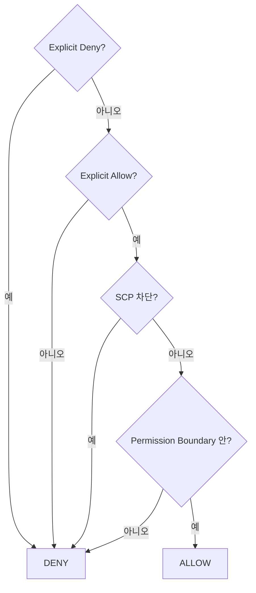
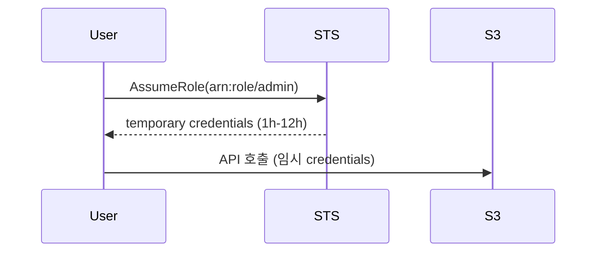
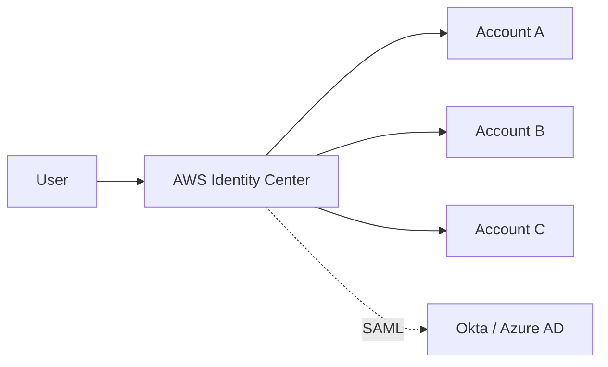

## 정의

**IAM (Identity and Access Management)** = AWS 의 *권한 관리 전부*. User, Group, Role, Policy.

## 객체

```mermaid
flowchart LR
    User[User<br/>(사람)] -->|attach| Policy
    Group[Group] -->|attach| Policy
    Role[Role<br/>(임시 권한, EC2/Lambda/외부 등)] -->|attach| Policy
    Policy --> Statement[Effect: Allow/Deny<br/>Action: s3:GetObject<br/>Resource: arn:...]
```

| 객체 | 의미 |
|---|---|
| **User** | 사람 (long-term credentials) |
| **Group** | User 묶음 |
| **Role** | *임시 권한 받는 entity* (EC2, Lambda, 외부 계정 등) |
| **Policy** | 권한 표현 (JSON) |

## Policy 구조

```json
{
  "Version": "2012-10-17",
  "Statement": [
    {
      "Sid": "AllowListBucket",
      "Effect": "Allow",
      "Action": ["s3:ListBucket"],
      "Resource": "arn:aws:s3:::my-bucket"
    },
    {
      "Sid": "AllowReadObjects",
      "Effect": "Allow",
      "Action": ["s3:GetObject"],
      "Resource": "arn:aws:s3:::my-bucket/*",
      "Condition": {
        "IpAddress": { "aws:SourceIp": "10.0.0.0/8" }
      }
    }
  ]
}
```

## Policy 종류

| 종류 | 의미 |
|---|---|
| **AWS Managed** | AWS 가 관리 (`AmazonS3ReadOnlyAccess`) |
| **Customer Managed** | 사용자 정의, 재사용 가능 |
| **Inline** | User/Group/Role 에 *직접 임베드* (재사용 불가) |
| **Permission Boundary** | *최대 권한 상한* |
| **Service Control Policy (SCP)** | Organization 수준 |
| **Resource-based Policy** | 자원에 붙음 (S3 bucket policy 등) |

## 권한 평가 알고리즘



> *Explicit Deny 가 모든 것을 이김*.

## Role 과 AssumeRole



```bash
aws sts assume-role \
  --role-arn arn:aws:iam::123:role/admin \
  --role-session-name my-session
```

| 사용 | 의미 |
|---|---|
| EC2 Role | EC2 가 metadata 로 자동 |
| Lambda Role | 함수 실행 권한 |
| Cross-account | 다른 계정의 role assume |
| 외부 ID + 신뢰 관계 | 3rd party (SaaS) 가 우리 계정 접근 |
| Federated (OIDC, SAML) | 외부 ID provider |

## IRSA / Pod Identity (EKS)

자세한 건 [[aws-eks]].

## Identity Center (옛 SSO)



- *organization 의 통합 SSO*.
- User 가 *로그인 1회로 N 계정 접근*.
- *short-lived credentials* (1시간).

## Best Practice

```
✓ Root user 의 MFA + 일상 사용 금지
✓ User 대신 SSO (Identity Center)
✓ Role 우선 (long-term credentials 회피)
✓ Least privilege (필요한 권한만)
✓ Permission Boundary 로 *최대* 제한
✓ Access Analyzer 로 unused 권한 식별
✓ IAM Access Advisor 로 미사용 확인
✓ MFA 강제
✓ Credentials rotation 정기
```

## 흔한 함정

> [!WARNING]
> 1. **Root user 의 access key** = 누출 = 모든 권한. *delete 후 SSO*.
> 2. **`"*"` 권한 남발** = 사고. 작은 권한 부터.
> 3. **Long-term access key** = git 누출 사고. Role + STS.
> 4. **Resource-based policy 의 *Principal 오타*** = 의도치 않은 공개.

## 관련 위키

- [[OAuth2]] (비교)
- [[k8s-rbac]] (대조)
- [[aws-secrets-manager]]
- [[aws-sts-assume-role]]
