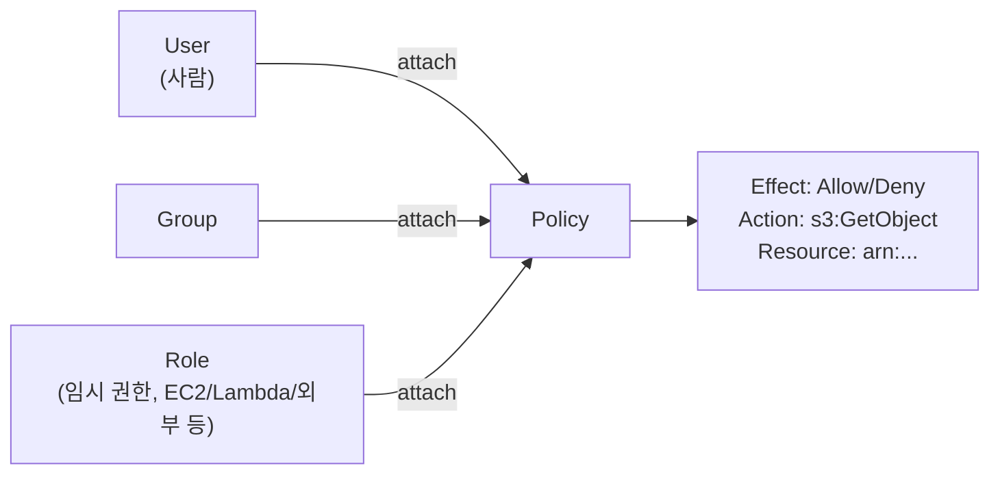
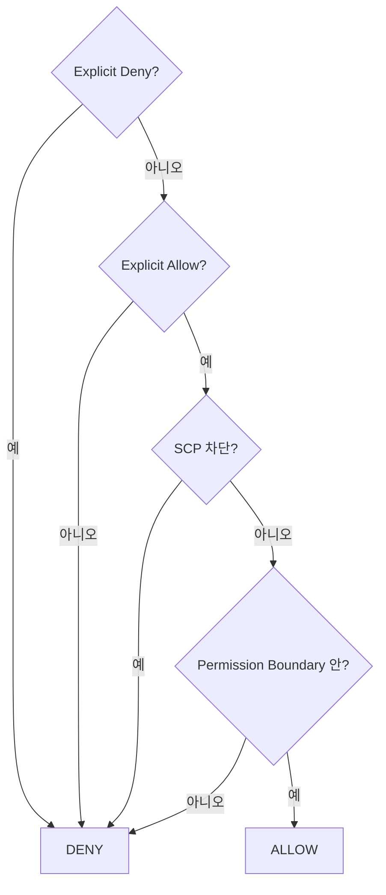
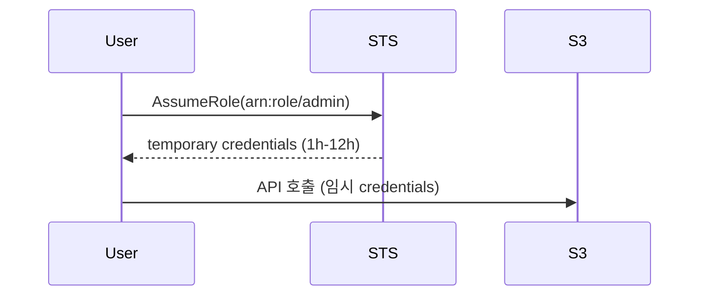
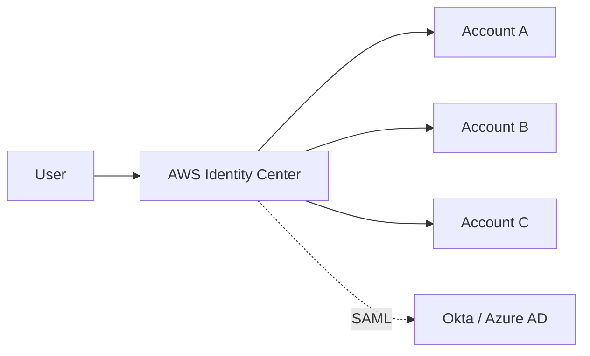

## 정의

**IAM (Identity and Access Management)** = AWS 의 *권한 관리 전부*. User, Group, Role, Policy 로 구성. *"누가 어떤 리소스에 어떤 행동을 할 수 있는가"* 를 정의.

## 사용 상황

| 상황 | IAM 사용 패턴 |
|---|---|
| 팀원 AWS 접근 권한 | Identity Center + Permission Set (SSO 권장) |
| EC2/Lambda 가 AWS 서비스 호출 | Instance Role / Execution Role |
| 다른 계정 리소스 접근 | Cross-account Role + AssumeRole |
| 외부 ID Provider | Federated Identity (OIDC, SAML) |
| 최소 권한 강제 | Permission Boundary |
| 조직 전체 정책 | Service Control Policy (SCP) |
| EKS Pod 의 AWS 접근 | IRSA (IAM Roles for Service Accounts) |

## 객체



| 객체 | 의미 |
|---|---|
| **User** | 사람 (long-term credentials, 가급적 최소화) |
| **Group** | User 묶음 (Policy 를 그룹에 부착) |
| **Role** | *임시 권한 받는 entity* (EC2, Lambda, 외부 계정, EKS Pod 등) |
| **Policy** | 권한 표현 (JSON Statement 배열) |

## Policy 구조

```json
{
  "Version": "2012-10-17",
  "Statement": [
    {
      "Sid": "AllowListBucket",
      "Effect": "Allow",
      "Action": ["s3:ListBucket"],
      "Resource": "arn:aws:s3:::my-bucket"
    },
    {
      "Sid": "AllowReadObjects",
      "Effect": "Allow",
      "Action": ["s3:GetObject"],
      "Resource": "arn:aws:s3:::my-bucket/*",
      "Condition": {
        "IpAddress": { "aws:SourceIp": "10.0.0.0/8" }
      }
    }
  ]
}
```

- `Effect`: `Allow` 또는 `Deny`. Explicit Deny 가 Allow 를 이김.
- `Action`: `s3:GetObject`, `ec2:*` 형식. `*` 와일드카드 가능.
- `Resource`: ARN. `*` 로 전체 허용 (최소 권한 원칙 위반).
- `Condition`: 추가 조건 (IP, MFA 여부, 태그 등).

## Policy 종류

| 종류 | 의미 |
|---|---|
| **AWS Managed** | AWS 가 관리 (`AmazonS3ReadOnlyAccess`) |
| **Customer Managed** | 사용자 정의, 재사용 가능 |
| **Inline** | User/Group/Role 에 직접 임베드 (재사용 불가) |
| **Permission Boundary** | 최대 권한 상한 (Role 이 가질 수 있는 최대) |
| **Service Control Policy** | Organization 수준 전체 상한 |
| **Resource-based Policy** | 자원에 붙음 (S3 Bucket Policy, Lambda Permission 등) |
| **Session Policy** | AssumeRole 시 임시로 줄이는 정책 |

## 권한 평가 알고리즘



> *Explicit Deny 가 모든 것을 이김*. Organization SCP → Permission Boundary → Identity Policy 순으로 모두 통과해야 Allow.

## Role 과 AssumeRole



```bash
aws sts assume-role \
  --role-arn arn:aws:iam::123:role/admin \
  --role-session-name my-session
```

| 사용 | 의미 |
|---|---|
| EC2 Role | EC2 가 metadata 로 자동 취득 |
| Lambda Role | 함수 실행 권한 |
| Cross-account | 다른 계정의 Role assume |
| 외부 ID + 신뢰 관계 | 3rd party (SaaS) 가 우리 계정 접근 |
| Federated (OIDC, SAML) | 외부 ID Provider 연동 |

임시 credentials = `AccessKeyId` + `SecretAccessKey` + `SessionToken`. 기본 1시간, 최대 12시간.

## ABAC: Attribute-Based Access Control

태그 기반 동적 권한 부여. *Role 을 늘리지 않고* 태그로 접근 제어.

```json
{
  "Effect": "Allow",
  "Action": "ec2:*",
  "Resource": "*",
  "Condition": {
    "StringEquals": {
      "aws:ResourceTag/Environment": "${aws:PrincipalTag/Environment}"
    }
  }
}
```

- `aws:PrincipalTag/Environment`: 현재 호출자(Principal)의 태그.
- `aws:ResourceTag/Environment`: 대상 리소스의 태그.
- 태그가 일치하는 리소스만 접근 허용.

*장점*: 새 EC2 인스턴스를 만들 때마다 Policy 수정 불필요. 태그만 맞으면 자동 허용.

## Condition Keys 상세

| Key | 의미 |
|---|---|
| `aws:SourceIp` | 요청 IP 대역 |
| `aws:RequestedRegion` | 요청 리전 |
| `aws:MultiFactorAuthPresent` | MFA 인증 여부 |
| `aws:SecureTransport` | HTTPS 여부 |
| `aws:CurrentTime` | 요청 시각 (업무 시간 외 차단) |
| `aws:PrincipalTag/Key` | 호출자 태그 |
| `aws:ResourceTag/Key` | 리소스 태그 |
| `iam:PermissionsBoundary` | Permission Boundary ARN |
| `s3:prefix` | S3 경로 prefix |

```json
{
  "Condition": {
    "Bool": { "aws:MultiFactorAuthPresent": "true" },
    "StringEquals": { "aws:RequestedRegion": ["ap-northeast-2"] }
  }
}
```

## IRSA / Pod Identity (EKS)

자세한 건 [[aws-eks]].

**IRSA (IAM Roles for Service Accounts)**: EKS Pod 가 AWS IAM Role 을 얻는 방법.

```yaml
# ServiceAccount 에 annotation
apiVersion: v1
kind: ServiceAccount
metadata:
  name: s3-reader
  annotations:
    eks.amazonaws.com/role-arn: arn:aws:iam::123:role/s3-reader-role
```

1. EKS 가 OIDC Provider 로 등록.
2. Pod 의 ServiceAccount 에 IAM Role ARN annotation.
3. Pod 기동 시 OIDC 토큰 주입.
4. AWS SDK 가 토큰으로 AssumeRoleWithWebIdentity.

**EKS Pod Identity (2023+)**: IRSA 보다 단순. OIDC Issuer 설정 없이 Pod 에 Role 직접 연결.

## Identity Center (옛 SSO)



- *Organization 의 통합 SSO*.
- User 가 *로그인 1회로 N 계정 접근*.
- *short-lived credentials* (1시간).
- Permission Set = 각 계정에서의 권한 묶음.
- AD / Okta / Azure AD 연동 지원.

## Access Analyzer

*의도치 않은 외부 접근 자동 탐지*.

| 분석 대상 | 탐지 예시 |
|---|---|
| S3 Bucket Policy | 퍼블릭 접근 허용 버킷 |
| IAM Role | 다른 계정 / 서비스가 assume 가능한 Role |
| KMS Key | 외부 공유 Key |
| SQS Queue | 외부 계정에서 메시지 전송 가능 |
| Lambda Permission | 외부 호출 허용 함수 |

```bash
aws accessanalyzer list-findings \
  --analyzer-arn arn:aws:access-analyzer:...:analyzer/my-analyzer \
  --filter '{"status": {"eq": ["ACTIVE"]}}'
```

> [!IMPORTANT]
> Access Analyzer 는 *신규 계정 생성 시 자동 활성화 권장*. 설정 후 주기적 findings 리뷰.

## Credential Report + Access Advisor

### Credential Report (계정 전체)

```bash
aws iam generate-credential-report
aws iam get-credential-report --output text --query Content | base64 --decode
```

CSV 형식. 각 User 의 password 최근 사용, access key 최근 사용, MFA 활성화 여부 확인.

### IAM Access Advisor (사용자별)

```bash
aws iam generate-service-last-accessed-details --arn arn:aws:iam::123:user/alice
aws iam get-service-last-accessed-details --job-id <id>
```

*최근 사용 서비스* 확인 → *미사용 권한 식별* → 최소 권한으로 축소.

## Best Practice

```
✓ Root user 의 MFA + 일상 사용 금지 (Access Key 삭제)
✓ User 대신 SSO (Identity Center)
✓ Role 우선 (long-term credentials 회피)
✓ Least privilege (필요한 권한만, Access Advisor 로 미사용 제거)
✓ Permission Boundary 로 최대 권한 제한
✓ SCP 로 조직 전체 guardrail
✓ Access Analyzer 로 외부 접근 탐지
✓ MFA 강제 (Condition 으로 정책 적용)
✓ Credentials rotation 정기 (90일 이내)
✓ CloudTrail 로 모든 IAM 이벤트 감사
```

## 흔한 함정

> [!WARNING]
> 1. **Root user 의 access key** = 누출 = 모든 권한 탈취. 즉시 삭제 + SSO 전환.
> 2. **`"Action": "*"` 남발** = 권한 과잉. 실제 필요한 Action 목록으로.
> 3. **Long-term access key 를 git 에** = 자동 스캔으로 즉시 탐지됨. Role + STS 사용.
> 4. **Resource-based policy 의 Principal 오타** = 의도치 않은 외부 공개.
> 5. **Policy 변경 후 즉시 반영 안 됨** = IAM 은 eventually consistent. 수초 대기.
> 6. **AssumeRole 시 duration 기본값** = 1시간. 장시간 작업은 `--duration-seconds` 조정.
> 7. **SCP 와 Permission Boundary 혼동** = SCP 는 계정 전체 상한, PB 는 특정 Role 상한.

## 관련 위키

- [[OAuth2]] (비교)
- [[k8s-rbac]] (대조)
- [[aws-secrets-manager]]
- [[aws-sts-assume-role]]
- [[aws-eks]] (IRSA)
- [[aws-cloudtrail]] (감사 로그)
