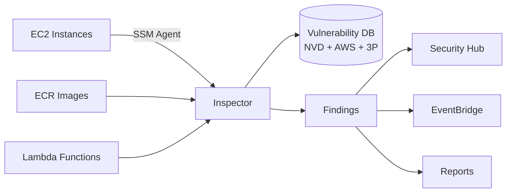

## 정의

**Amazon Inspector** (v2, 2021+) 는 AWS 워크로드의 **취약점 (CVE) 과 의도치 않은 네트워크 노출** 을 지속 스캔하는 서비스입니다. **EC2, ECR 이미지, Lambda 함수** 를 자동 발견하고 검사하며, 알려진 취약점 데이터베이스와 매칭합니다.

**한 줄 요약**: "우리 인프라에 알려진 CVE 취약점이 있나?" 에 답.

## Inspector v1 vs v2

**Inspector Classic (v1)**: agent 기반, 명시적 assessment target/template 필요. Complex 하고 유지 부담. **Deprecated**.

**Inspector v2** (2021+): agent-less (SSM 통해 자동), 자동 발견 + 지속 스캔, ECR/Lambda 추가.

이 문서는 **v2** 를 다룹니다.

## 왜 Inspector 인가

### 자체 스캐너 vs Inspector

**자체 (Trivy, Clair, Snyk 등)**:
- 도구/파이프라인 유지 부담
- 이미지 build time 스캔만 (배포 후 발견된 CVE 놓침)
- 결과 통합 어려움

**Inspector**:
- **지속 스캔** (배포 후 새 CVE 도 감지)
- **자동 발견** (모든 EC2/ECR/Lambda 자동 스캔)
- **AWS 통합** (Security Hub, EventBridge, Findings API)
- Managed vulnerability database (NVD + AWS 자체 + 3rd party)

## 스캔 대상

### 1. EC2 인스턴스

- **OS 취약점**: Amazon Linux, Ubuntu, CentOS, Debian, RHEL, SUSE, Windows
- **애플리케이션 패키지**: Python (pip), Java (Maven/Gradle), Node.js (npm), Ruby (bundler), Go (modules), Rust (cargo), .NET
- **Agent-less**: SSM Agent 통해. 명시적 Inspector agent 불필요.
- **네트워크 도달성**: 인터넷에서 도달 가능한 취약한 서비스

### 2. ECR 이미지

- **Container image scan**: Push 시 자동 + 지속 (새 CVE)
- **OS + language package**
- **Enhanced scanning**: Inspector v2 활성 시 자동 (ECR basic 스캔 대체)

### 3. Lambda 함수

- **Function code** 의 dependency 취약점
- **Layer** 취약점
- **런타임 취약점** (Python/Node/Java runtime 자체)

### 4. Lambda Standard vs Deep Scan

- **Standard**: 의존성 매니페스트 (`package.json`, `requirements.txt`)
- **Deep**: 실제 코드까지 분석 (더 정확, 요금 큼)

## 아키텍처



## Finding 예시

```json
{
  "findingArn": "arn:aws:inspector2:us-east-1:...:finding/abc123",
  "awsAccountId": "123456789012",
  "type": "PACKAGE_VULNERABILITY",
  "severity": "HIGH",
  "title": "CVE-2024-XXXX in libcurl",
  "description": "libcurl before X.Y.Z is vulnerable to...",
  "packageVulnerabilityDetails": {
    "vulnerabilityId": "CVE-2024-XXXX",
    "source": "NVD",
    "vulnerablePackages": [
      {
        "name": "libcurl4",
        "version": "7.68.0-1ubuntu2.15",
        "fixedInVersion": "7.68.0-1ubuntu2.20",
        "packageManager": "APT"
      }
    ],
    "cvss": [
      {"version": "3.1", "baseScore": 7.5, "scoringVector": "CVSS:3.1/AV:N/AC:L/PR:N/UI:N/S:U/C:H/I:N/A:N"}
    ],
    "referenceUrls": ["https://curl.se/docs/CVE-2024-XXXX.html"],
    "vendorCreatedAt": "2024-05-15T00:00:00Z"
  },
  "resources": [
    {
      "id": "i-abc123",
      "type": "AWS_EC2_INSTANCE",
      "region": "us-east-1"
    }
  ],
  "remediation": {
    "recommendation": {
      "text": "apt-get update && apt-get install libcurl4=7.68.0-1ubuntu2.20"
    }
  },
  "epss": {"score": 0.023, "percentile": 0.85}
}
```

**주요 필드**:
- **CVSS**: 취약점 심각도 표준 점수
- **EPSS** (Exploit Prediction Scoring System): 실제 악용 가능성 확률
- **Fixed version**: 패치된 버전
- **Remediation**: 조치 방법

## Severity 계산

Inspector 는 다음을 조합해 severity 산출:

- **CVSS Base Score**: 취약점 기술적 심각도
- **EPSS**: 실제 악용 확률
- **Network reachability**: 인터넷 노출 여부
- **Exploit availability**: 알려진 익스플로잇 존재

이 조합으로 **"실질적 위험"** 을 우선순위화. CVSS 만 보면 "패치 지옥" 이 되지만 EPSS 등을 조합하면 진짜 위험한 것에 집중.

## 스캔 트리거

### EC2

- **이벤트 기반**: 인스턴스 시작, 태그 변경, 패키지 설치
- **주기적**: 12시간마다 재검토
- **취약점 DB 업데이트**: 새 CVE 발표 시 즉시 재평가

### ECR

- **On push**: 이미지 push 시 자동
- **On pull**: 오래된 이미지 접근 시 재스캔
- **지속**: 새 CVE 시 재스캔

### Lambda

- **함수 배포 시**: `UpdateFunctionCode`, `PublishLayerVersion`
- **주기적**: 12시간

## SBOM (Software Bill of Materials) Export

**SBOM** = 소프트웨어 안 모든 컴포넌트/의존성 목록. 규제 요구 (SLSA, US Executive Order 14028).

Inspector 는 SBOM 을 S3 로 export:

```bash
aws inspector2 create-sbom-export \
  --resource-filter-criteria '{"resourceType": [{"comparison": "EQUALS", "value": "AWS_ECR_CONTAINER_IMAGE"}]}' \
  --report-format CYCLONEDX_1_4 \
  --s3-destination bucketName=sbom-bucket,kmsKeyArn=arn:aws:kms:...
```

지원 형식:
- **CycloneDX 1.4**: OWASP 표준
- **SPDX 2.3**: Linux Foundation 표준

## Multi-Account (Organizations)

Delegated administrator 계정이 조직 전체 관리:

```bash
aws inspector2 enable-delegated-admin-account \
  --delegated-admin-account-id 111111111111

aws inspector2 enable \
  --resource-types EC2 ECR LAMBDA \
  --account-ids 222222222222 333333333333
```

Central account 에서 모든 finding 통합.

## Findings 관리

### Suppression Rules

Ignore 하고 싶은 finding 억제:

```bash
aws inspector2 create-filter \
  --name "ignore-dev-instances" \
  --action SUPPRESS \
  --filter-criteria '{
    "resourceTags": [{"comparison": "EQUALS", "key": "environment", "value": "dev"}],
    "severity": [{"comparison": "EQUALS", "value": "LOW"}]
  }'
```

Dev 환경의 LOW severity 자동 archive.

### EventBridge

```json
{
  "source": ["aws.inspector2"],
  "detail-type": ["Inspector2 Finding"],
  "detail": {
    "severity": ["HIGH", "CRITICAL"]
  }
}
```

Slack 알림, Jira 티켓, 자동 patch 파이프라인.

## 요금

- **EC2 스캔**: 인스턴스당 월
- **ECR 이미지 스캔**: 이미지당 월 (지속 스캔), initial scan 별도
- **Lambda 스캔**:
  - Standard: 함수당 월
  - Deep: 별도 (더 비쌈)
- **SBOM export**: 무료 (S3 저장 요금만)

**Free tier**: 15일 무료 (계정 활성 후).

## Inspector vs 대안

| 도구 | 강점 | 언제 |
|:---|:---|:---|
| **Inspector** | AWS 자동 통합, 지속 스캔 | AWS 워크로드 |
| **Trivy** | 오픈소스, CI 통합 유연 | 개발 파이프라인 |
| **Snyk** | 개발자 UX, IDE 통합 | 개발 시점 |
| **Wiz** | 클라우드 자세 종합 | 멀티 클라우드 CSPM |
| **Prisma Cloud** | 종합 CNAPP | 대규모 엔터프라이즈 |
| **Aqua** | 컨테이너 특화 | Kubernetes 중심 |

**흔한 조합**: 개발 파이프라인 (Trivy/Snyk) + 배포 후 (Inspector). Defense in depth.

## 실전 사용 사례

### 1. ECR + CI/CD

- Push 시 자동 Inspector 스캔
- CRITICAL/HIGH 감지 시 배포 차단 (EventBridge -> Lambda -> CodePipeline stop)
- SBOM 자동 export 하여 규제 증거

### 2. EC2 fleet 관리

- 자동 발견된 모든 인스턴스
- 새 CVE 발표 -> Inspector 알림 -> Patch Manager 자동 패치
- Compliance 대시보드 (organization-wide)

### 3. Lambda 취약 의존성

- 매 배포마다 dependency scan
- `requests` 라이브러리 취약 버전 자동 감지
- EventBridge -> Slack 알림

### 4. 감사 대응

- Audit Manager 에 Inspector finding 을 evidence 로
- SOC 2, PCI, HIPAA compliance 지속 증명

### 5. Zero-day 대응

- 새 CVE (예: Log4Shell) 발표 시 즉시 모든 자원 재스캔
- 영향 인스턴스/이미지/함수 리스트 자동 생성

## GuardDuty / Macie 와 차이

| 서비스 | 초점 | 언제 감지 |
|:---|:---|:---|
| **Inspector** | 취약점 (CVE, 설정) | 정적, 지속 스캔 |
| **[[aws-guardduty|GuardDuty]]** | 활동 이상 | 실시간, 사후 |
| **[[aws-macie|Macie]]** | 데이터 민감성 | 정적, 데이터 위치 |

**세 서비스 상호보완**: 취약점 (Inspector) + 활동 (GuardDuty) + 데이터 (Macie).

## 함정

> [!WARNING]
> **SSM Agent 필수** (EC2 스캔). 없으면 인스턴스가 Inspector 에 안 보임. Systems Manager 관리 목록에서 확인.

> [!CAUTION]
> **False positive 다수**. 모든 finding 을 patch 하려면 팀 소진. EPSS + 실제 노출 여부 (network reachability) 로 우선순위.

> [!WARNING]
> **Lambda Deep Scan 요금 큼**. 대량 Lambda 함수는 Standard 부터.

> [!IMPORTANT]
> **오래된 이미지 재스캔**. ECR 에 오래 있는 이미지는 새 CVE 발견 시 계속 재평가되어 finding 증가. 사용 안 하는 이미지는 lifecycle policy 로 삭제.

> [!CAUTION]
> **Enhanced ECR scan vs Basic**. Inspector v2 활성 시 ECR basic scan 대체됨. 두 곳에서 요금 중복 X 확인.

> [!WARNING]
> **재스캔 지연**. Finding 이 12시간 이후 반영. 실시간 아님. 즉시성이 필요하면 CI 에서 Trivy 등.

## 관련 위키

- [[aws-guardduty|GuardDuty]] - 활동 위협 탐지 (짝)
- [[aws-macie|Macie]] - 데이터 민감성
- [[aws-shield|Shield]] - DDoS 방어
- [[aws-ecr|ECR]] - 이미지 스캔 대상
- [[aws-lambda|Lambda]] - Lambda 스캔
- [[aws-ec2|EC2]] - 인스턴스 스캔
- [[aws-config|Config]] - 리소스 컴플라이언스
- [[aws-audit-manager|Audit Manager]] - 감사 증거
- [[aws-cloudtrail|CloudTrail]] - 활동 로깅
- [[aws-eventbridge|EventBridge]] - 자동 대응
- [[container-image-best-practices|Container Image Best Practices]]
